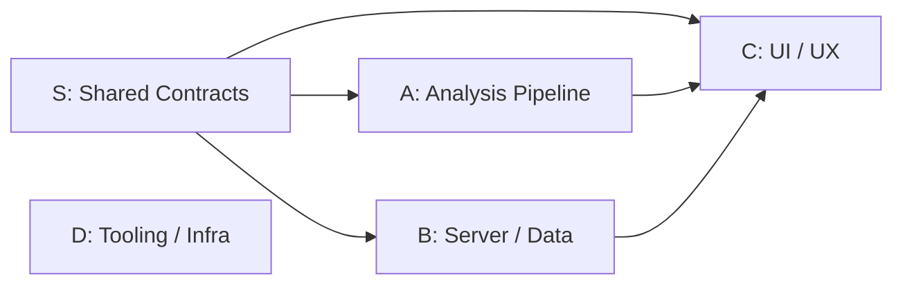
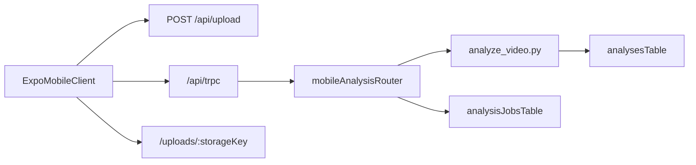

# Padel Analyzer — Full Codebase Review Context

Generated: 2026-04-10 01:00

Total files: 92 | Total lines: 12860

---

## README.md

```markdown
# Padel Swing Analyzer

AI-powered padel swing analysis using MediaPipe pose estimation. Upload a video of your swing and get detailed biomechanical feedback with scoring.

## Features

- **Video upload** — drag & drop or file picker (.mp4, .mov, .webm)
- **AI pose detection** — MediaPipe BlazePose tracks 33 body landmarks in-browser
- **Swing phase detection** — automatically segments Ready, Backswing, Forward Swing, Contact, Follow-Through
- **Biomechanical scoring** — per-phase scoring based on ideal angle ranges
- **Visual overlay** — skeleton drawn on top of your video with frame-by-frame stepping
- **History tracking** — view past analyses and track score progress over time
- **Side-by-side comparison** — compare two swing analyses with metric diffs
- **PWA ready** — installable on iOS/Android from the browser

## Tech Stack

- React 19 + Vite + TypeScript
- MediaPipe Tasks Vision (BlazePose)
- Tailwind CSS v4 + Radix UI
- Express + tRPC
- Drizzle ORM + SQLite
- Recharts, Framer Motion

## Getting Started

```bash
# Install dependencies
npm install

# Start development server
npm run dev

# Open in browser (default port is 3001)
open http://localhost:3001
```

## Parallel work (multiple agents / chats)

See **[AGENTS.md](./AGENTS.md)** for workstream ownership (client vs server vs tooling), merge order, branch naming, and optional git worktrees.

## Build for Production

```bash
npm run build
npm start
```

```

---

## AGENTS.md

```markdown
# Multi-agent workflow (Padel Analyzer)

Use this when splitting work across **multiple Cursor chats**, **Composer sessions**, or **git worktrees**. Each stream should own a **slice** of the repo and avoid drive-by edits elsewhere.

See also: `[TECH_STRATEGY.md](./TECH_STRATEGY.md)` for architectural milestones, `[ARCHITECTURE_REVIEW.md](./ARCHITECTURE_REVIEW.md)` for the severity-ranked fix backlog.

## Cursor chat routing

- **UI / UX and customer journey** (pages, flows, onboarding, Sessions vs Analyze, visual design, empty/loading states, navigation): do that work in the Cursor chat titled **`padel swing analysis UI/UX`** — not scattered across unrelated chats.
- **Other streams** (pipeline, server, shared contracts, tooling): use separate chats or worktrees per `AGENTS.md` workstreams **S / A / B / D** as usual.
- This avoids conflicting edits in `client/src/pages/`**, `client/src/components/`**, and `App.tsx`.

## Branch: `cursor/customer-journey-ui-ux`

- Customer-journey and UI work is tracked on `**cursor/customer-journey-ui-ux`**.
- In this repo there is currently **one** local branch at that name (no separate `main` ref in the last check). Treat this branch as the integration line for journey/UI until you add `main` or another default.
- **Uncommitted changes** may be extensive; commit or stash before switching agents or branches.

## Workstreams (ownership)

| ID | Scope | Primary paths | Do NOT touch | Typical tasks |
| --- | --- | --- | --- | --- |
| **S — Shared Contracts** | Cross-cutting types, config, schemas, DB schema | `shared/`*, `drizzle/schema.ts`, `drizzle.config.ts` | Page components, routers | Type definitions, scoring config, Zod validation schemas, DB migrations |
| **A — Analysis Pipeline** | ML inference, scoring math, classification, skeleton rendering | `client/src/lib/mediapipe.ts`, `swingAnalyzer.ts`, `shotClassifier.ts`, `gapAnalyzer.ts`, `skeleton.ts` | Pages, components, server routers | Pose detection, phase segmentation, ONNX classification, scoring ranges, skeleton drawing |
| **B — Server / Data** | tRPC routers, Express middleware, DB queries, YouTube pipeline | `server/`**, `data/` (runtime only; don't commit DB blobs) | `shared/`* (propose changes via S), UI components | tRPC procedures, input validation (using schemas from S), error formatting, query performance, `yt-dlp` |
| **C — UI / UX** | Pages, components, routing, design system, accessibility | `client/src/pages/`*, `client/src/components/`*, `client/src/App.tsx`, `client/src/main.tsx`, `client/src/index.css`, `client/index.html`, `client/public/`** | `client/src/lib/` analysis modules, server routers | Upload flow, results dashboard, metrics panels, design system ("Tennis Neon"), empty/loading/error states, aria labels |
| **D — Tooling / Infra** | Build config, deploy, PWA, CI, dependency management | `vite.config.ts`, `package.json`, `tsconfig*.json`, `README.md`, `AGENTS.md`, CI scripts, PWA assets | Feature code in client/server | Service worker, manifest icons, env docs, CI scripts, dependency upgrades |

**Architect** (review gate, not a workstream):
- Reviews any PR that touches `shared/`*
- Runs "Senior Review" or "Architecture Check" on PRs from any stream when requested
- Owns `TECH_STRATEGY.md`, `ARCHITECTURE_REVIEW.md`, and the severity-ranked fix list
- Does not write bulk feature code

## Dependency graph



## Merge order (reduces conflicts)

1. **S first** — `shared/types.ts`, `shared/config.ts`, `shared/schema.ts`, `drizzle/schema.ts`. All other streams rebase onto S.
2. **A and B in parallel** — Analysis pipeline and server can merge independently after S. If both touch a shared import, serialize: A before B.
3. **C last** — UI consumes APIs from B and pipeline modules from A.
4. **D anytime** — Tooling is independent unless touching dependency versions that affect other streams.

If two streams need the same file, **serialize**: merge the stream whose workstream letter comes first (S before A before B before C).

## Hotspots (expect merge conflicts)

- `shared/types.ts` — S owns; all streams consume.
- `shared/config.ts` — S owns; A and B import scoring config, thresholds, constants.
- `shared/schema.ts` — S owns; B validates with it, A produces data matching it.
- `server/routers/index.ts` — B owns; new routers must be merged into `appRouter`.
- `client/src/App.tsx` — C owns; new routes merge here.
- `client/src/lib/trpc.ts` — C owns; types inferred from B's `AppRouter`.
- `package.json` / `vite.config.ts` — D owns; dependency or alias changes.

## Branch naming

- `feat/shared-<topic>` — e.g. `feat/shared-pagination-types`
- `feat/pipeline-<topic>` — e.g. `feat/pipeline-quality-check`
- `feat/server-<topic>` — e.g. `feat/server-error-formatter`
- `feat/client-<topic>` — e.g. `feat/client-empty-states`
- `chore/tooling-<topic>` — e.g. `chore/tooling-pwa-icons`

## Git worktrees (optional, true parallelism)

Same repo, different folders and branches:

```bash
cd /path/to/padel-analyzer
git worktree add ../padel-analyzer-pipeline feat/pipeline-my-task
git worktree add ../padel-analyzer-server feat/server-my-task
git worktree add ../padel-analyzer-ui feat/client-my-task
```

Open each folder in a **separate Cursor window**; assign one agent/chat per worktree.

## Environment & commands

- **Dev:** `npm run dev` — default **[http://localhost:3001](http://localhost:3001)** (avoid port 3000 if another app uses it).
- **DB:** `npx drizzle-kit push` after schema changes in `drizzle/schema.ts`.
- **YouTube downloads:** server expects `**yt-dlp`** on `PATH` (Homebrew: `brew install yt-dlp`) and `**ffmpeg`** for merges (`brew install ffmpeg`).

## Agent brief template (paste at top of a new chat)

```
Workstream: S | A | B | C | D (see AGENTS.md)
Branch: feat/<area>-<topic>
Goal: <one sentence>
Out of scope: <what not to touch>
Depends on: <merged PRs or none>
Reviewed by: Architect (required for shared/* changes)
```

## Rules of thumb

- **Small PRs** per workstream; no unrelated refactors.
- **Match existing patterns** in the same folder (imports, tRPC usage, Tailwind).
- **Don't commit** `data/*.db` or large uploads; they're gitignored by design.
- **Never duplicate** constants from `shared/config.ts` — always import.
- **All `JSON.parse`** calls must be wrapped in `try/catch` — no exceptions.
- **Any new tRPC procedure** requires a corresponding schema in `shared/schema.ts`.

```

---

## TECH_STRATEGY.md

```markdown
# Tech Strategy — Padel Analyzer

> Lead Architect assessment · April 2026
>
> This document is the canonical reference for architectural direction. Update it when milestones are completed or priorities change.
>
> **See also:** `[ARCHITECTURE_REVIEW.md](./ARCHITECTURE_REVIEW.md)` — critical code-level audit with severity-ranked fix list.

---

## 1. State of the Union

### 1.1 Architecture snapshot

```

┌──────────────────────────────────────────────────────────┐
│                     BROWSER (client/)                    │
│                                                          │
│  Upload.tsx ── mediapipe.ts ── swingAnalyzer.ts           │
│      │              │              │                      │
│      │         PoseLandmarker   detectPhases / score      │
│      │              │              │                      │
│      │              ▼              ▼                      │
│      │         shotClassifier.ts (ONNX Runtime Web)       │
│      │                                                    │
│      ├─────► tRPC (analysis.create) ─────────────────┐   │
│      │                                               │   │
│  Analysis.tsx, History.tsx, ProCompare.tsx, Annotate  │   │
│      ▲  consume stored JSON via tRPC queries         │   │
└──────┼───────────────────────────────────────────────┼───┘
       │                                               │
       │              HTTP / tRPC                       │
       ▼                                               ▼
┌──────────────────────────────────────────────────────────┐
│                   SERVER (server/)                        │
│                                                          │
│  Express + tRPC (superjson)                              │
│  Routers: analysis, youtube, annotation, proCompare      │
│  Multer upload │  yt-dlp + ffmpeg  │  SQLite (Drizzle)   │
│                                                          │
│  NO server-side ML — all inference happens in the browser│
└──────────────────────────────────────────────────────────┘

```

**Stack:** React 18 + wouter · TanStack Query via tRPC · Tailwind CSS + Radix · Framer Motion · MediaPipe Tasks-Vision · ONNX Runtime Web · Express · Drizzle ORM + better-sqlite3 · yt-dlp / ffmpeg (external)

### 1.2 What's working well

| Area | Strength |
|---|---|
| **Shared type contract** | `shared/types.ts` gives both sides a single source of truth for domain types. |
| **Server-state management** | tRPC + React Query is a clean, type-safe data layer — no Redux boilerplate. |
| **ML isolation** | All inference runs client-side; the server never needs GPU or ML dependencies. |
| **Schema** | Drizzle schema is small and well-typed; migrations are straightforward. |
| **YouTube pipeline** | yt-dlp integration is contained, validates URLs, and enforces a duration cap. |

### 1.3 Separation of concerns — current coupling risks

| Coupling | Severity | Detail |
|---|---|---|
| **Upload.tsx is the orchestrator** | **High** | `Upload.tsx` chains file upload → MediaPipe → swing analysis → ONNX classification → tRPC persist. This 180-line `runMediaPipeAndSave` callback mixes I/O, ML, progress UI, and persistence. It cannot be tested, reused from a Web Worker, or invoked from another entry point. |
| **Scoring ↔ feedback divergence** | **Medium** | `analyzeSwing()` scores phases with shot-type-specific ranges, but `getMetricFeedback()` only uses them if `loadedRanges` was previously cached. On the analysis replay page, `shotType` may not even be passed to `getMetricFeedback`, causing generic feedback for a shot that was scored with specific ranges. |
| **gapAnalyzer duplicates weights** | **Medium** | `METRIC_WEIGHTS` in `gapAnalyzer.ts` is a copy of the weight structure in `GENERIC_RANGES` from `swingAnalyzer.ts`. If one changes, the other silently drifts. |
| **shotClassifier hardcodes right wrist** | **Medium** | `findContactFrame()` always uses landmark index 16 (right wrist) regardless of the dominant side passed to `classifyShotType`. Left-dominant players get a misaligned contact window. |

### 1.4 Code quality & technical debt

#### Hardcoded magic numbers (scattered, not centralized)

| Value | Appears in | Should be |
|---|---|---|
| `15` (sample FPS) | `mediapipe.ts:63`, `swingAnalyzer.ts:389`, `SkeletonReplay.tsx`, `annotation.ts`, `proCompare.ts` | A single constant in `shared/types.ts` or a new `shared/constants.ts` |
| `500 * 1024 * 1024` (500 MB) | `Upload.tsx:196`, `upload.ts`, `index.ts:17` | Shared config constant |
| `300` (5 min YouTube cap) | `youtube.ts:108` | Named constant |
| `0.3` (shot confidence threshold) | `swingAnalyzer.ts:357` | Named constant |
| `64` (ONNX max frames) | `shotClassifier.ts:15` | Already named locally — good |

#### Missing error handling

| Location | Gap |
|---|---|
| `**mediapipe.ts`** | No timeout or retry if a seek never fires `onseeked`. A corrupt frame silently skips. No `landmarker.close()` cleanup on abort. |
| `**youtube.ts`** | yt-dlp failures surface as raw `execFile` error messages with no structured error codes. Partial downloads are not cleaned up. |
| `**shotClassifier.ts`** | Graceful fallback (`return null`) is good, but the `console.warn` is the only logging — no telemetry or persistent log. |
| `**swingAnalyzer.ts`** | `loadShotTypeRanges()` silently swallows fetch failures with an empty `catch {}`. |
| **Server routers** | No global tRPC error formatter; raw Zod errors reach the client. |

#### Redundant / dead code

| Item | Location |
|---|---|
| Duplicate `labels` map | `swingAnalyzer.ts:407-414` duplicates `METRIC_LABELS` from `shared/types.ts` |
| Unused import | `isNull` in `annotation.ts` |
| `distance()` defined twice | Once in `swingAnalyzer.ts:55`, once in `shotClassifier.ts:37` (different signatures — 2D vs 3D) |

#### State management observations

- No global client store. Analysis data lives in React Query cache, which is correct for server-derived data.
- `Analysis.tsx` keeps `currentFrameIdx` in local state while `VideoPlayer` maintains its own `currentFrame` — they sync via callback. This works but adds unnecessary re-renders. A shared ref or context would be cleaner.
- `Upload.tsx` manages 9 `useState` hooks. A `useReducer` would make state transitions (idle → selected → processing → done/error) explicit and less error-prone.

### 1.5 Scalability concerns

| Area | Limit | Impact |
|---|---|---|
| **Browser-only ML** | Processing a 2-min video at 15 FPS = 1,800 seek + detect cycles on the main thread. | UI freezes, no progress on mobile Safari. Cannot leverage server GPUs. |
| **JSON blob storage** | `landmarksJson` for 1,800 frames × 33 landmarks ≈ 2-3 MB per row, stored as a TEXT column. | SQLite reads the entire blob for any query touching `analyses`. List queries are unnecessarily heavy. |
| **No pagination** | `analysis.list` returns all rows with full JSON. | Will degrade once a user has 50+ analyses. |
| **Single-user, no auth** | No authentication or user scoping. | Fine for personal use; blocks any multi-user or hosted deployment. |

---

## 2. Three Architectural Milestones

### Milestone 1 — Extract the Analysis Pipeline (decouple ML from UI)

**Goal:** Move the MediaPipe → swing analysis → shot classification chain out of `Upload.tsx` into a standalone, testable service.

**Deliverables:**

1. `**client/src/lib/analysisPipeline.ts`** — A pure orchestration module:
```

   analyzePadelVideo(videoFile: File, opts: PipelineOptions): AsyncGenerator

---

## ARCHITECTURE_REVIEW.md

```markdown
# Architecture Review — Padel Analyzer

> Lead Architect critical assessment · April 2026
>
> This document fills in all bracketed assessments from the original review plan.
> Findings are blunt. If something reads like a junior wrote it, it's called out.

---

## 1. Current Architectural Health

### Separation of Concerns

**Backend (Server):** Express + tRPC + SQLite. Handles video storage (multer), YouTube ingestion (yt-dlp), and CRUD for analyses/annotations/comparisons. **No ML runs on the server** — all pose estimation and classification happens in the browser. The server is a thin persistence layer.

**Frontend:** React + Tailwind. The client is the **entire ML pipeline orchestrator** — MediaPipe pose detection, ONNX shot classification, swing phase segmentation, and scoring all run in `Upload.tsx` via chained calls to `mediapipe.ts` → `swingAnalyzer.ts` → `shotClassifier.ts`.

**Verdict: API boundaries are _mostly_ clean, but ML logic leaks into the UI.**

The pipeline orchestration (`runMediaPipeAndSave` in `Upload.tsx`) is a 60-line callback that mixes:
- I/O (file upload via `fetch("/api/upload")`)
- ML inference (MediaPipe + ONNX)
- Progress UI updates (`setProgress`, `setProgressMsg`, canvas drawing)
- Data persistence (tRPC `analysis.create`)

This is not a clean separation. A component should _consume_ pipeline events, not _be_ the pipeline. The analysis logic cannot be unit tested, reused from another entry point, or moved to a Web Worker without rewriting this callback.

The server, meanwhile, accepts `phasesJson` and `landmarksJson` as **opaque strings** with no validation. The backend cannot distinguish a valid analysis from garbage JSON. The new `shared/schema.ts` defines Zod schemas for this, but the `analysis.create` router still uses a plain `z.string()` — the schema is defined but not yet wired into the input validation.

### Data Pipeline

**Input:** Raw .mp4/.mov video (file upload or YouTube via yt-dlp).

**Processing chain:**
1. Video stored on server → `storageKey` returned
2. Browser creates `<video>` element, seeks frame-by-frame at **15 FPS**
3. Each frame → `PoseLandmarker.detectForVideo()` → 33 landmarks
4. All frames → `analyzeSwing()` → dominant side detection → ONNX shot classification → phase segmentation → scoring
5. Result JSON → `tRPC analysis.create` → SQLite

**Latency and frame-rate handling assessment:**

The seek-based approach (`video.currentTime = t; await onseeked`) is **synchronous and blocking**. For a 2-minute video at 15 FPS = 1,800 iterations of seek + detect, each taking ~30–50ms. That's **55–90 seconds of main-thread blocking**. The browser cannot process user input during this time.

There is **no timeout** on the `onseeked` promise — if the browser fails to seek (corrupt frame, codec issue), the pipeline hangs indefinitely. There is **no abort mechanism** — once started, the user cannot cancel.

The 15 FPS sample rate is reasonable for padel swing analysis (swings last ~1 second, giving ~15 frames per swing), but the comment in `mediapipe.ts` mentions `requestVideoFrameCallback` as an alternative that is never implemented.

---

## 2. Technical Debt & Risks

### Error Handling: ML Pipeline Resilience

**Low-light / low-quality video handling: POOR.**

- `PoseLandmarker.detectForVideo()` returns empty landmarks when it can't detect a pose. The code handles this gracefully (skips the frame, continues). However:
- There is **no minimum landmark quality check**. If MediaPipe returns landmarks with `visibility: 0.01` (essentially guessing), those frames are treated identically to `visibility: 0.99` frames.
- If **every** frame fails detection (pitch-black video), `processVideo` returns an empty array. `analyzeSwing` then gets 0 frames, `detectPhases` returns `[]`, and the analysis is saved with `overallScore: 0` and empty phases — a valid but meaningless result with no user-facing warning about poor video quality.
- `shotClassifier.ts` has a `try/catch` that returns `null` on failure — correct. But the only logging is `console.warn`. No telemetry, no user-facing "classification unavailable" message.

**What a senior engineer would do differently:**
- Add a post-processing step that checks `frames.length / expectedFrames` and warns if detection rate is below 60%.
- Check average landmark visibility per frame and flag low-confidence analyses.
- Wrap the entire pipeline in a timeout (e.g., 3 minutes max).
- Add an abort controller so users can cancel.

### Scalability: Concurrent Requests

**Single-user only. Multiple simultaneous analyses will degrade.**

- The server has **no request queuing or rate limiting**. Two users uploading simultaneously is fine (multer handles parallel writes with random filenames).
- But two users triggering YouTube downloads of the same video hit a **TOCTOU race condition** in `youtube.ts`: both check `existsSync(filePath)`, both see `false`, both start `yt-dlp` writing to the same path simultaneously → corrupt file.
- The `analysis.list` endpoint returns **all rows with full JSON blobs** — no pagination. At 50+ analyses (~2–3 MB of landmarks each), this query returns 100+ MB of data.
- `exportTrainingData` and `exportPairedData` build entire datasets in memory — no streaming.

### Performance: UI Lag During Video Overlays

**VideoPlayer skeleton overlay is well-optimized; the pipeline is the problem.**

- `VideoPlayer.tsx` uses `requestAnimationFrame` to sync skeleton drawing with video playback — correct pattern, smooth at 15 FPS.
- The real performance issue is during **processing** (Upload page), where the main thread is blocked by the seek loop. The skeleton preview canvas updates during processing are a nice touch but don't prevent the UI from becoming unresponsive during long videos.
- `SkeletonReplay.tsx` animation loop is clean. No memory leaks from uncancelled animation frames (cleanup in `useEffect` return).

---

## 3. UX & Journey Integrity

### Current Flow

```

Upload Page                    Analysis Page                History Page
─────────────────────────────────────────────────────────────────────────

 [File / YouTube Tab]          [Video Player + Skeleton]    [Session List]
       │                              │                          │
       ▼                              ▼                          ▼
 Select video ──────► Processing ──► Phase Timeline           Score Chart
 (drag-drop or URL)   (4 steps)     Metrics Panel             Shot Filter
       │               │             Coaching Panel            Score Cards
       │               ▼             ShotType Badge                │
       │          Navigate to ────────────────────────────► Click → Analysis
       │          /analysis/:id                                    │
       │                                                    Delete (confirm)
       ▼
 [YouTube preview]
 (thumbnail, title, duration)

 Also: /compare (side-by-side), /annotate (labeling), /pro-compare (gap analysis)

```

**Journey gaps:**
1. **No "Processing Failed" recovery.** If the ML pipeline crashes mid-way, the error state shows "Try again" which resets everything — the video is already uploaded but the user must re-select it.
2. **No "Analysis in Progress" persistence.** If the user navigates away during processing, everything is lost.
3. **No video quality feedback.** The user uploads a dark hallway video, waits 60 seconds, and gets a score of 0 with no explanation.
4. **The YouTube "max 5 minutes" limit is only checked server-side.** The client shows "max 5 minutes" in copy but doesn't prevent the user from clicking "Analyze" on a 10-minute video — they'll wait for the download to complete before seeing the error.

### Visual Standards: "Dark Mode + Tennis Neon Green"

**Mostly consistent, with drift in edges.**

**What's right:**
- `Navbar`: Textbook use of `padel-green`, `padel-dark`, `padel-border` tokens
- `SwingCoachingPanel`: Clean dark surface + neon accent
- `Upload.tsx`: Neon green CTAs, dark surfaces, shimmer bar in brand green
- `index.css`: Centralizes theme tokens via `@theme`

**What's drifting:**
- `VideoPlayer.tsx`: Uses `bg-black` and `bg-slate-900` instead of `padel-dark`/`padel-surface`
- `PhaseTimeline.tsx`: Hardcoded `shadow-[0_0_4px_rgba(255,255,255,0.7)]` for the playhead
- `.shimmer-bar` in `index.css`: Hardcodes `#a3e635` instead of `var(--color-padel-green)` — if the theme color changes, shimmer drifts
- Empty states are inconsistent: `VideoPlayer` shows a bordered message, `PhaseTimeline` returns `null` (nothing), `MetricsPanel` shows an empty body with tabs but no content
- `History.tsx` chart colors are hardcoded hex values, not derived from theme

**Accessibility gaps:**
- Icon-only buttons in `VideoPlayer` (play, pause, skip, speed, skeleton toggle) have **no `aria-label`**
- `MetricsPanel` tabs use `<button>` without `role="tab"` / `aria-selected` / `role="tablist"`
- `PhaseTimeline` seeking is mouse-only — no keyboard navigation, no `role="slider"`
- `Navbar` hides link labels on mobile (`hidden sm:inline`) but doesn't add `aria-label` to the remaining icon-only links

---

## 4. Technical Debt Register — The Hard Truth

### Junior-Level Patterns

| Issue | Location | Why it's junior |
|---|---|---|
| **Rules of Hooks violation** | `Analysis.tsx:147` — `useMemo` called after conditional returns at lines 125, 133 | This will cause "Rendered more hooks than during the previous render" crashes in React strict mode. A senior would put all hooks before any returns. |
| **`JSON.parse` without try/catch — everywhere** | `Analysis.tsx:101-102`, `Compare.tsx:36-42`, `Annotate.tsx:39`, `ProCompare.tsx:307-349`, `annotation.ts:147-148`, `proCompare.ts:153,194,269-281` | One corrupt row in SQLite crashes the entire page/endpoint. A senior wraps these in try/catch with fallback UI. |
| **`(p: any)` in production code** | `proCompare.ts:195` | Explicit `any` in a typed codebase. Should be `(p: { type: string; metrics?: Record<string, number> })` or use the shared `SwingPhase` type. |
| **Dead code shipped** | `annotation.ts:106-108` — `const annotated = db.select(...)` is assigned but never used | Either a leftover from a refactor or an incomplete implementation. A senior deletes dead code or marks it with a TODO. |
| **Non-transactional writes** | `annotation.ts:21-37` — insert annotation then update analysis as separate operations | Crash between steps = annotation exists but analysis `shotType` is stale. A senior uses `db.transaction()`. |
| **N+1 queries** | `proCompare.ts:52-67` (list), `proCompare.ts:245-260` (export) | Per-row queries inside a loop. Classic junior ORM anti-pattern. Should be a JOIN or batch query. |
| **TOCTOU race condition** | `youtube.ts:123-125` — `existsSync` then `downloadVideo` | Two concurrent requests for the same YouTube URL both pass the check and both write to the same file. Should use atomic write (temp file + rename) or a lock. |
| **No input length limits** | `analysis.ts:19-20` — `phasesJson: z.string()`, `landmarksJson: z.string()` with no `.max()` | A client can POST a 500 MB JSON string and it will be inserted into SQLite. Should have `.max(10_000_000)` or similar. |
| **No tRPC error formatter** | `trpc.ts` — no `errorFormatter` configured | Raw database errors, yt-dlp stderr, and stack traces leak to the client. A senior adds an error formatter that sanitizes messages in production. |

### Backend ↔ Frontend Inconsistencies

| Inconsistency | Detail |
|---|---|
| **Server accepts any string as `phasesJson`; client sends validated data** | The schema contract exists in `shared/schema.ts` but the server's Zod validation still uses `z.string()`. The server trusts the client blindly. |
| **Server stores `sampleFps` per row; client hardcodes playback at 15 FPS** | `SkeletonReplay.tsx` uses `SAMPLE_FPS` (now centralized), but `VideoPlayer.tsx` accepts `sampleFps` as a prop. If a future analysis uses 30 FPS, the skeleton replay would be correct but the video player would need the prop wired through. |
| **`shotType` comes from two sources** | ML classifier sets it during analysis; manual annotation overwrites it via `annotation.create`. The `analysis` row and `annotation` row can disagree if the annotation is later deleted. |
| **Export `sampleFps` is always the constant, not the per-row value** | `annotation.ts:140` and `proCompare.ts:298` use `SAMPLE_FPS` instead of `r.sampleFps` from the analysis row — if a future row has a different FPS, the export lies. |
| **YouTube duration check is server-only** | The client shows "max 5 minutes" in help text but doesn't pre-validate `ytInfo.durationSeconds` before calling `download`. User waits for the full download before getting the error. |

---

## 5. Immediate Action Items (Marching Orders)

### Priority 1 (Critical): Wire the JSON schema into server validation

**Status: PARTIALLY DONE.** `shared/schema.ts` defines `createAnalysisInputSchema` with `phasesJson`/`landmarksJson` refinements that validate the JSON structure. But `server/routers/analysis.ts` still uses a hand-rolled `z.object(...)` without those refinements. **Wire `createAnalysisInputSchema` into the `analysis.create` procedure.**

Also add `.max()` limits to string fields and bounds to numeric fields.

### Priority 2 (UX): Processing state improvements

**Status: DONE.** `Upload.tsx` now shows:
- Elapsed time counter
- Estimated time remaining (computed from progress rate)
- Per-stage descriptions explaining what the ML is doing
- Live activity indicator (pulsing green dot)

**Still needed:**
- Abort/cancel button
- Post-analysis quality warning if landmark detection rate < 60%
- Client-side YouTube duration pre-validation

### Priority 3 (Clean Up): Central configuration

**Status: DONE.** `shared/config.ts` centralizes all hardcoded metrics. 12 files rewired. Magic numbers eliminated. `METRIC_WEIGHTS` derived from `GENERIC_RANGES` to prevent drift.

**Still needed:**
- Wire `SAMPLE_FPS` config into exports (use per-row `sampleFps` instead of the constant)
- Add phase order constant to shared config (duplicated in `ProCompare.tsx` and `proCompare.ts`)

---

## 6. Severity-Ranked Fix List

| # | Severity | Issue | File(s) | Effort |
|---|---|---|---|---|
| 1 | **Critical** | Rules of Hooks violation — `useMemo` after conditional return | `Analysis.tsx:147` | 5 min |
| 2 | **Critical** | JSON.parse without try/catch (crash on corrupt data) | 8+ files | 30 min |
| 3 | **High** | No tRPC error formatter — raw errors leak to client | `trpc.ts` | 15 min |
| 4 | **High** | No input length limits on JSON string fields | `analysis.ts` | 10 min |
| 5 | **High** | Non-transactional annotation create + analysis update | `annotation.ts` | 10 min |
| 6 | **High** | TOCTOU race in YouTube download | `youtube.ts` | 20 min |
| 7 | **Medium** | N+1 queries in proCompare list and export | `proCompare.ts` | 30 min |
| 8 | **Medium** | No pagination on analysis.list | `analysis.ts` | 20 min |
| 9 | **Medium** | Missing `aria-label` on icon-only buttons | `VideoPlayer`, `Navbar` | 15 min |
| 10 | **Medium** | Inconsistent empty states (null vs message vs blank) | Multiple components | 20 min |
| 11 | **Low** | Dead code (`annotated` variable, unused `statusBg`) | `annotation.ts`, `SwingCoachingPanel` | 5 min |
| 12 | **Low** | Shimmer bar hardcodes hex instead of CSS variable | `index.css` | 2 min |
| 13 | **Low** | PhaseTimeline seek is mouse-only | `PhaseTimeline.tsx` | 15 min |
```

---

## PRODUCT_BACKLOG.md

```markdown
# Product Backlog — Padel Analyzer

> Owned by the **PM Developer** agent. Updated as items are scoped, started, or completed.
>
> Sources: `[ARCHITECTURE_REVIEW.md](./ARCHITECTURE_REVIEW.md)` severity list, `[TECH_STRATEGY.md](./TECH_STRATEGY.md)` milestones.

---

## Now (current highest-priority remaining work)

| # | Item | Owner | Status | Ref |
|---|------|-------|--------|-----|
| 1 | ~~Rules of Hooks violation (`useMemo` after return)~~ | C | **Done** | Severity #1 |
| 2 | ~~JSON.parse without try/catch — crash on corrupt data (8+ files)~~ | B + C | **Done** | Severity #2 |
| 3 | ~~tRPC error formatter — raw errors leak to client~~ | B | **Done** | Severity #3 |
| 4 | ~~Input length limits on JSON string fields~~ | S → B | **Done** | Severity #4 |
| 5 | ~~Non-transactional annotation create + analysis update~~ | B | **Done** | Severity #5 |
| 6 | ~~TOCTOU race in YouTube download~~ | B | **Done** | Severity #6 |
| 7 | ~~N+1 queries in proCompare list and export~~ | B | **Done** | Severity #7 |
| 8 | ~~No pagination on `analysis.list` (returns all rows with JSON blobs)~~ | B | **Done** | Severity #8 |
| 9 | True worker offload for the analysis pipeline — `pipeline.worker.ts` exists, but full MediaPipe/ONNX execution still runs on the main thread because of DOM/runtime constraints | A | Partial | Milestone 1 |
| 10 | Persist “analysis in progress” and low-detection quality signals beyond sessionStorage so refresh/deep-link flows still show the right state | A + B + C | Open | UX gap |
| 11 | Normalize analysis data storage so list/replay scale beyond large JSON blobs in SQLite rows | B + S + C | Open | Milestone 3 |

---

## Next (current milestone deliverables)

### Milestone 1 — Extract the Analysis Pipeline

Goal: Decouple ML orchestration from `Upload.tsx` so it is testable, cancellable, and can run in a Web Worker.

| Deliverable | Owner | Status |
|-------------|-------|--------|
| `client/src/lib/analysisPipeline.ts` — AsyncGenerator orchestration | A | **Done** |
| `client/src/lib/pipeline.worker.ts` — Web Worker wrapper | A | **Partial** (capability probe + stub; not full offload) |
| `Upload.tsx` becomes a thin event consumer | A + C | **Done** |
| Abort/cancel button during processing | C | **Done** |
| Spike: MediaPipe in Worker on Safari | A | **Partial** (feature-detection and graceful fallback only; no verified Safari run) |
| Persist in-progress analysis state across navigation / reload | A + C | Open |
| Persist low-detection warning on the analysis record instead of sessionStorage-only handoff | S + B + C | Open |

### Milestone 2 — Consolidate Scoring Configuration

Goal: Single source of truth for ranges, weights, labels, feedback. Most constants already moved to `shared/config.ts`; remaining drift items below.

| Deliverable | Owner | Status |
|-------------|-------|--------|
| ~~Wire per-row `sampleFps` into exports (instead of global constant)~~ | B | **Done** |
| ~~Add `PHASE_ORDER` constant to `shared/config.ts`~~ | S | **Done** |
| ~~`findContactFrame` dominant-side bug~~ | A | **Done** (earlier session) |
| ~~Move magic numbers to `shared/config.ts`~~ | S | **Done** (earlier session) |
| Remaining phase-order/config duplication cleanup in adjacent modules when touched (`skillClassifier.ts`, other training helpers) | A + D | Open |

---

## Later (future milestones + medium/low-severity fixes)

### Milestone 3 — Normalize Data Storage & Add Pagination

| Deliverable | Owner | Status |
|-------------|-------|--------|
| Separate landmarks into file-based storage (write-once `.json`) | B + S | Not started |
| ~~`analysis.list` returns metadata only (no JSON blobs)~~ | B | **Done by default** (`phasesJson` optional, `landmarksJson` excluded) |
| ~~Cursor-based pagination on `analysis.list`~~ | B | **Done** |
| Lazy-load landmarks on replay player mount | C | Not started |

### Medium / low-severity fixes

| # | Item | Owner | Status | Ref |
|---|------|-------|--------|-----|
| 9 | ~~Missing `aria-label` on icon-only buttons~~ | C | **Done** | Severity #9 |
| 10 | ~~Inconsistent empty states (PhaseTimeline returns null)~~ | C | **Done** | Severity #10 |
| 11 | ~~Dead code (`annotated` variable)~~ | B | **Done** | Severity #11 |
| 12 | ~~Shimmer bar hardcodes hex instead of CSS variable~~ | C | **Done** | Severity #12 |
| 13 | ~~PhaseTimeline seek is mouse-only (no keyboard / `role="slider"`)~~ | C | **Done** | Severity #13 |
| — | ~~`MetricsPanel` tabs lack `role="tab"` / `aria-selected`~~ | C | **Done** | Review §3 |
| — | ~~`Navbar` icon-only links missing `aria-label` / screen-reader text on mobile~~ | C | **Done** | Review §3 |
| — | VideoPlayer keeps a black video stage for letterboxing; other surrounding surfaces now use theme tokens | C | Partial / acceptable | Review §3 |
| — | History selected shot-type pills still use `color: "#000"` for contrast on colored backgrounds | C | Low-priority polish | Review §3 |

### UX journey gaps (from ARCHITECTURE_REVIEW.md §3)

| Gap | Owner | Status |
|-----|-------|--------|
| ~~No "Processing Failed" recovery — must re-select video~~ | C | **Done** |
| No "Analysis in Progress" persistence (navigate away = lost) | A + C | Open |
| Video quality feedback now appears after upload via sessionStorage handoff; persistent replay/deep-link support still needs schema + storage | A → S/B → C | Partial |
| ~~YouTube duration check is server-only — client should pre-validate~~ | C + B | **Done** |

---

## Icebox (ideas not yet sized)

| Idea | Notes |
|------|-------|
| Server-side ML processing | Depends on Milestone 1 pipeline extraction |
| Authentication & multi-user | Required before any hosted deployment |
| Observability (structured logging, error boundaries) | Pino on server, error boundary on client |
| Testing (unit / integration / E2E) | Currently zero coverage |
| PWA / offline replay | Service worker + manifest |
| Formalize "Tennis Neon" design system | Move implicit Tailwind tokens into a `/docs` spec |
| Replay bookmarks / annotations on timeline | User request — not yet scoped |
| Side-by-side video comparison overlay | Extends existing `/compare` page |
| Shot-specific drill recommendations | Extends coaching panel with external content |

---

## Fresh Recommended Order

1. **Persist quality + in-progress state**  
   Add an analysis-level field for quality warnings / detection rate and define how in-progress jobs survive navigation or refresh.

2. **Finish Milestone 1 honestly**  
   Decide whether full worker offload is actually feasible with the current MediaPipe + DOM setup, or whether the extracted pipeline should remain main-thread with better UX and cancellation.

3. **Start Milestone 3**  
   Move heavy landmarks out of inline SQLite rows and keep replay data lazy-loaded.

4. **Low-risk polish**  
   History filter pill color cleanup and any remaining shared config dedupes when adjacent files are touched.

---

## Legend

- **Owner** uses workstream IDs from `AGENTS.md`: S (Shared), A (Pipeline), B (Server), C (UI), D (Tooling)
- **Done** = merged or applied in working tree
- **Open** = not started
- **Partial** = some work done, more remains
- Strikethrough (~~text~~) = completed
```

---

## shared/types.ts

```typescript
export type Landmark = {
  x: number;
  y: number;
  z: number;
  visibility: number;
};

export type FrameLandmarks = {
  frameIndex: number;
  timestamp: number;
  landmarks: Landmark[];
};

export type SwingPhaseType =
  | "ready"
  | "backswing"
  | "forwardSwing"
  | "contact"
  | "followThrough";

export type SwingPhase = {
  type: SwingPhaseType;
  startFrame: number;
  endFrame: number;
  score: number;
  metrics: PhaseMetrics;
};

export type PhaseMetrics = {
  shoulderRotation: number;
  hipRotation: number;
  elbowAngle: number;
  kneeFlex: number;
  spineAngle: number;
  wristVelocity: number;
};

export type AnalysisResult = {
  overallScore: number;
  dominantSide: "left" | "right";
  phases: SwingPhase[];
  frameLandmarks: FrameLandmarks[];
  durationMs: number;
  frameCount: number;
  sampleFps: number;
  shotType?: ShotType;
  shotConfidence?: number;
  skillLabel?: QualityBand;
  skillConfidence?: number;
  qualityScore?: number;
};

export type MetricStatus = "good" | "improve" | "issue";

export type MetricFeedback = {
  name: string;
  value: number;
  unit: string;
  idealRange: [number, number];
  status: MetricStatus;
  tip: string;
};

export const PHASE_LABELS: Record<SwingPhaseType, string> = {
  ready: "Ready",
  backswing: "Backswing",
  forwardSwing: "Forward Swing",
  contact: "Contact",
  followThrough: "Follow-Through",
};

export const PHASE_COLORS: Record<SwingPhaseType, string> = {
  ready: "#8b5cf6",
  backswing: "#3b82f6",
  forwardSwing: "#f59e0b",
  contact: "#ef4444",
  followThrough: "#22c55e",
};

// Shot type classification
export const SHOT_TYPES = [
  "bandeja",
  "vibora",
  "smash",
  "volley",
  "drive",
  "lob",
  "bajada",
  "other",
] as const;

export type ShotType = (typeof SHOT_TYPES)[number];

export const REFERENCE_TIERS = [
  "none",
  "amateur_curated",
  "pro",
] as const;

export type ReferenceTier = (typeof REFERENCE_TIERS)[number];

export const REFERENCE_TIER_LABELS: Record<ReferenceTier, string> = {
  none: "General",
  amateur_curated: "Curated Amateur",
  pro: "Pro Reference",
};

export const QUALITY_BANDS = [
  "beginner",
  "developing",
  "solid_amateur",
  "pro",
] as const;

export type QualityBand = (typeof QUALITY_BANDS)[number];

export const QUALITY_BAND_LABELS: Record<QualityBand, string> = {
  beginner: "Beginner",
  developing: "Developing",
  solid_amateur: "Solid Amateur",
  pro: "Pro",
};

export const REFERENCE_SOURCE_TYPES = [
  "user_upload",
  "youtube",
  "bulk_import",
  "manual",
] as const;

export type ReferenceSourceType = (typeof REFERENCE_SOURCE_TYPES)[number];

export const REFERENCE_SOURCE_TYPE_LABELS: Record<ReferenceSourceType, string> =
  {
    user_upload: "User Upload",
    youtube: "YouTube",
    bulk_import: "Bulk Import",
    manual: "Manual",
  };

export const SHOT_TYPE_LABELS: Record<ShotType, string> = {
  bandeja: "Bandeja",
  vibora: "Vibora",
  smash: "Smash",
  volley: "Volley",
  drive: "Drive",
  lob: "Lob",
  bajada: "Bajada",
  other: "Other",
};

export const SHOT_TYPE_COLORS: Record<ShotType, string> = {
  bandeja: "#f59e0b",
  vibora: "#ef4444",
  smash: "#dc2626",
  volley: "#3b82f6",
  drive: "#22c55e",
  lob: "#a78bfa",
  bajada: "#f97316",
  other: "#64748b",
};

// Pro vs Player gap analysis types
export type MetricGap = {
  metric: string;
  name: string;
  unit: string;
  playerValue: number;
  proValue: number;
  delta: number;
  percentDelta: number;
  phase: SwingPhaseType;
  importance: number;
  status: MetricStatus;
  tip: string;
};

export type PhaseGap = {
  phase: SwingPhaseType;
  playerScore: number;
  proScore: number;
  delta: number;
};

export type GapAnalysis = {
  shotType: ShotType | string;
  overallGapScore: number;
  phaseGaps: PhaseGap[];
  metricGaps: MetricGap[];
  topInsights: string[];
};

export type ProBenchmarkData = {
  shotType: ShotType;
  referenceTier: ReferenceTier;
  sampleCount: number;
  phases: Record<SwingPhaseType, PhaseMetrics>;
};

export const METRIC_LABELS: Record<string, { name: string; unit: string }> = {
  shoulderRotation: { name: "Shoulder Rotation", unit: "°" },
  hipRotation: { name: "Hip Rotation", unit: "°" },
  elbowAngle: { name: "Elbow Angle", unit: "°" },
  kneeFlex: { name: "Knee Flex", unit: "°" },
  spineAngle: { name: "Spine Lean", unit: "°" },
  wristVelocity: { name: "Wrist Speed", unit: "u/s" },
};
```

---

## shared/config.ts

```typescript
/**
 * Central configuration for all padel analysis constants.
 *
 * Every hardcoded threshold, limit, and scoring parameter lives here.
 * Both server and client import from this single source of truth.
 */

import type { SwingPhaseType } from "./types";

// ── Swing phases ────────────────────────────────────────────────────────────

/** Canonical iteration and display order (matches pipeline phase segmentation). */
export const PHASE_ORDER: readonly SwingPhaseType[] = [
  "ready",
  "backswing",
  "forwardSwing",
  "contact",
  "followThrough",
];

// ── Video pipeline ──────────────────────────────────────────────────────────

export const SAMPLE_FPS = 15;

export const MAX_UPLOAD_BYTES = 500 * 1024 * 1024; // 500 MB
export const MAX_UPLOAD_MB = MAX_UPLOAD_BYTES / (1024 * 1024);

export const YOUTUBE_MAX_DURATION_SEC = 300; // 5 minutes

// ── ML thresholds ───────────────────────────────────────────────────────────

export const SHOT_CONFIDENCE_THRESHOLD = 0.3;

export const POSE_MIN_DETECTION_CONFIDENCE = 0.5;
export const POSE_MIN_TRACKING_CONFIDENCE = 0.5;

/** Wrist velocity must exceed this fraction of peak to count as "active". */
export const VELOCITY_THRESHOLD_RATIO = 0.15;

/** Contact zone half-width in frames around peak wrist velocity. */
export const CONTACT_ZONE_FRAMES = 3;

/** Minimum frames required to attempt phase detection. */
export const MIN_FRAMES_FOR_PHASES = 10;

// ── ONNX classifier ────────────────────────────────────────────────────────

export const ONNX_MAX_FRAMES = 64;
export const NUM_LANDMARKS = 33;
export const LANDMARK_DIMS = 4;

// ── Scoring ranges ──────────────────────────────────────────────────────────

export type MetricRange = { range: [number, number]; weight: number };

export const GENERIC_RANGES: Record<
  SwingPhaseType,
  Record<string, MetricRange>
> = {
  ready: {
    kneeFlex: { range: [150, 170], weight: 0.4 },
    spineAngle: { range: [0, 15], weight: 0.3 },
    shoulderRotation: { range: [0, 20], weight: 0.3 },
  },
  backswing: {
    shoulderRotation: { range: [30, 60], weight: 0.4 },
    hipRotation: { range: [15, 35], weight: 0.3 },
    elbowAngle: { range: [70, 110], weight: 0.3 },
  },
  forwardSwing: {
    shoulderRotation: { range: [20, 50], weight: 0.35 },
    hipRotation: { range: [25, 50], weight: 0.35 },
    elbowAngle: { range: [90, 140], weight: 0.3 },
  },
  contact: {
    elbowAngle: { range: [140, 165], weight: 0.3 },
    shoulderRotation: { range: [40, 60], weight: 0.25 },
    hipRotation: { range: [35, 55], weight: 0.2 },
    kneeFlex: { range: [150, 170], weight: 0.15 },
    spineAngle: { range: [0, 15], weight: 0.1 },
  },
  followThrough: {
    shoulderRotation: { range: [50, 80], weight: 0.4 },
    elbowAngle: { range: [100, 160], weight: 0.3 },
    spineAngle: { range: [0, 20], weight: 0.3 },
  },
};

/**
 * Derived metric weights per phase — extracted from GENERIC_RANGES so that
 * gap analysis, scoring, and feedback all use the same weights.
 */
export const METRIC_WEIGHTS: Record<SwingPhaseType, Record<string, number>> =
  Object.fromEntries(
    Object.entries(GENERIC_RANGES).map(([phase, metrics]) => [
      phase,
      Object.fromEntries(
        Object.entries(metrics).map(([key, { weight }]) => [key, weight])
      ),
    ])
  ) as Record<SwingPhaseType, Record<string, number>>;

/**
 * Range spans for gap-analysis normalization.
 * A 20deg gap in elbow angle (span 50) is less alarming than
 * 20deg in spine angle (span 20).
 */
export const METRIC_RANGE_SPANS: Record<string, number> = {
  shoulderRotation: 40,
  hipRotation: 30,
  elbowAngle: 50,
  kneeFlex: 30,
  spineAngle: 20,
  wristVelocity: 0.5,
};

// ── Feedback status thresholds ──────────────────────────────────────────────

export const SCORE_GOOD_THRESHOLD = 80;
export const SCORE_IMPROVE_THRESHOLD = 50;

export const GAP_GOOD_THRESHOLD = 0.25;
export const GAP_IMPROVE_THRESHOLD = 0.6;

// ── MediaPipe landmark indices ──────────────────────────────────────────────

export const LM = {
  NOSE: 0,
  LEFT_SHOULDER: 11,
  RIGHT_SHOULDER: 12,
  LEFT_ELBOW: 13,
  RIGHT_ELBOW: 14,
  LEFT_WRIST: 15,
  RIGHT_WRIST: 16,
  LEFT_HIP: 23,
  RIGHT_HIP: 24,
  LEFT_KNEE: 25,
  RIGHT_KNEE: 26,
  LEFT_ANKLE: 27,
  RIGHT_ANKLE: 28,
} as const;
```

---

## shared/schema.ts

```typescript
/**
 * Zod schemas for the standard JSON contract between backend and frontend.
 *
 * These schemas validate the wire format of analysis payloads — the same
 * shapes stored in SQLite JSON columns and sent over tRPC.
 *
 * Rule: any code that serialises or deserialises analysis data must
 * reference these schemas instead of hand-rolling validators.
 */

import { z } from "zod";
import {
  QUALITY_BANDS,
  REFERENCE_SOURCE_TYPES,
  REFERENCE_TIERS,
  SHOT_TYPES,
} from "./types";
import { SAMPLE_FPS } from "./config";

// ── Landmark coordinate schema ──────────────────────────────────────────────

export const landmarkSchema = z.object({
  x: z.number(),
  y: z.number(),
  z: z.number(),
  visibility: z.number().min(0).max(1),
});

export const frameLandmarksSchema = z.object({
  frameIndex: z.number().int().min(0),
  timestamp: z.number().min(0),
  landmarks: z.array(landmarkSchema).min(1),
});

// ── Phase metrics (angles + velocity) ───────────────────────────────────────

export const phaseMetricsSchema = z.object({
  shoulderRotation: z.number(),
  hipRotation: z.number(),
  elbowAngle: z.number(),
  kneeFlex: z.number(),
  spineAngle: z.number(),
  wristVelocity: z.number(),
});

export const swingPhaseTypeSchema = z.enum([
  "ready",
  "backswing",
  "forwardSwing",
  "contact",
  "followThrough",
]);

export const swingPhaseSchema = z.object({
  type: swingPhaseTypeSchema,
  startFrame: z.number().int().min(0),
  endFrame: z.number().int().min(0),
  score: z.number().min(0).max(100),
  metrics: phaseMetricsSchema,
});

// ── Shot classification ─────────────────────────────────────────────────────

export const shotTypeSchema = z.enum(
  SHOT_TYPES as unknown as [string, ...string[]]
);

export const referenceTierSchema = z.enum(
  REFERENCE_TIERS as unknown as [string, ...string[]]
);

export const qualityBandSchema = z.enum(
  QUALITY_BANDS as unknown as [string, ...string[]]
);

export const referenceSourceTypeSchema = z.enum(
  REFERENCE_SOURCE_TYPES as unknown as [string, ...string[]]
);

// ── Full analysis result (the wire format) ──────────────────────────────────

export const analysisResultSchema = z.object({
  overallScore: z.number().min(0).max(100),
  dominantSide: z.enum(["left", "right"]),
  phases: z.array(swingPhaseSchema),
  frameLandmarks: z.array(frameLandmarksSchema),
  durationMs: z.number().min(0),
  frameCount: z.number().int().min(0),
  sampleFps: z.number().default(SAMPLE_FPS),
  shotType: shotTypeSchema.optional(),
  shotConfidence: z.number().min(0).max(1).optional(),
  skillLabel: qualityBandSchema.optional(),
  skillConfidence: z.number().min(0).max(1).optional(),
  qualityScore: z.number().min(0).max(100).optional(),
});

// ── Analysis list (metadata-only; no heavy JSON columns) ───────────────────

/** List view: metadata-only row (no heavy JSON columns). */
export const analysisListItemSchema = z.object({
  id: z.number().int().positive(),
  videoFileName: z.string(),
  videoStorageKey: z.string().nullable().optional(),
  thumbnailPath: z.string().nullable().optional(),
  createdAt: z.string(),
  overallScore: z.number(),
  dominantSide: z.enum(["left", "right"]),
  durationMs: z.number().int().min(0),
  frameCount: z.number().int().min(0),
  sampleFps: z.number(),
  shotType: z.string().nullable().optional(),
  shotConfidence: z.number().nullable().optional(),
  skillLabel: qualityBandSchema.nullable().optional(),
  skillConfidence: z.number().nullable().optional(),
  qualityScore: z.number().nullable().optional(),
  /** Only present when `includePhasesJson` was requested on list. */
  phasesJson: z.string().optional(),
});

export const analysisListInputSchema = z.object({
  /** Last-seen analysis id from the previous page (exclusive). Rows are ordered by id descending. */
  cursor: z.number().int().positive().optional(),
  limit: z.number().int().min(1).max(100).default(20),
  /** When true, each row includes `phasesJson` only (still no `landmarksJson`). Default false. */
  includePhasesJson: z.boolean().optional(),
});

// ── Mobile analysis jobs (server-side processing for native clients) ─────────

export const analysisJobStatusSchema = z.enum([
  "queued",
  "processing",
  "completed",
  "failed",
]);

export const createMobileAnalysisJobInputSchema = z.object({
  videoFileName: z.string().min(1),
  videoStorageKey: z.string().min(1),
});

export const analysisJobSchema = z.object({
  id: z.number().int().positive(),
  videoFileName: z.string(),
  videoStorageKey: z.string(),
  status: analysisJobStatusSchema,
  progress: z.number().int().min(0).max(100),
  statusMessage: z.string().nullable().optional(),
  errorMessage: z.string().nullable().optional(),
  analysisId: z.number().int().positive().nullable().optional(),
  createdAt: z.string(),
  updatedAt: z.string(),
});

// ── tRPC create-analysis input (what the client sends to the server) ────────

export const createAnalysisInputSchema = z.object({
  videoFileName: z.string().min(1),
  videoStorageKey: z.string().optional(),
  thumbnailPath: z.string().optional(),
  overallScore: z.number(),
  dominantSide: z.enum(["left", "right"]),
  durationMs: z.number(),
  frameCount: z.number(),
  sampleFps: z.number(),
  phasesJson: z.string().max(10_000_000).refine(
    (s) => {
      try {
        z.array(swingPhaseSchema).parse(JSON.parse(s));
        return true;
      } catch {
        return false;
      }
    },
    { message: "phasesJson must contain a valid SwingPhase[] array" }
  ),
  landmarksJson: z.string().max(10_000_000).refine(
    (s) => {
      try {
        z.array(frameLandmarksSchema).parse(JSON.parse(s));
        return true;
      } catch {
        return false;
      }
    },
    { message: "landmarksJson must contain a valid FrameLandmarks[] array" }
  ),
  shotType: z.string().optional(),
  shotConfidence: z.number().optional(),
  skillLabel: qualityBandSchema.optional(),
  skillConfidence: z.number().min(0).max(1).optional(),
  qualityScore: z.number().min(0).max(100).optional(),
});

// ── Annotation inputs ────────────────────────────────────────────────────────

export const annotationCreateInputSchema = z.object({
  analysisId: z.number().int().positive(),
  shotType: shotTypeSchema,
  referenceTier: referenceTierSchema.default("none"),
  qualityBand: qualityBandSchema.optional(),
  sourceType: referenceSourceTypeSchema.optional(),
  sourceUrl: z.string().url().optional(),
  notes: z.string().max(2_000).optional(),
});

export const annotationUpdateInputSchema = z.object({
  id: z.number().int().positive(),
  shotType: shotTypeSchema.optional(),
  referenceTier: referenceTierSchema.optional(),
  qualityBand: qualityBandSchema.optional().nullable(),
  sourceType: referenceSourceTypeSchema.optional().nullable(),
  sourceUrl: z.string().url().optional().nullable(),
  notes: z.string().max(2_000).optional().nullable(),
});

// ── Reference benchmark inputs ──────────────────────────────────────────────

export const referenceBenchmarkInputSchema = z.object({
  shotType: shotTypeSchema,
  referenceTier: z.enum(["pro", "amateur_curated"]).default("pro"),
});

export const referenceAnalysisListInputSchema = z.object({
  referenceTier: z.enum(["pro", "amateur_curated"]).default("pro"),
});

// ── Training-data export envelope ───────────────────────────────────────────

export const trainingExportSchema = z.object({
  version: z.string(),
  exportedAt: z.string().datetime(),
  /** Present when every sample uses the same FPS; omit when samples mix multiple values (use per-sample `sampleFps`). */
  sampleFps: z.number().optional(),
  samples: z.array(
    z.object({
      id: z.number(),
      videoFileName: z.string().optional(),
      shotType: shotTypeSchema,
      isProReference: z.boolean(),
      referenceTier: referenceTierSchema.default("none"),
      qualityBand: qualityBandSchema.optional(),
      sourceType: referenceSourceTypeSchema.optional(),
      sourceUrl: z.string().url().optional(),
      dominantSide: z.enum(["left", "right"]),
      overallScore: z.number().optional(),
      frameCount: z.number(),
      sampleFps: z.number().default(SAMPLE_FPS),
      landmarks: z.array(frameLandmarksSchema),
      phases: z.array(swingPhaseSchema),
    })
  ),
});

export const skillTrainingExportSchema = z.object({
  version: z.string(),
  exportedAt: z.string().datetime(),
  sampleFps: z.number().optional(),
  samples: z.array(
    z.object({
      id: z.number(),
      videoFileName: z.string().optional(),
      shotType: shotTypeSchema,
      referenceTier: z.enum(["pro", "amateur_curated"]),
      qualityBand: qualityBandSchema,
      sourceType: referenceSourceTypeSchema.optional(),
      sourceUrl: z.string().url().optional(),
      dominantSide: z.enum(["left", "right"]),
      overallScore: z.number(),
      frameCount: z.number(),
      sampleFps: z.number().default(SAMPLE_FPS),
      landmarks: z.array(frameLandmarksSchema),
      phases: z.array(swingPhaseSchema),
    })
  ),
});

export const pairedTrainingExportSchema = z.object({
  version: z.string(),
  exportedAt: z.string().datetime(),
  sampleFps: z.number().optional(),
  pairs: z.array(
    z.object({
      id: z.number(),
      shotType: shotTypeSchema,
      referenceTier: z.enum(["pro", "amateur_curated"]),
      player: z.object({
        analysisId: z.number(),
        dominantSide: z.enum(["left", "right"]),
        frameCount: z.number(),
        sampleFps: z.number(),
        landmarks: z.array(frameLandmarksSchema),
        phases: z.array(swingPhaseSchema),
      }),
      reference: z
        .object({
          analysisId: z.number(),
          dominantSide: z.enum(["left", "right"]),
          frameCount: z.number(),
          sampleFps: z.number(),
          landmarks: z.array(frameLandmarksSchema),
          phases: z.array(swingPhaseSchema),
        })
        .nullable(),
      gapAnalysis: z.unknown(),
    })
  ),
  benchmarks: z.record(
    z.string(),
    z.record(
      z.enum(["pro", "amateur_curated"]),
      z.object({
        sampleCount: z.number(),
        phases: z.record(z.string(), z.record(z.string(), z.number())),
      })
    )
  ),
});

// ── TypeScript types derived from schemas ───────────────────────────────────

export type LandmarkPayload = z.infer<typeof landmarkSchema>;
export type FrameLandmarksPayload = z.infer<typeof frameLandmarksSchema>;
export type PhaseMetricsPayload = z.infer<typeof phaseMetricsSchema>;
export type SwingPhasePayload = z.infer<typeof swingPhaseSchema>;
export type AnalysisResultPayload = z.infer<typeof analysisResultSchema>;
export type CreateAnalysisInput = z.infer<typeof createAnalysisInputSchema>;
export type AnalysisListItem = z.infer<typeof analysisListItemSchema>;
export type AnalysisListInput = z.infer<typeof analysisListInputSchema>;
export type AnalysisJobStatus = z.infer<typeof analysisJobStatusSchema>;
export type CreateMobileAnalysisJobInput = z.infer<
  typeof createMobileAnalysisJobInputSchema
>;
export type AnalysisJobPayload = z.infer<typeof analysisJobSchema>;
export type AnnotationCreateInput = z.infer<typeof annotationCreateInputSchema>;
export type AnnotationUpdateInput = z.infer<typeof annotationUpdateInputSchema>;
export type TrainingExport = z.infer<typeof trainingExportSchema>;
export type SkillTrainingExport = z.infer<typeof skillTrainingExportSchema>;
export type PairedTrainingExport = z.infer<typeof pairedTrainingExportSchema>;
```

---

## drizzle/schema.ts

```typescript
import {
  sqliteTable,
  text,
  integer,
  real,
  uniqueIndex,
} from "drizzle-orm/sqlite-core";

export const analyses = sqliteTable("analyses", {
  id: integer("id").primaryKey({ autoIncrement: true }),
  videoFileName: text("video_file_name").notNull(),
  /** Filename under data/uploads (for /uploads/... playback). Null on legacy rows. */
  videoStorageKey: text("video_storage_key"),
  thumbnailPath: text("thumbnail_path"),
  createdAt: text("created_at")
    .notNull()
    .$defaultFn(() => new Date().toISOString()),
  overallScore: real("overall_score").notNull(),
  dominantSide: text("dominant_side", { enum: ["left", "right"] }).notNull(),
  durationMs: integer("duration_ms").notNull(),
  frameCount: integer("frame_count").notNull(),
  sampleFps: real("sample_fps").notNull(),
  phasesJson: text("phases_json").notNull(),
  landmarksJson: text("landmarks_json").notNull(),
  shotType: text("shot_type"),
  shotConfidence: real("shot_confidence"),
  skillLabel: text("skill_label", {
    enum: ["beginner", "developing", "solid_amateur", "pro"],
  }),
  skillConfidence: real("skill_confidence"),
  qualityScore: real("quality_score"),
});

export const analysisJobs = sqliteTable("analysis_jobs", {
  id: integer("id").primaryKey({ autoIncrement: true }),
  videoFileName: text("video_file_name").notNull(),
  videoStorageKey: text("video_storage_key").notNull(),
  status: text("status", {
    enum: ["queued", "processing", "completed", "failed"],
  })
    .notNull()
    .default("queued"),
  progress: integer("progress").notNull().default(0),
  statusMessage: text("status_message"),
  errorMessage: text("error_message"),
  analysisId: integer("analysis_id"),
  createdAt: text("created_at")
    .notNull()
    .$defaultFn(() => new Date().toISOString()),
  updatedAt: text("updated_at")
    .notNull()
    .$defaultFn(() => new Date().toISOString()),
});

export const annotations = sqliteTable("annotations", {
  id: integer("id").primaryKey({ autoIncrement: true }),
  analysisId: integer("analysis_id").notNull(),
  shotType: text("shot_type").notNull(),
  isProReference: integer("is_pro_reference", { mode: "boolean" })
    .notNull()
    .default(false),
  referenceTier: text("reference_tier", {
    enum: ["none", "amateur_curated", "pro"],
  })
    .notNull()
    .default("none"),
  qualityBand: text("quality_band", {
    enum: ["beginner", "developing", "solid_amateur", "pro"],
  }),
  sourceType: text("source_type", {
    enum: ["user_upload", "youtube", "bulk_import", "manual"],
  }),
  sourceUrl: text("source_url"),
  annotatedAt: text("annotated_at")
    .notNull()
    .$defaultFn(() => new Date().toISOString()),
  notes: text("notes"),
});

export const proComparisons = sqliteTable("pro_comparisons", {
  id: integer("id").primaryKey({ autoIncrement: true }),
  playerAnalysisId: integer("player_analysis_id").notNull(),
  proAnalysisId: integer("pro_analysis_id"),
  referenceTier: text("reference_tier", {
    enum: ["pro", "amateur_curated"],
  })
    .notNull()
    .default("pro"),
  shotType: text("shot_type").notNull(),
  gapAnalysisJson: text("gap_analysis_json").notNull(),
  createdAt: text("created_at")
    .notNull()
    .$defaultFn(() => new Date().toISOString()),
  notes: text("notes"),
});

export const proBenchmarks = sqliteTable(
  "pro_benchmarks",
  {
    id: integer("id").primaryKey({ autoIncrement: true }),
    shotType: text("shot_type").notNull(),
    referenceTier: text("reference_tier", {
      enum: ["pro", "amateur_curated"],
    })
      .notNull()
      .default("pro"),
    sampleCount: integer("sample_count").notNull(),
    metricsJson: text("metrics_json").notNull(),
    updatedAt: text("updated_at")
      .notNull()
      .$defaultFn(() => new Date().toISOString()),
  },
  (table) => ({
    shotTypeReferenceTierUnique: uniqueIndex(
      "pro_benchmarks_shot_type_reference_tier_unique"
    ).on(table.shotType, table.referenceTier),
  })
);

export type Analysis = typeof analyses.$inferSelect;
export type NewAnalysis = typeof analyses.$inferInsert;
export type AnalysisJob = typeof analysisJobs.$inferSelect;
export type NewAnalysisJob = typeof analysisJobs.$inferInsert;
export type Annotation = typeof annotations.$inferSelect;
export type NewAnnotation = typeof annotations.$inferInsert;
export type ProComparison = typeof proComparisons.$inferSelect;
export type ProBenchmark = typeof proBenchmarks.$inferSelect;
```

---

## drizzle/0000_steady_bulldozer.sql

```sql
CREATE TABLE `analyses` (
	`id` integer PRIMARY KEY AUTOINCREMENT NOT NULL,
	`video_file_name` text NOT NULL,
	`thumbnail_path` text,
	`created_at` text NOT NULL,
	`overall_score` real NOT NULL,
	`dominant_side` text NOT NULL,
	`duration_ms` integer NOT NULL,
	`frame_count` integer NOT NULL,
	`sample_fps` real NOT NULL,
	`phases_json` text NOT NULL,
	`landmarks_json` text NOT NULL,
	`shot_type` text,
	`shot_confidence` real
);
--> statement-breakpoint
CREATE TABLE `annotations` (
	`id` integer PRIMARY KEY AUTOINCREMENT NOT NULL,
	`analysis_id` integer NOT NULL,
	`shot_type` text NOT NULL,
	`is_pro_reference` integer DEFAULT false NOT NULL,
	`annotated_at` text NOT NULL,
	`notes` text
);
```

---

## drizzle/0001_busy_mindworm.sql

```sql
ALTER TABLE `analyses` ADD `video_storage_key` text;--> statement-breakpoint
ALTER TABLE `analyses` ADD `skill_label` text;--> statement-breakpoint
ALTER TABLE `analyses` ADD `skill_confidence` real;--> statement-breakpoint
ALTER TABLE `analyses` ADD `quality_score` real;--> statement-breakpoint
ALTER TABLE `annotations` ADD `reference_tier` text DEFAULT 'none' NOT NULL;--> statement-breakpoint
ALTER TABLE `annotations` ADD `quality_band` text;--> statement-breakpoint
ALTER TABLE `annotations` ADD `source_type` text;--> statement-breakpoint
ALTER TABLE `annotations` ADD `source_url` text;
--> statement-breakpoint
UPDATE `annotations`
SET
	`reference_tier` = CASE
		WHEN `is_pro_reference` = 1 THEN 'pro'
		ELSE 'none'
	END,
	`quality_band` = CASE
		WHEN `is_pro_reference` = 1 AND `quality_band` IS NULL THEN 'pro'
		ELSE `quality_band`
	END;
--> statement-breakpoint
ALTER TABLE `pro_comparisons` ADD `reference_tier` text DEFAULT 'pro' NOT NULL;--> statement-breakpoint
ALTER TABLE `pro_benchmarks` ADD `reference_tier` text DEFAULT 'pro' NOT NULL;--> statement-breakpoint
CREATE UNIQUE INDEX `pro_benchmarks_shot_type_reference_tier_unique` ON `pro_benchmarks` (`shot_type`,`reference_tier`);
```

---

## drizzle/0002_nappy_gauntlet.sql

```sql
CREATE TABLE `analysis_jobs` (
	`id` integer PRIMARY KEY AUTOINCREMENT NOT NULL,
	`video_file_name` text NOT NULL,
	`video_storage_key` text NOT NULL,
	`status` text DEFAULT 'queued' NOT NULL,
	`progress` integer DEFAULT 0 NOT NULL,
	`status_message` text,
	`error_message` text,
	`analysis_id` integer,
	`created_at` text NOT NULL,
	`updated_at` text NOT NULL
);
```

---

## drizzle.config.ts

```typescript
import { defineConfig } from "drizzle-kit";

export default defineConfig({
  dialect: "sqlite",
  schema: "./drizzle/schema.ts",
  out: "./drizzle",
  dbCredentials: {
    url: "./data/padel.db",
  },
});
```

---

## server/db.ts

```typescript
import { drizzle } from "drizzle-orm/better-sqlite3";
import Database from "better-sqlite3";
import * as schema from "../drizzle/schema.js";
import { mkdirSync } from "fs";
import path from "path";

const dbDir = path.resolve("data");
mkdirSync(dbDir, { recursive: true });

const sqlite = new Database(path.join(dbDir, "padel.db"));
sqlite.pragma("journal_mode = WAL");

export const db = drizzle(sqlite, { schema });
```

---

## server/_core/trpc.ts

```typescript
import { initTRPC } from "@trpc/server";
import superjson from "superjson";
import { ZodError } from "zod";

const t = initTRPC.create({
  transformer: superjson,
  errorFormatter({ shape, error }) {
    const isProduction = process.env.NODE_ENV === "production";
    const isValidationError =
      error.code === "BAD_REQUEST" && error.cause instanceof ZodError;

    return {
      ...shape,
      message:
        isProduction && error.code === "INTERNAL_SERVER_ERROR"
          ? "Something went wrong while processing your request."
          : shape.message,
      data: {
        ...shape.data,
        zodError: isValidationError ? error.cause.flatten() : null,
      },
    };
  },
});

export const router = t.router;
export const publicProcedure = t.procedure;
```

---

## server/_core/upload.ts

```typescript
import multer from "multer";
import path from "path";
import { randomBytes } from "crypto";
import { MAX_UPLOAD_BYTES } from "../../shared/config.js";

export function createUploadHandler(uploadsDir: string) {
  const storage = multer.diskStorage({
    destination: (_req, _file, cb) => cb(null, uploadsDir),
    filename: (_req, file, cb) => {
      const ext = path.extname(file.originalname) || ".mp4";
      const name = `upload_${Date.now()}_${randomBytes(8).toString("hex")}${ext}`;
      cb(null, name);
    },
  });

  return multer({
    storage,
    limits: { fileSize: MAX_UPLOAD_BYTES },
  });
}
```

---

## server/_core/index.ts

```typescript
import express from "express";
import { createExpressMiddleware } from "@trpc/server/adapters/express";
import { appRouter } from "../routers/index.js";
import path from "path";
import { mkdirSync } from "fs";
import { fileURLToPath } from "url";
import { createUploadHandler } from "./upload.js";
import { MAX_UPLOAD_MB } from "../../shared/config.js";

const __dirname = path.dirname(fileURLToPath(import.meta.url));
const rootDir = path.resolve(__dirname, "../..");
const uploadsDir = path.join(rootDir, "data/uploads");

mkdirSync(uploadsDir, { recursive: true });
mkdirSync(path.join(rootDir, "data/thumbnails"), { recursive: true });

const app = express();
app.use(express.json({ limit: `${MAX_UPLOAD_MB}mb` }));

app.get("/healthz", (_req, res) => {
  res.json({
    ok: true,
    service: "padel-analyzer",
    uploadsPath: "/uploads",
    trpcPath: "/api/trpc",
  });
});

const upload = createUploadHandler(uploadsDir);
app.post("/api/upload", upload.single("file"), (req, res) => {
  if (!req.file) {
    res.status(400).json({ error: "No file uploaded" });
    return;
  }
  res.json({ storageKey: req.file.filename });
});

app.use(
  "/api/trpc",
  createExpressMiddleware({
    router: appRouter,
  })
);

app.use("/uploads", express.static(uploadsDir));

const isProd = process.env.NODE_ENV === "production";

if (isProd) {
  const publicDir = path.join(rootDir, "dist/public");
  app.use(express.static(publicDir));
  app.get("*", (_req, res) => {
    res.sendFile(path.join(publicDir, "index.html"));
  });
} else {
  const { createServer: createViteServer } = await import("vite");
  const vite = await createViteServer({
    configFile: path.join(rootDir, "vite.config.ts"),
    server: { middlewareMode: true },
    appType: "spa",
  });
  app.use(vite.middlewares);
}

const PORT = parseInt(process.env.PORT || "3001", 10);
app.listen(PORT, () => {
  console.log(`Padel Analyzer running at http://localhost:${PORT}`);
});
```

---

## server/_core/mobileAnalysisRunner.ts

```typescript
import path from "path";
import { fileURLToPath } from "url";
import { execFile } from "child_process";
import { promisify } from "util";
import { analysisResultSchema } from "../../shared/schema.js";

const exec = promisify(execFile);

const __dirname = path.dirname(fileURLToPath(import.meta.url));
const rootDir = path.resolve(__dirname, "../..");
const analyzeScript = path.join(rootDir, "scripts/analyze_video.py");

export async function runMobileAnalysis(videoPath: string) {
  const { stdout } = await exec(
    "python3",
    [analyzeScript, videoPath],
    {
      cwd: rootDir,
      timeout: 5 * 60 * 1000,
      maxBuffer: 50 * 1024 * 1024,
    }
  );

  const parsed = JSON.parse(stdout);
  return analysisResultSchema.parse(parsed);
}
```

---

## server/routers/index.ts

```typescript
import { router } from "../_core/trpc.js";
import { analysisRouter } from "./analysis.js";
import { youtubeRouter } from "./youtube.js";
import { annotationRouter } from "./annotation.js";
import { mobileAnalysisRouter } from "./mobileAnalysis.js";
import { proCompareRouter } from "./proCompare.js";

export const appRouter = router({
  analysis: analysisRouter,
  youtube: youtubeRouter,
  annotation: annotationRouter,
  mobileAnalysis: mobileAnalysisRouter,
  proCompare: proCompareRouter,
});

export type AppRouter = typeof appRouter;
```

---

## server/routers/analysis.ts

```typescript
import { router, publicProcedure } from "../_core/trpc.js";
import { db } from "../db.js";
import { analyses, type NewAnalysis } from "../../drizzle/schema.js";
import {
  analysisListInputSchema,
  createAnalysisInputSchema,
} from "../../shared/schema.js";
import { z } from "zod";
import { eq, desc, lt } from "drizzle-orm";

const analysisListColumnsBase = {
  id: analyses.id,
  videoFileName: analyses.videoFileName,
  videoStorageKey: analyses.videoStorageKey,
  thumbnailPath: analyses.thumbnailPath,
  createdAt: analyses.createdAt,
  overallScore: analyses.overallScore,
  dominantSide: analyses.dominantSide,
  durationMs: analyses.durationMs,
  frameCount: analyses.frameCount,
  sampleFps: analyses.sampleFps,
  shotType: analyses.shotType,
  shotConfidence: analyses.shotConfidence,
  skillLabel: analyses.skillLabel,
  skillConfidence: analyses.skillConfidence,
  qualityScore: analyses.qualityScore,
} as const;

const analysisListColumnsWithPhases = {
  ...analysisListColumnsBase,
  phasesJson: analyses.phasesJson,
} as const;

export const analysisRouter = router({
  create: publicProcedure
    .input(createAnalysisInputSchema)
    .mutation(async ({ input }) => {
      const result = db
        .insert(analyses)
        .values(input as NewAnalysis)
        .returning()
        .get();
      return result;
    }),

  getById: publicProcedure
    .input(z.object({ id: z.number() }))
    .query(async ({ input }) => {
      const result = db
        .select()
        .from(analyses)
        .where(eq(analyses.id, input.id))
        .get();
      return result ?? null;
    }),

  list: publicProcedure
    .input(analysisListInputSchema)
    .query(async ({ input }) => {
      const limit = input.limit;
      const cursor = input.cursor;
      const columns = input.includePhasesJson
        ? analysisListColumnsWithPhases
        : analysisListColumnsBase;
      const base = db.select(columns).from(analyses);
      const rows = (cursor != null
        ? base.where(lt(analyses.id, cursor))
        : base
      )
        .orderBy(desc(analyses.id))
        .limit(limit + 1)
        .all();

      const hasMore = rows.length > limit;
      const items = hasMore ? rows.slice(0, limit) : rows;
      const nextCursor = hasMore ? items[items.length - 1]!.id : null;

      return { items, nextCursor, hasMore };
    }),

  delete: publicProcedure
    .input(z.object({ id: z.number() }))
    .mutation(async ({ input }) => {
      db.delete(analyses).where(eq(analyses.id, input.id)).run();
      return { success: true };
    }),
});
```

---

## server/routers/annotation.ts

```typescript
import { z } from "zod";
import { router, publicProcedure } from "../_core/trpc.js";
import { db } from "../db.js";
import { annotations, analyses, type NewAnnotation } from "../../drizzle/schema.js";
import { eq, desc, sql } from "drizzle-orm";
import {
  annotationCreateInputSchema,
  annotationUpdateInputSchema,
  skillTrainingExportSchema,
  trainingExportSchema,
} from "../../shared/schema.js";
import type {
  QualityBand,
  ReferenceSourceType,
  ReferenceTier,
} from "../../shared/types.js";

type ExportRow = {
  analysisId: number;
  videoFileName: string;
  shotType: string;
  isProReference: boolean;
  referenceTier: ReferenceTier;
  qualityBand: QualityBand | null;
  sourceType: ReferenceSourceType | null;
  sourceUrl: string | null;
  dominantSide: "left" | "right";
  sampleFps: number;
  frameCount: number;
  overallScore: number;
  landmarksJson: string;
  phasesJson: string;
};

function normalizeReferenceFields(input: {
  referenceTier?: string;
  qualityBand?: string | null;
  sourceType?: string | null;
  sourceUrl?: string | null;
}) {
  const referenceTier = (input.referenceTier ?? "none") as ReferenceTier;
  return {
    isProReference: referenceTier === "pro",
    referenceTier,
    qualityBand:
      referenceTier === "pro"
        ? ("pro" satisfies QualityBand)
        : ((input.qualityBand ?? null) as QualityBand | null),
    sourceType: (input.sourceType ?? null) as ReferenceSourceType | null,
    sourceUrl: input.sourceUrl ?? null,
  };
}

function safeParseJson<T>(
  value: string,
  label: string,
  analysisId: number
): T | null {
  try {
    return JSON.parse(value) as T;
  } catch (error) {
    console.warn(
      `[annotationRouter] Failed to parse ${label} for analysis ${analysisId}:`,
      error
    );
    return null;
  }
}

function envelopeTopLevelSampleFps(samples: { sampleFps: number }[]): number | undefined {
  if (samples.length === 0) return undefined;
  const first = samples[0]!.sampleFps;
  return samples.every((s) => s.sampleFps === first) ? first : undefined;
}

function buildTrainingSample(row: ExportRow) {
  const landmarks = safeParseJson<unknown[]>(
    row.landmarksJson,
    "landmarksJson",
    row.analysisId
  );
  const phases = safeParseJson<unknown[]>(
    row.phasesJson,
    "phasesJson",
    row.analysisId
  );
  if (!landmarks || !phases) return null;

  return {
    id: row.analysisId,
    videoFileName: row.videoFileName,
    shotType: row.shotType,
    isProReference: row.isProReference,
    referenceTier: row.referenceTier,
    qualityBand: row.qualityBand ?? undefined,
    sourceType: row.sourceType ?? undefined,
    sourceUrl: row.sourceUrl ?? undefined,
    dominantSide: row.dominantSide,
    overallScore: row.overallScore,
    frameCount: row.frameCount,
    sampleFps: row.sampleFps,
    landmarks,
    phases,
  };
}

function getExportRows(): ExportRow[] {
  return db
    .select({
      analysisId: analyses.id,
      videoFileName: analyses.videoFileName,
      shotType: annotations.shotType,
      isProReference: annotations.isProReference,
      referenceTier: annotations.referenceTier,
      qualityBand: annotations.qualityBand,
      sourceType: annotations.sourceType,
      sourceUrl: annotations.sourceUrl,
      dominantSide: analyses.dominantSide,
      sampleFps: analyses.sampleFps,
      frameCount: analyses.frameCount,
      overallScore: analyses.overallScore,
      landmarksJson: analyses.landmarksJson,
      phasesJson: analyses.phasesJson,
    })
    .from(annotations)
    .innerJoin(analyses, eq(annotations.analysisId, analyses.id))
    .all() as ExportRow[];
}

export const annotationRouter = router({
  create: publicProcedure
    .input(annotationCreateInputSchema)
    .mutation(async ({ input }) => {
      const referenceFields = normalizeReferenceFields(input);
      return db.transaction((tx) => {
        const result = tx
          .insert(annotations)
          .values({
            analysisId: input.analysisId,
            shotType: input.shotType,
            isProReference: referenceFields.isProReference,
            referenceTier: referenceFields.referenceTier,
            qualityBand: referenceFields.qualityBand,
            sourceType: referenceFields.sourceType,
            sourceUrl: referenceFields.sourceUrl,
            notes: input.notes ?? null,
          } satisfies NewAnnotation)
          .returning()
          .get();

        // Keep the denormalized shot type in sync for faster reads.
        tx.update(analyses)
          .set({ shotType: input.shotType })
          .where(eq(analyses.id, input.analysisId))
          .run();

        return result;
      });
    }),

  list: publicProcedure.query(async () => {
    return db
      .select({
        annotation: annotations,
        videoFileName: analyses.videoFileName,
        overallScore: analyses.overallScore,
      })
      .from(annotations)
      .innerJoin(analyses, eq(annotations.analysisId, analyses.id))
      .orderBy(desc(annotations.annotatedAt))
      .all();
  }),

  update: publicProcedure
    .input(annotationUpdateInputSchema)
    .mutation(async ({ input }) => {
      const { id, ...updates } = input;
      const shouldUpdateReferenceFields =
        updates.referenceTier !== undefined ||
        updates.qualityBand !== undefined ||
        updates.sourceType !== undefined ||
        updates.sourceUrl !== undefined;
      const referenceFields = shouldUpdateReferenceFields
        ? normalizeReferenceFields({
            referenceTier: updates.referenceTier,
            qualityBand: updates.qualityBand ?? null,
            sourceType: updates.sourceType ?? null,
            sourceUrl: updates.sourceUrl ?? null,
          })
        : null;

      return db.transaction((tx) => {
        const result = tx
          .update(annotations)
          .set({
            shotType: updates.shotType,
            isProReference: referenceFields?.isProReference,
            referenceTier: referenceFields?.referenceTier,
            qualityBand: referenceFields?.qualityBand,
            sourceType: referenceFields?.sourceType,
            sourceUrl: referenceFields?.sourceUrl,
            notes: updates.notes,
          })
          .where(eq(annotations.id, id))
          .returning()
          .get();

        if (result && updates.shotType) {
          tx.update(analyses)
            .set({ shotType: updates.shotType })
            .where(eq(analyses.id, result.analysisId))
            .run();
        }

        return result;
      });
    }),

  delete: publicProcedure
    .input(z.object({ id: z.number() }))
    .mutation(async ({ input }) => {
      db.delete(annotations).where(eq(annotations.id, input.id)).run();
      return { success: true };
    }),

  stats: publicProcedure.query(async () => {
    const rows = db
      .select({
        shotType: annotations.shotType,
        count: sql<number>`count(*)`,
        proCount: sql<number>`sum(case when ${annotations.isProReference} = 1 then 1 else 0 end)`,
        amateurCount: sql<number>`sum(case when ${annotations.referenceTier} = 'amateur_curated' then 1 else 0 end)`,
      })
      .from(annotations)
      .groupBy(annotations.shotType)
      .all();
    return rows;
  }),

  unannotated: publicProcedure.query(async () => {
    return db
      .select()
      .from(analyses)
      .where(
        sql`${analyses.id} NOT IN (SELECT ${annotations.analysisId} FROM ${annotations})`
      )
      .orderBy(desc(analyses.createdAt))
      .all();
  }),

  // Export all annotated data for training
  exportTrainingData: publicProcedure.query(async () => {
    const samples = getExportRows()
      .map((row) => buildTrainingSample(row))
      .filter((row): row is NonNullable<typeof row> => row !== null);

    return trainingExportSchema.parse({
      version: "1.1",
      exportedAt: new Date().toISOString(),
      sampleFps: envelopeTopLevelSampleFps(samples),
      samples,
    });
  }),

  exportShotTrainingData: publicProcedure.query(async () => {
    const samples = getExportRows()
      .map((row) => buildTrainingSample(row))
      .filter((row): row is NonNullable<typeof row> => row !== null);

    return trainingExportSchema.parse({
      version: "1.1",
      exportedAt: new Date().toISOString(),
      sampleFps: envelopeTopLevelSampleFps(samples),
      samples,
    });
  }),

  exportSkillTrainingData: publicProcedure.query(async () => {
    const samples = getExportRows()
      .filter(
        (row) =>
          row.referenceTier === "pro" ||
          (row.referenceTier === "amateur_curated" && row.qualityBand !== null)
      )
      .map((row) => buildTrainingSample(row))
      .filter((row): row is NonNullable<typeof row> => row !== null)
      .map((row) => ({
        ...row,
        referenceTier: row.referenceTier === "none" ? "amateur_curated" : row.referenceTier,
        qualityBand: row.qualityBand ?? "pro",
      }));

    return skillTrainingExportSchema.parse({
      version: "1.0",
      exportedAt: new Date().toISOString(),
      sampleFps: envelopeTopLevelSampleFps(samples),
      samples,
    });
  }),
});
```

---

## server/routers/youtube.ts

```typescript
import { z } from "zod";
import { router, publicProcedure } from "../_core/trpc.js";
import { mkdirSync, existsSync, renameSync, rmSync } from "fs";
import path from "path";
import { fileURLToPath } from "url";
import { execFile } from "child_process";
import { promisify } from "util";
import { YOUTUBE_MAX_DURATION_SEC } from "../../shared/config.js";

const exec = promisify(execFile);

const __dirname = path.dirname(fileURLToPath(import.meta.url));
const rootDir = path.resolve(__dirname, "../..");
const uploadsDir = path.join(rootDir, "data/uploads");
mkdirSync(uploadsDir, { recursive: true });

const YOUTUBE_HOSTS = [
  "youtube.com",
  "www.youtube.com",
  "m.youtube.com",
  "youtu.be",
  "music.youtube.com",
];

function isYouTubeUrl(raw: string): boolean {
  try {
    const u = new URL(raw);
    return YOUTUBE_HOSTS.some(
      (h) => u.hostname === h || u.hostname.endsWith("." + h)
    );
  } catch {
    return false;
  }
}

const ytUrlSchema = z
  .string()
  .min(1, "Please enter a URL")
  .refine((v) => isYouTubeUrl(v), {
    message:
      "Not a valid YouTube URL. Paste a link from youtube.com or youtu.be.",
  });

type VideoInfo = {
  id: string;
  title: string;
  duration: number;
  thumbnail: string;
  uploader: string;
};

async function getVideoInfo(url: string): Promise<VideoInfo> {
  const { stdout } = await exec(
    "yt-dlp",
    ["--no-warnings", "--dump-json", "--no-download", url],
    { maxBuffer: 50 * 1024 * 1024, timeout: 30_000 }
  );

  const data = JSON.parse(stdout);
  return {
    id: data.id ?? data.display_id ?? "unknown",
    title: data.title ?? "Untitled",
    duration: typeof data.duration === "number" ? data.duration : 0,
    thumbnail: data.thumbnail ?? "",
    uploader: data.uploader ?? data.channel ?? "",
  };
}

async function downloadVideo(
  url: string,
  outputPath: string
): Promise<void> {
  await exec(
    "yt-dlp",
    [
      "--no-warnings",
      "-f",
      "best[ext=mp4]/best",
      "--no-playlist",
      "-o",
      outputPath,
      url,
    ],
    { maxBuffer: 50 * 1024 * 1024, timeout: 120_000 }
  );
}

export const youtubeRouter = router({
  getInfo: publicProcedure
    .input(z.object({ url: ytUrlSchema }))
    .mutation(async ({ input }) => {
      const info = await getVideoInfo(input.url);

      return {
        videoId: info.id,
        title: info.title,
        durationSeconds: Math.round(info.duration),
        thumbnailUrl: info.thumbnail,
        author: info.uploader,
      };
    }),

  download: publicProcedure
    .input(z.object({ url: ytUrlSchema }))
    .mutation(async ({ input }) => {
      const info = await getVideoInfo(input.url);

      if (info.duration > YOUTUBE_MAX_DURATION_SEC) {
        const maxMin = Math.floor(YOUTUBE_MAX_DURATION_SEC / 60);
        throw new Error(
          `Video too long. Please use a clip under ${maxMin} minutes for analysis.`
        );
      }

      const safeTitle = info.title
        .replace(/[^a-zA-Z0-9_\- ]/g, "")
        .slice(0, 60)
        .trim()
        .replace(/\s+/g, "_");

      const fileName = `yt_${info.id}_${safeTitle}.mp4`;
      const filePath = path.join(uploadsDir, fileName);
      const tempPath = `${filePath}.${process.pid}.${Date.now()}.tmp`;

      if (!existsSync(filePath)) {
        try {
          await downloadVideo(input.url, tempPath);
          if (!existsSync(filePath)) {
            renameSync(tempPath, filePath);
          } else {
            rmSync(tempPath, { force: true });
          }
        } catch (error) {
          rmSync(tempPath, { force: true });
          throw error;
        }
      }

      return {
        fileName,
        localUrl: `/uploads/${fileName}`,
        title: info.title,
        durationSeconds: Math.round(info.duration),
      };
    }),
});
```

---

## server/routers/proCompare.ts

```typescript
import { z } from "zod";
import { router, publicProcedure } from "../_core/trpc.js";
import { db } from "../db.js";
import {
  proComparisons,
  proBenchmarks,
  analyses,
  annotations,
} from "../../drizzle/schema.js";
import { eq, desc, and, sql, inArray } from "drizzle-orm";
import { PHASE_ORDER } from "../../shared/config.js";
import type { PhaseMetrics, SwingPhase } from "../../shared/types.js";
import {
  pairedTrainingExportSchema,
  referenceAnalysisListInputSchema,
  referenceBenchmarkInputSchema,
  shotTypeSchema,
} from "../../shared/schema.js";

const BENCHMARK_REFERENCE_TIERS = ["pro", "amateur_curated"] as const;
type BenchmarkReferenceTier = (typeof BENCHMARK_REFERENCE_TIERS)[number];

function safeParseJson<T>(value: string, label: string, rowId: number): T | null {
  try {
    return JSON.parse(value) as T;
  } catch (error) {
    console.warn(`[proCompareRouter] Failed to parse ${label} for row ${rowId}:`, error);
    return null;
  }
}

function computeAveragePhases(rows: Array<{ phasesJson: string }>) {
  const metricKeys: Array<keyof PhaseMetrics> = [
    "shoulderRotation",
    "hipRotation",
    "elbowAngle",
    "kneeFlex",
    "spineAngle",
    "wristVelocity",
  ];

  const avgPhases: Record<string, Record<string, number>> = {};
  for (const pt of PHASE_ORDER) {
    avgPhases[pt] = {};
    for (const mk of metricKeys) {
      const values: number[] = [];
      for (const row of rows) {
        const phases = safeParseJson<SwingPhase[]>(row.phasesJson, "phasesJson", -1);
        const phase = phases?.find((p) => p.type === pt);
        if (phase?.metrics?.[mk] != null) {
          values.push(phase.metrics[mk]);
        }
      }
      avgPhases[pt][mk] =
        values.length > 0
          ? values.reduce((a, b) => a + b, 0) / values.length
          : 0;
    }
  }

  return avgPhases;
}

function getReferenceBenchmark(
  shotType: string,
  referenceTier: BenchmarkReferenceTier
) {
  const countResult = db
    .select({ count: sql<number>`count(*)` })
    .from(annotations)
    .where(
      and(
        eq(annotations.referenceTier, referenceTier),
        eq(annotations.shotType, shotType)
      )
    )
    .get();
  const currentCount = countResult?.count ?? 0;

  if (currentCount === 0) {
    return null;
  }

  const cached = db
    .select()
    .from(proBenchmarks)
    .where(
      and(
        eq(proBenchmarks.shotType, shotType),
        eq(proBenchmarks.referenceTier, referenceTier)
      )
    )
    .get();

  if (cached && cached.sampleCount === currentCount) {
    const phases = safeParseJson<Record<string, Record<string, number>>>(
      cached.metricsJson,
      "metricsJson",
      cached.id
    );
    if (phases) {
      return {
        shotType: cached.shotType,
        referenceTier: cached.referenceTier,
        sampleCount: cached.sampleCount,
        phases,
      };
    }
  }

  const rows = db
    .select({ phasesJson: analyses.phasesJson })
    .from(annotations)
    .innerJoin(analyses, eq(annotations.analysisId, analyses.id))
    .where(
      and(
        eq(annotations.referenceTier, referenceTier),
        eq(annotations.shotType, shotType)
      )
    )
    .all();

  const avgPhases = computeAveragePhases(rows);
  const metricsJson = JSON.stringify(avgPhases);

  if (cached) {
    db.update(proBenchmarks)
      .set({
        sampleCount: currentCount,
        metricsJson,
        updatedAt: new Date().toISOString(),
      })
      .where(eq(proBenchmarks.id, cached.id))
      .run();
  } else {
    db.insert(proBenchmarks)
      .values({
        shotType,
        referenceTier,
        sampleCount: currentCount,
        metricsJson,
      })
      .run();
  }

  return {
    shotType,
    referenceTier,
    sampleCount: currentCount,
    phases: avgPhases,
  };
}

export const proCompareRouter = router({
  create: publicProcedure
    .input(
      z.object({
        playerAnalysisId: z.number(),
        proAnalysisId: z.number().optional(),
        referenceTier: z.enum(BENCHMARK_REFERENCE_TIERS).default("pro"),
        shotType: shotTypeSchema,
        gapAnalysisJson: z.string().max(1_000_000),
        notes: z.string().max(2_000).optional(),
      })
    )
    .mutation(async ({ input }) => {
      return db
        .insert(proComparisons)
        .values({
          playerAnalysisId: input.playerAnalysisId,
          proAnalysisId: input.proAnalysisId ?? null,
          referenceTier: input.referenceTier,
          shotType: input.shotType,
          gapAnalysisJson: input.gapAnalysisJson,
          notes: input.notes ?? null,
        })
        .returning()
        .get();
    }),

  list: publicProcedure.query(async () => {
    const rows = db
      .select({
        comparison: proComparisons,
        playerFileName: analyses.videoFileName,
        playerScore: analyses.overallScore,
      })
      .from(proComparisons)
      .innerJoin(analyses, eq(proComparisons.playerAnalysisId, analyses.id))
      .orderBy(desc(proComparisons.createdAt))
      .all();

    const referenceIds = Array.from(
      new Set(
        rows
          .map((row) => row.comparison.proAnalysisId)
          .filter((id): id is number => id != null)
      )
    );
    const referenceById = new Map(
      (referenceIds.length === 0
        ? []
        : db
            .select({
              id: analyses.id,
              videoFileName: analyses.videoFileName,
              overallScore: analyses.overallScore,
            })
            .from(analyses)
            .where(inArray(analyses.id, referenceIds))
            .all()
      ).map((row) => [row.id, row])
    );

    return rows.map((row) => {
      const reference = row.comparison.proAnalysisId
        ? referenceById.get(row.comparison.proAnalysisId)
        : null;

      return {
        ...row.comparison,
        playerFileName: row.playerFileName,
        playerScore: row.playerScore,
        referenceFileName: reference?.videoFileName ?? null,
        referenceScore: reference?.overallScore ?? null,
        proFileName: reference?.videoFileName ?? null,
        proScore: reference?.overallScore ?? null,
      };
    });
  }),

  getById: publicProcedure
    .input(z.object({ id: z.number() }))
    .query(async ({ input }) => {
      return (
        db
          .select()
          .from(proComparisons)
          .where(eq(proComparisons.id, input.id))
          .get() ?? null
      );
    }),

  delete: publicProcedure
    .input(z.object({ id: z.number() }))
    .mutation(async ({ input }) => {
      db.delete(proComparisons)
        .where(eq(proComparisons.id, input.id))
        .run();
      return { success: true };
    }),

  listReferenceAnalyses: publicProcedure
    .input(referenceAnalysisListInputSchema)
    .query(async ({ input }) => {
      return db
        .select({
          analysisId: annotations.analysisId,
          shotType: annotations.shotType,
          referenceTier: annotations.referenceTier,
          qualityBand: annotations.qualityBand,
          videoFileName: analyses.videoFileName,
          overallScore: analyses.overallScore,
          dominantSide: analyses.dominantSide,
          frameCount: analyses.frameCount,
          durationMs: analyses.durationMs,
          phasesJson: analyses.phasesJson,
        })
        .from(annotations)
        .innerJoin(analyses, eq(annotations.analysisId, analyses.id))
        .where(eq(annotations.referenceTier, input.referenceTier))
        .all();
    }),

  // Backward-compatible pro-only endpoint
  listProAnalyses: publicProcedure.query(async () => {
    return db
      .select({
        analysisId: annotations.analysisId,
        shotType: annotations.shotType,
        referenceTier: annotations.referenceTier,
        qualityBand: annotations.qualityBand,
        videoFileName: analyses.videoFileName,
        overallScore: analyses.overallScore,
        dominantSide: analyses.dominantSide,
        frameCount: analyses.frameCount,
        durationMs: analyses.durationMs,
        phasesJson: analyses.phasesJson,
      })
      .from(annotations)
      .innerJoin(analyses, eq(annotations.analysisId, analyses.id))
      .where(eq(annotations.referenceTier, "pro"))
      .all();
  }),

  getReferenceBenchmark: publicProcedure
    .input(referenceBenchmarkInputSchema)
    .query(async ({ input }) => {
      return getReferenceBenchmark(input.shotType, input.referenceTier);
    }),

  // Backward-compatible pro benchmark endpoint
  getProBenchmark: publicProcedure
    .input(z.object({ shotType: shotTypeSchema }))
    .query(async ({ input }) => {
      return getReferenceBenchmark(input.shotType, "pro");
    }),

  exportPairedData: publicProcedure.query(async () => {
    const rows = db
      .select()
      .from(proComparisons)
      .orderBy(desc(proComparisons.createdAt))
      .all();

    const analysisIds = Array.from(
      new Set(
        rows.flatMap((comp) =>
          comp.proAnalysisId == null
            ? [comp.playerAnalysisId]
            : [comp.playerAnalysisId, comp.proAnalysisId]
        )
      )
    );
    const analysesById = new Map(
      (analysisIds.length === 0
        ? []
        : db.select().from(analyses).where(inArray(analyses.id, analysisIds)).all()
      ).map((row) => [row.id, row])
    );

    const pairs = rows
      .map((comp) => {
        const player = analysesById.get(comp.playerAnalysisId);
        if (!player) return null;

        const reference =
          comp.proAnalysisId != null
            ? analysesById.get(comp.proAnalysisId) ?? null
            : null;

        const playerLandmarks = safeParseJson(
          player.landmarksJson,
          "player.landmarksJson",
          player.id
        );
        const playerPhases = safeParseJson(player.phasesJson, "player.phasesJson", player.id);
        const referenceLandmarks = reference
          ? safeParseJson(reference.landmarksJson, "reference.landmarksJson", reference.id)
          : null;
        const referencePhases = reference
          ? safeParseJson(reference.phasesJson, "reference.phasesJson", reference.id)
          : null;
        const gapAnalysis = safeParseJson(comp.gapAnalysisJson, "gapAnalysisJson", comp.id);

        if (!playerLandmarks || !playerPhases || !gapAnalysis) return null;
        if (reference && (!referenceLandmarks || !referencePhases)) return null;

        return {
          id: comp.id,
          shotType: comp.shotType,
          referenceTier: comp.referenceTier,
          player: {
            analysisId: player.id,
            dominantSide: player.dominantSide,
            frameCount: player.frameCount,
            sampleFps: player.sampleFps,
            landmarks: playerLandmarks,
            phases: playerPhases,
          },
          reference: reference
            ? {
                analysisId: reference.id,
                dominantSide: reference.dominantSide,
                frameCount: reference.frameCount,
                sampleFps: reference.sampleFps,
                landmarks: referenceLandmarks,
                phases: referencePhases,
              }
            : null,
          gapAnalysis,
        };
      })
      .filter((pair): pair is NonNullable<typeof pair> => pair !== null);

    function envelopeTopLevelSampleFps(
      pairList: Array<{
        player: { sampleFps: number };
        reference: { sampleFps: number } | null;
      }>
    ): number | undefined {
      const values: number[] = [];
      for (const p of pairList) {
        values.push(p.player.sampleFps);
        if (p.reference) values.push(p.reference.sampleFps);
      }
      if (values.length === 0) return undefined;
      const first = values[0]!;
      return values.every((v) => v === first) ? first : undefined;
    }

    const benchmarks: Record<
      string,
      Partial<Record<BenchmarkReferenceTier, { sampleCount: number; phases: Record<string, Record<string, number>> }>>
    > = {};
    const benchmarkRows = db.select().from(proBenchmarks).all();
    for (const benchmark of benchmarkRows) {
      const phases = safeParseJson<Record<string, Record<string, number>>>(
        benchmark.metricsJson,
        "metricsJson",
        benchmark.id
      );
      if (!phases) continue;

      benchmarks[benchmark.shotType] ??= {};
      benchmarks[benchmark.shotType][benchmark.referenceTier] = {
        sampleCount: benchmark.sampleCount,
        phases,
      };
    }

    return pairedTrainingExportSchema.parse({
      version: "2.1",
      exportedAt: new Date().toISOString(),
      sampleFps: envelopeTopLevelSampleFps(pairs),
      pairs,
      benchmarks,
    });
  }),
});
```

---

## server/routers/mobileAnalysis.ts

```typescript
import { existsSync } from "fs";
import path from "path";
import { fileURLToPath } from "url";
import { desc, eq } from "drizzle-orm";
import { router, publicProcedure } from "../_core/trpc.js";
import { db } from "../db.js";
import {
  analysisJobs,
  analyses,
  type NewAnalysis,
  type NewAnalysisJob,
} from "../../drizzle/schema.js";
import {
  analysisJobSchema,
  createMobileAnalysisJobInputSchema,
} from "../../shared/schema.js";
import { runMobileAnalysis } from "../_core/mobileAnalysisRunner.js";

const __dirname = path.dirname(fileURLToPath(import.meta.url));
const rootDir = path.resolve(__dirname, "../..");
const uploadsDir = path.join(rootDir, "data/uploads");

async function updateJob(
  jobId: number,
  updates: Partial<NewAnalysisJob>
): Promise<void> {
  db.update(analysisJobs)
    .set({
      ...updates,
      updatedAt: new Date().toISOString(),
    })
    .where(eq(analysisJobs.id, jobId))
    .run();
}

async function processMobileAnalysisJob(jobId: number): Promise<void> {
  try {
    const job = db
      .select()
      .from(analysisJobs)
      .where(eq(analysisJobs.id, jobId))
      .get();

    if (!job) return;

    await updateJob(jobId, {
      status: "processing",
      progress: 10,
      statusMessage: "Preparing analysis runtime...",
      errorMessage: null,
    });

    const videoPath = path.join(uploadsDir, job.videoStorageKey);
    if (!existsSync(videoPath)) {
      throw new Error("Uploaded video could not be found on the server.");
    }

    await updateJob(jobId, {
      progress: 40,
      statusMessage: "Extracting pose landmarks...",
    });

    const result = await runMobileAnalysis(videoPath);

    await updateJob(jobId, {
      progress: 90,
      statusMessage: "Saving analysis...",
    });

    const newAnalysis: NewAnalysis = {
      videoFileName: job.videoFileName,
      videoStorageKey: job.videoStorageKey,
      overallScore: result.overallScore,
      dominantSide: result.dominantSide,
      durationMs: result.durationMs,
      frameCount: result.frameCount,
      sampleFps: result.sampleFps,
      phasesJson: JSON.stringify(result.phases),
      landmarksJson: JSON.stringify(result.frameLandmarks),
      shotType: result.shotType as NewAnalysis["shotType"],
      shotConfidence: result.shotConfidence,
      skillLabel: result.skillLabel as NewAnalysis["skillLabel"],
      skillConfidence: result.skillConfidence,
      qualityScore: result.qualityScore,
    };

    const saved = db
      .insert(analyses)
      .values(newAnalysis)
      .returning()
      .get();

    await updateJob(jobId, {
      status: "completed",
      progress: 100,
      statusMessage: "Analysis complete.",
      analysisId: saved.id,
      errorMessage: null,
    });
  } catch (error) {
    await updateJob(jobId, {
      status: "failed",
      progress: 100,
      statusMessage: "Analysis failed.",
      errorMessage:
        error instanceof Error ? error.message : "Unknown analysis failure.",
    });
  }
}

export const mobileAnalysisRouter = router({
  create: publicProcedure
    .input(createMobileAnalysisJobInputSchema)
    .mutation(async ({ input }) => {
      const created = db
        .insert(analysisJobs)
        .values({
          videoFileName: input.videoFileName,
          videoStorageKey: input.videoStorageKey,
          status: "queued",
          progress: 0,
          statusMessage: "Queued for analysis.",
        } satisfies NewAnalysisJob)
        .returning()
        .get();

      void processMobileAnalysisJob(created.id);

      return analysisJobSchema.parse(created);
    }),

  getById: publicProcedure
    .input(analysisJobSchema.pick({ id: true }))
    .query(({ input }) => {
      const job = db
        .select()
        .from(analysisJobs)
        .where(eq(analysisJobs.id, input.id))
        .get();
      return job ? analysisJobSchema.parse(job) : null;
    }),

  list: publicProcedure.query(() => {
    return db
      .select()
      .from(analysisJobs)
      .orderBy(desc(analysisJobs.createdAt))
      .limit(20)
      .all()
      .map((job) => analysisJobSchema.parse(job));
  }),
});
```

---

## client/src/lib/trpc.ts

```typescript
import { createTRPCReact } from "@trpc/react-query";
import { createTRPCClient, httpBatchLink } from "@trpc/client";
import superjson from "superjson";
import type { AppRouter } from "../../../server/routers/index.js";

export const trpc = createTRPCReact<AppRouter>();

export function createTrpcClient() {
  return createTRPCClient<AppRouter>({
    links: [
      httpBatchLink({
        url: "/api/trpc",
        transformer: superjson,
      }),
    ],
  });
}
```

---

## client/src/lib/safeJson.ts

```typescript
/**
 * Client-side JSON parsing with graceful fallbacks (no throws from corrupt DB strings).
 */

export type ParseResult<T> = { ok: true; value: T } | { ok: false };

export function tryParseJson<T>(raw: string): ParseResult<T> {
  try {
    return { ok: true, value: JSON.parse(raw) as T };
  } catch {
    return { ok: false };
  }
}

export function parseJsonArray<T>(raw: string, fallback: T[] = []): T[] {
  const r = tryParseJson<T[]>(raw);
  if (!r.ok || !Array.isArray(r.value)) return fallback;
  return r.value;
}
```

---

## client/src/lib/mediapipe.ts

```typescript
import {
  PoseLandmarker,
  FilesetResolver,
  type PoseLandmarkerResult,
} from "@mediapipe/tasks-vision";
import type { FrameLandmarks, Landmark } from "@shared/types";
import {
  SAMPLE_FPS,
  POSE_MIN_DETECTION_CONFIDENCE,
  POSE_MIN_TRACKING_CONFIDENCE,
} from "@shared/config";

let landmarker: PoseLandmarker | null = null;
const SEEK_TIMEOUT_MS = 5_000;

export type ProcessVideoResult = {
  frames: FrameLandmarks[];
  detectionRate: number;
  qualityWarning?: "low_detection";
};

async function initLandmarker(): Promise<PoseLandmarker> {
  if (landmarker) return landmarker;

  const vision = await FilesetResolver.forVisionTasks(
    "https://cdn.jsdelivr.net/npm/@mediapipe/tasks-vision@latest/wasm"
  );

  landmarker = await PoseLandmarker.createFromOptions(vision, {
    baseOptions: {
      modelAssetPath:
        "https://storage.googleapis.com/mediapipe-models/pose_landmarker/pose_landmarker_full/float16/latest/pose_landmarker_full.task",
      delegate: "GPU",
    },
    runningMode: "VIDEO",
    numPoses: 1,
    minPoseDetectionConfidence: POSE_MIN_DETECTION_CONFIDENCE,
    minTrackingConfidence: POSE_MIN_TRACKING_CONFIDENCE,
  });

  return landmarker;
}

function convertLandmarks(
  result: PoseLandmarkerResult
): Landmark[] | null {
  if (!result.landmarks || result.landmarks.length === 0) return null;

  return result.landmarks[0].map((lm) => ({
    x: lm.x,
    y: lm.y,
    z: lm.z,
    visibility: lm.visibility ?? 0,
  }));
}

async function seekVideo(video: HTMLVideoElement, targetTime: number): Promise<void> {
  return new Promise<void>((resolve, reject) => {
    let settled = false;
    let timeoutId = 0;

    const cleanup = () => {
      video.removeEventListener("seeked", onSeeked);
      video.removeEventListener("error", onError);
      window.clearTimeout(timeoutId);
    };

    const finish = (callback: () => void) => {
      if (settled) return;
      settled = true;
      cleanup();
      callback();
    };

    const onSeeked = () => finish(resolve);
    const onError = () =>
      finish(() => reject(new Error("Failed to seek video during analysis")));

    timeoutId = window.setTimeout(() => {
      finish(() =>
        reject(
          new Error(
            `Timed out while seeking to ${targetTime.toFixed(2)}s during analysis`
          )
        )
      );
    }, SEEK_TIMEOUT_MS);

    video.addEventListener("seeked", onSeeked);
    video.addEventListener("error", onError);
    video.currentTime = targetTime;
  });
}

export type PoseStreamProgress = {
  percent: number;
  frame?: FrameLandmarks;
};

/**
 * Async generator over pose extraction. Yields per-frame progress; return value is the aggregate result.
 * Prefer this when orchestrating from an analysis pipeline; use {@link processVideo} for callback style.
 */
export async function* processVideoStream(
  videoFile: File,
  options?: { signal?: AbortSignal }
): AsyncGenerator<PoseStreamProgress, ProcessVideoResult> {
  console.time("[pipeline] processVideoStream");
  const pose = await initLandmarker();

  const videoUrl = URL.createObjectURL(videoFile);
  const video = document.createElement("video");
  video.src = videoUrl;
  video.muted = true;
  video.playsInline = true;

  try {
    await new Promise<void>((resolve, reject) => {
      video.onloadedmetadata = () => resolve();
      video.onerror = () => reject(new Error("Failed to load video"));
    });

    const duration = video.duration;
    const sampleFps = SAMPLE_FPS;
    const interval = 1 / sampleFps;
    const totalFrames = Math.floor(duration * sampleFps);
    const frames: FrameLandmarks[] = [];

    for (let i = 0; i < totalFrames; i++) {
      if (options?.signal?.aborted) {
        throw new DOMException("Aborted", "AbortError");
      }

      const targetTime = i * interval;
      await seekVideo(video, targetTime);

      const timestampMs = targetTime * 1000;
      const result = pose.detectForVideo(video, timestampMs);
      const landmarks = convertLandmarks(result);

      const pct = Math.round(((i + 1) / totalFrames) * 100);
      if (landmarks) {
        const frame: FrameLandmarks = {
          frameIndex: i,
          timestamp: timestampMs,
          landmarks,
        };
        frames.push(frame);
        yield { percent: pct, frame };
      } else {
        yield { percent: pct };
      }
    }

    const detectionRate = totalFrames > 0 ? frames.length / totalFrames : 0;
    return {
      frames,
      detectionRate,
      qualityWarning: detectionRate < 0.6 ? "low_detection" : undefined,
    };
  } finally {
    console.timeEnd("[pipeline] processVideoStream");
    URL.revokeObjectURL(videoUrl);
  }
}

export async function processVideo(
  videoFile: File,
  onProgress: (percent: number, currentFrame?: FrameLandmarks) => void,
  options?: { signal?: AbortSignal }
): Promise<ProcessVideoResult> {
  const gen = processVideoStream(videoFile, options);
  let step = await gen.next();
  while (!step.done) {
    const v = step.value;
    onProgress(v.percent, v.frame);
    step = await gen.next();
  }
  return step.value;
}
```

---

## client/src/lib/swingAnalyzer.ts

```typescript
import type {
  Landmark,
  FrameLandmarks,
  SwingPhase,
  SwingPhaseType,
  PhaseMetrics,
  AnalysisResult,
  MetricStatus,
  MetricFeedback,
  ShotType,
} from "@shared/types";
import { METRIC_LABELS } from "@shared/types";
import {
  LM,
  SAMPLE_FPS,
  GENERIC_RANGES,
  SHOT_CONFIDENCE_THRESHOLD,
  VELOCITY_THRESHOLD_RATIO,
  CONTACT_ZONE_FRAMES,
  MIN_FRAMES_FOR_PHASES,
  SCORE_GOOD_THRESHOLD,
  SCORE_IMPROVE_THRESHOLD,
} from "@shared/config";
import type { MetricRange } from "@shared/config";
import { classifyShotType, isModelAvailable } from "./shotClassifier";
import { classifySkillBand, isSkillModelAvailable } from "./skillClassifier";

function vec2Angle(ax: number, ay: number, bx: number, by: number): number {
  return Math.atan2(by - ay, bx - ax) * (180 / Math.PI);
}

function angleBetween(a: Landmark, b: Landmark, c: Landmark): number {
  const ba = { x: a.x - b.x, y: a.y - b.y };
  const bc = { x: c.x - b.x, y: c.y - b.y };
  const dot = ba.x * bc.x + ba.y * bc.y;
  const magBA = Math.sqrt(ba.x * ba.x + ba.y * ba.y);
  const magBC = Math.sqrt(bc.x * bc.x + bc.y * bc.y);
  if (magBA === 0 || magBC === 0) return 0;
  const cosAngle = Math.max(-1, Math.min(1, dot / (magBA * magBC)));
  return Math.acos(cosAngle) * (180 / Math.PI);
}

function midpoint(a: Landmark, b: Landmark): Landmark {
  return {
    x: (a.x + b.x) / 2,
    y: (a.y + b.y) / 2,
    z: (a.z + b.z) / 2,
    visibility: Math.min(a.visibility, b.visibility),
  };
}

function distance(a: Landmark, b: Landmark): number {
  return Math.sqrt((a.x - b.x) ** 2 + (a.y - b.y) ** 2);
}

export function detectDominantSide(
  frames: FrameLandmarks[]
): "left" | "right" {
  let leftActivity = 0;
  let rightActivity = 0;

  for (let i = 1; i < frames.length; i++) {
    const prev = frames[i - 1].landmarks;
    const curr = frames[i].landmarks;
    leftActivity += distance(prev[LM.LEFT_WRIST], curr[LM.LEFT_WRIST]);
    rightActivity += distance(prev[LM.RIGHT_WRIST], curr[LM.RIGHT_WRIST]);
  }

  return rightActivity >= leftActivity ? "right" : "left";
}

export function extractMetrics(
  landmarks: Landmark[],
  dominant: "left" | "right",
  prevLandmarks?: Landmark[],
  dt?: number
): PhaseMetrics {
  const ls = landmarks[LM.LEFT_SHOULDER];
  const rs = landmarks[LM.RIGHT_SHOULDER];
  const lh = landmarks[LM.LEFT_HIP];
  const rh = landmarks[LM.RIGHT_HIP];

  const shoulderRotation = Math.abs(vec2Angle(ls.x, ls.y, rs.x, rs.y));
  const hipRotation = Math.abs(vec2Angle(lh.x, lh.y, rh.x, rh.y));

  const shoulder =
    dominant === "right"
      ? landmarks[LM.RIGHT_SHOULDER]
      : landmarks[LM.LEFT_SHOULDER];
  const elbow =
    dominant === "right"
      ? landmarks[LM.RIGHT_ELBOW]
      : landmarks[LM.LEFT_ELBOW];
  const wrist =
    dominant === "right"
      ? landmarks[LM.RIGHT_WRIST]
      : landmarks[LM.LEFT_WRIST];
  const hip =
    dominant === "right" ? landmarks[LM.RIGHT_HIP] : landmarks[LM.LEFT_HIP];
  const knee =
    dominant === "right"
      ? landmarks[LM.RIGHT_KNEE]
      : landmarks[LM.LEFT_KNEE];
  const ankle =
    dominant === "right"
      ? landmarks[LM.RIGHT_ANKLE]
      : landmarks[LM.LEFT_ANKLE];

  const elbowAngle = angleBetween(shoulder, elbow, wrist);
  const kneeFlex = angleBetween(hip, knee, ankle);

  const shoulderMid = midpoint(ls, rs);
  const hipMid = midpoint(lh, rh);
  const spineAngle = Math.abs(
    90 - Math.abs(vec2Angle(hipMid.x, hipMid.y, shoulderMid.x, shoulderMid.y))
  );

  let wristVelocity = 0;
  if (prevLandmarks && dt && dt > 0) {
    const prevWrist =
      dominant === "right"
        ? prevLandmarks[LM.RIGHT_WRIST]
        : prevLandmarks[LM.LEFT_WRIST];
    wristVelocity = distance(wrist, prevWrist) / dt;
  }

  return {
    shoulderRotation,
    hipRotation,
    elbowAngle,
    kneeFlex,
    spineAngle,
    wristVelocity,
  };
}

export function detectPhases(
  frames: FrameLandmarks[],
  dominant: "left" | "right"
): SwingPhase[] {
  if (frames.length < MIN_FRAMES_FOR_PHASES) return [];

  const metricsPerFrame: PhaseMetrics[] = [];
  for (let i = 0; i < frames.length; i++) {
    const prev = i > 0 ? frames[i - 1].landmarks : undefined;
    const dt =
      i > 0 ? (frames[i].timestamp - frames[i - 1].timestamp) / 1000 : undefined;
    metricsPerFrame.push(
      extractMetrics(frames[i].landmarks, dominant, prev, dt)
    );
  }

  // Find peak wrist velocity frame as the contact point
  let peakVelFrame = 0;
  let peakVel = 0;
  for (let i = 0; i < metricsPerFrame.length; i++) {
    if (metricsPerFrame[i].wristVelocity > peakVel) {
      peakVel = metricsPerFrame[i].wristVelocity;
      peakVelFrame = i;
    }
  }

  const contactStart = Math.max(0, peakVelFrame - CONTACT_ZONE_FRAMES);
  const contactEnd = Math.min(frames.length - 1, peakVelFrame + CONTACT_ZONE_FRAMES);

  const velThreshold = peakVel * VELOCITY_THRESHOLD_RATIO;
  let backswingStart = 0;
  for (let i = contactStart - 1; i >= 0; i--) {
    if (metricsPerFrame[i].wristVelocity < velThreshold) {
      backswingStart = i;
      break;
    }
  }

  // Forward swing starts where acceleration reverses direction toward contact
  const forwardStart = Math.floor(
    backswingStart + (contactStart - backswingStart) * 0.5
  );

  // Follow-through: after contact until end or velocity drops
  let followEnd = frames.length - 1;
  for (let i = contactEnd + 1; i < frames.length; i++) {
    if (metricsPerFrame[i].wristVelocity < velThreshold) {
      followEnd = i;
      break;
    }
  }

  function avgMetrics(start: number, end: number): PhaseMetrics {
    const slice = metricsPerFrame.slice(start, end + 1);
    const n = slice.length || 1;
    return {
      shoulderRotation:
        slice.reduce((s, m) => s + m.shoulderRotation, 0) / n,
      hipRotation: slice.reduce((s, m) => s + m.hipRotation, 0) / n,
      elbowAngle: slice.reduce((s, m) => s + m.elbowAngle, 0) / n,
      kneeFlex: slice.reduce((s, m) => s + m.kneeFlex, 0) / n,
      spineAngle: slice.reduce((s, m) => s + m.spineAngle, 0) / n,
      wristVelocity: slice.reduce((s, m) => s + m.wristVelocity, 0) / n,
    };
  }

  const phases: SwingPhase[] = [
    {
      type: "ready",
      startFrame: 0,
      endFrame: backswingStart,
      score: 0,
      metrics: avgMetrics(0, backswingStart),
    },
    {
      type: "backswing",
      startFrame: backswingStart,
      endFrame: forwardStart,
      score: 0,
      metrics: avgMetrics(backswingStart, forwardStart),
    },
    {
      type: "forwardSwing",
      startFrame: forwardStart,
      endFrame: contactStart,
      score: 0,
      metrics: avgMetrics(forwardStart, contactStart),
    },
    {
      type: "contact",
      startFrame: contactStart,
      endFrame: contactEnd,
      score: 0,
      metrics: avgMetrics(contactStart, contactEnd),
    },
    {
      type: "followThrough",
      startFrame: contactEnd,
      endFrame: followEnd,
      score: 0,
      metrics: avgMetrics(contactEnd, followEnd),
    },
  ];

  for (const phase of phases) {
    phase.score = scorePhase(phase.type, phase.metrics);
  }

  return phases;
}

// Dynamic shot-type-specific ranges loaded from trained model data
type RangesMap = Record<
  string,
  Record<string, Record<string, MetricRange>>
>;
let loadedRanges: RangesMap | null = null;

async function loadShotTypeRanges(): Promise<RangesMap> {
  if (loadedRanges) return loadedRanges;
  try {
    const resp = await fetch("/models/shot_type_ranges.json");
    if (resp.ok) {
      loadedRanges = await resp.json();
      return loadedRanges!;
    }
  } catch {
    // No trained ranges available yet
  }
  return {};
}

function getRangesForShot(
  shotType: ShotType | undefined,
  phase: SwingPhaseType,
  rangesMap: RangesMap
): Record<string, MetricRange> {
  // Try shot-type-specific ranges first
  if (shotType && rangesMap[shotType]?.[phase]) {
    return rangesMap[shotType][phase];
  }
  // Fall back to generic
  return rangesMap["generic"]?.[phase] ?? GENERIC_RANGES[phase];
}

function rangeScore(value: number, range: [number, number]): number {
  const [lo, hi] = range;
  if (value >= lo && value <= hi) return 100;
  const dist = value < lo ? lo - value : value - hi;
  const span = hi - lo || 1;
  return Math.max(0, 100 - (dist / span) * 100);
}

function scorePhase(
  phase: SwingPhaseType,
  metrics: PhaseMetrics,
  ranges?: Record<string, MetricRange>
): number {
  ranges = ranges ?? GENERIC_RANGES[phase];
  let total = 0;
  let totalWeight = 0;

  for (const [key, { range, weight }] of Object.entries(ranges)) {
    const val = metrics[key as keyof PhaseMetrics];
    total += rangeScore(val, range) * weight;
    totalWeight += weight;
  }

  return totalWeight > 0 ? Math.round(total / totalWeight) : 50;
}

export async function analyzeSwing(frames: FrameLandmarks[]): Promise<AnalysisResult> {
  console.time("[pipeline] analyzeSwing");
  const dominantSide = detectDominantSide(frames);

  // Classify shot type if model is available
  let shotType: ShotType | undefined;
  let shotConfidence: number | undefined;
  let skillLabel: AnalysisResult["skillLabel"];
  let skillConfidence: number | undefined;
  let qualityScore: number | undefined;

  const modelReady = await isModelAvailable();
  if (modelReady) {
    const classification = await classifyShotType(frames, dominantSide);
    if (classification && classification.confidence >= SHOT_CONFIDENCE_THRESHOLD) {
      shotType = classification.shotType;
      shotConfidence = classification.confidence;
    }
  }

  // Load shot-type-specific ranges
  const rangesMap = await loadShotTypeRanges();

  const phases = detectPhases(frames, dominantSide);

  // Re-score phases with shot-type-specific ranges
  for (const phase of phases) {
    const ranges = getRangesForShot(shotType, phase.type, rangesMap);
    phase.score = scorePhase(phase.type, phase.metrics, ranges);
  }

  const overallScore =
    phases.length > 0
      ? Math.round(phases.reduce((s, p) => s + p.score, 0) / phases.length)
      : 0;

  const skillModelReady = shotType ? await isSkillModelAvailable() : false;
  if (shotType && skillModelReady) {
    const skillResult = await classifySkillBand(phases, shotType);
    if (skillResult) {
      skillLabel = skillResult.skillLabel;
      skillConfidence = skillResult.confidence;
      qualityScore = skillResult.qualityScore;
    }
  }

  const lastFrame = frames[frames.length - 1];
  const durationMs = lastFrame ? lastFrame.timestamp : 0;

  const result = {
    overallScore,
    dominantSide,
    phases,
    frameLandmarks: frames,
    durationMs,
    frameCount: frames.length,
    sampleFps: SAMPLE_FPS,
    shotType,
    shotConfidence,
    skillLabel,
    skillConfidence,
    qualityScore,
  };

  console.timeEnd("[pipeline] analyzeSwing");
  return result;
}

export function getMetricFeedback(
  phase: SwingPhaseType,
  metrics: PhaseMetrics,
  shotType?: ShotType
): MetricFeedback[] {
  // Use shot-type-specific ranges if available, otherwise generic
  const ranges =
    shotType && loadedRanges?.[shotType]?.[phase]
      ? loadedRanges[shotType][phase]
      : GENERIC_RANGES[phase];
  const feedback: MetricFeedback[] = [];

  for (const [key, { range }] of Object.entries(ranges)) {
    const value = metrics[key as keyof PhaseMetrics];
    const score = rangeScore(value, range);
    let status: MetricStatus = "good";
    if (score < SCORE_IMPROVE_THRESHOLD) status = "issue";
    else if (score < SCORE_GOOD_THRESHOLD) status = "improve";

    const label = METRIC_LABELS[key] || { name: key, unit: "" };
    feedback.push({
      name: label.name,
      value: Math.round(value * 10) / 10,
      unit: label.unit,
      idealRange: range,
      status,
      tip: getTip(phase, key, status),
    });
  }

  return feedback;
}

function getTip(
  phase: SwingPhaseType,
  metric: string,
  status: MetricStatus
): string {
  if (status === "good") return "Looking great! Keep it up.";

  const tips: Record<string, Record<string, string>> = {
    ready: {
      kneeFlex: "Bend your knees more — a lower stance gives more power.",
      spineAngle: "Keep your torso upright during the ready position.",
      shoulderRotation: "Face the net squarely in your ready stance.",
    },
    backswing: {
      shoulderRotation:
        "Rotate your shoulders more on the backswing for power.",
      hipRotation: "Engage your hips — let them turn with the shoulders.",
      elbowAngle: "Keep your elbow compact on the backswing.",
    },
    forwardSwing: {
      shoulderRotation:
        "Drive your shoulder rotation forward — this is your power source.",
      hipRotation: "Lead with your hips to transfer energy from legs to arm.",
      elbowAngle: "Extend your elbow progressively through the swing.",
    },
    contact: {
      elbowAngle:
        "At contact, your arm should be nearly extended (140–165°).",
      shoulderRotation:
        "Aim for 40–60° shoulder rotation at the contact point.",
      hipRotation: "Your hips should be roughly 35–55° rotated at contact.",
      kneeFlex: "Maintain a slight bend — don't lock your knees.",
      spineAngle: "Keep your spine relatively straight through contact.",
    },
    followThrough: {
      shoulderRotation: "Let your shoulders fully rotate through the ball.",
      elbowAngle: "Allow your arm to naturally decelerate after contact.",
      spineAngle: "Avoid excessive lean in the follow-through.",
    },
  };

  return tips[phase]?.[metric] || "Focus on this area for improvement.";
}
```

---

## client/src/lib/shotClassifier.ts

```typescript
/**
 * Client-side shot type classifier using ONNX Runtime Web.
 *
 * Preprocessing MUST match training/dataset.py exactly:
 * 1. Center landmarks on hip midpoint
 * 2. Scale by torso length
 * 3. Mirror left-dominant to right
 * 4. Compute velocity features
 * 5. Pad/truncate to 64 frames centered on contact
 */

import type { FrameLandmarks, Landmark, ShotType } from "@shared/types";
import { SHOT_TYPES } from "@shared/types";
import { ONNX_MAX_FRAMES, NUM_LANDMARKS, LANDMARK_DIMS, LM } from "@shared/config";

const FEATURES_PER_FRAME = NUM_LANDMARKS * LANDMARK_DIMS; // 132
const TOTAL_FEATURES = FEATURES_PER_FRAME * 2; // 264

let sessionPromise: Promise<any> | null = null;

async function getSession() {
  if (sessionPromise) return sessionPromise;

  sessionPromise = (async () => {
    const ort = await import("onnxruntime-web");
    // Use wasm backend (works everywhere)
    ort.env.wasm.wasmPaths = "https://cdn.jsdelivr.net/npm/onnxruntime-web/dist/";
    const session = await ort.InferenceSession.create("/models/shot_classifier.onnx");
    return { ort, session };
  })();

  return sessionPromise;
}

function distance(a: Landmark, b: Landmark): number {
  return Math.sqrt((a.x - b.x) ** 2 + (a.y - b.y) ** 2 + (a.z - b.z) ** 2);
}

function normalizeLandmarks(
  frames: FrameLandmarks[]
): { x: number; y: number; z: number; visibility: number }[][] {
  return frames.map((frame) => {
    const lms = frame.landmarks;
    // Hip midpoint
    const hipMidX = (lms[23].x + lms[24].x) / 2;
    const hipMidY = (lms[23].y + lms[24].y) / 2;
    const hipMidZ = (lms[23].z + lms[24].z) / 2;

    // Center on hip midpoint
    const centered = lms.map((lm) => ({
      x: lm.x - hipMidX,
      y: lm.y - hipMidY,
      z: lm.z - hipMidZ,
      visibility: lm.visibility,
    }));

    // Torso length: shoulder midpoint to hip midpoint (hip is now origin)
    const shoulderMidX = (centered[11].x + centered[12].x) / 2;
    const shoulderMidY = (centered[11].y + centered[12].y) / 2;
    const shoulderMidZ = (centered[11].z + centered[12].z) / 2;
    const torsoLen = Math.sqrt(
      shoulderMidX ** 2 + shoulderMidY ** 2 + shoulderMidZ ** 2
    );

    if (torsoLen > 1e-6) {
      for (const lm of centered) {
        lm.x /= torsoLen;
        lm.y /= torsoLen;
        lm.z /= torsoLen;
      }
    }

    return centered;
  });
}

function mirrorIfLeft(
  frames: { x: number; y: number; z: number; visibility: number }[][],
  dominantSide: "left" | "right"
): typeof frames {
  if (dominantSide === "left") {
    return frames.map((lms) =>
      lms.map((lm) => ({ ...lm, x: -lm.x }))
    );
  }
  return frames;
}

function computeVelocities(
  frames: { x: number; y: number; z: number; visibility: number }[][]
): Float32Array {
  const numFrames = frames.length;
  const result = new Float32Array(numFrames * TOTAL_FEATURES);

  for (let i = 0; i < numFrames; i++) {
    const lms = frames[i];
    const offset = i * TOTAL_FEATURES;

    // Position features (first 132)
    for (let j = 0; j < NUM_LANDMARKS; j++) {
      const lm = lms[j];
      result[offset + j * 4] = lm.x;
      result[offset + j * 4 + 1] = lm.y;
      result[offset + j * 4 + 2] = lm.z;
      result[offset + j * 4 + 3] = lm.visibility;
    }

    // Velocity features (next 132)
    if (i > 0) {
      const prevLms = frames[i - 1];
      for (let j = 0; j < NUM_LANDMARKS; j++) {
        result[offset + FEATURES_PER_FRAME + j * 4] = lms[j].x - prevLms[j].x;
        result[offset + FEATURES_PER_FRAME + j * 4 + 1] = lms[j].y - prevLms[j].y;
        result[offset + FEATURES_PER_FRAME + j * 4 + 2] = lms[j].z - prevLms[j].z;
        result[offset + FEATURES_PER_FRAME + j * 4 + 3] =
          lms[j].visibility - prevLms[j].visibility;
      }
    }
    // Frame 0 velocities are already 0 (Float32Array default)
  }

  return result;
}

function findContactFrame(
  frames: FrameLandmarks[],
  dominantSide: "left" | "right"
): number {
  if (frames.length < 3) return Math.floor(frames.length / 2);

  const wristIdx = dominantSide === "right" ? LM.RIGHT_WRIST : LM.LEFT_WRIST;
  let peakVel = 0;
  let peakIdx = 0;

  for (let i = 1; i < frames.length; i++) {
    const prev = frames[i - 1].landmarks[wristIdx];
    const curr = frames[i].landmarks[wristIdx];
    const vel = Math.sqrt((curr.x - prev.x) ** 2 + (curr.y - prev.y) ** 2);
    if (vel > peakVel) {
      peakVel = vel;
      peakIdx = i;
    }
  }

  return peakIdx;
}

function padOrTruncate(
  features: Float32Array,
  numFrames: number,
  contactFrame: number
): { padded: Float32Array; mask: Float32Array } {
  const padded = new Float32Array(ONNX_MAX_FRAMES * TOTAL_FEATURES);
  const mask = new Float32Array(ONNX_MAX_FRAMES);

  if (numFrames <= ONNX_MAX_FRAMES) {
    const offset = Math.floor((ONNX_MAX_FRAMES - numFrames) / 2);
    padded.set(features, offset * TOTAL_FEATURES);
    mask.fill(1, offset, offset + numFrames);
  } else {
    const half = Math.floor(ONNX_MAX_FRAMES / 2);
    let start = Math.max(0, contactFrame - half);
    start = Math.min(start, numFrames - ONNX_MAX_FRAMES);
    padded.set(
      features.subarray(start * TOTAL_FEATURES, (start + ONNX_MAX_FRAMES) * TOTAL_FEATURES)
    );
    mask.fill(1);
  }

  return { padded, mask };
}

function softmax(logits: Float32Array): Float32Array {
  const max = Math.max(...logits);
  const exps = logits.map((v) => Math.exp(v - max));
  const sum = exps.reduce((a, b) => a + b, 0);
  return exps.map((v) => v / sum) as Float32Array;
}

export type ClassificationResult = {
  shotType: ShotType;
  confidence: number;
  allProbabilities: Record<ShotType, number>;
};

/**
 * Classify the shot type from landmark frames.
 * Returns null if the model is not available yet.
 */
export async function classifyShotType(
  frames: FrameLandmarks[],
  dominantSide: "left" | "right"
): Promise<ClassificationResult | null> {
  try {
    const { ort, session } = await getSession();

    // Preprocess (matching Python pipeline exactly)
    const normalized = normalizeLandmarks(frames);
    const mirrored = mirrorIfLeft(normalized, dominantSide);
    const features = computeVelocities(mirrored);
    const contactFrame = findContactFrame(frames, dominantSide);
    const { padded, mask } = padOrTruncate(features, frames.length, contactFrame);

    const featuresTensor = new ort.Tensor("float32", padded, [1, ONNX_MAX_FRAMES, TOTAL_FEATURES]);
    const maskTensor = new ort.Tensor("float32", mask, [1, ONNX_MAX_FRAMES]);

    // Run inference
    const results = await session.run({
      features: featuresTensor,
      mask: maskTensor,
    });

    const logits = results.logits.data as Float32Array;
    const probs = softmax(logits);

    // Find best class
    let bestIdx = 0;
    let bestProb = probs[0];
    for (let i = 1; i < probs.length; i++) {
      if (probs[i] > bestProb) {
        bestProb = probs[i];
        bestIdx = i;
      }
    }

    const allProbabilities = {} as Record<ShotType, number>;
    for (let i = 0; i < SHOT_TYPES.length; i++) {
      allProbabilities[SHOT_TYPES[i]] = Math.round(probs[i] * 1000) / 1000;
    }

    return {
      shotType: SHOT_TYPES[bestIdx],
      confidence: Math.round(bestProb * 1000) / 1000,
      allProbabilities,
    };
  } catch (err) {
    console.warn("Shot classification unavailable:", err);
    return null;
  }
}

/**
 * Check if the ONNX model is available.
 */
export async function isModelAvailable(): Promise<boolean> {
  try {
    const response = await fetch("/models/shot_classifier.onnx", {
      method: "HEAD",
    });
    return response.ok;
  } catch {
    return false;
  }
}
```

---

## client/src/lib/skillClassifier.ts

```typescript
import type { QualityBand, ShotType, SwingPhase } from "@shared/types";
import { QUALITY_BANDS, SHOT_TYPES } from "@shared/types";

const PHASE_ORDER = ["ready", "backswing", "forwardSwing", "contact", "followThrough"] as const;
const METRIC_ORDER = [
  "shoulderRotation",
  "hipRotation",
  "elbowAngle",
  "kneeFlex",
  "spineAngle",
  "wristVelocity",
] as const;
const SKILL_INPUT_DIM = PHASE_ORDER.length * METRIC_ORDER.length + SHOT_TYPES.length;

let sessionPromise: Promise<any> | null = null;

async function getSession() {
  if (sessionPromise) return sessionPromise;

  sessionPromise = (async () => {
    const ort = await import("onnxruntime-web");
    ort.env.wasm.wasmPaths = "https://cdn.jsdelivr.net/npm/onnxruntime-web/dist/";
    const session = await ort.InferenceSession.create("/models/skill_classifier.onnx");
    return { ort, session };
  })();

  return sessionPromise;
}

function softmax(logits: Float32Array): Float32Array {
  const max = Math.max(...logits);
  const exps = logits.map((value) => Math.exp(value - max));
  const sum = exps.reduce((a, b) => a + b, 0);
  return exps.map((value) => value / sum) as Float32Array;
}

function buildFeatureVector(phases: SwingPhase[], shotType: ShotType): Float32Array {
  const phasesByType = new Map(phases.map((phase) => [phase.type, phase]));
  const result = new Float32Array(SKILL_INPUT_DIM);

  let cursor = 0;
  for (const phaseType of PHASE_ORDER) {
    const phase = phasesByType.get(phaseType);
    for (const metric of METRIC_ORDER) {
      result[cursor] = phase?.metrics[metric] ?? 0;
      cursor += 1;
    }
  }

  const shotIdx = SHOT_TYPES.indexOf(shotType);
  if (shotIdx >= 0) {
    result[cursor + shotIdx] = 1;
  }

  return result;
}

export type SkillClassificationResult = {
  skillLabel: QualityBand;
  confidence: number;
  qualityScore: number;
  allProbabilities: Record<QualityBand, number>;
};

export async function classifySkillBand(
  phases: SwingPhase[],
  shotType: ShotType
): Promise<SkillClassificationResult | null> {
  try {
    const { ort, session } = await getSession();
    const features = buildFeatureVector(phases, shotType);
    const tensor = new ort.Tensor("float32", features, [1, SKILL_INPUT_DIM]);
    const results = await session.run({ features: tensor });
    const logits = results.logits.data as Float32Array;
    const probabilities = softmax(logits);

    let bestIdx = 0;
    let bestProb = probabilities[0];
    let expectedScore = 0;
    const bandScores = [25, 50, 75, 100];

    const allProbabilities = {} as Record<QualityBand, number>;
    for (let i = 0; i < QUALITY_BANDS.length; i++) {
      const band = QUALITY_BANDS[i];
      const prob = probabilities[i];
      allProbabilities[band] = Math.round(prob * 1000) / 1000;
      expectedScore += prob * bandScores[i];
      if (prob > bestProb) {
        bestProb = prob;
        bestIdx = i;
      }
    }

    return {
      skillLabel: QUALITY_BANDS[bestIdx],
      confidence: Math.round(bestProb * 1000) / 1000,
      qualityScore: Math.round(expectedScore),
      allProbabilities,
    };
  } catch (error) {
    console.warn("[pipeline] Skill classification unavailable:", error);
    return null;
  }
}

export async function isSkillModelAvailable(): Promise<boolean> {
  try {
    const response = await fetch("/models/skill_classifier.onnx", { method: "HEAD" });
    return response.ok;
  } catch {
    return false;
  }
}
```

---

## client/src/lib/gapAnalyzer.ts

```typescript
/**
 * Gap analysis engine: compares player swing metrics against pro reference.
 * Runs client-side, consistent with the existing analysis pattern.
 */

import type {
  SwingPhase,
  SwingPhaseType,
  PhaseMetrics,
  MetricStatus,
  MetricGap,
  PhaseGap,
  GapAnalysis,
  ShotType,
} from "@shared/types";
import { PHASE_LABELS, METRIC_LABELS } from "@shared/types";
import {
  METRIC_WEIGHTS,
  METRIC_RANGE_SPANS,
  GAP_GOOD_THRESHOLD,
  GAP_IMPROVE_THRESHOLD,
} from "@shared/config";

function getStatus(normalizedDelta: number): MetricStatus {
  const absDelta = Math.abs(normalizedDelta);
  if (absDelta < GAP_GOOD_THRESHOLD) return "good";
  if (absDelta < GAP_IMPROVE_THRESHOLD) return "improve";
  return "issue";
}

function generateTip(
  phase: SwingPhaseType,
  metric: string,
  playerVal: number,
  proVal: number
): string {
  const label = METRIC_LABELS[metric]?.name ?? metric;
  const phaseName = PHASE_LABELS[phase].toLowerCase();
  const unit = METRIC_LABELS[metric]?.unit ?? "";
  const diff = Math.abs(Math.round(playerVal - proVal));
  const direction = playerVal < proVal ? "below" : "above";

  const tips: Record<string, Record<string, { low: string; high: string }>> = {
    ready: {
      kneeFlex: {
        low: `Bend your knees more in your ready stance — you're ${diff}${unit} less flexed than pros.`,
        high: `Don't over-bend in your ready position — straighten up ${diff}${unit} to match pro posture.`,
      },
      spineAngle: {
        low: `Good spine position! Stay upright.`,
        high: `You're leaning ${diff}${unit} more than pros in ready position — stand taller.`,
      },
      shoulderRotation: {
        low: `Good square stance!`,
        high: `Your shoulders are ${diff}${unit} too rotated in ready position — face the net more squarely.`,
      },
    },
    backswing: {
      shoulderRotation: {
        low: `Rotate your shoulders ${diff}${unit} more on the backswing — pros generate more power this way.`,
        high: `You're over-rotating ${diff}${unit} on the backswing — keep it more compact.`,
      },
      hipRotation: {
        low: `Engage your hips more — pros rotate ${diff}${unit} more in the backswing.`,
        high: `Your hip rotation is ${diff}${unit} beyond pro range — let your shoulders lead.`,
      },
      elbowAngle: {
        low: `Keep your elbow tighter — you're ${diff}${unit} more open than pros.`,
        high: `Your elbow is ${diff}${unit} too compact — give yourself room to accelerate.`,
      },
    },
    forwardSwing: {
      shoulderRotation: {
        low: `Drive your shoulders ${diff}${unit} more — this is your power source.`,
        high: `Your shoulder rotation is ${diff}${unit} past pro range — focus on control.`,
      },
      hipRotation: {
        low: `Lead with your hips more — pros rotate ${diff}${unit} more to transfer leg power.`,
        high: `Dial back hip rotation by ${diff}${unit} for better control.`,
      },
      elbowAngle: {
        low: `Extend your elbow ${diff}${unit} more through the forward swing.`,
        high: `Your arm is extending ${diff}${unit} too early — keep the extension for contact.`,
      },
    },
    contact: {
      elbowAngle: {
        low: `Extend your arm ${diff}${unit} more at contact — pros hit with a nearly straight arm.`,
        high: `Your arm is ${diff}${unit} too extended at contact — slight bend gives more control.`,
      },
      shoulderRotation: {
        low: `Rotate your shoulders ${diff}${unit} more through contact.`,
        high: `You're over-rotating by ${diff}${unit} at contact — control the finish.`,
      },
      hipRotation: {
        low: `Your hips should be ${diff}${unit} more rotated at contact.`,
        high: `Hips are ${diff}${unit} past ideal — stabilize through the hit.`,
      },
      kneeFlex: {
        low: `Maintain more knee bend at contact — you're ${diff}${unit} straighter than pros.`,
        high: `You're ${diff}${unit} too bent at contact — drive up through the ball.`,
      },
      spineAngle: {
        low: `Good spine angle!`,
        high: `You're leaning ${diff}${unit} more than pros at contact — stay centered.`,
      },
    },
    followThrough: {
      shoulderRotation: {
        low: `Let your shoulders rotate ${diff}${unit} more through the finish.`,
        high: `Over-rotating by ${diff}${unit} in follow-through — decelerate naturally.`,
      },
      elbowAngle: {
        low: `Allow your arm to extend ${diff}${unit} more in the follow-through.`,
        high: `Your arm is ${diff}${unit} too straight — let it relax after contact.`,
      },
      spineAngle: {
        low: `Good follow-through posture!`,
        high: `You're leaning ${diff}${unit} more than pros — stay balanced.`,
      },
    },
  };

  const phaseTips = tips[phase]?.[metric];
  if (!phaseTips) {
    return `Your ${label} during ${phaseName} is ${diff}${unit} ${direction} pro level.`;
  }

  return playerVal < proVal ? phaseTips.low : phaseTips.high;
}

/**
 * Compute full gap analysis between player and pro swing phases.
 */
export function computeGapAnalysis(
  playerPhases: SwingPhase[],
  proPhases: SwingPhase[],
  shotType: ShotType | string
): GapAnalysis {
  const metricGaps: MetricGap[] = [];
  const phaseGaps: PhaseGap[] = [];

  for (const playerPhase of playerPhases) {
    const proPhase = proPhases.find((p) => p.type === playerPhase.type);
    if (!proPhase) continue;

    phaseGaps.push({
      phase: playerPhase.type,
      playerScore: playerPhase.score,
      proScore: proPhase.score,
      delta: playerPhase.score - proPhase.score,
    });

    const weights = METRIC_WEIGHTS[playerPhase.type] ?? {};

    for (const [metric, weight] of Object.entries(weights)) {
      const playerVal = playerPhase.metrics[metric as keyof PhaseMetrics];
      const proVal = proPhase.metrics[metric as keyof PhaseMetrics];
      if (playerVal == null || proVal == null) continue;

      const delta = playerVal - proVal;
      const span = METRIC_RANGE_SPANS[metric] ?? 30;
      const normalizedDelta = delta / span;
      const importance = weight * Math.abs(normalizedDelta);
      const percentDelta =
        proVal !== 0 ? ((playerVal - proVal) / proVal) * 100 : 0;

      const label = METRIC_LABELS[metric] ?? { name: metric, unit: "" };

      metricGaps.push({
        metric,
        name: label.name,
        unit: label.unit,
        playerValue: Math.round(playerVal * 10) / 10,
        proValue: Math.round(proVal * 10) / 10,
        delta: Math.round(delta * 10) / 10,
        percentDelta: Math.round(percentDelta),
        phase: playerPhase.type,
        importance: Math.round(importance * 1000) / 1000,
        status: getStatus(normalizedDelta),
        tip: generateTip(playerPhase.type, metric, playerVal, proVal),
      });
    }
  }

  // Sort by importance descending
  metricGaps.sort((a, b) => b.importance - a.importance);

  // Overall gap score: average of phase score similarities
  const overallGapScore =
    phaseGaps.length > 0
      ? Math.round(
          phaseGaps.reduce((sum, pg) => {
            // Score similarity: 100 minus absolute difference, clamped 0-100
            return sum + Math.max(0, 100 - Math.abs(pg.delta));
          }, 0) / phaseGaps.length
        )
      : 0;

  // Top 3 insights from highest importance gaps
  const topInsights = metricGaps
    .filter((g) => g.status !== "good")
    .slice(0, 3)
    .map((g) => g.tip);

  return {
    shotType,
    overallGapScore,
    phaseGaps,
    metricGaps,
    topInsights,
  };
}

/**
 * Compute aggregated pro benchmark from multiple pro analyses' phases.
 */
export function computeProBenchmarkFromPhases(
  allProPhases: SwingPhase[][]
): Record<SwingPhaseType, PhaseMetrics> {
  const phaseTypes: SwingPhaseType[] = [
    "ready",
    "backswing",
    "forwardSwing",
    "contact",
    "followThrough",
  ];
  const metricKeys: (keyof PhaseMetrics)[] = [
    "shoulderRotation",
    "hipRotation",
    "elbowAngle",
    "kneeFlex",
    "spineAngle",
    "wristVelocity",
  ];

  const result = {} as Record<SwingPhaseType, PhaseMetrics>;

  for (const phaseType of phaseTypes) {
    const matching = allProPhases
      .map((phases) => phases.find((p) => p.type === phaseType))
      .filter(Boolean) as SwingPhase[];

    if (matching.length === 0) {
      result[phaseType] = {
        shoulderRotation: 0,
        hipRotation: 0,
        elbowAngle: 0,
        kneeFlex: 0,
        spineAngle: 0,
        wristVelocity: 0,
      };
      continue;
    }

    const avgMetrics = {} as PhaseMetrics;
    for (const key of metricKeys) {
      const values = matching.map((p) => p.metrics[key]);
      avgMetrics[key] = values.reduce((a, b) => a + b, 0) / values.length;
    }
    result[phaseType] = avgMetrics;
  }

  return result;
}
```

---

## client/src/lib/analysisPipeline.ts

```typescript
import { processVideoStream } from "./mediapipe";
import { analyzeSwing } from "./swingAnalyzer";
import type { AnalysisResult, FrameLandmarks } from "@shared/types";
import type { CreateAnalysisInput } from "@shared/schema";

export type PipelineInput = {
  videoBlob: Blob;
  fileName: string;
};

/** Co-operative cancellation — checked between major steps and pose frames. */
export type PipelineRunOptions = {
  signal?: AbortSignal;
};

export type PipelineEvent =
  | { type: "status"; message: string }
  | { type: "pose_progress"; percent: number; frame?: FrameLandmarks };

export type PipelineOutput = {
  fileName: string;
  videoStorageKey: string | undefined;
  analysisResult: AnalysisResult;
  qualityWarning?: "low_detection";
};

export function throwIfAborted(signal?: AbortSignal): void {
  if (signal?.aborted) {
    throw new DOMException("Aborted", "AbortError");
  }
}

function toVideoFile(blob: Blob, fileName: string): File {
  return blob instanceof File
    ? blob
    : new File([blob], fileName, { type: "video/mp4" });
}

/**
 * End-to-end ML orchestration: optional server upload, MediaPipe pose extraction, swing analysis.
 * Yields status and per-frame pose progress; return value is {@link PipelineOutput}.
 */
export async function* runAnalysisPipeline(
  input: PipelineInput,
  options?: PipelineRunOptions
): AsyncGenerator<PipelineEvent, PipelineOutput> {
  const { videoBlob, fileName } = input;
  const signal = options?.signal;
  const videoFile = toVideoFile(videoBlob, fileName);

  let videoStorageKey: string | undefined;

  if (fileName.startsWith("yt_")) {
    videoStorageKey = fileName;
  } else {
    yield { type: "status", message: "Saving video on server..." };
    throwIfAborted(signal);
    const fd = new FormData();
    fd.append("file", videoFile, fileName);
    const up = await fetch("/api/upload", { method: "POST", body: fd });
    if (!up.ok) {
      const err = await up.json().catch(() => ({}));
      throw new Error(
        (err as { error?: string }).error ?? "Failed to save video on server"
      );
    }
    const { storageKey } = (await up.json()) as { storageKey: string };
    videoStorageKey = storageKey;
  }

  yield { type: "status", message: "Processing frames with AI pose detection..." };
  throwIfAborted(signal);

  const poseGen = processVideoStream(videoFile, { signal });
  let poseStep = await poseGen.next();
  while (!poseStep.done) {
    const chunk = poseStep.value;
    yield {
      type: "pose_progress",
      percent: chunk.percent,
      frame: chunk.frame,
    };
    poseStep = await poseGen.next();
  }
  const { frames, qualityWarning } = poseStep.value;

  yield {
    type: "status",
    message:
      qualityWarning === "low_detection"
        ? "Low pose detection quality detected. Finishing analysis with reduced confidence..."
        : "Analyzing swing & classifying shot...",
  };
  throwIfAborted(signal);

  const analysisResult = await analyzeSwing(frames);

  return {
    fileName,
    videoStorageKey,
    analysisResult,
    qualityWarning,
  };
}

export function pipelineOutputToCreateAnalysisInput(
  output: PipelineOutput
): CreateAnalysisInput {
  const r = output.analysisResult;
  return {
    videoFileName: output.fileName,
    videoStorageKey: output.videoStorageKey,
    overallScore: r.overallScore,
    dominantSide: r.dominantSide,
    durationMs: r.durationMs,
    frameCount: r.frameCount,
    sampleFps: r.sampleFps,
    phasesJson: JSON.stringify(r.phases),
    landmarksJson: JSON.stringify(r.frameLandmarks),
    shotType: r.shotType,
    shotConfidence: r.shotConfidence,
    skillLabel: r.skillLabel,
    skillConfidence: r.skillConfidence,
    qualityScore: r.qualityScore,
  };
}

/**
 * Convenience wrapper when you prefer a callback over manual generator iteration.
 */
export async function runAnalysisPipelineWithHandlers(
  input: PipelineInput,
  handlers: {
    onEvent?: (event: PipelineEvent) => void;
    signal?: AbortSignal;
  }
): Promise<PipelineOutput> {
  const gen = runAnalysisPipeline(input, { signal: handlers.signal });
  let step = await gen.next();
  while (!step.done) {
    handlers.onEvent?.(step.value);
    step = await gen.next();
  }
  return step.value;
}

// ── Worker / environment (main thread) ─────────────────────────────────────

const PIPELINE_WORKER_LIMITATION =
  "MediaPipe pose extraction and HTMLVideoElement require a DOM; ONNX sessions in this app are initialized on the main thread. " +
  "The bundled `pipeline.worker.ts` is for capability probes and future CPU-only stages, not full offload.";

/**
 * Static facts for UI or diagnostics. Does not instantiate a Worker (no bundle load).
 */
export function getPipelineWorkerEnvironment(): {
  hasWorkerConstructor: boolean;
  limitation: string;
} {
  return {
    hasWorkerConstructor: typeof Worker !== "undefined",
    limitation: PIPELINE_WORKER_LIMITATION,
  };
}

/**
 * Attempt to load the module worker and complete a ping/pong round-trip.
 * Fails gracefully (returns false) if `Worker` throws, `onerror` fires, or the probe times out.
 * Safari and other browsers may differ in module worker support; this repo does not run automated Safari tests.
 */
export function probePipelineWorker(): Promise<boolean> {
  if (typeof Worker === "undefined") return Promise.resolve(false);

  return new Promise((resolve) => {
    let w: Worker | null = null;
    try {
      w = new Worker(new URL("./pipeline.worker.ts", import.meta.url), {
        type: "module",
      });
    } catch {
      resolve(false);
      return;
    }

    const timeoutId = window.setTimeout(() => {
      cleanup();
      resolve(false);
    }, 2500);

    const cleanup = () => {
      window.clearTimeout(timeoutId);
      w?.terminate();
      w = null;
    };

    w.onmessage = (ev: MessageEvent<{ type?: string }>) => {
      if (ev.data?.type === "pong") {
        cleanup();
        resolve(true);
      }
    };
    w.onerror = () => {
      cleanup();
      resolve(false);
    };

    w.postMessage({ type: "ping" });
  });
}
```

---

## client/src/lib/pipeline.worker.ts

```typescript
/// <reference lib="webworker" />

/**
 * Dedicated worker entry for capability checks and future CPU-only pipeline stages.
 *
 * The current pose pipeline (`processVideoStream` / MediaPipe) depends on HTMLVideoElement
 * and loads WASM from the window context; it cannot run inside this worker without a larger
 * architectural change. ONNX in this project is also wired for the main thread.
 *
 * Safari note: module workers (`{ type: "module" }`) and WASM threading have historically
 * had more constraints than Chromium; use {@link probePipelineWorker} from the main thread
 * before assuming workers are usable — behavior is not verified in CI for Safari.
 */

export type PipelineWorkerInbound =
  | { type: "ping" }
  | { type: "run"; id: number };

export type PipelineWorkerOutbound =
  | { type: "pong" }
  | { type: "error"; code: string; message: string };

const scope = self as DedicatedWorkerGlobalScope;

scope.onmessage = (ev: MessageEvent<PipelineWorkerInbound>) => {
  const data = ev.data;
  if (!data || typeof data !== "object") return;

  if (data.type === "ping") {
    const msg: PipelineWorkerOutbound = { type: "pong" };
    scope.postMessage(msg);
    return;
  }

  const err: PipelineWorkerOutbound = {
    type: "error",
    code: "PIPELINE_DOM_REQUIRED",
    message:
      "Full analysis is implemented on the main thread in this build (video + MediaPipe + ONNX).",
  };
  scope.postMessage(err);
};
```

---

## client/src/lib/skeleton.ts

```typescript
import type { Landmark } from "@shared/types";

const CONNECTIONS: [number, number][] = [
  // Torso
  [11, 12],
  [11, 23],
  [12, 24],
  [23, 24],
  // Left arm
  [11, 13],
  [13, 15],
  // Right arm
  [12, 14],
  [14, 16],
  // Left leg
  [23, 25],
  [25, 27],
  // Right leg
  [24, 26],
  [26, 28],
  // Face
  [0, 11],
  [0, 12],
];

const REGION_COLORS: Record<string, string> = {
  torso: "#ffffff",
  leftArm: "#60a5fa",
  rightArm: "#60a5fa",
  leftLeg: "#34d399",
  rightLeg: "#34d399",
  face: "#a78bfa",
};

function getRegion(a: number, b: number): string {
  if ([11, 12, 23, 24].includes(a) && [11, 12, 23, 24].includes(b))
    return "torso";
  if ([11, 13, 15].includes(a) && [11, 13, 15].includes(b)) return "leftArm";
  if ([12, 14, 16].includes(a) && [12, 14, 16].includes(b)) return "rightArm";
  if ([23, 25, 27].includes(a) && [23, 25, 27].includes(b)) return "leftLeg";
  if ([24, 26, 28].includes(a) && [24, 26, 28].includes(b)) return "rightLeg";
  return "face";
}

export function drawSkeleton(
  ctx: CanvasRenderingContext2D,
  landmarks: Landmark[],
  width: number,
  height: number,
  options?: { highlightContact?: boolean; opacity?: number }
) {
  const alpha = options?.opacity ?? 1;
  ctx.clearRect(0, 0, width, height);

  // Draw connections
  for (const [a, b] of CONNECTIONS) {
    const la = landmarks[a];
    const lb = landmarks[b];
    if (!la || !lb) continue;
    if (la.visibility < 0.3 || lb.visibility < 0.3) continue;

    const region = getRegion(a, b);
    ctx.strokeStyle = REGION_COLORS[region] || "#ffffff";
    ctx.globalAlpha = alpha * 0.8;
    ctx.lineWidth = 3;
    ctx.beginPath();
    ctx.moveTo(la.x * width, la.y * height);
    ctx.lineTo(lb.x * width, lb.y * height);
    ctx.stroke();
  }

  // Draw keypoints
  const highlightIndices = options?.highlightContact
    ? [15, 16]
    : [];

  for (let i = 0; i < landmarks.length; i++) {
    const lm = landmarks[i];
    if (lm.visibility < 0.3) continue;

    const isHighlight = highlightIndices.includes(i);
    const radius = isHighlight ? 7 : 4;

    ctx.globalAlpha = alpha;
    ctx.fillStyle = isHighlight ? "#f59e0b" : "#ffffff";
    ctx.beginPath();
    ctx.arc(lm.x * width, lm.y * height, radius, 0, 2 * Math.PI);
    ctx.fill();

    if (isHighlight) {
      ctx.strokeStyle = "#f59e0b";
      ctx.lineWidth = 2;
      ctx.globalAlpha = alpha * 0.4;
      ctx.beginPath();
      ctx.arc(lm.x * width, lm.y * height, 12, 0, 2 * Math.PI);
      ctx.stroke();
    }
  }

  ctx.globalAlpha = 1;
}
```

---

## client/src/lib/transitions.ts

```typescript
import { useReducedMotion } from "framer-motion";
import type { Transition, Variants } from "framer-motion";

export const spring: Transition = {
  type: "spring",
  stiffness: 200,
  damping: 20,
};

export const springStiff: Transition = {
  type: "spring",
  stiffness: 400,
  damping: 25,
};

export const snappy: Transition = {
  type: "spring",
  stiffness: 500,
  damping: 30,
  mass: 0.8,
};

export const fadeInUp: Variants = {
  initial: { opacity: 0, y: 12 },
  animate: { opacity: 1, y: 0 },
  exit: { opacity: 0, y: -8 },
};

export const staggerContainer: Variants = {
  animate: {
    transition: { staggerChildren: 0.04 },
  },
};

export const staggerItem: Variants = {
  initial: { opacity: 0, y: 8 },
  animate: { opacity: 1, y: 0, transition: spring },
};

export const staggerItemCoaching: Variants = {
  initial: { opacity: 0, y: 6 },
  animate: { opacity: 1, y: 0, transition: { ...spring, delay: 0.06 } },
};

export function useMotionSafe<T>(value: T, fallback: T | undefined = undefined): T | undefined {
  const prefersReduced = useReducedMotion();
  return prefersReduced ? fallback : value;
}
```

---

## client/src/pages/Upload.tsx

```tsx
import { useState, useCallback, useRef, useEffect } from "react";
import { useLocation } from "wouter";
import { motion, AnimatePresence } from "framer-motion";
import {
  Upload as UploadIcon,
  Video,
  Zap,
  BarChart3,
  AlertCircle,
  Link as LinkIcon,
  Search,
  Clock,
  User,
} from "lucide-react";
import {
  runAnalysisPipeline,
  pipelineOutputToCreateAnalysisInput,
} from "@/lib/analysisPipeline";
import { drawSkeleton } from "@/lib/skeleton";
import { trpc } from "@/lib/trpc";
import { cn } from "@/lib/utils";
import { fadeInUp } from "@/lib/transitions";
import { MAX_UPLOAD_BYTES, MAX_UPLOAD_MB, YOUTUBE_MAX_DURATION_SEC } from "@shared/config";

type Stage = "idle" | "selected" | "yt-preview" | "processing" | "done";
type Tab = "upload" | "youtube";

type YouTubeInfo = {
  videoId: string;
  title: string;
  durationSeconds: number;
  thumbnailUrl: string;
  author: string;
};

const STEPS = [
  {
    label: "Save video",
    desc: "Uploading your video to the server for safekeeping",
    match: (msg: string, done: boolean) =>
      done ? false : msg.includes("Saving"),
  },
  {
    label: "Detect pose",
    desc: "MediaPipe is tracking 33 body points through every frame",
    match: (msg: string, done: boolean) =>
      done ? false : msg.includes("AI pose") || msg.includes("frames"),
  },
  {
    label: "Classify shot",
    desc: "Running ONNX neural network to identify your shot type",
    match: (msg: string, done: boolean) =>
      done ? false : msg.includes("classifying") || msg.includes("Analyzing"),
  },
  {
    label: "Score phases",
    desc: "Scoring each swing phase against ideal biomechanical ranges",
    match: (_msg: string, done: boolean) => done,
  },
] as const;

function formatElapsed(ms: number): string {
  const totalSec = Math.floor(ms / 1000);
  const min = Math.floor(totalSec / 60);
  const sec = totalSec % 60;
  return min > 0 ? `${min}m ${sec}s` : `${sec}s`;
}

function ProcessingSteps({
  progressMsg,
  isDone,
  elapsedMs,
  progress,
}: {
  progressMsg: string;
  isDone: boolean;
  elapsedMs: number;
  progress: number;
}) {
  let activeStep = -1;
  if (isDone) {
    activeStep = 3;
  } else {
    for (let i = 0; i < STEPS.length; i++) {
      if (STEPS[i].match(progressMsg, isDone)) activeStep = i;
    }
  }

  const etaStr =
    progress > 5 && !isDone
      ? formatElapsed(((elapsedMs / progress) * (100 - progress)))
      : null;

  return (
    <div className="w-full max-w-md mx-auto">
      <div className="flex items-center justify-between gap-1">
        {STEPS.map((step, i) => {
          const completed = i < activeStep || isDone;
          const active = i === activeStep && !isDone;
          return (
            <div key={step.label} className="flex-1 flex flex-col items-center gap-1.5">
              <div
                className={[
                  "w-7 h-7 rounded-full flex items-center justify-center text-xs font-bold border-2 transition-all duration-500",
                  completed
                    ? "bg-padel-green border-padel-green text-black"
                    : active
                      ? "border-padel-green text-padel-green bg-padel-green/10 animate-pulse"
                      : "border-slate-700 text-text-muted",
                ].join(" ")}
              >
                {completed ? "✓" : i + 1}
              </div>
              <span
                className={[
                  "text-xs text-center leading-tight hidden sm:block",
                  completed || active ? "text-slate-300" : "text-text-muted",
                ].join(" ")}
              >
                {step.label}
              </span>
            </div>
          );
        })}
      </div>

      {activeStep >= 0 && activeStep < STEPS.length && !isDone && (
        <p className="text-xs text-text-secondary text-center mt-3 italic">
          {STEPS[activeStep].desc}
        </p>
      )}

      <div className="flex items-center justify-center gap-3 mt-2 text-xs text-text-secondary tabular-nums">
        <span>Elapsed: {formatElapsed(elapsedMs)}</span>
        {etaStr && <span>~{etaStr} remaining</span>}
      </div>
    </div>
  );
}

export default function Upload() {
  const [, navigate] = useLocation();
  const [tab, setTab] = useState<Tab>("upload");
  const [stage, setStage] = useState<Stage>("idle");
  const [file, setFile] = useState<File | null>(null);
  const [ytUrl, setYtUrl] = useState("");
  const [ytInfo, setYtInfo] = useState<YouTubeInfo | null>(null);
  const [progress, setProgress] = useState(0);
  const [progressMsg, setProgressMsg] = useState("");
  const [error, setError] = useState("");
  const [dragOver, setDragOver] = useState(false);
  const [elapsedMs, setElapsedMs] = useState(0);
  const canvasRef = useRef<HTMLCanvasElement>(null);
  const inputRef = useRef<HTMLInputElement>(null);
  const timerStart = useRef<number>(0);
  const timerRef = useRef<ReturnType<typeof setInterval>>(undefined);
  const pipelineAbortRef = useRef<AbortController | null>(null);

  useEffect(() => {
    return () => {
      pipelineAbortRef.current?.abort();
    };
  }, []);

  useEffect(() => {
    if (stage === "processing") {
      timerStart.current = Date.now();
      setElapsedMs(0);
      timerRef.current = setInterval(() => {
        setElapsedMs(Date.now() - timerStart.current);
      }, 500);
    } else if (timerRef.current) {
      clearInterval(timerRef.current);
    }
    return () => {
      if (timerRef.current) clearInterval(timerRef.current);
    };
  }, [stage]);

  const createAnalysis = trpc.analysis.create.useMutation();
  const getYtInfo = trpc.youtube.getInfo.useMutation();
  const downloadYt = trpc.youtube.download.useMutation();

  // ── helpers ──────────────────────────────────────────────────────────────

  const resetError = () => setError("");

  const clearErrorKeepContext = useCallback(() => {
    setError("");
    if (tab === "upload" && file) setStage("selected");
    else if (tab === "youtube" && ytInfo) setStage("yt-preview");
    else if (tab === "upload") setStage("idle");
    else setStage("idle");
  }, [tab, file, ytInfo]);

  const cancelProcessing = useCallback(() => {
    pipelineAbortRef.current?.abort();
    setProgress(0);
    setProgressMsg("");
    clearErrorKeepContext();
  }, [clearErrorKeepContext]);

  const runMediaPipeAndSave = useCallback(
    async (videoBlob: Blob, fileName: string) => {
      const controller = new AbortController();
      pipelineAbortRef.current = controller;

      try {
        const gen = runAnalysisPipeline(
          { videoBlob, fileName },
          { signal: controller.signal }
        );
        let step = await gen.next();
        while (!step.done) {
          const ev = step.value;
          if (ev.type === "status") setProgressMsg(ev.message);
          if (ev.type === "pose_progress") {
            setProgress(ev.percent);
            if (ev.frame && canvasRef.current) {
              const ctx = canvasRef.current.getContext("2d");
              if (ctx) {
                drawSkeleton(
                  ctx,
                  ev.frame.landmarks,
                  canvasRef.current.width,
                  canvasRef.current.height
                );
              }
            }
          }
          step = await gen.next();
        }
        const output = step.value;

        setStage("done");

        const saved = await createAnalysis.mutateAsync(
          pipelineOutputToCreateAnalysisInput(output)
        );

        if (output.qualityWarning === "low_detection") {
          try {
            sessionStorage.setItem(`padel-low-detection-${saved.id}`, "1");
          } catch {
            /* quota / private mode */
          }
        }

        navigate(`/analysis/${saved.id}`);
      } finally {
        if (pipelineAbortRef.current === controller) {
          pipelineAbortRef.current = null;
        }
      }
    },
    [createAnalysis, navigate]
  );

  // ── file upload flow ──────────────────────────────────────────────────────

  const handleFile = useCallback((f: File) => {
    if (!f.type.startsWith("video/")) {
      setError("Please upload a video file (.mp4, .mov, .webm)");
      return;
    }
    if (f.size > MAX_UPLOAD_BYTES) {
      setError(`File too large. Maximum ${MAX_UPLOAD_MB} MB.`);
      return;
    }
    setFile(f);
    setStage("selected");
    setError("");
  }, []);

  const handleDrop = useCallback(
    (e: React.DragEvent) => {
      e.preventDefault();
      setDragOver(false);
      const f = e.dataTransfer.files[0];
      if (f) handleFile(f);
    },
    [handleFile]
  );

  const startFileAnalysis = useCallback(async () => {
    if (!file) return;
    setStage("processing");
    setProgress(0);
    try {
      await runMediaPipeAndSave(file, file.name);
    } catch (err) {
      if (err instanceof DOMException && err.name === "AbortError") {
        setProgress(0);
        setProgressMsg("");
        clearErrorKeepContext();
        return;
      }
      setError(err instanceof Error ? err.message : "Analysis failed.");
      setStage("selected");
    }
  }, [file, runMediaPipeAndSave, clearErrorKeepContext]);

  // ── youtube flow ──────────────────────────────────────────────────────────

  const handleYtLookup = useCallback(async () => {
    if (!ytUrl.trim()) return;
    resetError();
    try {
      const info = await getYtInfo.mutateAsync({ url: ytUrl.trim() });
      if (info.durationSeconds > YOUTUBE_MAX_DURATION_SEC) {
        setError(
          `This video is longer than ${YOUTUBE_MAX_DURATION_SEC / 60} minutes. Choose a shorter clip.`
        );
        return;
      }
      setYtInfo(info);
      setStage("yt-preview");
    } catch (err) {
      setError(
        err instanceof Error ? err.message : "Could not fetch video info."
      );
    }
  }, [ytUrl, getYtInfo]);

  const startYtAnalysis = useCallback(async () => {
    if (!ytInfo) return;
    if (ytInfo.durationSeconds > YOUTUBE_MAX_DURATION_SEC) {
      setError(
        `This video is longer than ${YOUTUBE_MAX_DURATION_SEC / 60} minutes.`
      );
      setStage("yt-preview");
      return;
    }
    setStage("processing");
    setProgress(0);
    try {
      setProgressMsg("Downloading video from YouTube...");
      const result = await downloadYt.mutateAsync({ url: ytUrl.trim() });

      setProgressMsg("Fetching video for analysis...");
      const response = await fetch(result.localUrl);
      const blob = await response.blob();

      await runMediaPipeAndSave(blob, result.fileName);
    } catch (err) {
      if (err instanceof DOMException && err.name === "AbortError") {
        setProgress(0);
        setProgressMsg("");
        clearErrorKeepContext();
        return;
      }
      setError(err instanceof Error ? err.message : "Analysis failed.");
      setStage("yt-preview");
    }
  }, [ytInfo, ytUrl, downloadYt, runMediaPipeAndSave, clearErrorKeepContext]);

  // ── shared reset ──────────────────────────────────────────────────────────

  const reset = () => {
    pipelineAbortRef.current?.abort();
    setStage("idle");
    setFile(null);
    setYtUrl("");
    setYtInfo(null);
    setError("");
    setProgress(0);
    setProgressMsg("");
    setElapsedMs(0);
  };

  // ── render ────────────────────────────────────────────────────────────────

  const isProcessing = stage === "processing";

  return (
    <motion.div
      variants={fadeInUp}
      initial="initial"
      animate="animate"
      exit="exit"
      transition={{ duration: 0.25 }}
      className="max-w-4xl mx-auto px-4 py-12"
    >
      {/* Hero */}
      <div className="text-center mb-12">
        <h1 className="text-4xl sm:text-5xl font-bold mb-4 bg-gradient-to-r from-padel-green to-emerald-400 bg-clip-text text-transparent">
          Analyze Your Padel Swing
        </h1>
        <p className="text-slate-400 text-lg max-w-xl mx-auto">
          Upload a video or paste a YouTube link to get instant AI-powered
          biomechanical analysis with detailed scoring and coaching tips.
        </p>
      </div>

      {/* How it works */}
      <div className="grid grid-cols-1 sm:grid-cols-3 gap-6 mb-12">
        {[
          {
            icon: Video,
            title: "Upload or Link",
            desc: "Record your swing from the side, upload the clip or paste a YouTube URL",
          },
          {
            icon: Zap,
            title: "AI Analysis",
            desc: "MediaPipe tracks 33 body points through every frame",
          },
          {
            icon: BarChart3,
            title: "Get Results",
            desc: "See scores, angles, and coaching tips for each swing phase",
          },
        ].map((step, i) => (
          <div
            key={i}
            className="bg-padel-surface rounded-xl p-5 border border-padel-border text-center"
          >
            <div className="w-10 h-10 rounded-lg bg-padel-green/15 flex items-center justify-center mx-auto mb-3">
              <step.icon className="w-5 h-5 text-padel-green" />
            </div>
            <h3 className="font-semibold mb-1">{step.title}</h3>
            <p className="text-sm text-slate-400">{step.desc}</p>
          </div>
        ))}
      </div>

      {/* Main input card */}
      {!isProcessing && stage !== "done" && (
        <div className="bg-padel-surface rounded-2xl border border-padel-border overflow-hidden">
          {/* Tab bar */}
          <div className="flex border-b border-padel-border">
            {(["upload", "youtube"] as Tab[]).map((t) => (
              <button
                key={t}
                onClick={() => {
                  setTab(t);
                  reset();
                }}
                className={cn(
                  "flex-1 flex items-center justify-center gap-2 py-3.5 text-sm font-medium transition-colors border-b-2",
                  tab === t
                    ? "border-padel-green text-padel-green"
                    : "border-transparent text-slate-400 hover:text-white"
                )}
              >
                {t === "upload" ? (
                  <>
                    <UploadIcon className="w-4 h-4" />
                    Upload Video
                  </>
                ) : (
                  <>
                    <LinkIcon className="w-4 h-4" />
                    YouTube Link
                  </>
                )}
              </button>
            ))}
          </div>

          <div className="p-6">
            <AnimatePresence mode="wait">
              {/* ── Upload tab ── */}
              {tab === "upload" && stage === "idle" && (
                <motion.div
                  key="upload-idle"
                  initial={{ opacity: 0 }}
                  animate={{ opacity: 1 }}
                  exit={{ opacity: 0 }}
                >
                  <label
                    onDragOver={(e) => {
                      e.preventDefault();
                      setDragOver(true);
                    }}
                    onDragLeave={() => setDragOver(false)}
                    onDrop={handleDrop}
                    className={cn(
                      "border-2 border-dashed rounded-xl p-12 text-center cursor-pointer transition-all block focus-within:ring-2 focus-within:ring-padel-green focus-within:ring-offset-2 focus-within:ring-offset-padel-dark",
                      dragOver
                        ? "border-padel-green bg-padel-green/10 scale-[1.02]"
                        : "border-padel-border hover:border-slate-500 hover:bg-white/[0.02]"
                    )}
                  >
                    <UploadIcon className="w-12 h-12 text-text-muted mx-auto mb-4" />
                    <p className="text-lg font-medium mb-1">
                      Drop your video here or click to browse
                    </p>
                    <p className="text-sm text-text-secondary">
                      .mp4, .mov, .webm — up to {MAX_UPLOAD_MB} MB
                    </p>
                    <input
                      ref={inputRef}
                      type="file"
                      accept="video/*"
                      className="sr-only"
                      onChange={(e) => {
                        const f = e.target.files?.[0];
                        if (f) handleFile(f);
                      }}
                    />
                  </label>
                </motion.div>
              )}

              {tab === "upload" && stage === "selected" && file && (
                <motion.div
                  key="upload-selected"
                  initial={{ opacity: 0 }}
                  animate={{ opacity: 1 }}
                  exit={{ opacity: 0 }}
                  className="text-center py-6"
                >
                  <Video className="w-10 h-10 text-padel-green mx-auto mb-3" />
                  <p className="font-semibold text-lg mb-1">{file.name}</p>
                  <p className="text-sm text-slate-400 mb-6">
                    {(file.size / (1024 * 1024)).toFixed(1)} MB
                  </p>
                  <div className="flex gap-3 justify-center">
                    <button
                      onClick={reset}
                      className="px-5 py-2.5 rounded-lg border border-padel-border text-slate-400 hover:text-white hover:border-slate-500 transition-colors"
                    >
                      Change
                    </button>
                    <button
                      onClick={startFileAnalysis}
                      className="px-6 py-2.5 rounded-lg bg-padel-green text-white font-semibold hover:bg-padel-green/90 transition-colors"
                    >
                      Analyze My Swing
                    </button>
                  </div>
                </motion.div>
              )}

              {/* ── YouTube tab ── */}
              {tab === "youtube" && stage === "idle" && (
                <motion.div
                  key="yt-idle"
                  initial={{ opacity: 0 }}
                  animate={{ opacity: 1 }}
                  exit={{ opacity: 0 }}
                >
                  <p className="text-sm text-slate-400 mb-4">
                    Paste a YouTube URL of your padel swing (max 5 minutes).
                    The video will be downloaded server-side and processed
                    locally — nothing is sent to any AI cloud service.
                  </p>
                  <div className="flex gap-2">
                    <input
                      type="url"
                      value={ytUrl}
                      onChange={(e) => setYtUrl(e.target.value)}
                      onKeyDown={(e) => e.key === "Enter" && handleYtLookup()}
                      placeholder="https://www.youtube.com/watch?v=..."
                      className="flex-1 bg-slate-800 border border-padel-border rounded-lg px-4 py-2.5 text-sm focus:outline-none focus:border-padel-green placeholder:text-text-muted"
                    />
                    <button
                      onClick={handleYtLookup}
                      disabled={!ytUrl.trim() || getYtInfo.isPending}
                      className="px-4 py-2.5 rounded-lg bg-padel-green text-white font-medium hover:bg-padel-green/90 disabled:opacity-50 disabled:cursor-not-allowed transition-colors flex items-center gap-2"
                    >
                      {getYtInfo.isPending ? (
                        <div className="w-4 h-4 border-2 border-white/30 border-t-white rounded-full animate-spin" />
                      ) : (
                        <Search className="w-4 h-4" />
                      )}
                      Look up
                    </button>
                  </div>
                  <p className="text-xs text-text-muted mt-3">
                    Works with any public YouTube video — shorts, regular videos,
                    or direct youtu.be links.
                  </p>
                </motion.div>
              )}

              {tab === "youtube" && stage === "yt-preview" && ytInfo && (
                <motion.div
                  key="yt-preview"
                  initial={{ opacity: 0 }}
                  animate={{ opacity: 1 }}
                  exit={{ opacity: 0 }}
                  className="flex gap-4"
                >
                  {/* Thumbnail */}
                  {ytInfo.thumbnailUrl && (
                    
                  )}
                  <div className="flex-1 min-w-0">
                    <p className="font-semibold text-base leading-snug mb-1 truncate">
                      {ytInfo.title}
                    </p>
                    <div className="flex items-center gap-3 text-xs text-slate-400 mb-4">
                      <span className="flex items-center gap-1">
                        <User className="w-3 h-3" />
                        {ytInfo.author}
                      </span>
                      <span className="flex items-center gap-1">
                        <Clock className="w-3 h-3" />
                        {Math.floor(ytInfo.durationSeconds / 60)}:
                        {String(ytInfo.durationSeconds % 60).padStart(2, "0")}
                      </span>
                    </div>
                    <div className="flex gap-2">
                      <button
                        onClick={reset}
                        className="px-4 py-2 rounded-lg border border-padel-border text-slate-400 hover:text-white text-sm transition-colors"
                      >
                        Change
                      </button>
                      <button
                        onClick={startYtAnalysis}
                        className="px-5 py-2 rounded-lg bg-padel-green text-white font-semibold text-sm hover:bg-padel-green/90 transition-colors"
                      >
                        Analyze This Video
                      </button>
                    </div>
                  </div>
                </motion.div>
              )}
            </AnimatePresence>
          </div>
        </div>
      )}

      {/* Processing overlay */}
      {isProcessing && (
        <motion.div
          initial={{ opacity: 0 }}
          animate={{ opacity: 1 }}
          className="bg-padel-surface rounded-2xl p-8 border border-padel-border"
        >
          <div className="text-center mb-6">
            <div className="inline-flex items-center gap-2 mb-2">
              <div className="w-2.5 h-2.5 rounded-full bg-padel-green animate-pulse" />
              <p className="font-semibold text-xl">Analyzing your swing...</p>
            </div>
            <p className="text-sm text-slate-400">{progressMsg || "Preparing the ML pipeline..."}</p>
          </div>

          <ProcessingSteps
            progressMsg={progressMsg}
            isDone={false}
            elapsedMs={elapsedMs}
            progress={progress}
          />

          {/* Shimmer progress bar */}
          <div className="w-full bg-slate-800 rounded-full h-3 mb-2 overflow-hidden mt-6">
            <motion.div
              className="h-full rounded-full shimmer-bar"
              initial={{ width: 0 }}
              animate={{ width: `${progress}%` }}
              transition={{ ease: "easeOut", duration: 0.4 }}
            />
          </div>
          <p className="text-center text-sm text-slate-400 mb-4 tabular-nums">
            {progress}% complete
          </p>

          <div className="flex justify-center mb-6">
            <button
              type="button"
              onClick={cancelProcessing}
              className="px-5 py-2.5 rounded-lg border border-padel-border text-slate-400 hover:text-white hover:border-slate-500 transition-colors text-sm"
            >
              Cancel analysis
            </button>
          </div>

          {/* Live skeleton preview */}
          <div className="flex justify-center">
            <canvas
              ref={canvasRef}
              width={480}
              height={360}
              className="rounded-xl bg-slate-900 border border-padel-border w-full max-w-lg"
            />
          </div>
        </motion.div>
      )}

      {/* Error */}
      {error && (
        <motion.div
          initial={{ opacity: 0 }}
          animate={{ opacity: 1 }}
          className="mt-4 bg-red-500/10 border border-red-500/30 rounded-xl p-4 flex items-start gap-3"
        >
          <AlertCircle className="w-5 h-5 text-red-400 shrink-0 mt-0.5" />
          <p className="text-red-300 text-sm flex-1">{error}</p>
          <button
            type="button"
            onClick={clearErrorKeepContext}
            className="text-sm text-red-400 hover:text-red-300 underline shrink-0"
          >
            Dismiss
          </button>
        </motion.div>
      )}
    </motion.div>
  );
}
```

---

## client/src/pages/Analysis.tsx

```tsx
import { useState, useCallback, useMemo, useEffect } from "react";
import { useParams, useLocation } from "wouter";
import { motion } from "framer-motion";
import { AlertTriangle, ArrowLeft, ChevronDown, Trophy, X } from "lucide-react";
import { fadeInUp } from "@/lib/transitions";
import { tryParseJson } from "@/lib/safeJson";
import SkeletonCard from "@/components/ui/SkeletonCard";
import { trpc } from "@/lib/trpc";
import VideoPlayer from "@/components/VideoPlayer";
import PhaseTimeline from "@/components/PhaseTimeline";
import MetricsPanel from "@/components/MetricsPanel";
import ScoreCard from "@/components/ScoreCard";
import SwingCoachingPanel from "@/components/SwingCoachingPanel";
import type { FrameLandmarks, SwingPhase, SwingPhaseType, ShotType } from "@shared/types";
import {
  QUALITY_BAND_LABELS,
  SHOT_TYPES,
  SHOT_TYPE_LABELS,
  SHOT_TYPE_COLORS,
} from "@shared/types";

function ShotTypeBadge({
  shotType,
  confidence,
  analysisId,
}: {
  shotType: string | null;
  confidence: number | null;
  analysisId: number;
}) {
  const [open, setOpen] = useState(false);
  const utils = trpc.useUtils();
  const createAnnotation = trpc.annotation.create.useMutation({
    onSuccess: () => {
      utils.analysis.getById.invalidate({ id: analysisId });
      utils.annotation.stats.invalidate();
      setOpen(false);
    },
  });

  const color = shotType
    ? SHOT_TYPE_COLORS[shotType as ShotType] ?? "#64748b"
    : "#64748b";
  const label = shotType
    ? SHOT_TYPE_LABELS[shotType as ShotType] ?? shotType
    : "Unclassified";

  return (
    <div className="relative">
      <button
        onClick={() => setOpen((o) => !o)}
        className="flex items-center gap-1.5 px-3 py-1.5 rounded-lg border border-padel-border hover:border-slate-500 transition-colors text-sm"
      >
        <span
          className="w-2.5 h-2.5 rounded-full"
          style={{ backgroundColor: color }}
        />
        <span>{label}</span>
        {confidence != null && (
          <span className="text-text-secondary text-xs">
            {Math.round(confidence * 100)}%
          </span>
        )}
        <ChevronDown className="w-3.5 h-3.5 text-text-secondary" />
      </button>

      {open && (
        <div className="absolute top-full mt-1 right-0 z-20 bg-padel-surface border border-padel-border rounded-lg shadow-xl p-1 min-w-[140px]">
          {SHOT_TYPES.map((type) => (
            <button
              key={type}
              onClick={() => {
                createAnnotation.mutate({
                  analysisId,
                  shotType: type,
                  referenceTier: "none",
                });
              }}
              className={`w-full flex items-center gap-2 px-3 py-1.5 rounded text-sm text-left hover:bg-white/5 transition-colors ${
                type === shotType ? "text-padel-green" : "text-slate-300"
              }`}
            >
              <span
                className="w-2 h-2 rounded-full"
                style={{ backgroundColor: SHOT_TYPE_COLORS[type] }}
              />
              {SHOT_TYPE_LABELS[type]}
            </button>
          ))}
        </div>
      )}
    </div>
  );
}

export default function Analysis() {
  const { id } = useParams<{ id: string }>();
  const [, navigate] = useLocation();
  const [currentFrameIdx, setCurrentFrameIdx] = useState(0);

  const { data, isLoading, error } = trpc.analysis.getById.useQuery(
    { id: Number(id) },
    { enabled: !!id }
  );

  const parsedData = useMemo(() => {
    if (!data) return null;
    const phasesRes = tryParseJson<SwingPhase[]>(data.phasesJson);
    const framesRes = tryParseJson<FrameLandmarks[]>(data.landmarksJson);
    if (!phasesRes.ok || !framesRes.ok) return { corrupt: true as const };
    const phases = Array.isArray(phasesRes.value) ? phasesRes.value : [];
    const frames = Array.isArray(framesRes.value) ? framesRes.value : [];
    return { corrupt: false as const, phases, frames };
  }, [data]);

  const [lowDetectionDismissed, setLowDetectionDismissed] = useState(false);
  const showLowDetectionBanner = useMemo(() => {
    if (!data || lowDetectionDismissed || parsedData?.corrupt) return false;
    try {
      return sessionStorage.getItem(`padel-low-detection-${data.id}`) === "1";
    } catch {
      return false;
    }
  }, [data, lowDetectionDismissed, parsedData]);

  useEffect(() => {
    setLowDetectionDismissed(false);
  }, [data?.id]);

  const activePhase = useMemo<SwingPhaseType | undefined>(() => {
    if (!parsedData || parsedData.corrupt) return undefined;
    const frame = parsedData.frames[currentFrameIdx];
    if (!frame) return undefined;
    const phase = parsedData.phases.find(
      (p) => frame.frameIndex >= p.startFrame && frame.frameIndex <= p.endFrame
    );
    return phase?.type;
  }, [parsedData, currentFrameIdx]);

  const handleSeek = useCallback(
    (frame: number) => {
      if (!parsedData || parsedData.corrupt) return;
      const idx = parsedData.frames.findIndex((f) => f.frameIndex >= frame);
      if (idx >= 0) setCurrentFrameIdx(idx);
    },
    [parsedData]
  );

  const videoUrl = useMemo(() => {
    const key =
      data?.videoStorageKey ??
      (data?.videoFileName.startsWith("yt_") ? data.videoFileName : null);
    return key ? `/uploads/${key}` : "";
  }, [data]);

  if (isLoading) {
    return (
      <div className="max-w-7xl mx-auto px-4 py-6">
        <div className="h-7 w-48 bg-padel-border/50 rounded skeleton-pulse mb-6" />
        <div className="grid grid-cols-1 lg:grid-cols-5 gap-6">
          <div className="lg:col-span-3">
            <div className="aspect-video bg-padel-surface rounded-xl border border-padel-border skeleton-pulse" />
            <div className="mt-4 h-9 bg-padel-surface rounded-lg skeleton-pulse" />
          </div>
          <div className="lg:col-span-2 flex flex-col gap-4">
            <SkeletonCard lines={2} />
            <SkeletonCard lines={4} />
            <SkeletonCard lines={3} />
          </div>
        </div>
      </div>
    );
  }

  if (error || !data) {
    return (
      <div className="max-w-4xl mx-auto px-4 py-12 text-center">
        <p className="text-red-400 mb-4">Analysis not found.</p>
        <button
          onClick={() => navigate("/")}
          className="text-padel-green hover:underline"
        >
          Back to sessions
        </button>
      </div>
    );
  }

  if (!parsedData || parsedData.corrupt) {
    return (
      <div className="max-w-4xl mx-auto px-4 py-12 text-center">
        <p className="text-red-400 mb-2">Could not load swing data.</p>
        <p className="text-text-secondary text-sm mb-4">
          Stored phase or pose data is missing or invalid. Try analyzing the
          video again.
        </p>
        <button
          onClick={() => navigate("/")}
          className="text-padel-green hover:underline"
        >
          Back to sessions
        </button>
      </div>
    );
  }

  return (
    <motion.div
      variants={fadeInUp}
      initial="initial"
      animate="animate"
      exit="exit"
      transition={{ duration: 0.25 }}
      className="max-w-7xl mx-auto px-4 py-6"
    >
      {showLowDetectionBanner && (
        <div
          role="status"
          className="mb-4 flex items-start gap-3 rounded-xl border border-amber-400/30 bg-amber-400/10 px-4 py-3 text-sm"
        >
          <AlertTriangle className="w-5 h-5 shrink-0 text-amber-400 mt-0.5" aria-hidden />
          <div className="flex-1 min-w-0 text-left">
            <p className="font-medium text-amber-200">Low pose detection quality</p>
            <p className="text-text-secondary mt-0.5">
              Fewer frames had a clear body lock-in than ideal. Scores and tips may
              be less reliable — use a clearer side angle and lighting if you
              re-record.
            </p>
          </div>
          <button
            type="button"
            aria-label="Dismiss low detection notice"
            className="p-1 rounded-lg hover:bg-white/10 text-text-secondary shrink-0"
            onClick={() => {
              try {
                sessionStorage.removeItem(`padel-low-detection-${data.id}`);
              } catch {
                /* ignore */
              }
              setLowDetectionDismissed(true);
            }}
          >
            <X className="w-4 h-4" />
          </button>
        </div>
      )}

      {/* Header */}
      <div className="flex items-center justify-between mb-6">
        <div className="flex items-center gap-3">
          <button
            onClick={() => navigate("/")}
            aria-label="Back to sessions"
            className="p-2 rounded-lg hover:bg-white/5 text-text-secondary hover:text-white transition-colors focus-ring"
          >
            <ArrowLeft className="w-5 h-5" />
          </button>
          <div>
            <h1 className="text-xl font-bold">{data.videoFileName}</h1>
            <p className="text-xs text-text-secondary">
              {new Date(data.createdAt).toLocaleDateString()} —{" "}
              {data.dominantSide === "right" ? "Right" : "Left"}-handed
            </p>
          </div>
        </div>

        <div className="flex items-center gap-2">
          <span className="text-xs text-text-secondary hidden sm:inline">
            {data.frameCount} frames · {(data.durationMs / 1000).toFixed(1)}s
          </span>
        </div>
      </div>

      {/* Main layout */}
      <div className="grid grid-cols-1 lg:grid-cols-5 gap-6">
        {/* Video panel */}
        <div className="lg:col-span-3">
          <VideoPlayer
            videoUrl={videoUrl}
            frames={parsedData.frames}
            phases={parsedData.phases}
            sampleFps={data.sampleFps}
            onFrameChange={setCurrentFrameIdx}
          />
          <PhaseTimeline
            phases={parsedData.phases}
            totalFrames={data.frameCount}
            currentFrame={
              parsedData.frames[currentFrameIdx]?.frameIndex ?? 0
            }
            onSeek={handleSeek}
          />
        </div>

        {/* Sidebar: score + coaching + metrics */}
        <div className="lg:col-span-2 flex flex-col gap-4">
          {/* Score hero — centered, dominant */}
          <div className="bg-padel-surface rounded-xl border border-padel-border p-6 flex flex-col items-center gap-4">
            <p className="text-xs text-text-secondary uppercase tracking-widest">Overall Score</p>
            <ScoreCard score={data.overallScore} size="lg" />
            <div className="flex items-center gap-3">
              <ShotTypeBadge
                shotType={data.shotType ?? null}
                confidence={data.shotConfidence ?? null}
                analysisId={data.id}
              />
              {data.skillLabel && (
                <span className="px-2 py-1 rounded-lg text-xs bg-amber-400/10 text-amber-300">
                  {QUALITY_BAND_LABELS[data.skillLabel]} • {data.qualityScore ?? 0}
                </span>
              )}
              <span className="text-xs text-text-secondary">
                {data.dominantSide === "right" ? "Right" : "Left"}-handed
              </span>
            </div>
            <button
              onClick={() => navigate(`/pro-compare?player=${data.id}`)}
              className="w-full flex items-center justify-center gap-2 px-4 py-2 rounded-lg border border-amber-400/30 text-amber-400 hover:bg-amber-400/10 transition-colors text-sm focus-ring"
            >
              <Trophy className="w-4 h-4" />
              Compare with Reference
            </button>
          </div>

          {/* Coaching tips */}
          <SwingCoachingPanel phases={parsedData.phases} />

          {/* Per-phase metrics */}
          <MetricsPanel
            phases={parsedData.phases}
            activePhase={activePhase}
          />
        </div>
      </div>
    </motion.div>
  );
}
```

---

## client/src/pages/History.tsx

```tsx
import { useState, useEffect } from "react";
import { useLocation } from "wouter";
import { motion } from "framer-motion";
import {
  Clock,
  Trash2,
  Activity,
  Plus,
  Star,
  Target,
  Layers,
} from "lucide-react";
import {
  LineChart,
  Line,
  XAxis,
  YAxis,
  CartesianGrid,
  Tooltip,
  ResponsiveContainer,
  ReferenceLine,
} from "recharts";
import { trpc } from "@/lib/trpc";
import ScoreCard from "@/components/ScoreCard";
import { parseJsonArray } from "@/lib/safeJson";
import Badge from "@/components/ui/Badge";
import SkeletonCard from "@/components/ui/SkeletonCard";
import { fadeInUp, staggerContainer, staggerItem, useMotionSafe } from "@/lib/transitions";
import type { AnalysisListItem } from "@shared/schema";
import type { ShotType, SwingPhase } from "@shared/types";
import { SHOT_TYPE_LABELS, SHOT_TYPE_COLORS, PHASE_COLORS } from "@shared/types";

export default function History() {
  const [, navigate] = useLocation();
  const [shotFilter, setShotFilter] = useState<ShotType | "all">("all");
  const utils = trpc.useUtils();
  const listQuery = trpc.analysis.list.useInfiniteQuery(
    { limit: 50, includePhasesJson: true },
    { getNextPageParam: (last) => last.nextCursor ?? undefined }
  );
  useEffect(() => {
    if (listQuery.hasNextPage && !listQuery.isFetchingNextPage) {
      void listQuery.fetchNextPage();
    }
  }, [
    listQuery.hasNextPage,
    listQuery.isFetchingNextPage,
    listQuery.fetchNextPage,
  ]);
  const analyses = listQuery.data?.pages.flatMap((p) => p.items);
  const isLoading =
    listQuery.isLoading ||
    listQuery.isFetchingNextPage ||
    !!listQuery.hasNextPage;
  const deleteMutation = trpc.analysis.delete.useMutation({
    onSuccess: () => utils.analysis.list.invalidate(),
  });

  const bestScore = analyses
    ? Math.max(0, ...analyses.map((a) => a.overallScore))
    : 0;

  const shotTypeCounts = analyses
    ? analyses.reduce<Partial<Record<ShotType, number>>>((acc, a) => {
        if (a.shotType) {
          acc[a.shotType as ShotType] = (acc[a.shotType as ShotType] ?? 0) + 1;
        }
        return acc;
      }, {})
    : {};

  const topShotType = Object.entries(shotTypeCounts).sort(
    ([, a], [, b]) => b - a
  )[0]?.[0] as ShotType | undefined;

  const presentShotTypes = Object.keys(shotTypeCounts) as ShotType[];

  const filteredAnalyses =
    shotFilter === "all"
      ? analyses
      : analyses?.filter((a) => a.shotType === shotFilter);

  const chartData = analyses
    ?.slice()
    .reverse()
    .map((a) => ({
      date: new Date(a.createdAt).toLocaleDateString("en-GB", {
        day: "2-digit",
        month: "short",
      }),
      score: a.overallScore,
    }));

  const hoverScale = useMotionSafe({ scale: 1.02 });

  if (isLoading) {
    return (
      <div className="max-w-5xl mx-auto px-4 py-8">
        <div className="h-8 w-40 bg-padel-border/50 rounded skeleton-pulse mb-6" />
        <div className="grid grid-cols-1 sm:grid-cols-2 lg:grid-cols-3 gap-4">
          {Array.from({ length: 6 }).map((_, i) => (
            <SkeletonCard key={i} />
          ))}
        </div>
      </div>
    );
  }

  return (
    <motion.div
      variants={fadeInUp}
      initial="initial"
      animate="animate"
      exit="exit"
      transition={{ duration: 0.25 }}
      className="max-w-5xl mx-auto px-4 py-8"
    >
      {/* Header */}
      <div className="flex items-center justify-between gap-4 mb-6">
        <div className="flex items-center gap-3 min-w-0">
          <Clock className="w-6 h-6 text-padel-green shrink-0" />
          <h1 className="text-2xl font-bold truncate">Sessions</h1>
        </div>
        <button
          type="button"
          onClick={() => navigate("/upload")}
          className="flex items-center gap-2 px-4 py-2 rounded-lg bg-padel-green text-black text-sm font-bold hover:opacity-90 transition-opacity shrink-0"
        >
          <Plus className="w-4 h-4" />
          New analysis
        </button>
      </div>

      {!analyses || analyses.length === 0 ? (
        <div className="text-center py-16">
          <Activity className="w-12 h-12 text-text-muted mx-auto mb-4" />
          <p className="text-text-secondary text-lg mb-2">No analyses yet</p>
          <p className="text-sm text-text-secondary mb-6">
            Upload a video to get started
          </p>
          <button
            onClick={() => navigate("/upload")}
            className="px-5 py-2.5 rounded-lg bg-padel-green text-black font-bold hover:opacity-90 transition-opacity"
          >
            Analyze a Swing
          </button>
        </div>
      ) : (
        <>
          {/* Hero stat bar */}
          <div className="grid grid-cols-3 gap-4 mb-6">
            {[
              {
                icon: Layers,
                label: "Sessions",
                value: analyses.length,
                color: "text-padel-green",
              },
              {
                icon: Star,
                label: "Personal Best",
                value: bestScore,
                color: "text-amber-400",
              },
              {
                icon: Target,
                label: "Top Shot",
                value: topShotType
                  ? SHOT_TYPE_LABELS[topShotType]
                  : "—",
                color: topShotType
                  ? undefined
                  : "text-slate-400",
                style: topShotType
                  ? { color: SHOT_TYPE_COLORS[topShotType] }
                  : undefined,
              },
            ].map(({ icon: Icon, label, value, color, style }) => (
              <div
                key={label}
                className="bg-padel-surface rounded-xl border border-padel-border px-4 py-3 flex items-center gap-3"
              >
                <Icon className={`w-5 h-5 shrink-0 ${color ?? ""}`} style={style} />
                <div className="min-w-0">
                  <p className="text-xs text-text-secondary truncate">{label}</p>
                  <p
                    className={`font-bold text-lg leading-tight truncate ${color ?? ""}`}
                    style={style}
                  >
                    {value}
                  </p>
                </div>
              </div>
            ))}
          </div>

          {/* Progress chart */}
          {chartData && chartData.length > 1 && (
            <div className="bg-padel-surface rounded-xl border border-padel-border p-5 mb-6">
              <div className="flex items-center justify-between mb-4">
                <h2 className="text-sm font-semibold text-text-secondary">Score Progress</h2>
                {bestScore > 0 && (
                  <span className="text-xs text-amber-400 flex items-center gap-1">
                    <Star className="w-3 h-3" />
                    PB: {bestScore}
                  </span>
                )}
              </div>
              <ResponsiveContainer width="100%" height={200}>
                <LineChart data={chartData}>
                  <CartesianGrid strokeDasharray="3 3" stroke="var(--color-padel-surface)" />
                  <XAxis
                    dataKey="date"
                    tick={{ fontSize: 11, fill: "var(--color-text-muted)" }}
                  />
                  <YAxis
                    domain={[0, 100]}
                    tick={{ fontSize: 11, fill: "var(--color-text-muted)" }}
                  />
                  <Tooltip
                    contentStyle={{
                      background: "var(--color-padel-dark)",
                      border: "1px solid var(--color-padel-border)",
                      borderRadius: 8,
                      fontSize: 12,
                    }}
                  />
                  {bestScore > 0 && (
                    <ReferenceLine
                      y={bestScore}
                      stroke="var(--color-amber-400)"
                      strokeDasharray="4 4"
                      strokeWidth={1.5}
                      label={{
                        value: `PB ${bestScore}`,
                        fill: "var(--color-amber-400)",
                        fontSize: 10,
                        position: "insideTopRight",
                      }}
                    />
                  )}
                  <Line
                    type="monotone"
                    dataKey="score"
                    stroke="var(--color-padel-green)"
                    strokeWidth={2}
                    dot={{ fill: "var(--color-padel-green)", r: 4 }}
                    activeDot={{ r: 6, fill: "var(--color-padel-green)", stroke: "var(--color-padel-dark)", strokeWidth: 2 }}
                  />
                </LineChart>
              </ResponsiveContainer>
            </div>
          )}

          {/* Shot-type filter pills */}
          {presentShotTypes.length > 0 && (
            <div className="flex items-center gap-2 flex-wrap mb-4">
              <button
                onClick={() => setShotFilter("all")}
                className={[
                  "px-3 py-1 rounded-full text-xs font-medium border transition-colors",
                  shotFilter === "all"
                    ? "bg-padel-green text-black border-padel-green"
                    : "border-padel-border text-text-secondary hover:border-padel-border hover:text-text-primary",
                ].join(" ")}
              >
                All ({analyses.length})
              </button>
              {presentShotTypes.map((type) => (
                <button
                  key={type}
                  onClick={() =>
                    setShotFilter((prev) => (prev === type ? "all" : type))
                  }
                  className="px-3 py-1 rounded-full text-xs font-medium border transition-all"
                  style={
                    shotFilter === type
                      ? {
                          backgroundColor: SHOT_TYPE_COLORS[type],
                          color: "#000",
                          borderColor: SHOT_TYPE_COLORS[type],
                        }
                      : {
                          borderColor: `${SHOT_TYPE_COLORS[type]}44`,
                          color: SHOT_TYPE_COLORS[type],
                          backgroundColor: `${SHOT_TYPE_COLORS[type]}10`,
                        }
                  }
                >
                  {SHOT_TYPE_LABELS[type]} ({shotTypeCounts[type]})
                </button>
              ))}
            </div>
          )}

          {/* Analysis cards */}
          <motion.div
            className="grid grid-cols-1 sm:grid-cols-2 lg:grid-cols-3 gap-4"
            variants={staggerContainer}
            initial="initial"
            animate="animate"
          >
            {(filteredAnalyses ?? []).map((a) => {
              const isPB = a.overallScore === bestScore && bestScore > 0;
              const shotColor = a.shotType
                ? SHOT_TYPE_COLORS[a.shotType as ShotType]
                : undefined;

              const phases = parseJsonArray<SwingPhase>(
                (a as AnalysisListItem).phasesJson ?? "[]"
              );

              return (
                <motion.button
                  key={a.id}
                  variants={staggerItem}
                  whileHover={hoverScale}
                  className="bg-padel-surface rounded-xl border border-padel-border pt-4 px-4 pb-0 group relative overflow-hidden text-left focus-ring"
                  style={
                    shotColor
                      ? { borderLeftColor: shotColor, borderLeftWidth: 3 }
                      : undefined
                  }
                  onClick={() => navigate(`/analysis/${a.id}`)}
                  aria-label={`View analysis: ${a.videoFileName}, score ${a.overallScore}`}
                >
                  {isPB && (
                    <div className="absolute top-2.5 right-2.5 flex items-center gap-1 text-xs text-amber-400 font-semibold">
                      <Star className="w-3 h-3 fill-amber-400" />
                      PB
                    </div>
                  )}

                  <div className="flex items-start justify-between mb-3 pr-8">
                    <div className="min-w-0">
                      <p className="truncate text-sm text-text-secondary">{a.videoFileName}</p>
                      <p className="text-xs text-text-secondary">
                        {new Date(a.createdAt).toLocaleDateString()} —{" "}
                        {a.dominantSide === "right" ? "R" : "L"}-hand
                      </p>
                    </div>
                    <ScoreCard score={a.overallScore} size="sm" />
                  </div>

                  <div className="flex items-center justify-between mb-3">
                    <div className="flex items-center gap-1.5">
                      {a.shotType && shotColor && (
                        <Badge color={shotColor}>
                          {SHOT_TYPE_LABELS[a.shotType as ShotType]}
                        </Badge>
                      )}
                      <span className="text-xs text-text-secondary">
                        {a.frameCount} fr
                      </span>
                    </div>
                    <button
                      onClick={(e) => {
                        e.stopPropagation();
                        if (confirm("Delete this analysis?")) {
                          deleteMutation.mutate({ id: a.id });
                        }
                      }}
                      aria-label={`Delete analysis ${a.videoFileName}`}
                      className="p-1.5 rounded-lg text-text-muted hover:text-red-400 hover:bg-red-400/10 transition-colors opacity-0 group-hover:opacity-100 focus-ring"
                    >
                      <Trash2 className="w-3.5 h-3.5" />
                    </button>
                  </div>

                  {/* Phase mini-bar */}
                  {phases.length > 0 && (
                    <div className="flex h-1 -mx-4 rounded-b-xl overflow-hidden">
                      {phases.map((phase) => (
                        <div
                          key={phase.type}
                          className="flex-1"
                          style={{
                            backgroundColor: PHASE_COLORS[phase.type],
                            opacity: Math.max(0.2, phase.score / 100),
                          }}
                        />
                      ))}
                    </div>
                  )}
                </motion.button>
              );
            })}
          </motion.div>
        </>
      )}
    </motion.div>
  );
}
```

---

## client/src/pages/Compare.tsx

```tsx
import { useEffect, useMemo, useState } from "react";
import { useSearch, useLocation } from "wouter";
import { motion } from "framer-motion";
import { GitCompareArrows, ArrowLeft } from "lucide-react";
import { trpc } from "@/lib/trpc";
import { parseJsonArray } from "@/lib/safeJson";
import MetricsPanel from "@/components/MetricsPanel";
import ScoreCard from "@/components/ScoreCard";
import type { SwingPhase } from "@shared/types";
import { PHASE_LABELS } from "@shared/types";

export default function Compare() {
  const search = useSearch();
  const [, navigate] = useLocation();
  const params = new URLSearchParams(search);
  const aId = params.get("a");
  const bId = params.get("b");

  const listQuery = trpc.analysis.list.useInfiniteQuery(
    { limit: 50 },
    { getNextPageParam: (last) => last.nextCursor ?? undefined }
  );
  useEffect(() => {
    if (listQuery.hasNextPage && !listQuery.isFetchingNextPage) {
      void listQuery.fetchNextPage();
    }
  }, [
    listQuery.hasNextPage,
    listQuery.isFetchingNextPage,
    listQuery.fetchNextPage,
  ]);
  const analyses = listQuery.data?.pages.flatMap((p) => p.items);

  const [selectedA, setSelectedA] = useState<number | null>(
    aId ? Number(aId) : null
  );
  const [selectedB, setSelectedB] = useState<number | null>(
    bId ? Number(bId) : null
  );

  const { data: dataA } = trpc.analysis.getById.useQuery(
    { id: selectedA! },
    { enabled: selectedA !== null }
  );
  const { data: dataB } = trpc.analysis.getById.useQuery(
    { id: selectedB! },
    { enabled: selectedB !== null }
  );

  const phasesA = useMemo<SwingPhase[]>(
    () => (dataA ? parseJsonArray<SwingPhase>(dataA.phasesJson) : []),
    [dataA]
  );
  const phasesB = useMemo<SwingPhase[]>(
    () => (dataB ? parseJsonArray<SwingPhase>(dataB.phasesJson) : []),
    [dataB]
  );

  return (
    <motion.div
      initial={{ opacity: 0, y: 20 }}
      animate={{ opacity: 1, y: 0 }}
      exit={{ opacity: 0 }}
      className="max-w-7xl mx-auto px-4 py-8"
    >
      <div className="flex items-center gap-3 mb-8">
        <button
          type="button"
          onClick={() => navigate("/")}
          aria-label="Back to sessions"
          className="p-2 rounded-lg hover:bg-white/5 text-text-secondary hover:text-white transition-colors focus-ring"
        >
          <ArrowLeft className="w-5 h-5" />
        </button>
        <GitCompareArrows className="w-6 h-6 text-padel-green" />
        <h1 className="text-2xl font-bold">Compare Swings</h1>
      </div>

      {/* Selectors */}
      <div className="grid grid-cols-1 md:grid-cols-2 gap-6 mb-8">
        {[
          { label: "Swing A", selected: selectedA, setSelected: setSelectedA },
          { label: "Swing B", selected: selectedB, setSelected: setSelectedB },
        ].map(({ label, selected, setSelected }) => (
          <div key={label}>
            <label className="text-sm text-slate-400 mb-2 block">
              {label}
            </label>
            <select
              value={selected ?? ""}
              onChange={(e) =>
                setSelected(e.target.value ? Number(e.target.value) : null)
              }
              className="w-full bg-padel-surface border border-padel-border rounded-lg px-3 py-2.5 text-sm focus:outline-none focus:border-padel-green"
            >
              <option value="">Select an analysis...</option>
              {analyses?.map((a) => (
                <option key={a.id} value={a.id}>
                  {a.videoFileName} — Score: {a.overallScore} (
                  {new Date(a.createdAt).toLocaleDateString()})
                </option>
              ))}
            </select>
          </div>
        ))}
      </div>

      {/* Comparison */}
      {dataA && dataB && (phasesA.length === 0 || phasesB.length === 0) && (
        <p className="text-center text-amber-400/90 text-sm mb-6" role="status">
          Phase data could not be loaded for one or both swings. Try re-running
          analysis or pick a different session.
        </p>
      )}

      {dataA && dataB && phasesA.length > 0 && phasesB.length > 0 ? (
        <>
          {/* Overall score comparison */}
          <div className="grid grid-cols-2 gap-6 mb-8">
            <div className="bg-padel-surface rounded-xl border border-padel-border p-5 flex items-center justify-between">
              <div>
                <p className="font-semibold">{dataA.videoFileName}</p>
                <p className="text-xs text-slate-500">
                  {new Date(dataA.createdAt).toLocaleDateString()}
                </p>
              </div>
              <div className="relative">
                <ScoreCard score={dataA.overallScore} label="Score" size="sm" />
              </div>
            </div>
            <div className="bg-padel-surface rounded-xl border border-padel-border p-5 flex items-center justify-between">
              <div>
                <p className="font-semibold">{dataB.videoFileName}</p>
                <p className="text-xs text-slate-500">
                  {new Date(dataB.createdAt).toLocaleDateString()}
                </p>
              </div>
              <div className="relative">
                <ScoreCard score={dataB.overallScore} label="Score" size="sm" />
              </div>
            </div>
          </div>

          {/* Phase-by-phase comparison */}
          <h2 className="font-semibold text-lg mb-4">Phase-by-Phase Comparison</h2>
          <div className="space-y-4">
            {phasesA.map((phaseA) => {
              const phaseB = phasesB.find((p) => p.type === phaseA.type);
              if (!phaseB) return null;
              const diff = phaseA.score - phaseB.score;
              return (
                <div
                  key={phaseA.type}
                  className="bg-padel-surface rounded-xl border border-padel-border p-4"
                >
                  <div className="flex items-center justify-between mb-2">
                    <h3 className="font-medium">
                      {PHASE_LABELS[phaseA.type]}
                    </h3>
                    <span
                      className={`text-sm font-mono ${
                        diff > 0
                          ? "text-green-400"
                          : diff < 0
                            ? "text-red-400"
                            : "text-slate-400"
                      }`}
                    >
                      {diff > 0 ? "+" : ""}
                      {diff} pts
                    </span>
                  </div>
                  <div className="grid grid-cols-2 gap-4">
                    <div className="flex items-center gap-2">
                      <div className="flex-1 bg-slate-800 rounded-full h-2">
                        <div
                          className="h-full rounded-full bg-padel-green"
                          style={{ width: `${phaseA.score}%` }}
                        />
                      </div>
                      <span className="text-sm font-mono w-8 text-right">
                        {phaseA.score}
                      </span>
                    </div>
                    <div className="flex items-center gap-2">
                      <div className="flex-1 bg-slate-800 rounded-full h-2">
                        <div
                          className="h-full rounded-full bg-blue-400"
                          style={{ width: `${phaseB.score}%` }}
                        />
                      </div>
                      <span className="text-sm font-mono w-8 text-right">
                        {phaseB.score}
                      </span>
                    </div>
                  </div>
                </div>
              );
            })}
          </div>

          {/* Detailed metrics side by side */}
          <h2 className="font-semibold text-lg mt-8 mb-4">Detailed Metrics</h2>
          <div className="grid grid-cols-1 md:grid-cols-2 gap-6">
            <MetricsPanel phases={phasesA} />
            <MetricsPanel phases={phasesB} />
          </div>
        </>
      ) : (
        <div className="text-center py-16 text-slate-500">
          <p>Select two analyses above to compare them side by side.</p>
        </div>
      )}
    </motion.div>
  );
}
```

---

## client/src/pages/ProCompare.tsx

```tsx
import { useState, useMemo, useCallback, useEffect, useRef } from "react";
import { useSearch } from "wouter";
import { motion } from "framer-motion";
import {
  Trophy,
  User,
  Target,
  Play,
  Pause,
  SkipBack,
  SkipForward,
  Save,
  Download,
  BarChart2,
  AlertTriangle,
  XCircle,
  CheckCircle,
} from "lucide-react";
import * as Tabs from "@radix-ui/react-tabs";
import {
  RadarChart,
  Radar,
  PolarGrid,
  PolarAngleAxis,
  ResponsiveContainer,
  Legend,
  Tooltip as RechartsTooltip,
} from "recharts";
import { trpc } from "@/lib/trpc";
import ScoreCard from "@/components/ScoreCard";
import SkeletonReplay from "@/components/SkeletonReplay";
import CoachingInsights from "@/components/CoachingInsights";
import { computeGapAnalysis } from "@/lib/gapAnalyzer";
import type {
  SwingPhase,
  FrameLandmarks,
  ReferenceTier,
  ShotType,
  GapAnalysis,
  SwingPhaseType,
  MetricStatus,
  PhaseMetrics,
} from "@shared/types";
import {
  PHASE_LABELS,
  SHOT_TYPE_LABELS,
  SHOT_TYPE_COLORS,
  PHASE_COLORS,
  METRIC_LABELS,
  REFERENCE_TIER_LABELS,
} from "@shared/types";
import { PHASE_ORDER } from "@shared/config";
import { cn } from "@/lib/utils";
import { parseJsonArray } from "@/lib/safeJson";

function RadarCompare({
  gapAnalysis,
  playerPhases,
  proPhases,
  referenceLabel,
}: {
  gapAnalysis: GapAnalysis;
  playerPhases: SwingPhase[];
  proPhases: SwingPhase[];
  referenceLabel: string;
}) {
  const [selectedPhase, setSelectedPhase] = useState<SwingPhaseType>("contact");

  const radarData = useMemo(() => {
    const player = playerPhases.find((p) => p.type === selectedPhase);
    const pro = proPhases.find((p) => p.type === selectedPhase);
    if (!player || !pro) return [];

    const keys = Object.keys(player.metrics) as (keyof typeof player.metrics)[];
    return keys.map((key) => ({
      metric: METRIC_LABELS[key]?.name ?? key,
      player: Math.round(player.metrics[key]),
      pro: Math.round(pro.metrics[key]),
    }));
  }, [selectedPhase, playerPhases, proPhases]);

  return (
    <div className="bg-padel-surface rounded-xl border border-padel-border p-5">
      <div className="flex items-center justify-between mb-4">
        <div className="flex items-center gap-2">
          <BarChart2 className="w-4 h-4 text-padel-green" />
          <h3 className="font-semibold text-sm">Metrics Radar</h3>
        </div>
        {/* Phase selector */}
        <div className="flex gap-1 flex-wrap justify-end">
          {PHASE_ORDER.map((phase) => (
            <button
              key={phase}
              onClick={() => setSelectedPhase(phase)}
              className="text-xs px-2 py-0.5 rounded-full border transition-colors"
              style={
                selectedPhase === phase
                  ? {
                      backgroundColor: PHASE_COLORS[phase],
                      color: "#000",
                      borderColor: PHASE_COLORS[phase],
                    }
                  : {
                      borderColor: `${PHASE_COLORS[phase]}44`,
                      color: PHASE_COLORS[phase],
                      backgroundColor: `${PHASE_COLORS[phase]}11`,
                    }
              }
            >
              {PHASE_LABELS[phase]}
            </button>
          ))}
        </div>
      </div>

      {radarData.length > 0 ? (
        <ResponsiveContainer width="100%" height={260}>
          <RadarChart data={radarData} margin={{ top: 10, right: 20, bottom: 10, left: 20 }}>
            <PolarGrid stroke="#334155" />
            <PolarAngleAxis
              dataKey="metric"
              tick={{ fontSize: 10, fill: "#94a3b8" }}
            />
            <RechartsTooltip
              contentStyle={{
                background: "#0f172a",
                border: "1px solid #334155",
                borderRadius: 8,
                fontSize: 11,
              }}
            />
            <Radar
              name="You"
              dataKey="player"
              stroke="#a3e635"
              fill="#a3e635"
              fillOpacity={0.15}
              strokeWidth={2}
            />
            <Radar
              name={referenceLabel}
              dataKey="pro"
              stroke="#f59e0b"
              fill="#f59e0b"
              fillOpacity={0.1}
              strokeWidth={2}
              strokeDasharray="4 2"
            />
            <Legend
              wrapperStyle={{ fontSize: 11, paddingTop: 8 }}
              formatter={(value) => (
                <span style={{ color: value === "You" ? "#a3e635" : "#f59e0b" }}>
                  {value}
                </span>
              )}
            />
          </RadarChart>
        </ResponsiveContainer>
      ) : (
        <div className="h-64 flex items-center justify-center text-slate-500 text-sm">
          No data for this phase
        </div>
      )}
    </div>
  );
}

const statusIcon: Record<MetricStatus, typeof CheckCircle> = {
  good: CheckCircle,
  improve: AlertTriangle,
  issue: XCircle,
};
const statusColor: Record<MetricStatus, string> = {
  good: "text-green-400",
  improve: "text-amber-400",
  issue: "text-red-400",
};
const statusBg: Record<MetricStatus, string> = {
  good: "bg-green-400/10 border-green-400/20",
  improve: "bg-amber-400/10 border-amber-400/20",
  issue: "bg-red-400/10 border-red-400/20",
};

function GapScoreboard({ gapAnalysis }: { gapAnalysis: GapAnalysis }) {
  const top5 = [...gapAnalysis.metricGaps]
    .sort((a, b) => {
      const rank = { issue: 0, improve: 1, good: 2 };
      return rank[a.status] - rank[b.status];
    })
    .slice(0, 5);

  const focusGap = top5[0];

  return (
    <div className="bg-padel-surface rounded-xl border border-padel-border overflow-hidden">
      <div className="flex items-center gap-2 px-4 py-3 border-b border-padel-border">
        <Target className="w-4 h-4 text-amber-400" />
        <h3 className="font-semibold text-sm">Gap Scoreboard</h3>
        <span className="ml-auto text-xs text-slate-500">
          Top {top5.length} gaps ranked
        </span>
      </div>

      {/* Focus callout */}
      {focusGap && focusGap.status !== "good" && (
        <div
          className={cn(
            "mx-4 mt-4 rounded-lg border p-3 mb-2",
            statusBg[focusGap.status]
          )}
        >
          <p className="text-xs text-slate-400 mb-0.5">Focus Area #1</p>
          <p className="font-semibold text-sm">
            {focusGap.name} — {PHASE_LABELS[focusGap.phase]}
          </p>
          <p className="text-xs text-slate-300 mt-1">{focusGap.tip}</p>
        </div>
      )}

      <div className="divide-y divide-padel-border">
        {top5.map((gap, i) => {
          const Icon = statusIcon[gap.status];
          const absPercent = Math.min(100, Math.abs(gap.percentDelta));
          return (
            <div
              key={`${gap.phase}-${gap.metric}`}
              className="flex items-center gap-3 px-4 py-2.5"
            >
              <span className="text-xs text-slate-600 font-mono w-4 shrink-0">
                #{i + 1}
              </span>
              <Icon className={cn("w-4 h-4 shrink-0", statusColor[gap.status])} />
              <div className="flex-1 min-w-0">
                <div className="flex items-center justify-between mb-1">
                  <span className="text-sm font-medium truncate">{gap.name}</span>
                  <span
                    className="text-xs px-1.5 py-0.5 rounded ml-2 shrink-0 font-mono"
                    style={{
                      color: PHASE_COLORS[gap.phase],
                      backgroundColor: `${PHASE_COLORS[gap.phase]}18`,
                    }}
                  >
                    {PHASE_LABELS[gap.phase]}
                  </span>
                </div>
                <div className="h-1.5 bg-slate-700 rounded-full">
                  <div
                    className={cn(
                      "h-full rounded-full",
                      gap.status === "good"
                        ? "bg-green-400"
                        : gap.status === "improve"
                          ? "bg-amber-400"
                          : "bg-red-400"
                    )}
                    style={{ width: `${absPercent}%` }}
                  />
                </div>
              </div>
              <span className="text-xs font-mono text-slate-400 shrink-0 w-16 text-right">
                {gap.playerValue}{gap.unit} → {gap.proValue}{gap.unit}
              </span>
            </div>
          );
        })}
      </div>
    </div>
  );
}

export default function ProCompare() {
  const search = useSearch();
  const params = new URLSearchParams(search);
  const initialPlayer = params.get("player");

  const [selectedPlayerId, setSelectedPlayerId] = useState<number | null>(
    initialPlayer ? Number(initialPlayer) : null
  );
  const [selectedReferenceId, setSelectedReferenceId] = useState<number | null>(null);
  const [referenceTier, setReferenceTier] = useState<"pro" | "amateur_curated">("pro");
  const [referenceMode, setReferenceMode] = useState<"video" | "average">("video");
  const [syncFrameIdx, setSyncFrameIdx] = useState(0);
  const [syncPlaying, setSyncPlaying] = useState(false);

  // Data queries
  const listQuery = trpc.analysis.list.useInfiniteQuery(
    { limit: 50 },
    { getNextPageParam: (last) => last.nextCursor ?? undefined }
  );
  useEffect(() => {
    if (listQuery.hasNextPage && !listQuery.isFetchingNextPage) {
      void listQuery.fetchNextPage();
    }
  }, [
    listQuery.hasNextPage,
    listQuery.isFetchingNextPage,
    listQuery.fetchNextPage,
  ]);
  const allAnalyses = listQuery.data?.pages.flatMap((p) => p.items);
  const { data: referenceAnalyses } = trpc.proCompare.listReferenceAnalyses.useQuery({
    referenceTier,
  });

  const { data: playerData } = trpc.analysis.getById.useQuery(
    { id: selectedPlayerId! },
    { enabled: selectedPlayerId !== null }
  );
  const { data: referenceData } = trpc.analysis.getById.useQuery(
    { id: selectedReferenceId! },
    { enabled: selectedReferenceId !== null && referenceMode === "video" }
  );

  // Determine shot type from player selection
  const playerShotType = playerData?.shotType as ShotType | undefined;

  const { data: benchmark } = trpc.proCompare.getReferenceBenchmark.useQuery(
    {
      shotType: playerShotType ?? "other",
      referenceTier,
    },
    { enabled: referenceMode === "average" && !!playerShotType }
  );

  // Parse phase data
  const playerPhases = useMemo<SwingPhase[]>(
    () =>
      playerData ? parseJsonArray<SwingPhase>(playerData.phasesJson) : [],
    [playerData]
  );
  const playerFrames = useMemo<FrameLandmarks[]>(
    () =>
      playerData
        ? parseJsonArray<FrameLandmarks>(playerData.landmarksJson)
        : [],
    [playerData]
  );

  const proPhases = useMemo<SwingPhase[]>(() => {
    if (referenceMode === "video" && referenceData) {
      return parseJsonArray<SwingPhase>(referenceData.phasesJson);
    }
    if (referenceMode === "average" && benchmark) {
      const fallback: PhaseMetrics = {
        shoulderRotation: 0,
        hipRotation: 0,
        elbowAngle: 0,
        kneeFlex: 0,
        spineAngle: 0,
        wristVelocity: 0,
      };
      return PHASE_ORDER.map((type) => ({
        type,
        startFrame: 0,
        endFrame: 0,
        score: 0,
        metrics: (benchmark.phases[type] as PhaseMetrics | undefined) ?? fallback,
      }));
    }
    return [];
  }, [referenceMode, referenceData, benchmark]);

  const proFrames = useMemo<FrameLandmarks[]>(
    () =>
      referenceMode === "video" && referenceData
        ? parseJsonArray<FrameLandmarks>(referenceData.landmarksJson)
        : [],
    [referenceMode, referenceData]
  );

  const matchingReferenceAnalyses = useMemo(() => {
    if (!referenceAnalyses || !playerShotType) return [];
    return referenceAnalyses.filter((reference) => reference.shotType === playerShotType);
  }, [referenceAnalyses, playerShotType]);

  // Compute gap analysis
  const gapAnalysis = useMemo<GapAnalysis | null>(() => {
    if (playerPhases.length === 0 || proPhases.length === 0) return null;
    return computeGapAnalysis(
      playerPhases,
      proPhases,
      playerShotType ?? "other"
    );
  }, [playerPhases, proPhases, playerShotType]);

  // Save comparison
  const saveMutation = trpc.proCompare.create.useMutation();

  const handleSave = useCallback(() => {
    if (!gapAnalysis || !selectedPlayerId) return;
    saveMutation.mutate({
      playerAnalysisId: selectedPlayerId,
      proAnalysisId:
        referenceMode === "video" ? selectedReferenceId ?? undefined : undefined,
      referenceTier,
      shotType: gapAnalysis.shotType,
      gapAnalysisJson: JSON.stringify(gapAnalysis),
    });
  }, [
    gapAnalysis,
    selectedPlayerId,
    selectedReferenceId,
    referenceMode,
    referenceTier,
    saveMutation,
  ]);

  // Export paired data
  const exportQuery = trpc.proCompare.exportPairedData.useQuery(undefined, {
    enabled: false,
  });
  const handleExport = async () => {
    const result = await exportQuery.refetch();
    if (result.data) {
      const blob = new Blob([JSON.stringify(result.data, null, 2)], {
        type: "application/json",
      });
      const url = URL.createObjectURL(blob);
      const a = document.createElement("a");
      a.href = url;
      a.download = `paired_training_data_${new Date().toISOString().slice(0, 10)}.json`;
      a.click();
      URL.revokeObjectURL(url);
    }
  };

  // Sync playback for dual skeleton replay
  const maxFrames = Math.max(playerFrames.length, proFrames.length, 1);
  const rafRef = useRef<number>(0);
  const lastTimeRef = useRef<number>(0);

  useEffect(() => {
    if (!syncPlaying || maxFrames <= 1) return;

    const frameInterval = 1000 / 15;
    let currentFrame = syncFrameIdx;

    const animate = (timestamp: number) => {
      if (timestamp - lastTimeRef.current >= frameInterval) {
        lastTimeRef.current = timestamp;
        currentFrame = (currentFrame + 1) % maxFrames;
        setSyncFrameIdx(currentFrame);
      }
      rafRef.current = requestAnimationFrame(animate);
    };

    rafRef.current = requestAnimationFrame(animate);
    return () => cancelAnimationFrame(rafRef.current);
  }, [syncPlaying, maxFrames]);

  const hasReferenceSelection =
    (referenceMode === "video" && selectedReferenceId !== null) ||
    (referenceMode === "average" && benchmark !== null);

  return (
    <motion.div
      initial={{ opacity: 0, y: 20 }}
      animate={{ opacity: 1, y: 0 }}
      exit={{ opacity: 0 }}
      className="max-w-7xl mx-auto px-4 py-8"
    >
      {/* Header */}
      <div className="flex items-center justify-between mb-8">
        <div className="flex items-center gap-3">
          <Trophy className="w-6 h-6 text-amber-400" />
          <h1 className="text-2xl font-bold">Reference Compare</h1>
        </div>
        <div className="flex items-center gap-2">
          <button
            onClick={handleExport}
            className="flex items-center gap-2 px-3 py-1.5 rounded-lg text-xs font-medium bg-white/5 text-slate-400 hover:text-white hover:bg-white/10 transition-colors"
          >
            <Download className="w-3.5 h-3.5" />
            Export Pairs
          </button>
        </div>
      </div>

      {/* Selection row */}
      <div className="grid grid-cols-1 md:grid-cols-2 gap-6 mb-8">
        {/* Player selector */}
        <div>
          <label className="flex items-center gap-2 text-sm text-padel-green mb-2">
            <User className="w-4 h-4" />
            Your Swing
          </label>
          <select
            value={selectedPlayerId ?? ""}
            onChange={(e) => {
              setSelectedPlayerId(
                e.target.value ? Number(e.target.value) : null
              );
              setSelectedReferenceId(null);
            }}
            className="w-full bg-padel-surface border border-padel-border rounded-lg px-3 py-2.5 text-sm focus:outline-none focus:border-padel-green"
          >
            <option value="">Select your analysis...</option>
            {allAnalyses?.map((a) => (
              <option key={a.id} value={a.id}>
                {a.videoFileName} — Score: {a.overallScore}
                {a.shotType
                  ? ` (${SHOT_TYPE_LABELS[a.shotType as ShotType] ?? a.shotType})`
                  : ""}
              </option>
            ))}
          </select>
        </div>

        {/* Pro selector */}
        <div>
          <label className="flex items-center gap-2 text-sm text-amber-400 mb-2">
            <Trophy className="w-4 h-4" />
            Reference Library
          </label>
          <div className="flex gap-2 mb-2">
            {(["pro", "amateur_curated"] as const).map((tier) => (
              <button
                key={tier}
                onClick={() => {
                  setReferenceTier(tier);
                  setSelectedReferenceId(null);
                }}
                className={`px-3 py-1.5 rounded-lg text-xs font-medium border transition-colors ${
                  referenceTier === tier
                    ? "border-amber-400 text-amber-400 bg-amber-400/10"
                    : "border-padel-border text-slate-500 hover:text-white"
                }`}
              >
                {REFERENCE_TIER_LABELS[tier]}
              </button>
            ))}
          </div>
          <Tabs.Root
            value={referenceMode}
            onValueChange={(v) => setReferenceMode(v as "video" | "average")}
          >
            <Tabs.List className="flex border-b border-padel-border mb-2">
              <Tabs.Trigger
                value="video"
                className="px-3 py-1.5 text-xs font-medium border-b-2 transition-colors data-[state=active]:border-amber-400 data-[state=active]:text-amber-400 data-[state=inactive]:border-transparent data-[state=inactive]:text-slate-500"
              >
                Match with Reference Video
              </Tabs.Trigger>
              <Tabs.Trigger
                value="average"
                className="px-3 py-1.5 text-xs font-medium border-b-2 transition-colors data-[state=active]:border-amber-400 data-[state=active]:text-amber-400 data-[state=inactive]:border-transparent data-[state=inactive]:text-slate-500"
              >
                Use Tier Average
              </Tabs.Trigger>
            </Tabs.List>

            <Tabs.Content value="video">
              {matchingReferenceAnalyses.length > 0 ? (
                <select
                  value={selectedReferenceId ?? ""}
                  onChange={(e) =>
                    setSelectedReferenceId(
                      e.target.value ? Number(e.target.value) : null
                    )
                  }
                  className="w-full bg-padel-surface border border-padel-border rounded-lg px-3 py-2.5 text-sm focus:outline-none focus:border-amber-400"
                >
                  <option value="">Select a reference...</option>
                  {matchingReferenceAnalyses.map((reference) => (
                    <option key={reference.analysisId} value={reference.analysisId}>
                      {reference.videoFileName} — Score: {reference.overallScore}
                    </option>
                  ))}
                </select>
              ) : (
                <p className="text-sm text-slate-500 py-2">
                  {!playerShotType
                    ? "Select your swing first to see matching references."
                    : `No ${REFERENCE_TIER_LABELS[referenceTier].toLowerCase()} references for ${SHOT_TYPE_LABELS[playerShotType] ?? playerShotType} yet. Go to Annotate to label more videos.`}
                </p>
              )}
            </Tabs.Content>

            <Tabs.Content value="average">
              {benchmark ? (
                <div className="bg-padel-surface border border-padel-border rounded-lg px-3 py-2.5 text-sm">
                  <span className="text-amber-400 font-medium">
                    {SHOT_TYPE_LABELS[playerShotType as ShotType] ??
                      playerShotType}
                  </span>
                  <span className="text-slate-400">
                    {" "}
                    — Based on {benchmark.sampleCount}{" "}
                    {REFERENCE_TIER_LABELS[referenceTier].toLowerCase()} sample
                    {benchmark.sampleCount !== 1 ? "s" : ""}
                  </span>
                </div>
              ) : (
                <p className="text-sm text-slate-500 py-2">
                  {!playerShotType
                    ? "Select your swing first."
                    : "No benchmark available for this shot type and reference tier."}
                </p>
              )}
            </Tabs.Content>
          </Tabs.Root>
        </div>
      </div>

      {/* Gap Analysis Results */}
      {gapAnalysis && selectedPlayerId && hasReferenceSelection ? (
        <>
          {/* Overview scores */}
          <div className="grid grid-cols-3 gap-4 mb-8">
            <div className="bg-padel-surface rounded-xl border border-padel-border p-5 flex items-center justify-between">
              <div>
                <p className="text-xs text-padel-green font-medium mb-1">
                  Your Score
                </p>
                <p className="font-semibold">
                  {playerData?.videoFileName}
                </p>
              </div>
              <ScoreCard score={playerData?.overallScore ?? 0} size="sm" />
            </div>

            <div className="bg-padel-surface rounded-xl border border-amber-400/20 p-5 flex flex-col items-center justify-center">
              <p className="text-xs text-slate-400 mb-1">Gap Score</p>
              <div className="flex items-center gap-2">
                <Target className="w-5 h-5 text-amber-400" />
                <span className="text-3xl font-bold text-amber-400">
                  {gapAnalysis.overallGapScore}
                </span>
              </div>
              <p className="text-xs text-slate-500 mt-1">
                {gapAnalysis.overallGapScore >= 80
                  ? "Very close to pro!"
                  : gapAnalysis.overallGapScore >= 60
                    ? "Good foundation"
                    : "Room to grow"}
              </p>
            </div>

            <div className="bg-padel-surface rounded-xl border border-padel-border p-5 flex items-center justify-between">
              <div>
                <p className="text-xs text-amber-400 font-medium mb-1">
                  Reference
                </p>
                <p className="font-semibold">
                  {referenceMode === "video"
                    ? referenceData?.videoFileName ?? "—"
                    : `${REFERENCE_TIER_LABELS[referenceTier]} Average`}
                </p>
              </div>
              {referenceMode === "video" && referenceData && (
                <ScoreCard score={referenceData.overallScore} size="sm" />
              )}
            </div>
          </div>

          {/* Synchronized skeleton replay */}
          {referenceMode === "video" && proFrames.length > 0 && (
            <div className="bg-padel-surface rounded-xl border border-padel-border p-5 mb-8">
              <div className="flex justify-center gap-8 mb-4">
                <SkeletonReplay
                  frames={playerFrames}
                  width={260}
                  height={340}
                  controlledFrameIdx={Math.min(
                    syncFrameIdx,
                    playerFrames.length - 1
                  )}
                  showControls={false}
                  accentColor="#a3e635"
                  label="You"
                />
                <SkeletonReplay
                  frames={proFrames}
                  width={260}
                  height={340}
                  controlledFrameIdx={Math.min(
                    syncFrameIdx,
                    proFrames.length - 1
                  )}
                  showControls={false}
                  accentColor="#f59e0b"
                  label={referenceTier === "pro" ? "Pro" : "Amateur"}
                />
              </div>

              {/* Shared controls */}
              <div className="flex items-center justify-center gap-3">
                <button
                  onClick={() => {
                    setSyncPlaying(false);
                    setSyncFrameIdx((prev) => Math.max(0, prev - 1));
                  }}
                  className="p-1.5 rounded hover:bg-white/10 text-slate-400 hover:text-white transition-colors"
                >
                  <SkipBack className="w-4 h-4" />
                </button>
                <button
                  onClick={() => setSyncPlaying((p) => !p)}
                  className="p-2 rounded-lg bg-padel-green/15 text-padel-green hover:bg-padel-green/25 transition-colors"
                >
                  {syncPlaying ? (
                    <Pause className="w-5 h-5" />
                  ) : (
                    <Play className="w-5 h-5" />
                  )}
                </button>
                <button
                  onClick={() => {
                    setSyncPlaying(false);
                    setSyncFrameIdx((prev) =>
                      Math.min(maxFrames - 1, prev + 1)
                    );
                  }}
                  className="p-1.5 rounded hover:bg-white/10 text-slate-400 hover:text-white transition-colors"
                >
                  <SkipForward className="w-4 h-4" />
                </button>
                <input
                  type="range"
                  min={0}
                  max={maxFrames - 1}
                  value={syncFrameIdx}
                  onChange={(e) => {
                    setSyncPlaying(false);
                    setSyncFrameIdx(Number(e.target.value));
                  }}
                  className="w-64 accent-padel-green"
                />
                <span className="text-xs text-slate-500 tabular-nums">
                  {syncFrameIdx + 1}/{maxFrames}
                </span>
              </div>
            </div>
          )}

          {/* Phase-by-phase gap bars */}
          <h2 className="font-semibold text-lg mb-4">
            Phase-by-Phase Comparison
          </h2>
          <div className="space-y-3 mb-8">
            {gapAnalysis.phaseGaps.map((pg) => (
              <div
                key={pg.phase}
                className="bg-padel-surface rounded-xl border border-padel-border p-4"
              >
                <div className="flex items-center justify-between mb-2">
                  <h3 className="font-medium">{PHASE_LABELS[pg.phase]}</h3>
                  <span
                    className={`text-sm font-mono ${
                      pg.delta > 0
                        ? "text-green-400"
                        : pg.delta < 0
                          ? "text-red-400"
                          : "text-slate-400"
                    }`}
                  >
                    {pg.delta > 0 ? "+" : ""}
                    {pg.delta} pts
                  </span>
                </div>
                <div className="grid grid-cols-2 gap-4">
                  <div className="flex items-center gap-2">
                    <div className="flex-1 bg-slate-800 rounded-full h-2">
                      <div
                        className="h-full rounded-full bg-padel-green"
                        style={{ width: `${pg.playerScore}%` }}
                      />
                    </div>
                    <span className="text-sm font-mono w-8 text-right text-padel-green">
                      {pg.playerScore}
                    </span>
                  </div>
                  <div className="flex items-center gap-2">
                    <div className="flex-1 bg-slate-800 rounded-full h-2">
                      <div
                        className="h-full rounded-full bg-amber-400"
                        style={{ width: `${pg.proScore}%` }}
                      />
                    </div>
                    <span className="text-sm font-mono w-8 text-right text-amber-400">
                      {pg.proScore}
                    </span>
                  </div>
                </div>
              </div>
            ))}
          </div>

          {/* Radar + Gap Scoreboard row */}
          <div className="grid grid-cols-1 lg:grid-cols-2 gap-6 mb-8">
            <RadarCompare
              gapAnalysis={gapAnalysis}
              playerPhases={playerPhases}
              proPhases={proPhases}
              referenceLabel={referenceTier === "pro" ? "Pro" : "Amateur"}
            />
            <GapScoreboard gapAnalysis={gapAnalysis} />
          </div>

          {/* Coaching insights */}
          <CoachingInsights
            metricGaps={gapAnalysis.metricGaps}
            topInsights={gapAnalysis.topInsights}
          />

          {/* Save button */}
          <div className="mt-8 flex justify-end">
            <button
              onClick={handleSave}
              disabled={saveMutation.isPending || saveMutation.isSuccess}
              className="flex items-center gap-2 px-5 py-2.5 rounded-lg font-semibold bg-padel-green text-white hover:bg-padel-green/90 transition-colors disabled:opacity-50"
            >
              <Save className="w-4 h-4" />
              {saveMutation.isSuccess
                ? "Saved!"
                : saveMutation.isPending
                  ? "Saving..."
                  : "Save Comparison"}
            </button>
          </div>
        </>
      ) : (
        <div className="text-center py-16 text-slate-500">
          <Target className="w-12 h-12 mx-auto mb-4 text-slate-600" />
          <p className="text-lg mb-2">Select both swings to compare</p>
          <p className="text-sm">
            Choose your swing on the left and a reference video or benchmark on the right.
          </p>
        </div>
      )}
    </motion.div>
  );
}

```

---

## client/src/pages/Annotate.tsx

```tsx
import { useMemo, useState } from "react";
import { motion } from "framer-motion";
import { Tag, Download, CheckCircle, Star, Users } from "lucide-react";
import * as Dialog from "@radix-ui/react-dialog";
import { trpc } from "@/lib/trpc";
import ScoreCard from "@/components/ScoreCard";
import SkeletonReplay from "@/components/SkeletonReplay";
import type {
  FrameLandmarks,
  QualityBand,
  ReferenceSourceType,
  ReferenceTier,
  ShotType,
} from "@shared/types";
import {
  QUALITY_BANDS,
  QUALITY_BAND_LABELS,
  REFERENCE_SOURCE_TYPES,
  REFERENCE_SOURCE_TYPE_LABELS,
  REFERENCE_TIERS,
  REFERENCE_TIER_LABELS,
  SHOT_TYPES,
  SHOT_TYPE_LABELS,
  SHOT_TYPE_COLORS,
} from "@shared/types";
import { parseJsonArray } from "@/lib/safeJson";

type AnnotateDialogProps = {
  analysis: {
    id: number;
    videoFileName: string;
    overallScore: number;
    dominantSide: string;
    frameCount: number;
    durationMs: number;
    landmarksJson: string;
  };
  onClose: () => void;
};

function AnnotateDialog({ analysis, onClose }: AnnotateDialogProps) {
  const [shotType, setShotType] = useState<ShotType | null>(null);
  const [referenceTier, setReferenceTier] = useState<ReferenceTier>("none");
  const [qualityBand, setQualityBand] = useState<QualityBand>("developing");
  const [sourceType, setSourceType] = useState<ReferenceSourceType>("youtube");
  const [sourceUrl, setSourceUrl] = useState("");
  const [notes, setNotes] = useState("");

  const utils = trpc.useUtils();
  const createAnnotation = trpc.annotation.create.useMutation({
    onSuccess: () => {
      utils.annotation.unannotated.invalidate();
      utils.annotation.stats.invalidate();
      utils.annotation.list.invalidate();
      onClose();
    },
  });

  const frames = useMemo(
    () => parseJsonArray<FrameLandmarks>(analysis.landmarksJson),
    [analysis.landmarksJson]
  );
  const landmarksOk = frames.length > 0;

  return (
    <Dialog.Portal>
      <Dialog.Overlay className="fixed inset-0 bg-black/60 backdrop-blur-sm z-50" />
      <Dialog.Content className="fixed top-1/2 left-1/2 -translate-x-1/2 -translate-y-1/2 z-50 bg-padel-surface border border-padel-border rounded-2xl p-6 w-[90vw] max-w-2xl max-h-[90vh] overflow-y-auto">
        <Dialog.Title className="text-lg font-bold mb-1">
          Label Reference Swing
        </Dialog.Title>
        <Dialog.Description className="text-sm text-slate-400 mb-4">
          {analysis.videoFileName} — {analysis.frameCount} frames,{" "}
          {(analysis.durationMs / 1000).toFixed(1)}s
        </Dialog.Description>

        {!landmarksOk ? (
          <p className="text-sm text-red-400 mb-5 text-center">
            Pose data for this analysis could not be loaded. Skip this session or
            re-upload the video.
          </p>
        ) : (
          <div className="flex justify-center mb-5">
            <SkeletonReplay frames={frames} width={280} height={360} />
          </div>
        )}

        <div className="mb-4">
          <p className="text-sm font-medium text-slate-300 mb-2">Shot Type</p>
          <div className="grid grid-cols-4 gap-2">
            {SHOT_TYPES.map((type) => (
              <button
                key={type}
                onClick={() => setShotType(type)}
                className={`px-3 py-2 rounded-lg text-sm font-medium transition-all border ${
                  shotType === type
                    ? "border-padel-green bg-padel-green/15 text-padel-green"
                    : "border-padel-border text-slate-400 hover:border-slate-500 hover:text-white"
                }`}
              >
                {SHOT_TYPE_LABELS[type]}
              </button>
            ))}
          </div>
        </div>

        <div className="grid grid-cols-1 md:grid-cols-2 gap-4 mb-4">
          <div>
            <p className="text-sm font-medium text-slate-300 mb-2">
              Reference Tier
            </p>
            <div className="grid grid-cols-1 gap-2">
              {REFERENCE_TIERS.map((tier) => (
                <button
                  key={tier}
                  onClick={() => {
                    setReferenceTier(tier);
                    if (tier === "pro") setQualityBand("pro");
                  }}
                  className={`px-3 py-2 rounded-lg text-sm font-medium transition-all border text-left ${
                    referenceTier === tier
                      ? "border-padel-green bg-padel-green/15 text-padel-green"
                      : "border-padel-border text-slate-400 hover:border-slate-500 hover:text-white"
                  }`}
                >
                  {REFERENCE_TIER_LABELS[tier]}
                </button>
              ))}
            </div>
          </div>

          <div>
            <label className="text-sm font-medium text-slate-300 mb-2 block">
              Quality Band
            </label>
            <select
              value={referenceTier === "pro" ? "pro" : qualityBand}
              onChange={(e) => setQualityBand(e.target.value as QualityBand)}
              disabled={referenceTier === "pro" || referenceTier === "none"}
              className="w-full bg-padel-dark border border-padel-border rounded-lg px-3 py-2 text-sm text-slate-300 disabled:opacity-60"
            >
              {(referenceTier === "pro"
                ? ["pro"]
                : QUALITY_BANDS.filter((band) => band !== "pro")
              ).map((band) => (
                <option key={band} value={band}>
                  {QUALITY_BAND_LABELS[band as QualityBand]}
                </option>
              ))}
            </select>
          </div>
        </div>

        <div className="grid grid-cols-1 md:grid-cols-2 gap-4 mb-4">
          <div>
            <label className="text-sm font-medium text-slate-300 mb-2 block">
              Source Type
            </label>
            <select
              value={sourceType}
              onChange={(e) => setSourceType(e.target.value as ReferenceSourceType)}
              className="w-full bg-padel-dark border border-padel-border rounded-lg px-3 py-2 text-sm text-slate-300"
            >
              {REFERENCE_SOURCE_TYPES.map((type) => (
                <option key={type} value={type}>
                  {REFERENCE_SOURCE_TYPE_LABELS[type]}
                </option>
              ))}
            </select>
          </div>
          <div>
            <label className="text-sm font-medium text-slate-300 mb-2 block">
              Source URL
            </label>
            <input
              value={sourceUrl}
              onChange={(e) => setSourceUrl(e.target.value)}
              placeholder="https://youtube.com/watch?v=..."
              className="w-full bg-padel-dark border border-padel-border rounded-lg px-3 py-2 text-sm text-slate-300 placeholder-slate-600"
            />
          </div>
        </div>

        <textarea
          value={notes}
          onChange={(e) => setNotes(e.target.value)}
          placeholder="Optional notes (camera angle, coaching context, classification rationale)..."
          className="w-full bg-padel-dark border border-padel-border rounded-lg px-3 py-2 text-sm text-slate-300 placeholder-slate-600 mb-4 resize-none h-20"
        />

        <div className="flex gap-3 justify-end">
          <Dialog.Close asChild>
            <button className="px-4 py-2 rounded-lg text-sm text-slate-400 hover:text-white transition-colors">
              Cancel
            </button>
          </Dialog.Close>
          <button
            disabled={!shotType || createAnnotation.isPending || !landmarksOk}
            onClick={() => {
              if (!shotType) return;
              createAnnotation.mutate({
                analysisId: analysis.id,
                shotType,
                referenceTier,
                qualityBand:
                  referenceTier === "none"
                    ? undefined
                    : referenceTier === "pro"
                      ? "pro"
                      : qualityBand,
                sourceType,
                sourceUrl: sourceUrl || undefined,
                notes: notes || undefined,
              });
            }}
            className="px-5 py-2 rounded-lg text-sm font-semibold bg-padel-green text-white hover:bg-padel-green/90 transition-colors disabled:opacity-40 disabled:cursor-not-allowed"
          >
            {createAnnotation.isPending ? "Saving..." : "Save Label"}
          </button>
        </div>
      </Dialog.Content>
    </Dialog.Portal>
  );
}

export default function Annotate() {
  const [selectedAnalysis, setSelectedAnalysis] = useState<number | null>(null);

  const { data: unannotated, isLoading: loadingUnannotated } =
    trpc.annotation.unannotated.useQuery();
  const { data: stats } = trpc.annotation.stats.useQuery();
  const { data: annotated } = trpc.annotation.list.useQuery();

  const exportShotQuery = trpc.annotation.exportShotTrainingData.useQuery(
    undefined,
    { enabled: false }
  );
  const exportSkillQuery = trpc.annotation.exportSkillTrainingData.useQuery(
    undefined,
    { enabled: false }
  );

  const downloadJson = (name: string, data: unknown) => {
    const blob = new Blob([JSON.stringify(data, null, 2)], {
      type: "application/json",
    });
    const url = URL.createObjectURL(blob);
    const a = document.createElement("a");
    a.href = url;
    a.download = name;
    a.click();
    URL.revokeObjectURL(url);
  };

  const handleExportShot = async () => {
    const result = await exportShotQuery.refetch();
    if (result.data) {
      downloadJson(
        `shot_training_data_${new Date().toISOString().slice(0, 10)}.json`,
        result.data
      );
    }
  };

  const handleExportSkill = async () => {
    const result = await exportSkillQuery.refetch();
    if (result.data) {
      downloadJson(
        `skill_training_data_${new Date().toISOString().slice(0, 10)}.json`,
        result.data
      );
    }
  };

  const totalAnnotated = stats?.reduce((sum, row) => sum + row.count, 0) ?? 0;

  if (loadingUnannotated) {
    return (
      <div className="flex items-center justify-center h-[60vh]">
        <div className="w-8 h-8 border-2 border-padel-green border-t-transparent rounded-full animate-spin" />
      </div>
    );
  }

  const selected = unannotated?.find((item) => item.id === selectedAnalysis);

  return (
    <motion.div
      initial={{ opacity: 0, y: 20 }}
      animate={{ opacity: 1, y: 0 }}
      exit={{ opacity: 0 }}
      className="max-w-5xl mx-auto px-4 py-8"
    >
      <div className="flex items-center justify-between mb-8">
        <div className="flex items-center gap-3">
          <Tag className="w-6 h-6 text-padel-green" />
          <h1 className="text-2xl font-bold">Annotate</h1>
        </div>
        <div className="flex items-center gap-2">
          <button
            onClick={handleExportShot}
            disabled={totalAnnotated === 0}
            className="flex items-center gap-2 px-4 py-2 rounded-lg text-sm font-medium bg-padel-green/15 text-padel-green hover:bg-padel-green/25 transition-colors disabled:opacity-40 disabled:cursor-not-allowed"
          >
            <Download className="w-4 h-4" />
            Export Shot Data ({totalAnnotated})
          </button>
          <button
            onClick={handleExportSkill}
            disabled={totalAnnotated === 0}
            className="flex items-center gap-2 px-4 py-2 rounded-lg text-sm font-medium bg-amber-400/10 text-amber-300 hover:bg-amber-400/20 transition-colors disabled:opacity-40 disabled:cursor-not-allowed"
          >
            <Users className="w-4 h-4" />
            Export Skill Data
          </button>
        </div>
      </div>

      {stats && stats.length > 0 && (
        <div className="bg-padel-surface rounded-xl border border-padel-border p-4 mb-6">
          <h2 className="text-sm font-semibold text-slate-400 mb-3">
            Labeled Samples
          </h2>
          <div className="flex flex-wrap gap-2">
            {stats.map((row) => (
              <div
                key={row.shotType}
                className="flex items-center gap-2 px-3 py-1.5 rounded-full border border-padel-border text-sm"
              >
                <span
                  className="w-2 h-2 rounded-full"
                  style={{
                    backgroundColor:
                      SHOT_TYPE_COLORS[row.shotType as ShotType] ?? "#64748b",
                  }}
                />
                <span className="text-slate-300">
                  {SHOT_TYPE_LABELS[row.shotType as ShotType] ?? row.shotType}
                </span>
                <span className="text-slate-500">{row.count}</span>
                {row.proCount > 0 && (
                  <span className="text-amber-400 text-xs">
                    ({row.proCount} pro)
                  </span>
                )}
                {row.amateurCount > 0 && (
                  <span className="text-sky-300 text-xs">
                    ({row.amateurCount} amateur)
                  </span>
                )}
              </div>
            ))}
          </div>
        </div>
      )}

      <h2 className="text-sm font-semibold text-slate-400 mb-3">
        Needs Labeling ({unannotated?.length ?? 0})
      </h2>

      {!unannotated || unannotated.length === 0 ? (
        <div className="text-center py-12">
          <CheckCircle className="w-12 h-12 text-padel-green mx-auto mb-4" />
          <p className="text-slate-400 text-lg mb-2">All caught up!</p>
          <p className="text-sm text-slate-500">
            Upload more videos to build your training dataset.
          </p>
        </div>
      ) : (
        <Dialog.Root
          open={selectedAnalysis !== null}
          onOpenChange={(open) => {
            if (!open) setSelectedAnalysis(null);
          }}
        >
          <div className="grid grid-cols-1 sm:grid-cols-2 lg:grid-cols-3 gap-4">
            {unannotated.map((item) => (
              <motion.div
                key={item.id}
                whileHover={{ scale: 1.02 }}
                className="bg-padel-surface rounded-xl border border-padel-border p-4 cursor-pointer group"
                onClick={() => setSelectedAnalysis(item.id)}
              >
                <div className="flex items-start justify-between mb-3">
                  <div className="min-w-0">
                    <p className="font-medium truncate">{item.videoFileName}</p>
                    <p className="text-xs text-slate-500">
                      {new Date(item.createdAt).toLocaleDateString()} —{" "}
                      {item.dominantSide === "right" ? "R" : "L"}-hand
                    </p>
                  </div>
                  <ScoreCard score={item.overallScore} size="sm" />
                </div>
                <span className="text-xs text-slate-500">
                  {item.frameCount} frames • {(item.durationMs / 1000).toFixed(1)}s
                </span>
              </motion.div>
            ))}
          </div>

          {selected && (
            <AnnotateDialog
              analysis={selected}
              onClose={() => setSelectedAnalysis(null)}
            />
          )}
        </Dialog.Root>
      )}

      {annotated && annotated.length > 0 && (
        <>
          <h2 className="text-sm font-semibold text-slate-400 mt-8 mb-3">
            Labeled ({annotated.length})
          </h2>
          <div className="grid grid-cols-1 sm:grid-cols-2 lg:grid-cols-3 gap-3">
            {annotated.map((item) => (
              <div
                key={item.annotation.id}
                className="bg-padel-surface rounded-xl border border-padel-border p-3 flex items-center justify-between"
              >
                <div className="min-w-0">
                  <p className="text-sm font-medium truncate">
                    {item.videoFileName}
                  </p>
                  <div className="flex items-center gap-2 mt-1 flex-wrap">
                    <span
                      className="px-2 py-0.5 rounded text-xs font-medium"
                      style={{
                        backgroundColor: `${SHOT_TYPE_COLORS[item.annotation.shotType as ShotType] ?? "#64748b"}20`,
                        color:
                          SHOT_TYPE_COLORS[item.annotation.shotType as ShotType] ??
                          "#64748b",
                      }}
                    >
                      {SHOT_TYPE_LABELS[item.annotation.shotType as ShotType] ??
                        item.annotation.shotType}
                    </span>
                    {item.annotation.referenceTier === "pro" && (
                      <Star className="w-3 h-3 text-amber-400" />
                    )}
                    {item.annotation.referenceTier === "amateur_curated" && (
                      <span className="text-sky-300 text-[10px] uppercase tracking-wide">
                        Amateur
                      </span>
                    )}
                    {item.annotation.qualityBand && (
                      <span className="text-slate-500 text-[10px] uppercase tracking-wide">
                        {
                          QUALITY_BAND_LABELS[
                            item.annotation.qualityBand as QualityBand
                          ]
                        }
                      </span>
                    )}
                  </div>
                </div>
                <ScoreCard score={item.overallScore} size="sm" />
              </div>
            ))}
          </div>
        </>
      )}
    </motion.div>
  );
}
```

---

## client/src/components/VideoPlayer.tsx

```tsx
import { useRef, useState, useEffect, useCallback } from "react";
import {
  Play,
  Pause,
  SkipBack,
  SkipForward,
  Eye,
  EyeOff,
} from "lucide-react";
import { motion, AnimatePresence } from "framer-motion";
import { drawSkeleton } from "@/lib/skeleton";
import type { FrameLandmarks, SwingPhase, SwingPhaseType } from "@shared/types";
import { PHASE_LABELS, PHASE_COLORS } from "@shared/types";

type Props = {
  videoUrl: string;
  frames: FrameLandmarks[];
  phases: SwingPhase[];
  sampleFps: number;
  onFrameChange?: (frameIndex: number) => void;
};

export default function VideoPlayer({
  videoUrl,
  frames,
  phases,
  sampleFps,
  onFrameChange,
}: Props) {
  const videoRef = useRef<HTMLVideoElement>(null);
  const canvasRef = useRef<HTMLCanvasElement>(null);
  const [playing, setPlaying] = useState(false);
  const [showSkeleton, setShowSkeleton] = useState(true);
  const [currentFrame, setCurrentFrame] = useState(0);
  const [playbackRate, setPlaybackRate] = useState(1);
  const [dimensions, setDimensions] = useState({ w: 640, h: 480 });
  const [activePhaseType, setActivePhaseType] = useState<SwingPhaseType | undefined>();
  const [contactFlash, setContactFlash] = useState(false);
  const prevPhaseRef = useRef<SwingPhaseType | undefined>(undefined);

  const findFrame = useCallback(
    (time: number) => {
      const frameIdx = Math.round(time * sampleFps);
      let closest = 0;
      let minDist = Infinity;
      for (let i = 0; i < frames.length; i++) {
        const dist = Math.abs(frames[i].frameIndex - frameIdx);
        if (dist < minDist) {
          minDist = dist;
          closest = i;
        }
      }
      return closest;
    },
    [frames, sampleFps]
  );

  const renderOverlay = useCallback(
    (idx: number) => {
      const canvas = canvasRef.current;
      if (!canvas) return;
      const ctx = canvas.getContext("2d");
      if (!ctx) return;

      if (!showSkeleton || !frames[idx]) {
        ctx.clearRect(0, 0, canvas.width, canvas.height);
        return;
      }

      const currentPhase = phases.find(
        (p) =>
          frames[idx].frameIndex >= p.startFrame &&
          frames[idx].frameIndex <= p.endFrame
      );

      drawSkeleton(ctx, frames[idx].landmarks, canvas.width, canvas.height, {
        highlightContact: currentPhase?.type === "contact",
      });
    },
    [frames, phases, showSkeleton]
  );

  useEffect(() => {
    const video = videoRef.current;
    if (!video) return;

    const onTimeUpdate = () => {
      const idx = findFrame(video.currentTime);
      setCurrentFrame(idx);
      onFrameChange?.(idx);
      renderOverlay(idx);

      const frame = frames[idx];
      if (frame) {
        const phase = phases.find(
          (p) => frame.frameIndex >= p.startFrame && frame.frameIndex <= p.endFrame
        );
        const newPhaseType = phase?.type;
        setActivePhaseType(newPhaseType);

        // Contact flash
        if (newPhaseType === "contact" && prevPhaseRef.current !== "contact") {
          setContactFlash(true);
          setTimeout(() => setContactFlash(false), 300);
        }
        prevPhaseRef.current = newPhaseType;
      }
    };

    const onMeta = () => {
      setDimensions({ w: video.videoWidth, h: video.videoHeight });
    };

    video.addEventListener("timeupdate", onTimeUpdate);
    video.addEventListener("loadedmetadata", onMeta);
    return () => {
      video.removeEventListener("timeupdate", onTimeUpdate);
      video.removeEventListener("loadedmetadata", onMeta);
    };
  }, [findFrame, frames, phases, onFrameChange, renderOverlay]);

  useEffect(() => {
    renderOverlay(currentFrame);
  }, [showSkeleton, currentFrame, renderOverlay]);

  const togglePlay = () => {
    const v = videoRef.current;
    if (!v) return;
    if (v.paused) {
      v.play();
      setPlaying(true);
    } else {
      v.pause();
      setPlaying(false);
    }
  };

  const stepFrame = (dir: -1 | 1) => {
    const v = videoRef.current;
    if (!v) return;
    v.pause();
    setPlaying(false);
    v.currentTime = Math.max(
      0,
      Math.min(v.duration, v.currentTime + dir / sampleFps)
    );
  };

  const speeds = [0.1, 0.25, 0.5, 1, 2];
  const changeSpeed = () => {
    const next = speeds[(speeds.indexOf(playbackRate) + 1) % speeds.length];
    setPlaybackRate(next);
    if (videoRef.current) videoRef.current.playbackRate = next;
  };

  if (!videoUrl) {
    return (
      <div className="relative bg-padel-dark rounded-xl overflow-hidden border border-padel-border p-8 text-center text-text-secondary text-sm">
        No saved video for replay. Analysis data is still available on the right.
      </div>
    );
  }

  const phaseColor = activePhaseType ? PHASE_COLORS[activePhaseType] : undefined;

  return (
    <div className="relative bg-black rounded-xl overflow-hidden" role="region" aria-label="Video player">
      <div className="relative" style={{ aspectRatio: `${dimensions.w}/${dimensions.h}` }}>
        <video
          ref={videoRef}
          src={videoUrl}
          className="w-full h-full object-contain"
          playsInline
          muted
          onEnded={() => setPlaying(false)}
        />
        <canvas
          ref={canvasRef}
          width={dimensions.w}
          height={dimensions.h}
          className="absolute inset-0 w-full h-full pointer-events-none"
        />

        {/* Contact flash vignette */}
        <AnimatePresence>
          {contactFlash && (
            <motion.div
              key="flash"
              initial={{ opacity: 0.6 }}
              animate={{ opacity: 0 }}
              exit={{ opacity: 0 }}
              transition={{ duration: 0.3 }}
              className="absolute inset-0 pointer-events-none"
              style={{
                background: "radial-gradient(ellipse at center, rgba(255,255,255,0.18) 0%, transparent 70%)",
              }}
            />
          )}
        </AnimatePresence>

        {/* Phase HUD chip */}
        <AnimatePresence mode="wait">
          {activePhaseType && (
            <motion.div
              key={activePhaseType}
              initial={{ opacity: 0, y: -4 }}
              animate={{ opacity: 1, y: 0 }}
              exit={{ opacity: 0, y: -4 }}
              transition={{ duration: 0.2 }}
              className="absolute top-3 left-3 flex items-center gap-1.5 px-2.5 py-1 rounded-full text-xs font-semibold backdrop-blur-sm"
              style={{
                backgroundColor: `${phaseColor}22`,
                border: `1px solid ${phaseColor}55`,
                color: phaseColor,
              }}
            >
              <span
                className="w-2 h-2 rounded-full"
                style={{ backgroundColor: phaseColor }}
              />
              {PHASE_LABELS[activePhaseType]}
            </motion.div>
          )}
        </AnimatePresence>
      </div>

      {/* Phase color progress strip */}
      {activePhaseType && phases.length > 0 && (
        <div className="h-1 w-full bg-padel-surface relative">
          {phases.map((phase) => {
            const left = (phase.startFrame / (phases[phases.length - 1].endFrame || 1)) * 100;
            const width = ((phase.endFrame - phase.startFrame) / (phases[phases.length - 1].endFrame || 1)) * 100;
            return (
              <div
                key={phase.type}
                className="absolute h-1 transition-opacity"
                style={{
                  left: `${left}%`,
                  width: `${width}%`,
                  backgroundColor: PHASE_COLORS[phase.type],
                  opacity: phase.type === activePhaseType ? 1 : 0.3,
                }}
              />
            );
          })}
        </div>
      )}

      {/* Controls */}
      <div className="flex items-center gap-2 p-3 bg-padel-dark/90 backdrop-blur border-t border-padel-border/80">
        <button
          onClick={() => stepFrame(-1)}
          aria-label="Previous frame"
          className="p-1.5 rounded-lg hover:bg-white/10 text-text-secondary hover:text-white transition-colors focus-ring"
        >
          <SkipBack className="w-4 h-4" />
        </button>
        <button
          onClick={togglePlay}
          aria-label={playing ? "Pause video" : "Play video"}
          className="p-2 rounded-lg bg-padel-green text-black hover:opacity-90 transition-colors focus-ring"
        >
          {playing ? (
            <Pause className="w-4 h-4" />
          ) : (
            <Play className="w-4 h-4" />
          )}
        </button>
        <button
          onClick={() => stepFrame(1)}
          aria-label="Next frame"
          className="p-1.5 rounded-lg hover:bg-white/10 text-text-secondary hover:text-white transition-colors focus-ring"
        >
          <SkipForward className="w-4 h-4" />
        </button>

        <button
          onClick={changeSpeed}
          aria-label={`Playback speed: ${playbackRate}x`}
          className="ml-2 px-2 py-1 rounded text-xs font-mono bg-padel-surface text-text-secondary hover:bg-white/10 transition-colors min-w-[38px] text-center focus-ring"
        >
          {playbackRate}x
        </button>

        <div className="flex-1" />

        <span className="text-xs text-text-muted font-mono">
          Frame {frames[currentFrame]?.frameIndex ?? 0}
        </span>

        <button
          onClick={() => setShowSkeleton(!showSkeleton)}
          aria-label={showSkeleton ? "Hide skeleton overlay" : "Show skeleton overlay"}
          className="p-1.5 rounded-lg hover:bg-white/10 text-text-secondary hover:text-white transition-colors focus-ring"
        >
          {showSkeleton ? (
            <Eye className="w-4 h-4" />
          ) : (
            <EyeOff className="w-4 h-4" />
          )}
        </button>
      </div>
    </div>
  );
}
```

---

## client/src/components/PhaseTimeline.tsx

```tsx
import { useRef, useCallback } from "react";
import type { SwingPhase } from "@shared/types";
import { PHASE_LABELS, PHASE_COLORS } from "@shared/types";

type Props = {
  phases: SwingPhase[];
  totalFrames: number;
  currentFrame: number;
  onSeek: (frame: number) => void;
};

export default function PhaseTimeline({
  phases,
  totalFrames,
  currentFrame,
  onSeek,
}: Props) {
  const trackRef = useRef<HTMLDivElement>(null);

  if (phases.length === 0 || totalFrames === 0) {
    return (
      <div className="mt-4 rounded-lg border border-padel-border bg-padel-surface/70 px-4 py-3 text-sm text-text-secondary">
        No swing phases were detected for this analysis.
      </div>
    );
  }

  const playheadPos = (currentFrame / totalFrames) * 100;

  const handleTrackClick = (e: React.MouseEvent<HTMLDivElement>) => {
    const rect = e.currentTarget.getBoundingClientRect();
    const ratio = (e.clientX - rect.left) / rect.width;
    const frame = Math.round(ratio * totalFrames);
    onSeek(Math.max(0, Math.min(totalFrames, frame)));
  };

  const handleKeyDown = useCallback(
    (e: React.KeyboardEvent) => {
      const step = Math.max(1, Math.round(totalFrames / 100));
      if (e.key === "ArrowRight" || e.key === "ArrowUp") {
        e.preventDefault();
        onSeek(Math.min(totalFrames, currentFrame + step));
      } else if (e.key === "ArrowLeft" || e.key === "ArrowDown") {
        e.preventDefault();
        onSeek(Math.max(0, currentFrame - step));
      } else if (e.key === "Home") {
        e.preventDefault();
        onSeek(0);
      } else if (e.key === "End") {
        e.preventDefault();
        onSeek(totalFrames);
      }
    },
    [totalFrames, currentFrame, onSeek]
  );

  return (
    <div className="mt-4">
      {/* Legend row */}
      <div className="flex items-center gap-3 mb-2 flex-wrap">
        {phases.map((phase) => {
          const isActive =
            currentFrame >= phase.startFrame && currentFrame <= phase.endFrame;
          return (
            <button
              key={phase.type}
              onClick={() => onSeek(phase.startFrame)}
              className="flex items-center gap-1.5 text-xs transition-opacity focus-ring rounded"
              style={{ opacity: isActive ? 1 : 0.5 }}
              aria-label={`Jump to ${PHASE_LABELS[phase.type]} phase, score ${phase.score}`}
            >
              <span
                className="w-2.5 h-2.5 rounded-full"
                style={{ backgroundColor: PHASE_COLORS[phase.type] }}
              />
              <span className={isActive ? "text-text-primary" : "text-text-secondary"}>
                {PHASE_LABELS[phase.type]}
              </span>
              <span
                className="font-mono text-xs px-1 rounded"
                style={{
                  color: PHASE_COLORS[phase.type],
                  backgroundColor: `${PHASE_COLORS[phase.type]}18`,
                }}
              >
                {phase.score}
              </span>
            </button>
          );
        })}
      </div>

      {/* Timeline track — click or keyboard to seek */}
      <div
        ref={trackRef}
        role="slider"
        tabIndex={0}
        aria-label="Swing timeline"
        aria-valuemin={0}
        aria-valuemax={totalFrames}
        aria-valuenow={currentFrame}
        className="relative h-9 bg-slate-800/60 rounded-lg overflow-hidden cursor-pointer select-none focus-ring"
        onClick={handleTrackClick}
        onKeyDown={handleKeyDown}
      >
        {phases.map((phase) => {
          const left = (phase.startFrame / totalFrames) * 100;
          const width = ((phase.endFrame - phase.startFrame) / totalFrames) * 100;
          const isActive =
            currentFrame >= phase.startFrame && currentFrame <= phase.endFrame;

          return (
            <div
              key={phase.type}
              className="absolute top-0 h-full flex items-center justify-center transition-opacity"
              style={{
                left: `${left}%`,
                width: `${width}%`,
                backgroundColor: PHASE_COLORS[phase.type],
                opacity: isActive ? 0.85 : 0.38,
              }}
            >
              {width > 7 && (
                <span className="text-xs font-bold text-white/90 select-none pointer-events-none">
                  {phase.score}
                </span>
              )}
            </div>
          );
        })}

        {/* Playhead */}
        <div
          className="absolute top-0 h-full w-0.5 bg-white z-10 pointer-events-none shadow-[0_0_4px_rgba(255,255,255,0.7)]"
          style={{ left: `${playheadPos}%` }}
        />
      </div>
    </div>
  );
}
```

---

## client/src/components/MetricsPanel.tsx

```tsx
import { useId, useState } from "react";
import { motion, LayoutGroup } from "framer-motion";
import { CheckCircle, AlertTriangle, XCircle } from "lucide-react";
import { cn } from "@/lib/utils";
import { getMetricFeedback } from "@/lib/swingAnalyzer";
import { staggerContainer, staggerItem } from "@/lib/transitions";
import ScoreCard from "./ScoreCard";
import type { SwingPhase, SwingPhaseType, MetricStatus } from "@shared/types";
import { PHASE_LABELS, PHASE_COLORS } from "@shared/types";

type Props = {
  phases: SwingPhase[];
  activePhase?: SwingPhaseType;
};

const statusIcon: Record<MetricStatus, typeof CheckCircle> = {
  good: CheckCircle,
  improve: AlertTriangle,
  issue: XCircle,
};

const statusColor: Record<MetricStatus, string> = {
  good: "text-green-400",
  improve: "text-amber-400",
  issue: "text-red-400",
};

export default function MetricsPanel({ phases, activePhase }: Props) {
  const tablistId = useId();
  const [selected, setSelected] = useState<SwingPhaseType>(
    activePhase || phases[0]?.type || "ready"
  );

  const phase = phases.find((p) => p.type === selected);
  const feedback = phase ? getMetricFeedback(phase.type, phase.metrics) : [];

  return (
    <div className="bg-padel-surface rounded-xl border border-padel-border overflow-hidden">
      {/* Phase tabs with LayoutGroup animated indicator */}
      <LayoutGroup id="metrics-tabs">
        <div
          role="tablist"
          aria-label="Swing phases"
          id={tablistId}
          className="flex border-b border-padel-border overflow-x-auto sm:overflow-visible"
        >
          {phases.map((p) => {
            const tabId = `${tablistId}-tab-${p.type}`;
            const panelId = `${tablistId}-panel-${p.type}`;
            const isSelected = selected === p.type;
            return (
              <button
                key={p.type}
                type="button"
                id={tabId}
                role="tab"
                aria-selected={isSelected}
                aria-controls={panelId}
                tabIndex={isSelected ? 0 : -1}
                onClick={() => setSelected(p.type)}
                className={cn(
                  "relative flex-1 min-w-0 px-3 py-3 text-xs font-medium whitespace-nowrap transition-colors focus-ring",
                  isSelected
                    ? "text-text-primary"
                    : "text-text-secondary hover:text-slate-300"
                )}
              >
                {PHASE_LABELS[p.type]}
                {isSelected && (
                  <motion.div
                    layoutId="phase-tab-indicator"
                    className="absolute bottom-0 left-0 right-0 h-0.5"
                    style={{ backgroundColor: PHASE_COLORS[p.type] }}
                    transition={{ type: "spring", stiffness: 400, damping: 30 }}
                  />
                )}
              </button>
            );
          })}
        </div>
      </LayoutGroup>

      {phase && (
        <div
          role="tabpanel"
          id={`${tablistId}-panel-${phase.type}`}
          aria-labelledby={`${tablistId}-tab-${phase.type}`}
          className="p-4"
        >
          {/* Phase score */}
          <div className="flex items-center justify-between mb-4">
            <div>
              <h3 className="font-semibold text-lg">
                {PHASE_LABELS[phase.type]}
              </h3>
              <p className="text-xs text-text-secondary">
                Frames {phase.startFrame}–{phase.endFrame}
              </p>
            </div>
            <div className="relative">
              <ScoreCard score={phase.score} size="sm" />
            </div>
          </div>

          {/* Metric rows with stagger */}
          <motion.div
            className="space-y-3"
            variants={staggerContainer}
            initial="initial"
            animate="animate"
            key={selected}
          >
            {feedback.map((m) => {
              const Icon = statusIcon[m.status];
              return (
                <motion.div
                  key={m.name}
                  variants={staggerItem}
                  className="bg-slate-800/50 rounded-lg p-3"
                >
                  <div className="flex items-center justify-between mb-1">
                    <div className="flex items-center gap-2">
                      <Icon
                        className={cn("w-4 h-4", statusColor[m.status])}
                      />
                      <span className="text-sm font-medium">{m.name}</span>
                    </div>
                    <span className="text-sm font-mono">
                      {m.value}
                      {m.unit}
                    </span>
                  </div>

                  {/* Gauge bar */}
                  <div className="relative h-1.5 bg-slate-700 rounded-full mt-2 mb-2">
                    <div
                      className="absolute h-full rounded-full"
                      style={{
                        left: `${(m.idealRange[0] / 180) * 100}%`,
                        width: `${((m.idealRange[1] - m.idealRange[0]) / 180) * 100}%`,
                        backgroundColor: PHASE_COLORS[phase.type],
                        opacity: 0.3,
                      }}
                    />
                    <div
                      className="absolute w-2 h-2 rounded-full bg-white -top-[1px]"
                      style={{
                        left: `${Math.min(100, (m.value / 180) * 100)}%`,
                      }}
                    />
                  </div>

                  <p className="text-xs text-text-secondary">{m.tip}</p>
                </motion.div>
              );
            })}
          </motion.div>
        </div>
      )}
    </div>
  );
}
```

---

## client/src/components/SwingCoachingPanel.tsx

```tsx
import { motion } from "framer-motion";
import { CheckCircle, AlertTriangle, XCircle, TrendingUp } from "lucide-react";
import { cn } from "@/lib/utils";
import { getMetricFeedback } from "@/lib/swingAnalyzer";
import Badge from "@/components/ui/Badge";
import { staggerContainer, staggerItem } from "@/lib/transitions";
import type { SwingPhase, MetricStatus, SwingPhaseType } from "@shared/types";
import { PHASE_LABELS, PHASE_COLORS } from "@shared/types";

const statusIcon: Record<MetricStatus, typeof CheckCircle> = {
  good: CheckCircle,
  improve: AlertTriangle,
  issue: XCircle,
};

const statusColor: Record<MetricStatus, string> = {
  good: "text-green-400",
  improve: "text-amber-400",
  issue: "text-red-400",
};

type CoachingItem = {
  phaseName: string;
  phaseType: SwingPhaseType;
  metricName: string;
  value: number;
  unit: string;
  idealRange: [number, number];
  status: MetricStatus;
  tip: string;
};

type Props = {
  phases: SwingPhase[];
};

export default function SwingCoachingPanel({ phases }: Props) {
  const items: CoachingItem[] = [];

  for (const phase of phases) {
    const feedbacks = getMetricFeedback(phase.type, phase.metrics);
    for (const f of feedbacks) {
      if (f.status !== "good") {
        items.push({
          phaseName: PHASE_LABELS[phase.type],
          phaseType: phase.type,
          metricName: f.name,
          value: f.value,
          unit: f.unit,
          idealRange: f.idealRange,
          status: f.status,
          tip: f.tip,
        });
      }
    }
  }

  items.sort((a, b) => {
    const rank = { issue: 0, improve: 1, good: 2 };
    return rank[a.status] - rank[b.status];
  });

  const top = items.slice(0, 4);

  if (top.length === 0) {
    return (
      <div className="bg-padel-surface rounded-xl border border-padel-border p-5 text-center">
        <CheckCircle className="w-8 h-8 text-padel-green mx-auto mb-2" />
        <p className="font-semibold text-padel-green">Great swing!</p>
        <p className="text-sm text-text-secondary mt-1">All metrics are within ideal ranges.</p>
      </div>
    );
  }

  return (
    <div className="bg-padel-surface rounded-xl border border-padel-border overflow-hidden">
      <div className="flex items-center gap-2 px-4 py-3 border-b border-padel-border">
        <TrendingUp className="w-4 h-4 text-padel-green" />
        <h3 className="font-semibold text-sm">Coaching Tips</h3>
        <span className="ml-auto text-xs text-text-secondary">{items.length} areas to improve</span>
      </div>
      <motion.div
        className="divide-y divide-padel-border"
        variants={staggerContainer}
        initial="initial"
        animate="animate"
      >
        {top.map((item, i) => {
          const Icon = statusIcon[item.status];
          const phaseColor = PHASE_COLORS[item.phaseType];
          const idealMid = (item.idealRange[0] + item.idealRange[1]) / 2;
          const delta = Math.round((idealMid - item.value) * 10) / 10;

          return (
            <motion.div key={`${item.phaseType}-${item.metricName}-${i}`} variants={staggerItem} className="p-4">
              <div className="flex items-start gap-3">
                <Icon className={cn("w-4 h-4 mt-0.5 shrink-0", statusColor[item.status])} />
                <div className="flex-1 min-w-0">
                  <div className="flex items-center gap-2 flex-wrap mb-1">
                    <span className="font-medium text-sm">{item.metricName}</span>
                    <Badge color={phaseColor}>{item.phaseName}</Badge>
                  </div>
                  <div className="flex items-center gap-2 mb-1.5 text-xs">
                    <span className="font-mono text-slate-300">
                      {item.value}{item.unit}
                    </span>
                    <span className="text-text-muted">&rarr;</span>
                    <span className="font-mono text-text-secondary">
                      ideal {item.idealRange[0]}&ndash;{item.idealRange[1]}{item.unit}
                    </span>
                    <span
                      className={cn(
                        "font-mono px-1 py-0.5 rounded text-xs",
                        delta > 0 ? "bg-blue-500/10 text-blue-400" : "bg-orange-500/10 text-orange-400"
                      )}
                    >
                      {delta > 0 ? "+" : ""}{delta}{item.unit}
                    </span>
                  </div>
                  <p className="text-xs text-text-secondary leading-relaxed">{item.tip}</p>
                </div>
              </div>
            </motion.div>
          );
        })}
      </motion.div>
      {items.length > 4 && (
        <div className="px-4 py-2.5 border-t border-padel-border">
          <p className="text-xs text-text-secondary text-center">
            +{items.length - 4} more metrics in the panel &rarr;
          </p>
        </div>
      )}
    </div>
  );
}
```

---

## client/src/components/CoachingInsights.tsx

```tsx
import { CheckCircle, AlertTriangle, XCircle, TrendingUp } from "lucide-react";
import { cn } from "@/lib/utils";
import type { MetricGap, MetricStatus } from "@shared/types";
import { PHASE_LABELS } from "@shared/types";

const statusIcon: Record<MetricStatus, typeof CheckCircle> = {
  good: CheckCircle,
  improve: AlertTriangle,
  issue: XCircle,
};

const statusColor: Record<MetricStatus, string> = {
  good: "text-green-400",
  improve: "text-amber-400",
  issue: "text-red-400",
};

const statusBg: Record<MetricStatus, string> = {
  good: "bg-green-400/10 border-green-400/20",
  improve: "bg-amber-400/10 border-amber-400/20",
  issue: "bg-red-400/10 border-red-400/20",
};

type Props = {
  metricGaps: MetricGap[];
  topInsights: string[];
};

export default function CoachingInsights({ metricGaps, topInsights }: Props) {
  const topGaps = metricGaps.filter((g) => g.status !== "good").slice(0, 3);

  return (
    <div className="space-y-6">
      {/* Top 3 coaching insights */}
      {topGaps.length > 0 && (
        <div>
          <div className="flex items-center gap-2 mb-3">
            <TrendingUp className="w-5 h-5 text-padel-green" />
            <h3 className="font-semibold text-lg">Top Improvements</h3>
          </div>
          <div className="space-y-3">
            {topGaps.map((gap, i) => {
              const Icon = statusIcon[gap.status];
              return (
                <div
                  key={`${gap.phase}-${gap.metric}`}
                  className={cn(
                    "rounded-xl border p-4",
                    statusBg[gap.status]
                  )}
                >
                  <div className="flex items-start gap-3">
                    <div className="mt-0.5">
                      <Icon
                        className={cn("w-5 h-5", statusColor[gap.status])}
                      />
                    </div>
                    <div className="flex-1 min-w-0">
                      <div className="flex items-center justify-between mb-1">
                        <span className="font-medium text-sm">
                          {gap.name} — {PHASE_LABELS[gap.phase]}
                        </span>
                        <span className="text-xs text-slate-500 font-mono">
                          #{i + 1} priority
                        </span>
                      </div>

                      {/* Value comparison */}
                      <div className="flex items-center gap-3 mb-2">
                        <span className="text-sm">
                          <span className="text-padel-green font-mono">
                            {gap.playerValue}
                            {gap.unit}
                          </span>
                          <span className="text-slate-500 mx-1">→</span>
                          <span className="text-amber-400 font-mono">
                            {gap.proValue}
                            {gap.unit}
                          </span>
                        </span>
                        <span
                          className={cn(
                            "text-xs font-mono px-1.5 py-0.5 rounded",
                            gap.delta > 0
                              ? "bg-red-500/10 text-red-400"
                              : "bg-blue-500/10 text-blue-400"
                          )}
                        >
                          {gap.delta > 0 ? "+" : ""}
                          {gap.delta}
                          {gap.unit}
                        </span>
                      </div>

                      <p className="text-sm text-slate-300">{gap.tip}</p>
                    </div>
                  </div>
                </div>
              );
            })}
          </div>
        </div>
      )}

      {/* Full gap table */}
      <div>
        <h3 className="font-semibold text-sm text-slate-400 mb-3">
          All Metrics ({metricGaps.length})
        </h3>
        <div className="bg-padel-surface rounded-xl border border-padel-border overflow-hidden">
          <div className="divide-y divide-padel-border">
            {metricGaps.map((gap) => {
              const Icon = statusIcon[gap.status];
              return (
                <div
                  key={`${gap.phase}-${gap.metric}`}
                  className="flex items-center gap-3 px-4 py-2.5 text-sm"
                >
                  <Icon
                    className={cn("w-4 h-4 shrink-0", statusColor[gap.status])}
                  />
                  <span className="text-slate-400 w-28 shrink-0 text-xs">
                    {PHASE_LABELS[gap.phase]}
                  </span>
                  <span className="font-medium w-36 shrink-0">{gap.name}</span>
                  <span className="text-padel-green font-mono w-14 text-right shrink-0">
                    {gap.playerValue}
                    {gap.unit}
                  </span>
                  <span className="text-amber-400 font-mono w-14 text-right shrink-0">
                    {gap.proValue}
                    {gap.unit}
                  </span>
                  <div className="flex-1 min-w-0">
                    {/* Importance bar */}
                    <div className="h-1.5 bg-slate-700 rounded-full">
                      <div
                        className={cn(
                          "h-full rounded-full",
                          gap.status === "good"
                            ? "bg-green-400"
                            : gap.status === "improve"
                              ? "bg-amber-400"
                              : "bg-red-400"
                        )}
                        style={{
                          width: `${Math.min(100, gap.importance * 200)}%`,
                        }}
                      />
                    </div>
                  </div>
                </div>
              );
            })}
          </div>
        </div>
      </div>
    </div>
  );
}
```

---

## client/src/components/ScoreCard.tsx

```tsx
import { useEffect, useRef, useState } from "react";
import { motion } from "framer-motion";

type Props = {
  score: number;
  label?: string;
  size?: "sm" | "lg";
};

function scoreColor(score: number): string {
  if (score >= 80) return "#a3e635";
  if (score >= 60) return "#f59e0b";
  return "#ef4444";
}

function useCountUp(target: number, duration = 1200) {
  const [value, setValue] = useState(0);
  const rafRef = useRef<number>(0);

  useEffect(() => {
    const startTime = performance.now();
    const animate = (now: number) => {
      const elapsed = now - startTime;
      const t = Math.min(elapsed / duration, 1);
      const eased = 1 - Math.pow(1 - t, 3);
      setValue(Math.round(eased * target));
      if (t < 1) rafRef.current = requestAnimationFrame(animate);
    };
    rafRef.current = requestAnimationFrame(animate);
    return () => cancelAnimationFrame(rafRef.current);
  }, [target, duration]);

  return value;
}

export default function ScoreCard({ score, label, size = "lg" }: Props) {
  const dim = size === "lg" ? 148 : 64;
  const stroke = size === "lg" ? 9 : 5;
  const r = (dim - stroke) / 2;
  const circumference = 2 * Math.PI * r;
  const offset = circumference * (1 - score / 100);
  const color = scoreColor(score);
  const countUp = useCountUp(score);
  const displayScore = size === "lg" ? countUp : score;

  return (
    <div className="flex flex-col items-center relative" style={{ width: dim }}>
      <svg width={dim} height={dim} className="-rotate-90" style={{ display: "block" }}>
        {/* Track ring */}
        <circle
          cx={dim / 2}
          cy={dim / 2}
          r={r}
          fill="none"
          stroke="var(--color-padel-surface)"
          strokeWidth={stroke}
        />
        {/* Outer glow ring (subtle) */}
        {size === "lg" && (
          <circle
            cx={dim / 2}
            cy={dim / 2}
            r={r}
            fill="none"
            stroke={color}
            strokeWidth={stroke + 6}
            strokeOpacity={0.08}
            strokeDasharray={circumference}
            strokeDashoffset={offset}
            strokeLinecap="round"
          />
        )}
        {/* Score arc */}
        <motion.circle
          cx={dim / 2}
          cy={dim / 2}
          r={r}
          fill="none"
          stroke={color}
          strokeWidth={stroke}
          strokeLinecap="round"
          strokeDasharray={circumference}
          initial={{ strokeDashoffset: circumference }}
          animate={{ strokeDashoffset: offset }}
          transition={{ duration: 1.2, ease: "easeOut" }}
        />
      </svg>
      {/* Centered number — absolutely positioned over the SVG */}
      <div
        className="absolute inset-0 flex flex-col items-center justify-center pointer-events-none"
      >
        <span
          className="font-bold tabular-nums leading-none"
          style={{ fontSize: size === "lg" ? 38 : 16, color }}
        >
          {displayScore}
        </span>
        {size === "lg" && (
          <span className="text-xs text-text-muted tracking-widest uppercase mt-0.5">pts</span>
        )}
      </div>
      {label && (
        <span className="text-xs text-slate-400 mt-1">{label}</span>
      )}
    </div>
  );
}
```

---

## client/src/components/SkeletonReplay.tsx

```tsx
import { useRef, useEffect, useState, useCallback } from "react";
import { Play, Pause, SkipBack, SkipForward } from "lucide-react";
import type { FrameLandmarks } from "@shared/types";
import { SAMPLE_FPS } from "@shared/config";
import { drawSkeleton } from "@/lib/skeleton";

type Props = {
  frames: FrameLandmarks[];
  width?: number;
  height?: number;
  autoPlay?: boolean;
  /** Controlled mode: parent manages frame index */
  controlledFrameIdx?: number;
  /** Callback when frame changes (for parent sync) */
  onFrameChange?: (idx: number) => void;
  /** Hide built-in controls (parent provides shared controls) */
  showControls?: boolean;
  /** Border accent color */
  accentColor?: string;
  /** Label shown above the canvas */
  label?: string;
};

export default function SkeletonReplay({
  frames,
  width = 300,
  height = 400,
  autoPlay = true,
  controlledFrameIdx,
  onFrameChange,
  showControls = true,
  accentColor,
  label,
}: Props) {
  const canvasRef = useRef<HTMLCanvasElement>(null);
  const [internalIdx, setInternalIdx] = useState(0);
  const [playing, setPlaying] = useState(autoPlay);
  const rafRef = useRef<number>(0);
  const lastTimeRef = useRef<number>(0);

  const isControlled = controlledFrameIdx !== undefined;
  const frameIdx = isControlled ? controlledFrameIdx : internalIdx;
  const setFrameIdx = isControlled
    ? (val: number | ((prev: number) => number)) => {
        const next = typeof val === "function" ? val(frameIdx) : val;
        onFrameChange?.(next);
      }
    : setInternalIdx;

  const totalFrames = frames.length;
  const frameInterval = 1000 / SAMPLE_FPS;

  const drawFrame = useCallback(
    (idx: number) => {
      const canvas = canvasRef.current;
      if (!canvas || !frames[idx]) return;
      const ctx = canvas.getContext("2d");
      if (!ctx) return;

      ctx.fillStyle = "#0f172a";
      ctx.fillRect(0, 0, width, height);

      drawSkeleton(ctx, frames[idx].landmarks, width, height);
    },
    [frames, width, height]
  );

  // Animation loop (only in uncontrolled mode)
  useEffect(() => {
    if (isControlled || !playing || totalFrames === 0) return;

    let currentFrame = frameIdx;

    const animate = (timestamp: number) => {
      if (timestamp - lastTimeRef.current >= frameInterval) {
        lastTimeRef.current = timestamp;
        currentFrame = (currentFrame + 1) % totalFrames;
        setInternalIdx(currentFrame);
        onFrameChange?.(currentFrame);
        drawFrame(currentFrame);
      }
      rafRef.current = requestAnimationFrame(animate);
    };

    rafRef.current = requestAnimationFrame(animate);
    return () => cancelAnimationFrame(rafRef.current);
  }, [isControlled, playing, totalFrames, frameInterval, drawFrame]);

  // Draw on frame change
  useEffect(() => {
    drawFrame(frameIdx);
  }, [frameIdx, drawFrame]);

  const borderStyle = accentColor
    ? { borderColor: accentColor }
    : undefined;

  return (
    <div className="flex flex-col items-center gap-2">
      {label && (
        <span
          className="text-xs font-semibold uppercase tracking-wider"
          style={accentColor ? { color: accentColor } : undefined}
        >
          {label}
        </span>
      )}
      <canvas
        ref={canvasRef}
        width={width}
        height={height}
        className="rounded-lg border border-padel-border"
        style={borderStyle}
      />

      {showControls && (
        <div className="flex items-center gap-2 w-full max-w-[300px]">
          <button
            onClick={() => {
              setPlaying(false);
              setFrameIdx((prev: number) => Math.max(0, prev - 1));
            }}
            className="p-1.5 rounded hover:bg-white/10 text-slate-400 hover:text-white transition-colors"
          >
            <SkipBack className="w-4 h-4" />
          </button>

          <button
            onClick={() => setPlaying((p) => !p)}
            className="p-1.5 rounded hover:bg-white/10 text-slate-400 hover:text-white transition-colors"
          >
            {playing ? (
              <Pause className="w-4 h-4" />
            ) : (
              <Play className="w-4 h-4" />
            )}
          </button>

          <button
            onClick={() => {
              setPlaying(false);
              setFrameIdx((prev: number) => Math.min(totalFrames - 1, prev + 1));
            }}
            className="p-1.5 rounded hover:bg-white/10 text-slate-400 hover:text-white transition-colors"
          >
            <SkipForward className="w-4 h-4" />
          </button>

          <input
            type="range"
            min={0}
            max={totalFrames - 1}
            value={frameIdx}
            onChange={(e) => {
              setPlaying(false);
              setFrameIdx(Number(e.target.value));
            }}
            className="flex-1 accent-padel-green"
          />

          <span className="text-xs text-slate-500 tabular-nums w-14 text-right">
            {frameIdx + 1}/{totalFrames}
          </span>
        </div>
      )}
    </div>
  );
}
```

---

## client/src/components/Navbar.tsx

```tsx
import { Link, useLocation } from "wouter";
import { Activity, Upload, Clock, GitCompareArrows, Tag, Trophy } from "lucide-react";
import { cn } from "@/lib/utils";

const links = [
  { href: "/", label: "Sessions", icon: Clock },
  { href: "/upload", label: "Analyze", icon: Upload },
  { href: "/compare", label: "Compare", icon: GitCompareArrows },
  { href: "/pro-compare", label: "Pro Compare", icon: Trophy },
  { href: "/annotate", label: "Annotate", icon: Tag },
];

export default function Navbar() {
  const [location] = useLocation();

  return (
    <nav className="border-b border-padel-border bg-padel-dark/80 backdrop-blur-lg sticky top-0 z-50">
      <div className="max-w-7xl mx-auto px-4 h-14 flex items-center justify-between">
        <Link href="/" className="flex items-center gap-2 font-bold text-lg focus-ring rounded-lg px-1">
          <Activity className="w-6 h-6 text-padel-green" />
          <span>Padel Analyzer</span>
        </Link>

        <div className="flex items-center gap-1">
          {links.map(({ href, label, icon: Icon }) => {
            const active =
              href === "/" ? location === "/" : location.startsWith(href);
            return (
              <Link
                key={href}
                href={href}
                aria-current={active ? "page" : undefined}
                className={cn(
                  "flex items-center gap-1.5 px-3 py-1.5 rounded-lg text-sm transition-colors focus-ring",
                  active
                    ? "bg-padel-green/15 text-padel-green"
                    : "text-text-secondary hover:text-text-primary hover:bg-white/5"
                )}
              >
                <Icon className="w-4 h-4 shrink-0" aria-hidden />
                <span className="hidden sm:inline">{label}</span>
                <span className="sm:hidden sr-only">{label}</span>
              </Link>
            );
          })}
        </div>
      </div>
    </nav>
  );
}
```

---

## client/src/components/ui/Badge.tsx

```tsx
import { cn } from "@/lib/utils";

type Props = {
  color: string;
  children: React.ReactNode;
  className?: string;
};

export default function Badge({ color, children, className }: Props) {
  return (
    <span
      className={cn(
        "inline-flex items-center text-xs font-medium px-2 py-0.5 rounded-full border",
        className
      )}
      style={{
        backgroundColor: `${color}18`,
        color,
        borderColor: `${color}44`,
      }}
    >
      {children}
    </span>
  );
}
```

---

## client/src/components/ui/Button.tsx

```tsx
import { forwardRef, type ButtonHTMLAttributes } from "react";
import { motion, useReducedMotion } from "framer-motion";
import { cva, type VariantProps } from "class-variance-authority";
import { cn } from "@/lib/utils";

const buttonVariants = cva(
  "inline-flex items-center justify-center gap-2 font-medium transition-colors focus-ring disabled:opacity-50 disabled:pointer-events-none",
  {
    variants: {
      variant: {
        primary: "bg-padel-green text-black hover:opacity-90",
        ghost: "border border-padel-border text-text-secondary hover:text-text-primary hover:border-slate-500 hover:bg-white/5",
        danger: "border border-red-400/30 text-red-400 hover:bg-red-400/10",
      },
      size: {
        sm: "text-xs px-3 py-1.5 rounded-[var(--radius-button)]",
        md: "text-sm px-4 py-2.5 rounded-[var(--radius-button)]",
      },
    },
    defaultVariants: {
      variant: "primary",
      size: "md",
    },
  }
);

type ButtonProps = ButtonHTMLAttributes<HTMLButtonElement> &
  VariantProps<typeof buttonVariants> & {
    asMotion?: boolean;
  };

const Button = forwardRef<HTMLButtonElement, ButtonProps>(
  ({ className, variant, size, asMotion = false, ...props }, ref) => {
    const prefersReduced = useReducedMotion();

    if (asMotion) {
      return (
        <motion.button
          ref={ref}
          whileTap={prefersReduced ? undefined : { scale: 0.97 }}
          className={cn(buttonVariants({ variant, size }), className)}
          {...(props as React.ComponentProps<typeof motion.button>)}
        />
      );
    }

    return (
      <button
        ref={ref}
        className={cn(buttonVariants({ variant, size }), className)}
        {...props}
      />
    );
  }
);

Button.displayName = "Button";
export { Button, buttonVariants };
```

---

## client/src/components/ui/SkeletonCard.tsx

```tsx
import { cn } from "@/lib/utils";

type Props = {
  className?: string;
  lines?: number;
};

export default function SkeletonCard({ className, lines = 3 }: Props) {
  return (
    <div
      className={cn(
        "bg-padel-surface rounded-[var(--radius-card)] border border-padel-border p-[var(--space-card)] skeleton-pulse",
        className
      )}
    >
      <div className="flex items-start justify-between mb-3">
        <div className="flex-1 space-y-2">
          <div className="h-4 w-3/4 bg-padel-border/60 rounded" />
          <div className="h-3 w-1/2 bg-padel-border/40 rounded" />
        </div>
        <div className="w-14 h-14 rounded-full bg-padel-border/50 shrink-0 ml-3" />
      </div>
      <div className="space-y-2">
        {Array.from({ length: lines }).map((_, i) => (
          <div
            key={i}
            className="h-3 bg-padel-border/40 rounded"
            style={{ width: `${80 - i * 15}%` }}
          />
        ))}
      </div>
    </div>
  );
}
```

---

## client/src/App.tsx

```tsx
import { Route, Switch } from "wouter";
import { AnimatePresence } from "framer-motion";
import Upload from "./pages/Upload";
import Analysis from "./pages/Analysis";
import History from "./pages/History";
import Compare from "./pages/Compare";
import Annotate from "./pages/Annotate";
import ProCompare from "./pages/ProCompare";
import Navbar from "./components/Navbar";

export default function App() {
  return (
    <div className="min-h-dvh flex flex-col">
      <Navbar />
      <main className="flex-1">
        <AnimatePresence mode="wait">
          <Switch>
            <Route path="/" component={History} />
            <Route path="/upload" component={Upload} />
            <Route path="/analysis/:id" component={Analysis} />
            <Route path="/compare" component={Compare} />
            <Route path="/annotate" component={Annotate} />
            <Route path="/pro-compare" component={ProCompare} />
          </Switch>
        </AnimatePresence>
      </main>
    </div>
  );
}
```

---

## client/src/main.tsx

```tsx
import { StrictMode, useState } from "react";
import { createRoot } from "react-dom/client";
import { QueryClient, QueryClientProvider } from "@tanstack/react-query";
import { trpc, createTrpcClient } from "./lib/trpc";
import App from "./App";
import "./index.css";

function Root() {
  const [queryClient] = useState(() => new QueryClient());
  const [trpcClient] = useState(() => createTrpcClient());

  return (
    <trpc.Provider client={trpcClient} queryClient={queryClient}>
      <QueryClientProvider client={queryClient}>
        <App />
      </QueryClientProvider>
    </trpc.Provider>
  );
}

createRoot(document.getElementById("root")!).render(
  <StrictMode>
    <Root />
  </StrictMode>
);
```

---

## client/src/index.css

```css
@import "tailwindcss";

@theme {
  /* ── Tier 1: Primitives ─────────────────────────────────────── */
  --color-lime-400: #a3e635;
  --color-lime-300: #bef264;
  --color-emerald-400: #34d399;
  --color-slate-950: #020617;
  --color-slate-900: #0f172a;
  --color-slate-800: #1e293b;
  --color-slate-700: #334155;
  --color-slate-500: #64748b;
  --color-slate-400: #94a3b8;
  --color-amber-400: #f59e0b;
  --color-red-400: #f87171;

  /* ── Tier 2: Semantics ──────────────────────────────────────── */
  --color-padel-green: var(--color-lime-400);
  --color-padel-court: #1a5632;
  --color-padel-gold: var(--color-amber-400);
  --color-padel-dark: var(--color-slate-900);
  --color-padel-surface: var(--color-slate-800);
  --color-padel-border: var(--color-slate-700);
  --color-text-primary: #f8fafc;
  --color-text-secondary: var(--color-slate-400);
  --color-text-muted: var(--color-slate-500);

  /* ── Tier 3: Component ──────────────────────────────────────── */
  --radius-card: 0.75rem;
  --radius-button: 0.5rem;
  --radius-pill: 9999px;
  --space-card: 1.25rem;
}

/* ── Animations ─────────────────────────────────────────────── */

@keyframes shimmer {
  0% { background-position: -200% center; }
  100% { background-position: 200% center; }
}

.shimmer-bar {
  background: linear-gradient(
    90deg,
    var(--color-lime-400) 0%,
    var(--color-emerald-400) 40%,
    var(--color-lime-400) 60%,
    var(--color-lime-300) 100%
  );
  background-size: 200% auto;
  animation: shimmer 2s linear infinite;
}

@keyframes skeleton-pulse {
  0%, 100% { opacity: 0.4; }
  50% { opacity: 0.7; }
}

.skeleton-pulse {
  animation: skeleton-pulse 1.8s ease-in-out infinite;
}

/* ── Focus ring utility ─────────────────────────────────────── */

.focus-ring {
  @apply focus-visible:outline-none focus-visible:ring-2 focus-visible:ring-padel-green focus-visible:ring-offset-2 focus-visible:ring-offset-padel-dark;
}

/* ── Body ───────────────────────────────────────────────────── */

body {
  min-height: 100dvh;
}

::-webkit-scrollbar {
  width: 6px;
}
::-webkit-scrollbar-track {
  background: transparent;
}
::-webkit-scrollbar-thumb {
  background: var(--color-slate-700);
  border-radius: 3px;
}
```

---

## client/index.html

```html
<!DOCTYPE html>
<html lang="en">
  <head>
    <meta charset="UTF-8" />
    <meta name="viewport" content="width=device-width, initial-scale=1.0" />
    <meta name="theme-color" content="#0f172a" />
    <meta name="apple-mobile-web-app-capable" content="yes" />
    <meta name="apple-mobile-web-app-status-bar-style" content="black-translucent" />
    <title>Padel Swing Analyzer</title>
    <link rel="manifest" href="/manifest.json" />
  </head>
  <body class="bg-slate-950 text-white antialiased">
    <div id="root"></div>
    <script type="module" src="/src/main.tsx"></script>
  </body>
</html>
```

---

## mobile/MOBILE_ARCHITECTURE.md

```markdown
# Mobile Architecture

## Chosen path

The mobile v1 path is:

- true native client with Expo / React Native
- server-side swing analysis
- existing Node/tRPC backend retained as the system of record

This deliberately avoids trying to run the browser ML stack inside a mobile WebView or React Native runtime for v1.

## Why this path

- Mobile UX is better served by native file picking, navigation, and app lifecycle handling.
- The current browser pipeline depends on `HTMLVideoElement`, browser MediaPipe Tasks, and `onnxruntime-web`, which are not drop-in for native mobile.
- Server-side analysis gives one consistent runtime for results across web and mobile.

## System shape



## Implemented v1 mobile flow

1. User picks a local video in the native app.
2. The app uploads the file to the backend.
3. The app creates a mobile analysis job.
4. The backend runs Python/MediaPipe analysis and stores the final `analyses` row.
5. The mobile app polls job status and navigates to the saved analysis.

## Intentional non-goals for v1

- native pose inference on-device
- native overlay replay renderer
- native annotation and pro-comparison tooling
- auth/account system

## Key files

- `mobile/App.tsx`
- `mobile/src/screens/HomeScreen.tsx`
- `mobile/src/screens/JobStatusScreen.tsx`
- `mobile/src/screens/AnalysisScreen.tsx`
- `server/routers/mobileAnalysis.ts`
- `server/_core/mobileAnalysisRunner.ts`
- `scripts/analyze_video.py`

```

---

## mobile/BACKEND_CONTRACT.md

```markdown
# Mobile Backend Contract

## Base URL

The native app uses `EXPO_PUBLIC_API_BASE_URL` as the backend origin.

Examples:

- iOS simulator / Android emulator: `http://localhost:3001`
- physical device on local network: `http://192.168.x.x:3001`
- hosted API: `https://api.your-domain.com`

## Health check

`GET /healthz`

Response:

```json
{
  "ok": true,
  "service": "padel-analyzer",
  "uploadsPath": "/uploads",
  "trpcPath": "/api/trpc"
}
```

## Upload contract

`POST /api/upload`

Multipart form field:

- `file`: video file

Success response:

```json
{
  "storageKey": "uploaded-file-name.mp4"
}
```

## tRPC procedures used by mobile v1

### `mobileAnalysis.create`

Input:

```json
{
  "videoFileName": "swing.mp4",
  "videoStorageKey": "stored-video.mp4"
}
```

Output:

- returns the created analysis job row

### `mobileAnalysis.getById`

Input:

```json
{
  "id": 123
}
```

Output:

- returns the job row or `null`

Statuses:

- `queued`
- `processing`
- `completed`
- `failed`

### `analysis.list`

Input used by mobile v1:

```json
{
  "limit": 20
}
```

Output:

- paginated list payload `{ items, nextCursor, hasMore }`

### `analysis.getById`

Input:

```json
{
  "id": 456
}
```

Output:

- full analysis row including `phasesJson` and `landmarksJson`

## Static asset contract

- Uploaded video playback URL: `/uploads/:storageKey`

The mobile app currently opens the stored upload URL externally instead of rendering a native overlay replay.

## Server-side analysis runtime contract

The backend expects:

- `python3` available on `PATH`
- dependencies from `scripts/requirements-server-analysis.txt`

Runner path:

- `scripts/analyze_video.py`

Behavior:

- returns an `AnalysisResult`-compatible JSON payload
- failure surfaces through the job `errorMessage`

```

---

## mobile/STORE_READINESS.md

```markdown
# Store Readiness

## Implemented scaffolding

- Expo app config exists in `mobile/app.json`
- EAS profiles exist in `mobile/eas.json`
- native upload flow exists
- backend-driven long-running job state exists
- Expo dependency health passes via `expo-doctor`

## Still required before App Store / Play Store submission

### Product identity

- replace placeholder bundle identifier `com.example.padelanalyzermobile`
- replace placeholder Android package `com.example.padelanalyzermobile`
- finalize app display name, icon set, splash, and marketing copy

### Production backend

- deploy the API over HTTPS
- provision persistent storage and backups for uploads/database
- install Python analysis dependencies on the deployed backend
- add runtime monitoring and alerting

### Privacy and policy

- publish a privacy policy URL
- define video retention and deletion rules
- document how uploaded videos and derived pose data are stored
- review YouTube ingestion policy before shipping that feature on mobile

### Release operations

- connect Expo/EAS to the Apple and Google developer accounts
- create preview/internal build lanes
- configure crash reporting and product analytics
- run a device matrix on modern iPhone and Android hardware

### QA gates

- verify upload -> job -> analysis on simulator
- verify the same flow on at least one real iPhone and one real Android device
- verify local-network and hosted API configurations
- verify failure UX when backend is unavailable or Python dependencies are missing

## Suggested release sequence

1. Internal builds through EAS preview profiles
2. TestFlight / Play internal testing
3. Closed beta with hosted backend only
4. Public store submission after privacy copy and support flow are in place
```

---

## mobile/REUSE_AUDIT.md

```markdown
# Reuse Audit

## Reused directly in the implemented mobile v1

- backend persistence in `server/**`
- shared analysis data model in `shared/schema.ts`
- shared config/constants in `shared/config.ts`
- analysis result storage in `drizzle/schema.ts`
- uploaded asset serving in `server/_core/index.ts`

## Reused conceptually, but not imported directly into the native client

- upload -> process -> results journey from the web app
- session/history list behavior from the web app
- analysis score and phase presentation patterns

These stayed conceptually aligned, but the React DOM/Tailwind implementation was rebuilt natively.

## Rewritten for mobile

- app shell and navigation
- upload UI
- processing/progress UI
- analysis summary UI
- networking configuration for absolute API origins

Primary files:

- `mobile/App.tsx`
- `mobile/src/screens/HomeScreen.tsx`
- `mobile/src/screens/JobStatusScreen.tsx`
- `mobile/src/screens/AnalysisScreen.tsx`

## Deferred from the web app

- `client/src/lib/mediapipe.ts`
- `client/src/lib/analysisPipeline.ts`
- `client/src/lib/shotClassifier.ts`
- `client/src/lib/skillClassifier.ts`
- `client/src/components/VideoPlayer.tsx`
- overlay replay and frame-by-frame skeleton rendering
- annotation and pro-comparison workflows

## Why these were deferred

- they rely on browser video/runtime assumptions
- `onnxruntime-web` is not the correct native runtime layer
- native v1 is intentionally server-analysis-first to reduce platform risk
```

---

## mobile/app.json

```json
{
  "expo": {
    "name": "Padel Analyzer Mobile",
    "slug": "padel-analyzer-mobile",
    "version": "1.0.0",
    "orientation": "portrait",
    "icon": "./assets/icon.png",
    "userInterfaceStyle": "dark",
    "newArchEnabled": true,
    "splash": {
      "image": "./assets/splash-icon.png",
      "resizeMode": "contain",
      "backgroundColor": "#0f172a"
    },
    "scheme": "padelanalyzer",
    "plugins": [
      "expo-document-picker"
    ],
    "ios": {
      "supportsTablet": true,
      "bundleIdentifier": "com.example.padelanalyzermobile"
    },
    "android": {
      "adaptiveIcon": {
        "foregroundImage": "./assets/adaptive-icon.png",
        "backgroundColor": "#0f172a"
      },
      "edgeToEdgeEnabled": true,
      "predictiveBackGestureEnabled": false,
      "package": "com.example.padelanalyzermobile"
    },
    "web": {
      "favicon": "./assets/favicon.png"
    }
  }
}
```

---

## mobile/eas.json

```json
{
  "cli": {
    "version": ">= 16.20.0"
  },
  "build": {
    "development": {
      "developmentClient": true,
      "distribution": "internal"
    },
    "preview": {
      "distribution": "internal",
      "android": {
        "buildType": "apk"
      }
    },
    "production": {
      "autoIncrement": true
    }
  },
  "submit": {
    "production": {}
  }
}
```

---

## mobile/App.tsx

```tsx
import "react-native-gesture-handler";
import { StatusBar } from "expo-status-bar";
import { NavigationContainer, DarkTheme } from "@react-navigation/native";
import { createNativeStackNavigator } from "@react-navigation/native-stack";
import { QueryClient, QueryClientProvider } from "@tanstack/react-query";
import { SafeAreaProvider } from "react-native-safe-area-context";
import { GestureHandlerRootView } from "react-native-gesture-handler";
import HomeScreen from "./src/screens/HomeScreen";
import JobStatusScreen from "./src/screens/JobStatusScreen";
import AnalysisScreen from "./src/screens/AnalysisScreen";
import type { RootStackParamList } from "./src/lib/navigation";

const Stack = createNativeStackNavigator<RootStackParamList>();
const queryClient = new QueryClient();

const theme = {
  ...DarkTheme,
  colors: {
    ...DarkTheme.colors,
    primary: "#a3e635",
    background: "#0f172a",
    card: "#1e293b",
    text: "#f8fafc",
    border: "#334155",
    notification: "#f59e0b",
  },
};

export default function App() {
  return (
    <GestureHandlerRootView style={{ flex: 1 }}>
      <SafeAreaProvider>
        <QueryClientProvider client={queryClient}>
          <NavigationContainer theme={theme}>
            <StatusBar style="light" />
            <Stack.Navigator
              screenOptions={{
                headerStyle: { backgroundColor: "#0f172a" },
                headerTintColor: "#f8fafc",
                contentStyle: { backgroundColor: "#0f172a" },
              }}
            >
              <Stack.Screen
                name="Home"
                component={HomeScreen}
                options={{ title: "Padel Analyzer" }}
              />
              <Stack.Screen
                name="JobStatus"
                component={JobStatusScreen}
                options={{ title: "Processing" }}
              />
              <Stack.Screen
                name="Analysis"
                component={AnalysisScreen}
                options={{ title: "Analysis" }}
              />
            </Stack.Navigator>
          </NavigationContainer>
        </QueryClientProvider>
      </SafeAreaProvider>
    </GestureHandlerRootView>
  );
}
```

---

## mobile/src/lib/config.ts

```typescript
const fallbackBaseUrl = "http://localhost:3001";

export const API_BASE_URL =
  process.env.EXPO_PUBLIC_API_BASE_URL?.replace(/\/$/, "") || fallbackBaseUrl;

export function isUsingLocalhostBaseUrl() {
  return API_BASE_URL.includes("localhost");
}
```

---

## mobile/src/lib/navigation.ts

```typescript
export type RootStackParamList = {
  Home: undefined;
  JobStatus: { jobId: number };
  Analysis: { analysisId: number };
};
```

---

## mobile/src/lib/trpc.ts

```typescript
import { createTRPCUntypedClient, httpBatchLink } from "@trpc/client";
import superjson from "superjson";
import { API_BASE_URL } from "./config";

export const trpc = createTRPCUntypedClient({
  links: [
    httpBatchLink({
      url: `${API_BASE_URL}/api/trpc`,
      transformer: superjson,
    }),
  ],
});
```

---

## mobile/src/lib/api.ts

```typescript
import type { DocumentPickerAsset } from "expo-document-picker";
import { API_BASE_URL } from "./config";
import { trpc } from "./trpc";
import type {
  AnalysisDetail,
  AnalysisJob,
  AnalysisListResponse,
} from "./types";

type UploadResponse = {
  storageKey: string;
};

export async function uploadVideoAsset(asset: DocumentPickerAsset) {
  const fileName = asset.name || "swing.mp4";
  const form = new FormData();
  form.append("file", {
    uri: asset.uri,
    name: fileName,
    type: asset.mimeType || "video/mp4",
  } as any);

  const response = await fetch(`${API_BASE_URL}/api/upload`, {
    method: "POST",
    body: form,
  });
  if (!response.ok) {
    const error = await response.json().catch(() => ({}));
    throw new Error(error.error || "Failed to upload video");
  }

  const uploaded = (await response.json()) as UploadResponse;
  return {
    videoFileName: fileName,
    videoStorageKey: uploaded.storageKey,
  };
}

export async function createMobileAnalysisJob(input: {
  videoFileName: string;
  videoStorageKey: string;
}) {
  return (await trpc.mutation("mobileAnalysis.create", input)) as AnalysisJob;
}

export async function getMobileAnalysisJob(jobId: number) {
  return (await trpc.query("mobileAnalysis.getById", { id: jobId })) as
    | AnalysisJob
    | null;
}

export async function listRecentAnalyses() {
  return (await trpc.query("analysis.list", {
    limit: 20,
  })) as AnalysisListResponse;
}

export async function getAnalysisById(analysisId: number) {
  return (await trpc.query("analysis.getById", { id: analysisId })) as
    | AnalysisDetail
    | null;
}
```

---

## mobile/src/lib/types.ts

```typescript
export type AnalysisJobStatus =
  | "queued"
  | "processing"
  | "completed"
  | "failed";

export type MetricMap = {
  shoulderRotation: number;
  hipRotation: number;
  elbowAngle: number;
  kneeFlex: number;
  spineAngle: number;
  wristVelocity: number;
};

export type AnalysisPhase = {
  type: "ready" | "backswing" | "forwardSwing" | "contact" | "followThrough";
  startFrame: number;
  endFrame: number;
  score: number;
  metrics: MetricMap;
};

export type AnalysisJob = {
  id: number;
  videoFileName: string;
  videoStorageKey: string;
  status: AnalysisJobStatus;
  progress: number;
  statusMessage?: string | null;
  errorMessage?: string | null;
  analysisId?: number | null;
  createdAt: string;
  updatedAt: string;
};

export type AnalysisListResponse = {
  items: AnalysisSummary[];
  nextCursor: number | null;
  hasMore: boolean;
};

export type AnalysisSummary = {
  id: number;
  videoFileName: string;
  videoStorageKey?: string | null;
  createdAt: string;
  overallScore: number;
  dominantSide: "left" | "right";
  durationMs: number;
  frameCount: number;
  sampleFps: number;
  shotType?: string | null;
  shotConfidence?: number | null;
  skillLabel?: string | null;
  skillConfidence?: number | null;
  qualityScore?: number | null;
  phasesJson?: string;
};

export type AnalysisDetail = AnalysisSummary & {
  thumbnailPath?: string | null;
  landmarksJson: string;
  phasesJson: string;
};
```

---

## mobile/src/components/SectionCard.tsx

```tsx
import type { PropsWithChildren, ReactNode } from "react";
import { StyleSheet, Text, View } from "react-native";

type Props = PropsWithChildren<{
  title: string;
  subtitle?: string;
  right?: ReactNode;
}>;

export default function SectionCard({
  title,
  subtitle,
  right,
  children,
}: Props) {
  return (
    <View style={styles.card}>
      <View style={styles.header}>
        <View style={styles.headerText}>
          <Text style={styles.title}>{title}</Text>
          {subtitle ? <Text style={styles.subtitle}>{subtitle}</Text> : null}
        </View>
        {right}
      </View>
      {children}
    </View>
  );
}

const styles = StyleSheet.create({
  card: {
    backgroundColor: "#1e293b",
    borderWidth: 1,
    borderColor: "#334155",
    borderRadius: 16,
    padding: 16,
    gap: 12,
  },
  header: {
    flexDirection: "row",
    alignItems: "center",
    justifyContent: "space-between",
    gap: 12,
  },
  headerText: {
    flex: 1,
    gap: 4,
  },
  title: {
    color: "#f8fafc",
    fontSize: 18,
    fontWeight: "700",
  },
  subtitle: {
    color: "#94a3b8",
    fontSize: 13,
  },
});
```

---

## mobile/src/screens/HomeScreen.tsx

```tsx
import { useState } from "react";
import * as DocumentPicker from "expo-document-picker";
import { useQuery } from "@tanstack/react-query";
import type { NativeStackScreenProps } from "@react-navigation/native-stack";
import {
  ActivityIndicator,
  FlatList,
  Pressable,
  RefreshControl,
  StyleSheet,
  Text,
  View,
} from "react-native";
import SectionCard from "../components/SectionCard";
import { isUsingLocalhostBaseUrl, API_BASE_URL } from "../lib/config";
import {
  createMobileAnalysisJob,
  listRecentAnalyses,
  uploadVideoAsset,
} from "../lib/api";
import type { RootStackParamList } from "../lib/navigation";

type Props = NativeStackScreenProps<RootStackParamList, "Home">;

function formatDate(value: string) {
  return new Date(value).toLocaleString();
}

function formatDuration(durationMs: number) {
  return `${(durationMs / 1000).toFixed(1)}s`;
}

export default function HomeScreen({ navigation }: Props) {
  const [uploading, setUploading] = useState(false);
  const [error, setError] = useState<string | null>(null);

  const analysesQuery = useQuery({
    queryKey: ["mobile-analyses"],
    queryFn: listRecentAnalyses,
  });

  const handlePickVideo = async () => {
    setError(null);
    const result = await DocumentPicker.getDocumentAsync({
      type: "video/*",
      copyToCacheDirectory: true,
      multiple: false,
    });
    if (result.canceled || result.assets.length === 0) return;

    setUploading(true);
    try {
      const uploaded = await uploadVideoAsset(result.assets[0]!);
      const job = await createMobileAnalysisJob(uploaded);
      navigation.navigate("JobStatus", { jobId: job.id });
    } catch (err) {
      setError(err instanceof Error ? err.message : "Could not start analysis.");
    } finally {
      setUploading(false);
    }
  };

  return (
    <View style={styles.screen}>
      <FlatList
        data={analysesQuery.data?.items ?? []}
        keyExtractor={(item) => String(item.id)}
        contentContainerStyle={styles.content}
        refreshControl={
          <RefreshControl
            refreshing={analysesQuery.isRefetching}
            onRefresh={() => analysesQuery.refetch()}
            tintColor="#a3e635"
          />
        }
        ListHeaderComponent={
          <View style={styles.headerStack}>
            <SectionCard
              title="Native Mobile V1"
              subtitle="Upload a clip, let the server analyze it, and review your results."
              right={
                uploading ? <ActivityIndicator color="#a3e635" /> : undefined
              }
            >
              <Text style={styles.bodyText}>
                API: {API_BASE_URL}
              </Text>
              {isUsingLocalhostBaseUrl() ? (
                <Text style={styles.warningText}>
                  Using localhost. This works on simulators, but physical devices
                  need `EXPO_PUBLIC_API_BASE_URL` set to your machine or hosted API.
                </Text>
              ) : null}
              {error ? <Text style={styles.errorText}>{error}</Text> : null}
              <Pressable
                onPress={handlePickVideo}
                disabled={uploading}
                style={({ pressed }) => [
                  styles.primaryButton,
                  pressed && !uploading ? styles.buttonPressed : null,
                  uploading ? styles.buttonDisabled : null,
                ]}
              >
                <Text style={styles.primaryButtonText}>
                  {uploading ? "Uploading..." : "Choose swing video"}
                </Text>
              </Pressable>
            </SectionCard>

            <Text style={styles.sectionTitle}>Recent analyses</Text>
          </View>
        }
        renderItem={({ item }) => (
          <Pressable
            onPress={() => navigation.navigate("Analysis", { analysisId: item.id })}
            style={({ pressed }) => [
              styles.listCard,
              pressed ? styles.listCardPressed : null,
            ]}
          >
            <View style={styles.rowBetween}>
              <Text style={styles.cardTitle} numberOfLines={1}>
                {item.videoFileName}
              </Text>
              <Text style={styles.score}>{item.overallScore}</Text>
            </View>
            <Text style={styles.metaText}>{formatDate(item.createdAt)}</Text>
            <Text style={styles.metaText}>
              {item.dominantSide}-handed • {item.frameCount} frames •{" "}
              {formatDuration(item.durationMs)}
            </Text>
            {item.shotType ? (
              <Text style={styles.badge}>{item.shotType}</Text>
            ) : null}
          </Pressable>
        )}
        ListEmptyComponent={
          analysesQuery.isLoading ? (
            <View style={styles.emptyState}>
              <ActivityIndicator color="#a3e635" />
              <Text style={styles.metaText}>Loading sessions...</Text>
            </View>
          ) : (
            <View style={styles.emptyState}>
              <Text style={styles.cardTitle}>No analyses yet</Text>
              <Text style={styles.metaText}>
                Pick a video above to create your first mobile analysis.
              </Text>
            </View>
          )
        }
      />
    </View>
  );
}

const styles = StyleSheet.create({
  screen: {
    flex: 1,
    backgroundColor: "#0f172a",
  },
  content: {
    padding: 16,
    gap: 12,
  },
  headerStack: {
    gap: 12,
    marginBottom: 12,
  },
  sectionTitle: {
    color: "#f8fafc",
    fontSize: 20,
    fontWeight: "700",
  },
  bodyText: {
    color: "#cbd5e1",
    fontSize: 13,
  },
  warningText: {
    color: "#fbbf24",
    fontSize: 13,
    lineHeight: 18,
  },
  errorText: {
    color: "#fca5a5",
    fontSize: 13,
    lineHeight: 18,
  },
  primaryButton: {
    backgroundColor: "#a3e635",
    borderRadius: 12,
    paddingVertical: 14,
    alignItems: "center",
  },
  primaryButtonText: {
    color: "#0f172a",
    fontWeight: "700",
    fontSize: 16,
  },
  buttonPressed: {
    opacity: 0.92,
  },
  buttonDisabled: {
    opacity: 0.65,
  },
  listCard: {
    backgroundColor: "#1e293b",
    borderWidth: 1,
    borderColor: "#334155",
    borderRadius: 16,
    padding: 16,
    gap: 6,
  },
  listCardPressed: {
    opacity: 0.85,
  },
  rowBetween: {
    flexDirection: "row",
    alignItems: "center",
    justifyContent: "space-between",
    gap: 12,
  },
  cardTitle: {
    color: "#f8fafc",
    fontSize: 16,
    fontWeight: "600",
    flex: 1,
  },
  score: {
    color: "#a3e635",
    fontWeight: "800",
    fontSize: 22,
  },
  metaText: {
    color: "#94a3b8",
    fontSize: 13,
  },
  badge: {
    alignSelf: "flex-start",
    marginTop: 4,
    backgroundColor: "#a3e63522",
    color: "#d9f99d",
    paddingHorizontal: 10,
    paddingVertical: 4,
    borderRadius: 999,
    overflow: "hidden",
    fontSize: 12,
    fontWeight: "600",
  },
  emptyState: {
    paddingVertical: 36,
    alignItems: "center",
    gap: 8,
  },
});
```

---

## mobile/src/screens/JobStatusScreen.tsx

```tsx
import { useEffect } from "react";
import { useQuery } from "@tanstack/react-query";
import type { NativeStackScreenProps } from "@react-navigation/native-stack";
import {
  ActivityIndicator,
  Pressable,
  StyleSheet,
  Text,
  View,
} from "react-native";
import SectionCard from "../components/SectionCard";
import { getMobileAnalysisJob } from "../lib/api";
import type { RootStackParamList } from "../lib/navigation";

type Props = NativeStackScreenProps<RootStackParamList, "JobStatus">;

export default function JobStatusScreen({ route, navigation }: Props) {
  const { jobId } = route.params;
  const query = useQuery({
    queryKey: ["mobile-job", jobId],
    queryFn: () => getMobileAnalysisJob(jobId),
    refetchInterval: (queryState) => {
      const job = queryState.state.data;
      return job && (job.status === "completed" || job.status === "failed")
        ? false
        : 1500;
    },
  });

  useEffect(() => {
    const job = query.data;
    if (job?.status === "completed" && job.analysisId) {
      navigation.replace("Analysis", { analysisId: job.analysisId });
    }
  }, [query.data, navigation]);

  const job = query.data;
  const progress = job?.progress ?? 0;

  return (
    <View style={styles.screen}>
      <View style={styles.content}>
        <SectionCard
          title={job?.videoFileName || "Server analysis"}
          subtitle="The backend is extracting landmarks and computing your swing scores."
        >
          {query.isLoading ? (
            <View style={styles.centerRow}>
              <ActivityIndicator color="#a3e635" />
              <Text style={styles.metaText}>Connecting to analysis job...</Text>
            </View>
          ) : null}

          {job ? (
            <>
              <Text style={styles.statusText}>
                {job.statusMessage || "Working..."}
              </Text>

              <View style={styles.progressTrack}>
                <View style={[styles.progressFill, { width: `${progress}%` }]} />
              </View>
              <Text style={styles.metaText}>{progress}% complete</Text>

              {job.errorMessage ? (
                <Text style={styles.errorText}>{job.errorMessage}</Text>
              ) : null}
            </>
          ) : null}

          {job?.status === "failed" ? (
            <Pressable
              onPress={() => navigation.replace("Home")}
              style={({ pressed }) => [
                styles.secondaryButton,
                pressed ? styles.buttonPressed : null,
              ]}
            >
              <Text style={styles.secondaryButtonText}>Back to sessions</Text>
            </Pressable>
          ) : null}
        </SectionCard>
      </View>
    </View>
  );
}

const styles = StyleSheet.create({
  screen: {
    flex: 1,
    backgroundColor: "#0f172a",
  },
  content: {
    padding: 16,
  },
  centerRow: {
    flexDirection: "row",
    alignItems: "center",
    gap: 10,
  },
  statusText: {
    color: "#f8fafc",
    fontSize: 16,
    fontWeight: "600",
  },
  metaText: {
    color: "#94a3b8",
    fontSize: 13,
  },
  progressTrack: {
    height: 12,
    borderRadius: 999,
    backgroundColor: "#0f172a",
    overflow: "hidden",
  },
  progressFill: {
    height: "100%",
    backgroundColor: "#a3e635",
    borderRadius: 999,
  },
  errorText: {
    color: "#fca5a5",
    fontSize: 14,
    lineHeight: 20,
  },
  secondaryButton: {
    borderRadius: 12,
    borderWidth: 1,
    borderColor: "#334155",
    paddingVertical: 12,
    alignItems: "center",
  },
  secondaryButtonText: {
    color: "#e2e8f0",
    fontWeight: "600",
  },
  buttonPressed: {
    opacity: 0.85,
  },
});
```

---

## mobile/src/screens/AnalysisScreen.tsx

```tsx
import { useMemo } from "react";
import { useQuery } from "@tanstack/react-query";
import type { NativeStackScreenProps } from "@react-navigation/native-stack";
import {
  ActivityIndicator,
  Linking,
  Pressable,
  ScrollView,
  StyleSheet,
  Text,
  View,
} from "react-native";
import SectionCard from "../components/SectionCard";
import { getAnalysisById } from "../lib/api";
import { API_BASE_URL } from "../lib/config";
import type { RootStackParamList } from "../lib/navigation";
import type { AnalysisPhase } from "../lib/types";

type Props = NativeStackScreenProps<RootStackParamList, "Analysis">;

function formatDuration(durationMs: number) {
  return `${(durationMs / 1000).toFixed(1)}s`;
}

export default function AnalysisScreen({ route }: Props) {
  const { analysisId } = route.params;
  const query = useQuery({
    queryKey: ["analysis", analysisId],
    queryFn: () => getAnalysisById(analysisId),
  });

  const phases = useMemo<AnalysisPhase[]>(() => {
    const raw = query.data?.phasesJson;
    if (!raw) return [];
    try {
      const parsed = JSON.parse(raw);
      return Array.isArray(parsed) ? parsed : [];
    } catch {
      return [];
    }
  }, [query.data?.phasesJson]);

  if (query.isLoading) {
    return (
      <View style={styles.centered}>
        <ActivityIndicator color="#a3e635" />
      </View>
    );
  }

  if (!query.data) {
    return (
      <View style={styles.centered}>
        <Text style={styles.title}>Analysis not found</Text>
      </View>
    );
  }

  const analysis = query.data;
  const replayUrl = analysis.videoStorageKey
    ? `${API_BASE_URL}/uploads/${analysis.videoStorageKey}`
    : null;

  return (
    <ScrollView style={styles.screen} contentContainerStyle={styles.content}>
      <SectionCard
        title={analysis.videoFileName}
        subtitle={new Date(analysis.createdAt).toLocaleString()}
        right={<Text style={styles.score}>{analysis.overallScore}</Text>}
      >
        <Text style={styles.metaText}>
          {analysis.dominantSide}-handed • {analysis.frameCount} frames •{" "}
          {formatDuration(analysis.durationMs)}
        </Text>
        {analysis.shotType ? (
          <Text style={styles.badge}>Shot: {analysis.shotType}</Text>
        ) : null}
        {analysis.skillLabel ? (
          <Text style={styles.badge}>
            Skill: {analysis.skillLabel} ({analysis.qualityScore ?? 0})
          </Text>
        ) : null}
        {replayUrl ? (
          <Pressable
            onPress={() => Linking.openURL(replayUrl)}
            style={({ pressed }) => [
              styles.secondaryButton,
              pressed ? styles.buttonPressed : null,
            ]}
          >
            <Text style={styles.secondaryButtonText}>Open uploaded video</Text>
          </Pressable>
        ) : null}
      </SectionCard>

      <SectionCard
        title="Phase breakdown"
        subtitle="Server-side v1 focuses on score and metrics. Replay overlay stays on the web app for now."
      >
        {phases.length === 0 ? (
          <Text style={styles.metaText}>No phases available.</Text>
        ) : (
          phases.map((phase) => (
            <View key={`${phase.type}-${phase.startFrame}`} style={styles.phaseRow}>
              <View style={{ flex: 1 }}>
                <Text style={styles.phaseTitle}>{phase.type}</Text>
                <Text style={styles.metaText}>
                  Frames {phase.startFrame}–{phase.endFrame}
                </Text>
              </View>
              <Text style={styles.phaseScore}>{phase.score}</Text>
            </View>
          ))
        )}
      </SectionCard>
    </ScrollView>
  );
}

const styles = StyleSheet.create({
  screen: {
    flex: 1,
    backgroundColor: "#0f172a",
  },
  content: {
    padding: 16,
    gap: 12,
  },
  centered: {
    flex: 1,
    backgroundColor: "#0f172a",
    alignItems: "center",
    justifyContent: "center",
  },
  title: {
    color: "#f8fafc",
    fontSize: 18,
    fontWeight: "700",
  },
  score: {
    color: "#a3e635",
    fontSize: 28,
    fontWeight: "800",
  },
  metaText: {
    color: "#94a3b8",
    fontSize: 13,
  },
  badge: {
    alignSelf: "flex-start",
    backgroundColor: "#a3e63522",
    color: "#d9f99d",
    paddingHorizontal: 10,
    paddingVertical: 4,
    borderRadius: 999,
    overflow: "hidden",
    fontSize: 12,
    fontWeight: "600",
  },
  secondaryButton: {
    borderRadius: 12,
    borderWidth: 1,
    borderColor: "#334155",
    paddingVertical: 12,
    alignItems: "center",
  },
  secondaryButtonText: {
    color: "#e2e8f0",
    fontWeight: "600",
  },
  buttonPressed: {
    opacity: 0.85,
  },
  phaseRow: {
    flexDirection: "row",
    alignItems: "center",
    gap: 12,
    paddingVertical: 8,
    borderBottomWidth: 1,
    borderBottomColor: "#334155",
  },
  phaseTitle: {
    color: "#f8fafc",
    fontSize: 15,
    fontWeight: "600",
    textTransform: "capitalize",
  },
  phaseScore: {
    color: "#f8fafc",
    fontSize: 22,
    fontWeight: "700",
  },
});
```

---

## scripts/analyze_video.py

```python
#!/usr/bin/env python3
"""Run server-side swing analysis for a single video file.

Outputs a JSON AnalysisResult-compatible payload to stdout.
"""

import argparse
import json
import sys

from bulk_process import analyze_swing, extract_landmarks


def main() -> int:
    parser = argparse.ArgumentParser(description="Analyze one padel swing video")
    parser.add_argument("video_path", help="Absolute path to the local video file")
    parser.add_argument("--sample-fps", type=int, default=15, help="Sampling FPS")
    args = parser.parse_args()

    try:
        frames = extract_landmarks(args.video_path, args.sample_fps)
        result = analyze_swing(frames)
        result["frameLandmarks"] = frames
        print(json.dumps(result))
        return 0
    except Exception as error:
        print(str(error), file=sys.stderr)
        return 1


if __name__ == "__main__":
    raise SystemExit(main())
```

---

## scripts/bulk_process.py

```python
#!/usr/bin/env python3
"""Bulk process video clips: extract landmarks via MediaPipe Python,
run swing analysis, and save results to the padel analyzer database.

Usage:
    pip install mediapipe opencv-python
    python3 scripts/bulk_process.py <clips_dir> [--reference-tier pro] [--quality-band solid_amateur] [--shot-type volley]

This replicates the app's client-side MediaPipe + swingAnalyzer pipeline
but runs server-side for batch processing.
"""

import argparse
import json
import math
import os
import sqlite3
import sys
from datetime import datetime
from pathlib import Path

import cv2
import mediapipe as mp
from mediapipe.tasks import python as mp_python
from mediapipe.tasks.python import vision


# ── Landmark extraction ──────────────────────────────────────────────

def extract_landmarks(video_path: str, sample_fps: int = 15) -> list[dict]:
    """Extract pose landmarks from video using MediaPipe Pose Landmarker.

    Returns list of FrameLandmarks matching the app's TypeScript format:
    { frameIndex, timestamp, landmarks: [{x, y, z, visibility}, ...] }
    """
    # Download model if not cached
    model_path = Path(__file__).parent / "pose_landmarker_full.task"
    if not model_path.exists():
        print("  Downloading MediaPipe pose model...")
        import urllib.request
        url = "https://storage.googleapis.com/mediapipe-models/pose_landmarker/pose_landmarker_full/float16/latest/pose_landmarker_full.task"
        urllib.request.urlretrieve(url, str(model_path))

    # Create landmarker
    base_options = mp_python.BaseOptions(model_asset_path=str(model_path))
    options = vision.PoseLandmarkerOptions(
        base_options=base_options,
        running_mode=vision.RunningMode.VIDEO,
        num_poses=1,
        min_pose_detection_confidence=0.5,
        min_tracking_confidence=0.5,
    )
    landmarker = vision.PoseLandmarker.create_from_options(options)

    cap = cv2.VideoCapture(video_path)
    if not cap.isOpened():
        raise RuntimeError(f"Cannot open video: {video_path}")

    video_fps = cap.get(cv2.CAP_PROP_FPS)
    total_frames = int(cap.get(cv2.CAP_PROP_FRAME_COUNT))
    duration = total_frames / video_fps if video_fps > 0 else 0
    frame_interval = max(1, int(video_fps / sample_fps))

    frames_data = []
    frame_idx = 0
    sample_idx = 0

    while True:
        ret, frame = cap.read()
        if not ret:
            break

        if frame_idx % frame_interval == 0:
            timestamp_ms = int((frame_idx / video_fps) * 1000)

            # Convert to MediaPipe image
            rgb_frame = cv2.cvtColor(frame, cv2.COLOR_BGR2RGB)
            mp_image = mp.Image(image_format=mp.ImageFormat.SRGB, data=rgb_frame)

            # Detect pose
            result = landmarker.detect_for_video(mp_image, timestamp_ms)

            if result.pose_landmarks and len(result.pose_landmarks) > 0:
                landmarks = []
                h, w = frame.shape[:2]
                for lm in result.pose_landmarks[0]:
                    landmarks.append({
                        "x": round(lm.x, 6),
                        "y": round(lm.y, 6),
                        "z": round(lm.z, 6),
                        "visibility": round(lm.visibility, 4),
                    })

                frames_data.append({
                    "frameIndex": sample_idx,
                    "timestamp": timestamp_ms,
                    "landmarks": landmarks,
                })

            sample_idx += 1
        frame_idx += 1

    cap.release()
    landmarker.close()

    return frames_data


# ── Swing analysis (mirrors swingAnalyzer.ts) ─────────────────────────

def vec2_angle(ax, ay, bx, by):
    return abs(math.degrees(math.atan2(by - ay, bx - ax)))


def angle_between(a, b, c):
    """Angle at vertex b."""
    ba = (a["x"] - b["x"], a["y"] - b["y"])
    bc = (c["x"] - b["x"], c["y"] - b["y"])
    dot = ba[0] * bc[0] + ba[1] * bc[1]
    mag_ba = math.sqrt(ba[0]**2 + ba[1]**2)
    mag_bc = math.sqrt(bc[0]**2 + bc[1]**2)
    if mag_ba == 0 or mag_bc == 0:
        return 0
    cos_angle = max(-1, min(1, dot / (mag_ba * mag_bc)))
    return math.degrees(math.acos(cos_angle))


def distance(a, b):
    return math.sqrt((a["x"] - b["x"])**2 + (a["y"] - b["y"])**2)


LM = {
    "LEFT_SHOULDER": 11, "RIGHT_SHOULDER": 12,
    "LEFT_ELBOW": 13, "RIGHT_ELBOW": 14,
    "LEFT_WRIST": 15, "RIGHT_WRIST": 16,
    "LEFT_HIP": 23, "RIGHT_HIP": 24,
    "LEFT_KNEE": 25, "RIGHT_KNEE": 26,
    "LEFT_ANKLE": 27, "RIGHT_ANKLE": 28,
}


def detect_dominant_side(frames):
    left_activity = 0
    right_activity = 0
    for i in range(1, len(frames)):
        prev = frames[i-1]["landmarks"]
        curr = frames[i]["landmarks"]
        left_activity += distance(prev[LM["LEFT_WRIST"]], curr[LM["LEFT_WRIST"]])
        right_activity += distance(prev[LM["RIGHT_WRIST"]], curr[LM["RIGHT_WRIST"]])
    return "right" if right_activity >= left_activity else "left"


def extract_metrics(landmarks, dominant, prev_landmarks=None, dt=None):
    ls = landmarks[LM["LEFT_SHOULDER"]]
    rs = landmarks[LM["RIGHT_SHOULDER"]]
    lh = landmarks[LM["LEFT_HIP"]]
    rh = landmarks[LM["RIGHT_HIP"]]

    shoulder_rot = vec2_angle(ls["x"], ls["y"], rs["x"], rs["y"])
    hip_rot = vec2_angle(lh["x"], lh["y"], rh["x"], rh["y"])

    side = "RIGHT" if dominant == "right" else "LEFT"
    shoulder = landmarks[LM[f"{side}_SHOULDER"]]
    elbow = landmarks[LM[f"{side}_ELBOW"]]
    wrist = landmarks[LM[f"{side}_WRIST"]]
    hip = landmarks[LM[f"{side}_HIP"]]
    knee = landmarks[LM[f"{side}_KNEE"]]
    ankle = landmarks[LM[f"{side}_ANKLE"]]

    elbow_angle = angle_between(shoulder, elbow, wrist)
    knee_flex = angle_between(hip, knee, ankle)

    shoulder_mid = {"x": (ls["x"]+rs["x"])/2, "y": (ls["y"]+rs["y"])/2}
    hip_mid = {"x": (lh["x"]+rh["x"])/2, "y": (lh["y"]+rh["y"])/2}
    spine_angle = abs(90 - abs(vec2_angle(hip_mid["x"], hip_mid["y"],
                                           shoulder_mid["x"], shoulder_mid["y"])))

    wrist_vel = 0
    if prev_landmarks and dt and dt > 0:
        prev_wrist = prev_landmarks[LM[f"{side}_WRIST"]]
        wrist_vel = distance(wrist, prev_wrist) / dt

    return {
        "shoulderRotation": round(shoulder_rot, 2),
        "hipRotation": round(hip_rot, 2),
        "elbowAngle": round(elbow_angle, 2),
        "kneeFlex": round(knee_flex, 2),
        "spineAngle": round(spine_angle, 2),
        "wristVelocity": round(wrist_vel, 4),
    }


def detect_phases(frames, dominant):
    if len(frames) < 10:
        return []

    metrics_per_frame = []
    for i, frame in enumerate(frames):
        prev = frames[i-1]["landmarks"] if i > 0 else None
        dt = (frames[i]["timestamp"] - frames[i-1]["timestamp"]) / 1000 if i > 0 else None
        metrics_per_frame.append(extract_metrics(frame["landmarks"], dominant, prev, dt))

    # Find peak wrist velocity (contact)
    peak_vel = 0
    peak_frame = 0
    for i, m in enumerate(metrics_per_frame):
        if m["wristVelocity"] > peak_vel:
            peak_vel = m["wristVelocity"]
            peak_frame = i

    contact_start = max(0, peak_frame - 3)
    contact_end = min(len(frames) - 1, peak_frame + 3)

    vel_threshold = peak_vel * 0.15
    backswing_start = 0
    for i in range(contact_start - 1, -1, -1):
        if metrics_per_frame[i]["wristVelocity"] < vel_threshold:
            backswing_start = i
            break

    forward_start = backswing_start + int((contact_start - backswing_start) * 0.5)

    follow_end = len(frames) - 1
    for i in range(contact_end + 1, len(frames)):
        if metrics_per_frame[i]["wristVelocity"] < vel_threshold:
            follow_end = i
            break

    def avg_metrics(start, end):
        sl = metrics_per_frame[start:end+1]
        n = len(sl) or 1
        return {
            key: round(sum(m[key] for m in sl) / n, 2)
            for key in sl[0]
        } if sl else metrics_per_frame[0]

    # Ideal ranges for scoring
    IDEAL_RANGES = {
        "ready": {"kneeFlex": ([150,170], 0.4), "spineAngle": ([0,15], 0.3), "shoulderRotation": ([0,20], 0.3)},
        "backswing": {"shoulderRotation": ([30,60], 0.4), "hipRotation": ([15,35], 0.3), "elbowAngle": ([70,110], 0.3)},
        "forwardSwing": {"shoulderRotation": ([20,50], 0.35), "hipRotation": ([25,50], 0.35), "elbowAngle": ([90,140], 0.3)},
        "contact": {"elbowAngle": ([140,165], 0.3), "shoulderRotation": ([40,60], 0.25), "hipRotation": ([35,55], 0.2), "kneeFlex": ([150,170], 0.15), "spineAngle": ([0,15], 0.1)},
        "followThrough": {"shoulderRotation": ([50,80], 0.4), "elbowAngle": ([100,160], 0.3), "spineAngle": ([0,20], 0.3)},
    }

    def score_phase(phase_type, metrics):
        ranges = IDEAL_RANGES[phase_type]
        total = 0
        total_w = 0
        for key, (rng, weight) in ranges.items():
            val = metrics.get(key, 0)
            lo, hi = rng
            if lo <= val <= hi:
                sc = 100
            else:
                dist = lo - val if val < lo else val - hi
                span = hi - lo or 1
                sc = max(0, 100 - (dist / span) * 100)
            total += sc * weight
            total_w += weight
        return round(total / total_w) if total_w > 0 else 50

    phases = [
        {"type": "ready", "startFrame": 0, "endFrame": backswing_start,
         "metrics": avg_metrics(0, backswing_start)},
        {"type": "backswing", "startFrame": backswing_start, "endFrame": forward_start,
         "metrics": avg_metrics(backswing_start, forward_start)},
        {"type": "forwardSwing", "startFrame": forward_start, "endFrame": contact_start,
         "metrics": avg_metrics(forward_start, contact_start)},
        {"type": "contact", "startFrame": contact_start, "endFrame": contact_end,
         "metrics": avg_metrics(contact_start, contact_end)},
        {"type": "followThrough", "startFrame": contact_end, "endFrame": follow_end,
         "metrics": avg_metrics(contact_end, follow_end)},
    ]

    for p in phases:
        p["score"] = score_phase(p["type"], p["metrics"])

    return phases


def analyze_swing(frames):
    dominant = detect_dominant_side(frames)
    phases = detect_phases(frames, dominant)
    overall = round(sum(p["score"] for p in phases) / len(phases)) if phases else 0
    duration_ms = frames[-1]["timestamp"] if frames else 0

    return {
        "overallScore": overall,
        "dominantSide": dominant,
        "phases": phases,
        "durationMs": duration_ms,
        "frameCount": len(frames),
        "sampleFps": 15,
    }


# ── Database operations ──────────────────────────────────────────────

def save_to_db(
    db_path,
    video_name,
    analysis,
    frames_data,
    shot_type=None,
    reference_tier="none",
    quality_band=None,
    source_type=None,
    source_url=None,
):
    """Save analysis results to the padel analyzer SQLite database."""
    conn = sqlite3.connect(db_path)
    cursor = conn.cursor()

    now = datetime.now().isoformat()

    cursor.execute(
        """INSERT INTO analyses
           (video_file_name, created_at, overall_score, dominant_side,
            duration_ms, frame_count, sample_fps, phases_json, landmarks_json,
            shot_type, shot_confidence)
           VALUES (?, ?, ?, ?, ?, ?, ?, ?, ?, ?, ?)""",
        (
            video_name, now, analysis["overallScore"], analysis["dominantSide"],
            analysis["durationMs"], analysis["frameCount"], analysis["sampleFps"],
            json.dumps(analysis["phases"]), json.dumps(frames_data),
            shot_type, 1.0 if shot_type else None,
        ),
    )
    analysis_id = cursor.lastrowid

    if shot_type:
        is_pro = 1 if reference_tier == "pro" else 0
        final_quality_band = "pro" if reference_tier == "pro" else quality_band
        cursor.execute(
            """INSERT INTO annotations
               (analysis_id, shot_type, is_pro_reference, reference_tier,
                quality_band, source_type, source_url, annotated_at, notes)
               VALUES (?, ?, ?, ?, ?, ?, ?, ?, ?)""",
            (
                analysis_id,
                shot_type,
                is_pro,
                reference_tier,
                final_quality_band,
                source_type,
                source_url,
                now,
                f"Bulk processed {reference_tier} reference",
            ),
        )

    conn.commit()
    conn.close()

    return analysis_id


# ── Main ─────────────────────────────────────────────────────────────

def main():
    parser = argparse.ArgumentParser(description="Bulk process padel video clips")
    parser.add_argument("clips_dir", help="Directory containing video clips")
    parser.add_argument(
        "--reference-tier",
        choices=["none", "amateur_curated", "pro"],
        default="none",
        help="Reference tier to apply to imported clips",
    )
    parser.add_argument(
        "--quality-band",
        choices=["beginner", "developing", "solid_amateur", "pro"],
        default=None,
        help="Optional quality band for curated amateur clips",
    )
    parser.add_argument("--shot-type", "-s", default=None, help="Shot type label")
    parser.add_argument(
        "--source-type",
        choices=["youtube", "user_upload", "bulk_import", "manual"],
        default="bulk_import",
        help="Source type to store with the annotation",
    )
    parser.add_argument("--source-url", default=None, help="Optional source URL")
    parser.add_argument("--db", default=None, help="Path to padel.db")
    parser.add_argument("--sample-fps", type=int, default=15, help="Sampling FPS")
    args = parser.parse_args()

    clips_dir = Path(args.clips_dir)
    if not clips_dir.exists():
        print(f"Error: directory not found: {clips_dir}")
        sys.exit(1)

    # Find DB
    db_path = args.db or str(Path(__file__).parent.parent / "data" / "padel.db")
    if not os.path.exists(db_path):
        print(f"Error: database not found: {db_path}")
        sys.exit(1)

    # Find video files
    video_exts = {".mp4", ".mov", ".webm", ".avi"}
    video_files = sorted(
        f for f in clips_dir.iterdir()
        if f.suffix.lower() in video_exts
    )

    if not video_files:
        print(f"No video files found in {clips_dir}")
        sys.exit(0)

    print(f"Found {len(video_files)} video clips in {clips_dir}")
    print(f"Reference tier: {args.reference_tier}")
    if args.quality_band:
        print(f"Quality band: {args.quality_band}")
    if args.shot_type:
        print(f"Shot type: {args.shot_type}")
    print(f"Database: {db_path}")
    print()

    processed = 0
    failed = 0
    total_frames = 0

    for i, video_path in enumerate(video_files):
        print(f"[{i+1}/{len(video_files)}] {video_path.name}")

        try:
            # Extract landmarks
            frames = extract_landmarks(str(video_path), args.sample_fps)
            if len(frames) < 5:
                print(f"  → Skipped: only {len(frames)} frames detected")
                failed += 1
                continue

            # Analyze swing
            analysis = analyze_swing(frames)
            total_frames += len(frames)

            # Save to database
            analysis_id = save_to_db(
                db_path, video_path.name, analysis, frames,
                shot_type=args.shot_type,
                reference_tier=args.reference_tier,
                quality_band=args.quality_band,
                source_type=args.source_type,
                source_url=args.source_url,
            )

            phases_summary = ", ".join(
                f"{p['type']}:{p['score']}" for p in analysis["phases"]
            )
            print(f"  → #{analysis_id}: {len(frames)} frames, "
                  f"score={analysis['overallScore']}, "
                  f"{analysis['dominantSide']}-hand")
            print(f"    Phases: {phases_summary}")

            processed += 1

        except Exception as e:
            print(f"  → FAILED: {e}")
            failed += 1

    print(f"\nDone: {processed} processed, {failed} failed, {total_frames} total frames")
    if args.reference_tier != "none" and args.shot_type:
        print(
            f"All clips annotated as '{args.shot_type}' "
            f"{args.reference_tier} references."
        )
        print(f"\nYou can now:")
        print(f"  1. View results in the app at / (Sessions)")
        print(f"  2. Compare with your swings at /pro-compare")
        print(f"  3. Export training data from /annotate")


if __name__ == "__main__":
    main()
```

---

## scripts/extract_clips.py

```python
#!/usr/bin/env python3
"""Extract short swing clips from longer padel videos using motion detection.

Scans the video for periods of high motion (indicating active play/swings),
then extracts those segments as individual clips ready for the padel analyzer.

Usage:
    python3 scripts/extract_clips.py <video_path> [--output-dir clips/] [--min-duration 1.5] [--max-duration 6]
"""

import argparse
import subprocess
import json
import os
import sys
from pathlib import Path


def get_video_info(video_path: str) -> dict:
    """Get video metadata using ffprobe."""
    cmd = [
        "ffprobe", "-v", "quiet", "-print_format", "json",
        "-show_format", "-show_streams", video_path
    ]
    result = subprocess.run(cmd, capture_output=True, text=True)
    return json.loads(result.stdout)


def detect_motion_segments(
    video_path: str,
    threshold: float = 0.02,
    min_duration: float = 1.5,
    max_duration: float = 6.0,
    min_gap: float = 1.0,
):
    """Detect segments with significant motion using ffmpeg scene detection.

    Uses the 'select' filter to find frames with high scene change scores,
    then groups them into continuous motion segments.
    """
    # Use ffmpeg to detect scene changes
    cmd = [
        "ffmpeg", "-i", video_path,
        "-vf", f"select='gt(scene,{threshold})',showinfo",
        "-vsync", "vfr",
        "-f", "null", "-"
    ]
    result = subprocess.run(cmd, capture_output=True, text=True, timeout=300)

    # Parse timestamps from showinfo output
    timestamps = []
    for line in result.stderr.split("\n"):
        if "pts_time:" in line:
            try:
                pts_part = line.split("pts_time:")[1].split()[0]
                timestamps.append(float(pts_part))
            except (IndexError, ValueError):
                continue

    if not timestamps:
        print("No motion detected. Try lowering --threshold.")
        return []

    # Group timestamps into segments
    segments = []
    seg_start = timestamps[0]
    seg_end = timestamps[0]

    for ts in timestamps[1:]:
        if ts - seg_end > min_gap:
            # Gap detected — close current segment
            duration = seg_end - seg_start
            if min_duration <= duration <= max_duration:
                segments.append((seg_start, seg_end))
            elif duration > max_duration:
                # Split long segments into max_duration chunks
                t = seg_start
                while t + min_duration <= seg_end:
                    end = min(t + max_duration, seg_end)
                    segments.append((t, end))
                    t = end
            seg_start = ts
        seg_end = ts

    # Don't forget last segment
    duration = seg_end - seg_start
    if min_duration <= duration <= max_duration:
        segments.append((seg_start, seg_end))

    return segments


def extract_clip(
    video_path: str, start: float, end: float, output_path: str
) -> bool:
    """Extract a clip from the video using ffmpeg."""
    duration = end - start
    # Add 0.5s padding on each side for context
    padded_start = max(0, start - 0.5)
    padded_duration = duration + 1.0

    cmd = [
        "ffmpeg", "-y",
        "-ss", f"{padded_start:.2f}",
        "-i", video_path,
        "-t", f"{padded_duration:.2f}",
        "-c:v", "libx264",
        "-crf", "23",
        "-preset", "fast",
        "-an",  # no audio needed for analysis
        "-loglevel", "error",
        output_path,
    ]
    result = subprocess.run(cmd, capture_output=True, text=True, timeout=60)
    return result.returncode == 0


def main():
    parser = argparse.ArgumentParser(description="Extract swing clips from padel videos")
    parser.add_argument("video", help="Path to input video")
    parser.add_argument("--output-dir", "-o", default=None, help="Output directory for clips")
    parser.add_argument("--threshold", "-t", type=float, default=0.015,
                        help="Scene change threshold (lower = more sensitive, default 0.015)")
    parser.add_argument("--min-duration", type=float, default=1.5,
                        help="Minimum clip duration in seconds (default 1.5)")
    parser.add_argument("--max-duration", type=float, default=6.0,
                        help="Maximum clip duration in seconds (default 6.0)")
    parser.add_argument("--min-gap", type=float, default=1.0,
                        help="Minimum gap between segments in seconds (default 1.0)")
    parser.add_argument("--prefix", "-p", default=None,
                        help="Filename prefix for clips (default: video filename)")
    args = parser.parse_args()

    video_path = args.video
    if not os.path.exists(video_path):
        print(f"Error: video not found: {video_path}")
        sys.exit(1)

    # Set output directory
    if args.output_dir:
        output_dir = args.output_dir
    else:
        output_dir = os.path.join(os.path.dirname(video_path), "clips")
    os.makedirs(output_dir, exist_ok=True)

    # Set prefix
    prefix = args.prefix or Path(video_path).stem[:20]

    # Get video info
    info = get_video_info(video_path)
    video_stream = next(
        (s for s in info.get("streams", []) if s["codec_type"] == "video"), None
    )
    if video_stream:
        duration = float(info["format"]["duration"])
        print(f"Video: {Path(video_path).name}")
        print(f"Duration: {duration:.1f}s, Resolution: {video_stream['width']}x{video_stream['height']}")
    else:
        print("Error: no video stream found")
        sys.exit(1)

    # Detect motion segments
    print(f"\nScanning for motion segments (threshold={args.threshold})...")
    segments = detect_motion_segments(
        video_path,
        threshold=args.threshold,
        min_duration=args.min_duration,
        max_duration=args.max_duration,
        min_gap=args.min_gap,
    )

    if not segments:
        print("No suitable swing segments found.")
        print("Try: --threshold 0.01 (more sensitive) or --min-duration 1.0 (shorter clips)")
        sys.exit(0)

    print(f"Found {len(segments)} potential swing segments\n")

    # Extract clips
    extracted = 0
    for i, (start, end) in enumerate(segments):
        clip_name = f"{prefix}_clip{i+1:03d}_{start:.1f}s-{end:.1f}s.mp4"
        clip_path = os.path.join(output_dir, clip_name)

        duration = end - start
        print(f"  [{i+1}/{len(segments)}] {start:.1f}s → {end:.1f}s ({duration:.1f}s) → {clip_name}")

        if extract_clip(video_path, start, end, clip_path):
            extracted += 1
        else:
            print(f"    FAILED to extract clip")

    print(f"\nExtracted {extracted}/{len(segments)} clips to {output_dir}/")
    print(f"\nNext steps:")
    print(f"  1. Upload these clips to the padel analyzer app")
    print(f"  2. Go to /annotate to label shot types and mark as 'Pro Reference'")
    print(f"  3. Export training data when you have enough labels")


if __name__ == "__main__":
    main()
```

---

## scripts/requirements-server-analysis.txt

```text
mediapipe
opencv-python
```

---

## vite.config.ts

```typescript
import { defineConfig } from "vite";
import react from "@vitejs/plugin-react";
import tailwindcss from "@tailwindcss/vite";
import path from "path";
import { fileURLToPath } from "url";

const __dirname = path.dirname(fileURLToPath(import.meta.url));

export default defineConfig({
  root: path.resolve(__dirname, "client"),
  plugins: [react(), tailwindcss()],
  resolve: {
    alias: {
      "@": path.resolve(__dirname, "client/src"),
      "@shared": path.resolve(__dirname, "shared"),
    },
  },
  build: {
    outDir: path.resolve(__dirname, "dist/public"),
    emptyOutDir: true,
    rollupOptions: {
      output: {
        manualChunks: {
          "ort": ["onnxruntime-web"],
        },
      },
    },
  },
  server: {
    proxy: {
      "/api": "http://localhost:3001",
      "/uploads": "http://localhost:3001",
    },
  },
  worker: {
    format: "es",
  },
});
```

---

## tsconfig.json

```json
{
  "compilerOptions": {
    "target": "ES2022",
    "module": "ESNext",
    "moduleResolution": "bundler",
    "lib": ["ES2022", "DOM", "DOM.Iterable", "WebWorker"],
    "jsx": "react-jsx",
    "strict": true,
    "esModuleInterop": true,
    "skipLibCheck": true,
    "forceConsistentCasingInFileNames": true,
    "resolveJsonModule": true,
    "isolatedModules": true,
    "noEmit": true,
    "baseUrl": ".",
    "paths": {
      "@/*": ["client/src/*"],
      "@shared/*": ["shared/*"]
    }
  },
  "include": ["client/src", "shared", "server"]
}
```

---

## package.json

```json
{
  "name": "padel-analyzer",
  "version": "0.1.0",
  "private": true,
  "type": "module",
  "scripts": {
    "dev": "tsx watch server/_core/index.ts",
    "build": "vite build --config vite.config.ts && esbuild server/_core/index.ts --bundle --platform=node --format=esm --outfile=dist/index.js --external:better-sqlite3 --external:@mediapipe/tasks-vision --external:vite",
    "start": "NODE_ENV=production node dist/index.js",
    "mobile:start": "npm --prefix mobile start",
    "mobile:typecheck": "npm --prefix mobile run typecheck",
    "mobile:doctor": "npm --prefix mobile run doctor",
    "db:generate": "drizzle-kit generate",
    "db:migrate": "drizzle-kit migrate",
    "db:push": "drizzle-kit push"
  },
  "dependencies": {
    "@mediapipe/tasks-vision": "^0.10.18",
    "@radix-ui/react-dialog": "^1.1.6",
    "@radix-ui/react-progress": "^1.1.2",
    "@radix-ui/react-slider": "^1.2.3",
    "@radix-ui/react-tabs": "^1.1.3",
    "@radix-ui/react-toggle": "^1.1.2",
    "@radix-ui/react-tooltip": "^1.1.8",
    "@tanstack/react-query": "^5.72.2",
    "@trpc/client": "^11.0.0",
    "@trpc/react-query": "^11.0.0",
    "@trpc/server": "^11.0.0",
    "better-sqlite3": "^11.8.1",
    "class-variance-authority": "^0.7.1",
    "clsx": "^2.1.1",
    "cookie": "^1.0.2",
    "drizzle-orm": "^0.39.3",
    "express": "^5.1.0",
    "framer-motion": "^12.6.3",
    "lucide-react": "^0.475.0",
    "multer": "^2.1.1",
    "onnxruntime-web": "^1.24.3",
    "react": "^19.1.0",
    "react-dom": "^19.1.0",
    "recharts": "^2.15.1",
    "superjson": "^2.2.2",
    "tailwind-merge": "^3.0.2",
    "wouter": "^3.7.1",
    "zod": "^3.24.2"
  },
  "devDependencies": {
    "@tailwindcss/vite": "^4.1.3",
    "@types/better-sqlite3": "^7.6.13",
    "@types/cookie": "^1.0.0",
    "@types/express": "^5.0.2",
    "@types/multer": "^2.1.0",
    "@types/node": "^22.14.0",
    "@types/react": "^19.1.0",
    "@types/react-dom": "^19.1.0",
    "@vitejs/plugin-react": "^4.4.1",
    "drizzle-kit": "^0.30.5",
    "esbuild": "^0.25.2",
    "tailwindcss": "^4.1.3",
    "tsx": "^4.19.3",
    "typescript": "^5.8.3",
    "vite": "^6.3.1"
  }
}
```

---

## training/config.py

```python
"""Training configuration and constants."""

from pathlib import Path

# Paths
ROOT_DIR = Path(__file__).parent
DATA_DIR = ROOT_DIR / "data"
MODEL_DIR = ROOT_DIR / "checkpoints"
EXPORT_DIR = ROOT_DIR.parent / "client" / "public" / "models"

# Shot types (must match shared/types.ts SHOT_TYPES)
SHOT_TYPES = [
    "bandeja",
    "vibora",
    "smash",
    "volley",
    "drive",
    "lob",
    "bajada",
    "other",
]
NUM_CLASSES = len(SHOT_TYPES)

QUALITY_BANDS = [
    "beginner",
    "developing",
    "solid_amateur",
    "pro",
]
NUM_QUALITY_BANDS = len(QUALITY_BANDS)

# MediaPipe landmarks
NUM_LANDMARKS = 33
LANDMARK_DIMS = 4  # x, y, z, visibility
FEATURES_PER_FRAME = NUM_LANDMARKS * LANDMARK_DIMS  # 132
# With velocity features: 132 position + 132 velocity = 264
TOTAL_FEATURES = FEATURES_PER_FRAME * 2

# Preprocessing
MAX_FRAMES = 64  # pad/truncate to this length (~4.3s at 15fps)
SAMPLE_FPS = 15

# Model architecture
CONV_CHANNELS = [128, 128, 64]
ATTENTION_HEADS = 4
HIDDEN_DIM = 32
DROPOUT = 0.2
CLASSIFIER_DROPOUT = 0.3

# Training
LEARNING_RATE = 1e-3
BATCH_SIZE = 16
MAX_EPOCHS = 100
PATIENCE = 10
NUM_FOLDS = 5
NOISE_STD = 0.005
JITTER_FRAMES = 3
FRAME_DROPOUT_RATE = 0.1
```

---

## training/model.py

```python
"""Shot classification model: 1D Temporal CNN with self-attention."""

import torch
import torch.nn as nn
from config import (
    TOTAL_FEATURES,
    MAX_FRAMES,
    NUM_CLASSES,
    CONV_CHANNELS,
    ATTENTION_HEADS,
    HIDDEN_DIM,
    DROPOUT,
    CLASSIFIER_DROPOUT,
)


class TemporalBlock(nn.Module):
    """Conv1D + BatchNorm + ReLU + Dropout."""

    def __init__(self, in_channels: int, out_channels: int, kernel_size: int):
        super().__init__()
        self.conv = nn.Conv1d(
            in_channels, out_channels, kernel_size, padding=kernel_size // 2
        )
        self.bn = nn.BatchNorm1d(out_channels)
        self.relu = nn.ReLU()
        self.dropout = nn.Dropout(DROPOUT)

    def forward(self, x):
        return self.dropout(self.relu(self.bn(self.conv(x))))


class ShotClassifier(nn.Module):
    """1D TCN + multi-head self-attention for shot type classification.

    Input: (batch, seq_len, features) where features=264, seq_len=64
    Output: (batch, num_classes) logits
    """

    def __init__(self):
        super().__init__()

        # Temporal convolution blocks
        # Input is transposed to (batch, features, seq_len) for Conv1d
        channels = [TOTAL_FEATURES] + CONV_CHANNELS
        self.conv_blocks = nn.ModuleList(
            [
                TemporalBlock(channels[i], channels[i + 1], kernel_size=5 if i < 2 else 3)
                for i in range(len(CONV_CHANNELS))
            ]
        )

        # Self-attention over temporal dimension
        attn_dim = CONV_CHANNELS[-1]
        self.attention = nn.MultiheadAttention(
            embed_dim=attn_dim,
            num_heads=ATTENTION_HEADS,
            dropout=DROPOUT,
            batch_first=True,
        )
        self.attn_norm = nn.LayerNorm(attn_dim)

        # Classifier head
        self.classifier = nn.Sequential(
            nn.Linear(attn_dim, HIDDEN_DIM),
            nn.ReLU(),
            nn.Dropout(CLASSIFIER_DROPOUT),
            nn.Linear(HIDDEN_DIM, NUM_CLASSES),
        )

    def forward(self, x: torch.Tensor, mask: torch.Tensor | None = None) -> torch.Tensor:
        """
        Args:
            x: (batch, seq_len, features) - landmark features
            mask: (batch, seq_len) - 1 for real frames, 0 for padding

        Returns:
            (batch, num_classes) logits
        """
        # Conv1d expects (batch, channels, seq_len)
        h = x.transpose(1, 2)

        for block in self.conv_blocks:
            h = block(h)

        # Back to (batch, seq_len, channels) for attention
        h = h.transpose(1, 2)

        # Self-attention with padding mask
        key_padding_mask = None
        if mask is not None:
            key_padding_mask = mask == 0  # True = ignore

        attn_out, _ = self.attention(h, h, h, key_padding_mask=key_padding_mask)
        h = self.attn_norm(h + attn_out)

        # Global average pooling (respecting mask)
        if mask is not None:
            mask_expanded = mask.unsqueeze(-1)  # (batch, seq_len, 1)
            h = (h * mask_expanded).sum(dim=1) / mask_expanded.sum(dim=1).clamp(min=1)
        else:
            h = h.mean(dim=1)

        return self.classifier(h)


def count_parameters(model: nn.Module) -> int:
    return sum(p.numel() for p in model.parameters() if p.requires_grad)


if __name__ == "__main__":
    model = ShotClassifier()
    print(f"Model parameters: {count_parameters(model):,}")

    # Test forward pass
    batch = torch.randn(4, MAX_FRAMES, TOTAL_FEATURES)
    mask = torch.ones(4, MAX_FRAMES)
    out = model(batch, mask)
    print(f"Input shape:  {batch.shape}")
    print(f"Output shape: {out.shape}")
    print(f"Output: {out}")
```

---

## training/dataset.py

```python
"""Dataset loader and preprocessing for padel shot classification.

Loads exported JSON from the app, preprocesses landmark sequences into
normalized tensors suitable for the TCN classifier.
"""

import json
import numpy as np
import torch
from torch.utils.data import Dataset
from pathlib import Path
from config import (
    SHOT_TYPES,
    NUM_LANDMARKS,
    LANDMARK_DIMS,
    FEATURES_PER_FRAME,
    TOTAL_FEATURES,
    MAX_FRAMES,
    NOISE_STD,
    JITTER_FRAMES,
    FRAME_DROPOUT_RATE,
)


def get_reference_tier(sample: dict) -> str:
    """Normalize old/new export formats to a reference tier."""
    tier = sample.get("referenceTier")
    if tier:
        return tier
    return "pro" if sample.get("isProReference") else "none"


def get_quality_band(sample: dict) -> str | None:
    """Return explicit quality band or derive one for pro references."""
    band = sample.get("qualityBand")
    if band:
        return band
    return "pro" if get_reference_tier(sample) == "pro" else None


def load_json(path: str | Path) -> dict:
    """Load exported training data JSON."""
    with open(path) as f:
        return json.load(f)


def landmarks_to_array(frames: list[dict]) -> np.ndarray:
    """Convert FrameLandmarks[] JSON to numpy array (num_frames, 33, 4)."""
    result = []
    for frame in frames:
        lms = frame["landmarks"]
        row = [[lm["x"], lm["y"], lm["z"], lm["visibility"]] for lm in lms]
        result.append(row)
    return np.array(result, dtype=np.float32)


def normalize_landmarks(arr: np.ndarray) -> np.ndarray:
    """Center on hip midpoint and scale by torso length per frame.

    Args:
        arr: (num_frames, 33, 4) landmark array

    Returns:
        Normalized array of same shape
    """
    out = arr.copy()
    for i in range(len(out)):
        # Hip midpoint (landmarks 23, 24)
        hip_mid = (out[i, 23, :3] + out[i, 24, :3]) / 2.0
        # Translate: subtract hip midpoint from x, y, z (not visibility)
        out[i, :, :3] -= hip_mid

        # Torso length: distance from shoulder midpoint to hip midpoint
        shoulder_mid = (out[i, 11, :3] + out[i, 12, :3]) / 2.0
        torso_len = np.linalg.norm(shoulder_mid)  # hip_mid is now origin
        if torso_len > 1e-6:
            out[i, :, :3] /= torso_len

    return out


def mirror_if_left(arr: np.ndarray, dominant_side: str) -> np.ndarray:
    """Mirror left-dominant players by negating x coordinates."""
    if dominant_side == "left":
        arr = arr.copy()
        arr[:, :, 0] *= -1
    return arr


def compute_velocities(arr: np.ndarray) -> np.ndarray:
    """Compute frame-to-frame velocity features.

    Args:
        arr: (num_frames, 33, 4) normalized landmarks

    Returns:
        (num_frames, 264) array: [positions_flat | velocities_flat]
    """
    num_frames = arr.shape[0]
    flat = arr.reshape(num_frames, -1)  # (num_frames, 132)

    velocities = np.zeros_like(flat)
    velocities[1:] = flat[1:] - flat[:-1]

    return np.concatenate([flat, velocities], axis=1)  # (num_frames, 264)


def find_contact_frame(frames: list[dict], landmarks_arr: np.ndarray) -> int:
    """Find peak wrist velocity frame (contact point)."""
    if len(frames) < 3:
        return len(frames) // 2

    # Use right wrist (index 16) velocity as proxy
    wrist_positions = landmarks_arr[:, 16, :2]  # x, y only
    velocities = np.zeros(len(wrist_positions))
    for i in range(1, len(wrist_positions)):
        velocities[i] = np.linalg.norm(wrist_positions[i] - wrist_positions[i - 1])

    return int(np.argmax(velocities))


def pad_or_truncate(
    features: np.ndarray, contact_frame: int, max_frames: int = MAX_FRAMES
) -> tuple[np.ndarray, np.ndarray]:
    """Pad or truncate to fixed length, centered on contact frame.

    Returns:
        (padded_features, mask) where mask is 1 for real frames, 0 for padding
    """
    num_frames, feat_dim = features.shape
    result = np.zeros((max_frames, feat_dim), dtype=np.float32)
    mask = np.zeros(max_frames, dtype=np.float32)

    if num_frames <= max_frames:
        # Pad: center the sequence
        offset = (max_frames - num_frames) // 2
        result[offset : offset + num_frames] = features
        mask[offset : offset + num_frames] = 1.0
    else:
        # Truncate: center on contact frame
        half = max_frames // 2
        start = max(0, contact_frame - half)
        start = min(start, num_frames - max_frames)
        result[:] = features[start : start + max_frames]
        mask[:] = 1.0

    return result, mask


def preprocess_sample(
    sample: dict, augment: bool = False, jitter: int = 0
) -> tuple[np.ndarray, np.ndarray]:
    """Full preprocessing pipeline for a single sample.

    Returns:
        (features, mask) where features is (MAX_FRAMES, TOTAL_FEATURES)
    """
    landmarks = landmarks_to_array(sample["landmarks"])
    landmarks = normalize_landmarks(landmarks)
    landmarks = mirror_if_left(landmarks, sample["dominantSide"])

    contact = find_contact_frame(sample["landmarks"], landmarks)

    if augment and jitter != 0:
        contact = max(0, min(len(landmarks) - 1, contact + jitter))

    features = compute_velocities(landmarks)

    padded, mask = pad_or_truncate(features, contact)

    if augment:
        # Gaussian noise on position features (first 132 dims)
        noise = np.random.normal(0, NOISE_STD, (MAX_FRAMES, FEATURES_PER_FRAME))
        padded[:, :FEATURES_PER_FRAME] += noise.astype(np.float32)
        padded[:, :FEATURES_PER_FRAME] *= mask[:, None]  # zero out padding

        # Random frame dropout
        drop_mask = np.random.random(MAX_FRAMES) > FRAME_DROPOUT_RATE
        drop_mask = drop_mask | (mask == 0)  # don't drop already-padded frames
        padded *= drop_mask[:, None].astype(np.float32)

    return padded, mask


class PadelShotDataset(Dataset):
    """PyTorch Dataset for padel shot classification."""

    def __init__(self, samples: list[dict], augment: bool = False):
        self.samples = samples
        self.augment = augment
        self.label_map = {name: i for i, name in enumerate(SHOT_TYPES)}

    def __len__(self):
        return len(self.samples)

    def __getitem__(self, idx):
        sample = self.samples[idx]
        jitter = (
            np.random.randint(-JITTER_FRAMES, JITTER_FRAMES + 1)
            if self.augment
            else 0
        )

        features, mask = preprocess_sample(sample, augment=self.augment, jitter=jitter)
        label = self.label_map[sample["shotType"]]

        return (
            torch.from_numpy(features),
            torch.from_numpy(mask),
            torch.tensor(label, dtype=torch.long),
        )


def load_dataset(json_path: str | Path) -> list[dict]:
    """Load and validate training data from exported JSON."""
    data = load_json(json_path)
    samples = data["samples"]

    valid = []
    for s in samples:
        if s["shotType"] not in SHOT_TYPES:
            print(f"Warning: skipping unknown shot type '{s['shotType']}' (id={s['id']})")
            continue
        if len(s["landmarks"]) < 10:
            print(f"Warning: skipping sample with only {len(s['landmarks'])} frames (id={s['id']})")
            continue
        valid.append(s)

    print(f"Loaded {len(valid)} valid samples from {len(samples)} total")

    # Print class distribution
    from collections import Counter
    dist = Counter(s["shotType"] for s in valid)
    for shot_type in SHOT_TYPES:
        count = dist.get(shot_type, 0)
        pro = sum(
            1
            for s in valid
            if s["shotType"] == shot_type and get_reference_tier(s) == "pro"
        )
        amateur = sum(
            1
            for s in valid
            if s["shotType"] == shot_type and get_reference_tier(s) == "amateur_curated"
        )
        print(f"  {shot_type}: {count} ({pro} pro, {amateur} amateur)")

    return valid
```

---

## training/train.py

```python
"""Training script with stratified k-fold cross-validation."""

import argparse
import json
import numpy as np
import torch
import torch.nn as nn
from torch.utils.data import DataLoader
from torch.optim.lr_scheduler import CosineAnnealingLR
from sklearn.model_selection import StratifiedKFold
from sklearn.ensemble import RandomForestClassifier
from sklearn.metrics import classification_report, confusion_matrix
from pathlib import Path
from collections import Counter

from config import (
    SHOT_TYPES,
    NUM_CLASSES,
    MAX_FRAMES,
    FEATURES_PER_FRAME,
    LEARNING_RATE,
    BATCH_SIZE,
    MAX_EPOCHS,
    PATIENCE,
    NUM_FOLDS,
    MODEL_DIR,
)
from dataset import load_dataset, PadelShotDataset, preprocess_sample
from model import ShotClassifier, count_parameters


REPORT_LABELS = list(range(NUM_CLASSES))


def compute_class_weights(labels: list[int]) -> torch.Tensor:
    """Inverse frequency class weights."""
    counts = Counter(labels)
    total = len(labels)
    weights = torch.zeros(NUM_CLASSES)
    for cls, count in counts.items():
        weights[cls] = total / (NUM_CLASSES * count)
    return weights


def train_one_epoch(model, loader, criterion, optimizer, device):
    model.train()
    total_loss = 0
    correct = 0
    total = 0

    for features, mask, labels in loader:
        features, mask, labels = (
            features.to(device),
            mask.to(device),
            labels.to(device),
        )

        optimizer.zero_grad()
        logits = model(features, mask)
        loss = criterion(logits, labels)
        loss.backward()
        optimizer.step()

        total_loss += loss.item() * labels.size(0)
        preds = logits.argmax(dim=1)
        correct += (preds == labels).sum().item()
        total += labels.size(0)

    return total_loss / total, correct / total


@torch.no_grad()
def evaluate(model, loader, criterion, device):
    model.eval()
    total_loss = 0
    all_preds = []
    all_labels = []

    for features, mask, labels in loader:
        features, mask, labels = (
            features.to(device),
            mask.to(device),
            labels.to(device),
        )

        logits = model(features, mask)
        loss = criterion(logits, labels)

        total_loss += loss.item() * labels.size(0)
        all_preds.extend(logits.argmax(dim=1).cpu().tolist())
        all_labels.extend(labels.cpu().tolist())

    total = len(all_labels)
    acc = sum(p == l for p, l in zip(all_preds, all_labels)) / total
    return total_loss / total, acc, all_preds, all_labels


def train_fold(
    fold: int,
    train_samples: list,
    val_samples: list,
    device: torch.device,
) -> tuple[float, list, list]:
    """Train a single fold and return (best_val_acc, val_preds, val_labels)."""
    print(f"\n--- Fold {fold + 1}/{NUM_FOLDS} ---")
    print(f"  Train: {len(train_samples)}, Val: {len(val_samples)}")

    train_ds = PadelShotDataset(train_samples, augment=True)
    val_ds = PadelShotDataset(val_samples, augment=False)

    train_loader = DataLoader(train_ds, batch_size=BATCH_SIZE, shuffle=True)
    val_loader = DataLoader(val_ds, batch_size=BATCH_SIZE, shuffle=False)

    model = ShotClassifier().to(device)

    train_labels = [SHOT_TYPES.index(s["shotType"]) for s in train_samples]
    class_weights = compute_class_weights(train_labels).to(device)
    criterion = nn.CrossEntropyLoss(weight=class_weights)

    optimizer = torch.optim.Adam(model.parameters(), lr=LEARNING_RATE)
    scheduler = CosineAnnealingLR(optimizer, T_max=MAX_EPOCHS)

    best_val_loss = float("inf")
    best_val_acc = 0
    best_preds = []
    best_labels = []
    patience_counter = 0

    MODEL_DIR.mkdir(parents=True, exist_ok=True)
    checkpoint_path = MODEL_DIR / f"fold_{fold}.pt"

    for epoch in range(MAX_EPOCHS):
        train_loss, train_acc = train_one_epoch(
            model, train_loader, criterion, optimizer, device
        )
        val_loss, val_acc, val_preds, val_labels = evaluate(
            model, val_loader, criterion, device
        )
        scheduler.step()

        if val_loss < best_val_loss:
            best_val_loss = val_loss
            best_val_acc = val_acc
            best_preds = val_preds
            best_labels = val_labels
            patience_counter = 0
            torch.save(model.state_dict(), checkpoint_path)
        else:
            patience_counter += 1

        if (epoch + 1) % 10 == 0 or patience_counter == 0:
            print(
                f"  Epoch {epoch + 1:3d}: "
                f"train_loss={train_loss:.4f} train_acc={train_acc:.3f} "
                f"val_loss={val_loss:.4f} val_acc={val_acc:.3f}"
                f"{'  *' if patience_counter == 0 else ''}"
            )

        if patience_counter >= PATIENCE:
            print(f"  Early stopping at epoch {epoch + 1}")
            break

    print(f"  Best val accuracy: {best_val_acc:.3f}")
    return best_val_acc, best_preds, best_labels


def train_random_forest_baseline(samples: list):
    """Train a Random Forest baseline on aggregate features for comparison."""
    print("\n=== Random Forest Baseline ===")

    features_list = []
    labels = []

    for sample in samples:
        feats, mask = preprocess_sample(sample, augment=False)
        # Aggregate: mean, std, min, max over time for each feature
        valid = feats[mask.astype(bool)]
        if len(valid) == 0:
            continue

        agg = np.concatenate([
            valid.mean(axis=0),
            valid.std(axis=0),
            valid.min(axis=0),
            valid.max(axis=0),
        ])
        features_list.append(agg)
        labels.append(SHOT_TYPES.index(sample["shotType"]))

    X = np.array(features_list)
    y = np.array(labels)

    skf = StratifiedKFold(n_splits=NUM_FOLDS, shuffle=True, random_state=42)
    all_preds = np.zeros_like(y)

    for fold, (train_idx, val_idx) in enumerate(skf.split(X, y)):
        clf = RandomForestClassifier(
            n_estimators=100, class_weight="balanced", random_state=42
        )
        clf.fit(X[train_idx], y[train_idx])
        all_preds[val_idx] = clf.predict(X[val_idx])

    print(
        classification_report(
            y,
            all_preds,
            labels=REPORT_LABELS,
            target_names=SHOT_TYPES,
            zero_division=0,
        )
    )
    return


def main():
    parser = argparse.ArgumentParser(description="Train padel shot classifier")
    parser.add_argument(
        "--data",
        type=str,
        required=True,
        help="Path to exported training data JSON",
    )
    parser.add_argument(
        "--device",
        type=str,
        default="auto",
        help="Device: cpu, cuda, mps, or auto",
    )
    args = parser.parse_args()

    # Select device
    if args.device == "auto":
        if torch.cuda.is_available():
            device = torch.device("cuda")
        elif torch.backends.mps.is_available():
            device = torch.device("mps")
        else:
            device = torch.device("cpu")
    else:
        device = torch.device(args.device)
    print(f"Using device: {device}")

    # Load data
    samples = load_dataset(args.data)
    if len(samples) < NUM_FOLDS:
        print(f"Error: need at least {NUM_FOLDS} samples for cross-validation")
        return

    labels = [SHOT_TYPES.index(s["shotType"]) for s in samples]

    # Random Forest baseline
    train_random_forest_baseline(samples)

    # TCN cross-validation
    print(f"\n=== TCN Classifier ({count_parameters(ShotClassifier()):,} params) ===")

    skf = StratifiedKFold(n_splits=NUM_FOLDS, shuffle=True, random_state=42)
    all_val_preds = []
    all_val_labels = []
    fold_accs = []

    for fold, (train_idx, val_idx) in enumerate(skf.split(samples, labels)):
        train_samples = [samples[i] for i in train_idx]
        val_samples = [samples[i] for i in val_idx]

        best_acc, preds, fold_labels = train_fold(
            fold, train_samples, val_samples, device
        )
        fold_accs.append(best_acc)
        all_val_preds.extend(preds)
        all_val_labels.extend(fold_labels)

    print(f"\n=== Cross-Validation Results ===")
    print(f"Mean accuracy: {np.mean(fold_accs):.3f} (+/- {np.std(fold_accs):.3f})")
    print(f"\nClassification Report:")
    print(
        classification_report(
            all_val_labels,
            all_val_preds,
            labels=REPORT_LABELS,
            target_names=SHOT_TYPES,
            zero_division=0,
        )
    )
    print(f"Confusion Matrix:")
    print(confusion_matrix(all_val_labels, all_val_preds, labels=REPORT_LABELS))

    # Train final model on all data
    print(f"\n=== Training Final Model on All Data ===")
    full_ds = PadelShotDataset(samples, augment=True)
    full_loader = DataLoader(full_ds, batch_size=BATCH_SIZE, shuffle=True)

    model = ShotClassifier().to(device)
    class_weights = compute_class_weights(labels).to(device)
    criterion = nn.CrossEntropyLoss(weight=class_weights)
    optimizer = torch.optim.Adam(model.parameters(), lr=LEARNING_RATE)
    scheduler = CosineAnnealingLR(optimizer, T_max=MAX_EPOCHS)

    for epoch in range(MAX_EPOCHS):
        train_loss, train_acc = train_one_epoch(
            model, full_loader, criterion, optimizer, device
        )
        scheduler.step()
        if (epoch + 1) % 10 == 0:
            print(f"  Epoch {epoch + 1}: loss={train_loss:.4f} acc={train_acc:.3f}")

    final_path = MODEL_DIR / "final_model.pt"
    MODEL_DIR.mkdir(parents=True, exist_ok=True)
    torch.save(model.state_dict(), final_path)
    print(f"\nFinal model saved to {final_path}")


if __name__ == "__main__":
    main()
```

---

## training/export_onnx.py

```python
"""Export trained PyTorch model to ONNX format for client-side inference."""

import argparse
import torch
import numpy as np
from pathlib import Path

from config import TOTAL_FEATURES, MAX_FRAMES, MODEL_DIR, EXPORT_DIR
from model import ShotClassifier


def export(checkpoint_path: str | None = None):
    # Load model
    model = ShotClassifier()
    ckpt = Path(checkpoint_path) if checkpoint_path else MODEL_DIR / "final_model.pt"
    if not ckpt.exists():
        print(f"Error: checkpoint not found at {ckpt}")
        return

    model.load_state_dict(torch.load(ckpt, map_location="cpu", weights_only=True))
    model.eval()

    # Dummy inputs
    dummy_features = torch.randn(1, MAX_FRAMES, TOTAL_FEATURES)
    dummy_mask = torch.ones(1, MAX_FRAMES)

    # Export
    EXPORT_DIR.mkdir(parents=True, exist_ok=True)
    output_path = EXPORT_DIR / "shot_classifier.onnx"
    external_data_path = Path(f"{output_path}.data")
    if external_data_path.exists():
        external_data_path.unlink()

    torch.onnx.export(
        model,
        (dummy_features, dummy_mask),
        str(output_path),
        opset_version=18,
        input_names=["features", "mask"],
        output_names=["logits"],
        external_data=False,
        dynamic_axes={
            "features": {0: "batch", 1: "seq_len"},
            "mask": {0: "batch", 1: "seq_len"},
            "logits": {0: "batch"},
        },
    )
    print(f"ONNX model exported to {output_path}")
    print(f"File size: {output_path.stat().st_size / 1024:.1f} KB")

    # Verify with onnxruntime
    try:
        import onnxruntime as ort

        session = ort.InferenceSession(str(output_path))
        ort_inputs = {
            "features": dummy_features.numpy(),
            "mask": dummy_mask.numpy(),
        }
        ort_output = session.run(None, ort_inputs)[0]

        with torch.no_grad():
            pt_output = model(dummy_features, dummy_mask).numpy()

        diff = np.abs(ort_output - pt_output).max()
        print(f"PyTorch vs ONNX max diff: {diff:.6f}")
        if diff < 1e-4:
            print("Verification PASSED")
        else:
            print("WARNING: outputs differ more than expected")
    except ImportError:
        print("onnxruntime not installed, skipping verification")


if __name__ == "__main__":
    parser = argparse.ArgumentParser()
    parser.add_argument("--checkpoint", type=str, default=None)
    args = parser.parse_args()
    export(args.checkpoint)
```

---

## training/skill_model.py

```python
"""Lightweight MLP for predicting a swing quality band."""

import torch
import torch.nn as nn

from config import NUM_QUALITY_BANDS
from skill_dataset import SKILL_INPUT_DIM


class SkillClassifier(nn.Module):
    def __init__(self):
        super().__init__()
        self.register_buffer("feature_mean", torch.zeros(SKILL_INPUT_DIM))
        self.register_buffer("feature_std", torch.ones(SKILL_INPUT_DIM))
        self.net = nn.Sequential(
            nn.Linear(SKILL_INPUT_DIM, 64),
            nn.ReLU(),
            nn.Dropout(0.2),
            nn.Linear(64, 32),
            nn.ReLU(),
            nn.Dropout(0.1),
            nn.Linear(32, NUM_QUALITY_BANDS),
        )

    def set_normalization(self, mean: torch.Tensor, std: torch.Tensor):
        self.feature_mean.copy_(mean)
        self.feature_std.copy_(std.clamp(min=1e-6))

    def forward(self, x: torch.Tensor) -> torch.Tensor:
        x = (x - self.feature_mean) / self.feature_std
        return self.net(x)


def count_parameters(model: nn.Module) -> int:
    return sum(p.numel() for p in model.parameters() if p.requires_grad)


if __name__ == "__main__":
    model = SkillClassifier()
    print(f"SkillClassifier parameters: {count_parameters(model):,}")
    sample = torch.randn(4, SKILL_INPUT_DIM)
    print(model(sample).shape)
```

---

## training/skill_dataset.py

```python
"""Dataset loader for the curated amateur/pro skill model."""

import json
import numpy as np
import torch
from pathlib import Path
from torch.utils.data import Dataset

from config import QUALITY_BANDS, SHOT_TYPES

PHASE_ORDER = ["ready", "backswing", "forwardSwing", "contact", "followThrough"]
METRIC_ORDER = [
    "shoulderRotation",
    "hipRotation",
    "elbowAngle",
    "kneeFlex",
    "spineAngle",
    "wristVelocity",
]
PHASE_METRIC_DIM = len(PHASE_ORDER) * len(METRIC_ORDER)
SHOT_ONE_HOT_DIM = len(SHOT_TYPES)
SKILL_INPUT_DIM = PHASE_METRIC_DIM + SHOT_ONE_HOT_DIM


def load_skill_json(path: str | Path) -> dict:
    with open(path) as f:
        return json.load(f)


def sample_to_feature_vector(sample: dict) -> np.ndarray:
    """Flatten phase metrics + shot one-hot into a single feature vector."""
    phases_by_type = {phase["type"]: phase for phase in sample["phases"]}

    values = []
    for phase_type in PHASE_ORDER:
        metrics = phases_by_type.get(phase_type, {}).get("metrics", {})
        for metric in METRIC_ORDER:
            values.append(float(metrics.get(metric, 0.0)))

    shot_one_hot = np.zeros(SHOT_ONE_HOT_DIM, dtype=np.float32)
    shot_idx = SHOT_TYPES.index(sample["shotType"])
    shot_one_hot[shot_idx] = 1.0

    return np.concatenate([np.array(values, dtype=np.float32), shot_one_hot], axis=0)


class PadelSkillDataset(Dataset):
    """Dataset for predicting a quality band from analyzed swing metrics."""

    def __init__(self, samples: list[dict]):
        self.samples = samples
        self.label_map = {name: i for i, name in enumerate(QUALITY_BANDS)}

    def __len__(self):
        return len(self.samples)

    def __getitem__(self, idx):
        sample = self.samples[idx]
        features = sample_to_feature_vector(sample)
        label = self.label_map[sample["qualityBand"]]
        return torch.from_numpy(features), torch.tensor(label, dtype=torch.long)


def load_skill_dataset(json_path: str | Path) -> list[dict]:
    data = load_skill_json(json_path)
    samples = data.get("samples", [])

    valid = []
    for sample in samples:
        if sample.get("shotType") not in SHOT_TYPES:
            print(f"Warning: skipping unknown shot type for sample {sample.get('id')}")
            continue
        if sample.get("qualityBand") not in QUALITY_BANDS:
            print(f"Warning: skipping unknown quality band for sample {sample.get('id')}")
            continue
        if sample.get("referenceTier") not in {"pro", "amateur_curated"}:
            print(f"Warning: skipping non-reference sample {sample.get('id')}")
            continue
        valid.append(sample)

    print(f"Loaded {len(valid)} valid skill samples from {len(samples)} total")

    from collections import Counter

    label_dist = Counter(sample["qualityBand"] for sample in valid)
    for band in QUALITY_BANDS:
        print(f"  {band}: {label_dist.get(band, 0)}")

    return valid
```

---

## training/train_skill.py

```python
"""Train a lightweight skill-band classifier for curated references."""

import argparse
from collections import Counter
from pathlib import Path

import numpy as np
import torch
import torch.nn as nn
from sklearn.metrics import classification_report
from sklearn.model_selection import StratifiedShuffleSplit
from torch.utils.data import DataLoader, Subset

from config import BATCH_SIZE, LEARNING_RATE, MAX_EPOCHS, MODEL_DIR, NUM_QUALITY_BANDS, QUALITY_BANDS
from skill_dataset import PadelSkillDataset, load_skill_dataset
from skill_model import SkillClassifier, count_parameters


def compute_class_weights(labels: list[int]) -> torch.Tensor:
    counts = Counter(labels)
    total = len(labels)
    weights = torch.zeros(NUM_QUALITY_BANDS)
    for cls, count in counts.items():
        weights[cls] = total / (NUM_QUALITY_BANDS * count)
    return weights


def compute_normalization(samples: list[dict]) -> tuple[torch.Tensor, torch.Tensor]:
    from skill_dataset import sample_to_feature_vector

    matrix = np.stack([sample_to_feature_vector(sample) for sample in samples])
    mean = torch.from_numpy(matrix.mean(axis=0).astype(np.float32))
    std = torch.from_numpy(matrix.std(axis=0).astype(np.float32))
    return mean, std


def run_epoch(model, loader, criterion, optimizer, device):
    model.train()
    total_loss = 0.0
    preds = []
    labels_all = []

    for features, labels in loader:
        features = features.to(device)
        labels = labels.to(device)
        optimizer.zero_grad()
        logits = model(features)
        loss = criterion(logits, labels)
        loss.backward()
        optimizer.step()

        total_loss += loss.item() * labels.size(0)
        preds.extend(logits.argmax(dim=1).cpu().tolist())
        labels_all.extend(labels.cpu().tolist())

    accuracy = sum(p == y for p, y in zip(preds, labels_all)) / max(len(labels_all), 1)
    return total_loss / max(len(labels_all), 1), accuracy


@torch.no_grad()
def evaluate(model, loader, criterion, device):
    model.eval()
    total_loss = 0.0
    preds = []
    labels_all = []

    for features, labels in loader:
        features = features.to(device)
        labels = labels.to(device)
        logits = model(features)
        loss = criterion(logits, labels)

        total_loss += loss.item() * labels.size(0)
        preds.extend(logits.argmax(dim=1).cpu().tolist())
        labels_all.extend(labels.cpu().tolist())

    accuracy = sum(p == y for p, y in zip(preds, labels_all)) / max(len(labels_all), 1)
    return total_loss / max(len(labels_all), 1), accuracy, preds, labels_all


def main():
    parser = argparse.ArgumentParser(description="Train curated amateur skill model")
    parser.add_argument("--data", type=str, required=True, help="Path to exported skill data JSON")
    parser.add_argument("--device", type=str, default="auto", help="cpu, cuda, mps, or auto")
    args = parser.parse_args()

    if args.device == "auto":
        if torch.cuda.is_available():
            device = torch.device("cuda")
        elif torch.backends.mps.is_available():
            device = torch.device("mps")
        else:
            device = torch.device("cpu")
    else:
        device = torch.device(args.device)
    print(f"Using device: {device}")

    samples = load_skill_dataset(args.data)
    if len(samples) < 8:
        raise SystemExit("Need at least 8 curated reference samples to train skill model")

    dataset = PadelSkillDataset(samples)
    labels = [dataset.label_map[sample["qualityBand"]] for sample in samples]
    distinct_labels = sorted(set(labels))
    if len(distinct_labels) < 2:
        raise SystemExit(
            "Need at least 2 quality bands in exportSkillTrainingData to train skill model"
        )

    splitter = StratifiedShuffleSplit(n_splits=1, test_size=0.2, random_state=42)
    train_idx, val_idx = next(splitter.split(np.zeros(len(labels)), labels))
    train_subset = Subset(dataset, train_idx.tolist())
    val_subset = Subset(dataset, val_idx.tolist())

    mean, std = compute_normalization([samples[i] for i in train_idx])

    train_loader = DataLoader(train_subset, batch_size=min(BATCH_SIZE, len(train_subset)), shuffle=True)
    val_loader = DataLoader(val_subset, batch_size=min(BATCH_SIZE, len(val_subset)), shuffle=False)

    model = SkillClassifier().to(device)
    model.set_normalization(mean.to(device), std.to(device))
    class_weights = compute_class_weights([labels[i] for i in train_idx]).to(device)
    criterion = nn.CrossEntropyLoss(weight=class_weights)
    optimizer = torch.optim.Adam(model.parameters(), lr=LEARNING_RATE)

    print(f"Skill model params: {count_parameters(model):,}")
    print(f"Train: {len(train_subset)}, Val: {len(val_subset)}")

    best_val_acc = 0.0
    best_state = None
    for epoch in range(MAX_EPOCHS):
        train_loss, train_acc = run_epoch(model, train_loader, criterion, optimizer, device)
        val_loss, val_acc, val_preds, val_labels = evaluate(model, val_loader, criterion, device)

        if val_acc >= best_val_acc:
            best_val_acc = val_acc
            best_state = {key: value.detach().cpu() for key, value in model.state_dict().items()}

        if (epoch + 1) % 10 == 0 or epoch == 0:
            print(
                f"Epoch {epoch + 1:3d}: "
                f"train_loss={train_loss:.4f} train_acc={train_acc:.3f} "
                f"val_loss={val_loss:.4f} val_acc={val_acc:.3f}"
            )

    print(f"Best validation accuracy: {best_val_acc:.3f}")
    print(
        classification_report(
            val_labels,
            val_preds,
            labels=list(range(NUM_QUALITY_BANDS)),
            target_names=QUALITY_BANDS,
            zero_division=0,
        )
    )

    if best_state is not None:
        model.load_state_dict(best_state)

    final_model = SkillClassifier().to(device)
    final_mean, final_std = compute_normalization(samples)
    final_model.set_normalization(final_mean.to(device), final_std.to(device))
    final_loader = DataLoader(dataset, batch_size=min(BATCH_SIZE, len(dataset)), shuffle=True)
    final_weights = compute_class_weights(labels).to(device)
    final_criterion = nn.CrossEntropyLoss(weight=final_weights)
    final_optimizer = torch.optim.Adam(final_model.parameters(), lr=LEARNING_RATE)

    for epoch in range(MAX_EPOCHS // 2):
        loss, acc = run_epoch(final_model, final_loader, final_criterion, final_optimizer, device)
        if (epoch + 1) % 10 == 0 or epoch == 0:
            print(f"Final epoch {epoch + 1:3d}: loss={loss:.4f} acc={acc:.3f}")

    MODEL_DIR.mkdir(parents=True, exist_ok=True)
    output_path = MODEL_DIR / "skill_model.pt"
    torch.save(final_model.state_dict(), output_path)
    print(f"Saved skill model to {output_path}")


if __name__ == "__main__":
    main()
```

---

## training/gap_model.py

```python
"""Siamese gap predictor model (future v2).

Uses a shared TCN encoder (from ShotClassifier) to embed both player and pro
sequences, then a comparison head predicts per-metric importance scores.

This model learns WHICH technique differences matter most for improvement,
going beyond the statistical gap analysis.

Requirements: ~50+ paired samples to train meaningfully.
"""

import torch
import torch.nn as nn
from model import ShotClassifier
from config import (
    TOTAL_FEATURES,
    MAX_FRAMES,
    CONV_CHANNELS,
    ATTENTION_HEADS,
    DROPOUT,
)


class SharedEncoder(nn.Module):
    """TCN encoder backbone shared between player and pro branches.

    Reuses the conv_blocks + attention from ShotClassifier, without the
    classifier head. Can be initialized from a pretrained checkpoint.
    """

    def __init__(self):
        super().__init__()
        # Build same architecture as ShotClassifier minus classifier head
        from model import TemporalBlock

        channels = [TOTAL_FEATURES] + CONV_CHANNELS
        self.conv_blocks = nn.ModuleList(
            [
                TemporalBlock(channels[i], channels[i + 1], kernel_size=5 if i < 2 else 3)
                for i in range(len(CONV_CHANNELS))
            ]
        )

        attn_dim = CONV_CHANNELS[-1]
        self.attention = nn.MultiheadAttention(
            embed_dim=attn_dim,
            num_heads=ATTENTION_HEADS,
            dropout=DROPOUT,
            batch_first=True,
        )
        self.attn_norm = nn.LayerNorm(attn_dim)
        self.output_dim = attn_dim

    def forward(self, x: torch.Tensor, mask: torch.Tensor | None = None) -> torch.Tensor:
        """Encode sequence to fixed-size embedding.

        Args:
            x: (batch, seq_len, features)
            mask: (batch, seq_len)

        Returns:
            (batch, output_dim) embedding
        """
        h = x.transpose(1, 2)
        for block in self.conv_blocks:
            h = block(h)
        h = h.transpose(1, 2)

        key_padding_mask = (mask == 0) if mask is not None else None
        attn_out, _ = self.attention(h, h, h, key_padding_mask=key_padding_mask)
        h = self.attn_norm(h + attn_out)

        if mask is not None:
            mask_expanded = mask.unsqueeze(-1)
            h = (h * mask_expanded).sum(dim=1) / mask_expanded.sum(dim=1).clamp(min=1)
        else:
            h = h.mean(dim=1)

        return h

    @classmethod
    def from_pretrained(cls, classifier_checkpoint: str) -> "SharedEncoder":
        """Initialize from a pretrained ShotClassifier checkpoint."""
        encoder = cls()
        classifier = ShotClassifier()
        classifier.load_state_dict(
            torch.load(classifier_checkpoint, map_location="cpu", weights_only=True)
        )

        # Copy matching weights
        encoder.conv_blocks.load_state_dict(classifier.conv_blocks.state_dict())
        encoder.attention.load_state_dict(classifier.attention.state_dict())
        encoder.attn_norm.load_state_dict(classifier.attn_norm.state_dict())

        return encoder


class GapPredictor(nn.Module):
    """Siamese model that predicts per-metric gap importance.

    Takes player and pro landmark sequences, encodes both with a shared
    encoder, then predicts which technique differences matter most.

    Output: (batch, 30) importance scores for 5 phases x 6 metrics.
    """

    NUM_OUTPUTS = 30  # 5 phases x 6 metrics

    def __init__(self, pretrained_checkpoint: str | None = None):
        super().__init__()

        if pretrained_checkpoint:
            self.encoder = SharedEncoder.from_pretrained(pretrained_checkpoint)
        else:
            self.encoder = SharedEncoder()

        embed_dim = self.encoder.output_dim

        # Comparison head: concat player + pro embeddings + their difference
        self.comparison_head = nn.Sequential(
            nn.Linear(embed_dim * 3, 128),  # concat + diff
            nn.ReLU(),
            nn.Dropout(0.3),
            nn.Linear(128, 64),
            nn.ReLU(),
            nn.Dropout(0.2),
            nn.Linear(64, self.NUM_OUTPUTS),
            nn.Sigmoid(),  # importance scores in [0, 1]
        )

    def forward(
        self,
        player_x: torch.Tensor,
        player_mask: torch.Tensor,
        pro_x: torch.Tensor,
        pro_mask: torch.Tensor,
    ) -> torch.Tensor:
        """
        Args:
            player_x: (batch, seq_len, features)
            player_mask: (batch, seq_len)
            pro_x: (batch, seq_len, features)
            pro_mask: (batch, seq_len)

        Returns:
            (batch, 30) importance scores
        """
        player_emb = self.encoder(player_x, player_mask)
        pro_emb = self.encoder(pro_x, pro_mask)

        diff = player_emb - pro_emb
        combined = torch.cat([player_emb, pro_emb, diff], dim=-1)

        return self.comparison_head(combined)


if __name__ == "__main__":
    model = GapPredictor()
    params = sum(p.numel() for p in model.parameters() if p.requires_grad)
    print(f"GapPredictor parameters: {params:,}")

    # Test forward pass
    batch_size = 4
    player_x = torch.randn(batch_size, MAX_FRAMES, TOTAL_FEATURES)
    player_mask = torch.ones(batch_size, MAX_FRAMES)
    pro_x = torch.randn(batch_size, MAX_FRAMES, TOTAL_FEATURES)
    pro_mask = torch.ones(batch_size, MAX_FRAMES)

    out = model(player_x, player_mask, pro_x, pro_mask)
    print(f"Output shape: {out.shape}")  # (4, 30)
    print(f"Output range: [{out.min():.3f}, {out.max():.3f}]")
```

---

## training/gap_dataset.py

```python
"""Dataset loader for paired (player, pro) comparison data.

Loads v2.0 exported paired data for future ML-based gap analysis.
Each item preprocesses both player and pro samples using the existing
preprocessing pipeline from dataset.py.
"""

import json
import numpy as np
import torch
from torch.utils.data import Dataset
from pathlib import Path

from config import SHOT_TYPES, MAX_FRAMES, TOTAL_FEATURES
from dataset import preprocess_sample


def load_paired_json(path: str | Path) -> dict:
    """Load paired training data JSON."""
    with open(path) as f:
        data = json.load(f)
    assert str(data.get("version", "")).startswith("2."), (
        f"Expected version 2.x, got {data.get('version')}"
    )
    return data


class PadelGapDataset(Dataset):
    """PyTorch Dataset for paired player-pro comparison data.

    Each item returns:
        - player_features: (MAX_FRAMES, TOTAL_FEATURES) tensor
        - player_mask: (MAX_FRAMES,) tensor
        - pro_features: (MAX_FRAMES, TOTAL_FEATURES) tensor
        - pro_mask: (MAX_FRAMES,) tensor
        - gap_target: per-metric importance scores from gap analysis
        - shot_type_label: integer class index
    """

    def __init__(self, pairs: list[dict], augment: bool = False):
        self.pairs = [
            p for p in pairs if p.get("reference") is not None or p.get("pro") is not None
        ]
        self.augment = augment
        self.label_map = {name: i for i, name in enumerate(SHOT_TYPES)}

    def __len__(self):
        return len(self.pairs)

    def __getitem__(self, idx):
        pair = self.pairs[idx]

        # Build sample dicts matching the format expected by preprocess_sample
        player_sample = {
            "landmarks": pair["player"]["landmarks"],
            "dominantSide": pair["player"]["dominantSide"],
        }
        reference = pair.get("reference") or pair.get("pro")
        pro_sample = {
            "landmarks": reference["landmarks"],
            "dominantSide": reference["dominantSide"],
        }

        player_features, player_mask = preprocess_sample(
            player_sample, augment=self.augment
        )
        pro_features, pro_mask = preprocess_sample(
            pro_sample, augment=self.augment
        )

        # Extract gap importance targets from stored gap analysis
        gap_analysis = pair.get("gapAnalysis", {})
        metric_gaps = gap_analysis.get("metricGaps", [])

        # Flatten to a fixed-size importance vector
        # Order: 5 phases x 6 metrics = 30 potential slots
        phase_order = ["ready", "backswing", "forwardSwing", "contact", "followThrough"]
        metric_order = [
            "shoulderRotation", "hipRotation", "elbowAngle",
            "kneeFlex", "spineAngle", "wristVelocity",
        ]
        gap_target = np.zeros(len(phase_order) * len(metric_order), dtype=np.float32)

        for mg in metric_gaps:
            phase_idx = phase_order.index(mg["phase"]) if mg["phase"] in phase_order else -1
            metric_idx = metric_order.index(mg["metric"]) if mg["metric"] in metric_order else -1
            if phase_idx >= 0 and metric_idx >= 0:
                gap_target[phase_idx * len(metric_order) + metric_idx] = mg["importance"]

        shot_label = self.label_map.get(pair["shotType"], 0)

        return (
            torch.from_numpy(player_features),
            torch.from_numpy(player_mask),
            torch.from_numpy(pro_features),
            torch.from_numpy(pro_mask),
            torch.from_numpy(gap_target),
            torch.tensor(shot_label, dtype=torch.long),
        )


def load_paired_dataset(json_path: str | Path) -> list[dict]:
    """Load and validate paired training data."""
    data = load_paired_json(json_path)
    pairs = data.get("pairs", [])

    valid = [p for p in pairs if p.get("reference") is not None or p.get("pro") is not None]
    print(f"Loaded {len(valid)} valid pairs from {len(pairs)} total")

    from collections import Counter
    dist = Counter(p["shotType"] for p in valid)
    for st in SHOT_TYPES:
        print(f"  {st}: {dist.get(st, 0)} pairs")

    return valid
```

---

## training/compute_ranges.py

```python
"""Compute per-shot-type ideal angle ranges from pro player data.

Replaces the hardcoded IDEAL_RANGES in swingAnalyzer.ts with data-driven
ranges derived from professional player samples.
"""

import argparse
import json
import numpy as np
from collections import defaultdict
from pathlib import Path

from config import SHOT_TYPES, EXPORT_DIR
from dataset import get_reference_tier, load_dataset


# Metric extraction matching swingAnalyzer.ts extractMetrics()
LM = {
    "LEFT_SHOULDER": 11,
    "RIGHT_SHOULDER": 12,
    "LEFT_ELBOW": 13,
    "RIGHT_ELBOW": 14,
    "LEFT_WRIST": 15,
    "RIGHT_WRIST": 16,
    "LEFT_HIP": 23,
    "RIGHT_HIP": 24,
    "LEFT_KNEE": 25,
    "RIGHT_KNEE": 26,
    "LEFT_ANKLE": 27,
    "RIGHT_ANKLE": 28,
}

PHASE_TYPES = ["ready", "backswing", "forwardSwing", "contact", "followThrough"]

METRIC_NAMES = [
    "shoulderRotation",
    "hipRotation",
    "elbowAngle",
    "kneeFlex",
    "spineAngle",
    "wristVelocity",
]


def vec2_angle(ax, ay, bx, by):
    return abs(np.degrees(np.arctan2(by - ay, bx - ax)))


def angle_between(a, b, c):
    """Angle at vertex b formed by points a-b-c."""
    ba = np.array([a[0] - b[0], a[1] - b[1]])
    bc = np.array([c[0] - b[0], c[1] - b[1]])
    dot = np.dot(ba, bc)
    mag_ba = np.linalg.norm(ba)
    mag_bc = np.linalg.norm(bc)
    if mag_ba == 0 or mag_bc == 0:
        return 0
    cos_angle = np.clip(dot / (mag_ba * mag_bc), -1, 1)
    return np.degrees(np.arccos(cos_angle))


def extract_metrics_from_landmarks(landmarks, dominant):
    """Extract PhaseMetrics from a single frame's landmarks (matching TS logic)."""
    lms = landmarks

    ls = lms[LM["LEFT_SHOULDER"]]
    rs = lms[LM["RIGHT_SHOULDER"]]
    lh = lms[LM["LEFT_HIP"]]
    rh = lms[LM["RIGHT_HIP"]]

    shoulder_rot = vec2_angle(ls["x"], ls["y"], rs["x"], rs["y"])
    hip_rot = vec2_angle(lh["x"], lh["y"], rh["x"], rh["y"])

    side = "RIGHT" if dominant == "right" else "LEFT"
    shoulder = lms[LM[f"{side}_SHOULDER"]]
    elbow = lms[LM[f"{side}_ELBOW"]]
    wrist = lms[LM[f"{side}_WRIST"]]
    hip = lms[LM[f"{side}_HIP"]]
    knee = lms[LM[f"{side}_KNEE"]]
    ankle = lms[LM[f"{side}_ANKLE"]]

    elbow_angle = angle_between(
        (shoulder["x"], shoulder["y"]),
        (elbow["x"], elbow["y"]),
        (wrist["x"], wrist["y"]),
    )
    knee_flex = angle_between(
        (hip["x"], hip["y"]),
        (knee["x"], knee["y"]),
        (ankle["x"], ankle["y"]),
    )

    shoulder_mid = ((ls["x"] + rs["x"]) / 2, (ls["y"] + rs["y"]) / 2)
    hip_mid = ((lh["x"] + rh["x"]) / 2, (lh["y"] + rh["y"]) / 2)
    spine_angle = abs(
        90 - abs(vec2_angle(hip_mid[0], hip_mid[1], shoulder_mid[0], shoulder_mid[1]))
    )

    return {
        "shoulderRotation": shoulder_rot,
        "hipRotation": hip_rot,
        "elbowAngle": elbow_angle,
        "kneeFlex": knee_flex,
        "spineAngle": spine_angle,
    }


def compute_phase_metrics(sample):
    """Compute average metrics per phase for a sample."""
    phases = sample["phases"]
    frames = sample["landmarks"]
    dominant = sample["dominantSide"]
    results = {}

    for phase in phases:
        phase_type = phase["type"]
        start = phase["startFrame"]
        end = phase["endFrame"]

        phase_frames = frames[start : end + 1]
        if not phase_frames:
            continue

        metrics_list = [
            extract_metrics_from_landmarks(f["landmarks"], dominant)
            for f in phase_frames
        ]

        avg_metrics = {}
        for key in METRIC_NAMES:
            if key == "wristVelocity":
                continue  # velocity depends on timing, skip for ranges
            values = [m[key] for m in metrics_list if key in m]
            if values:
                avg_metrics[key] = np.mean(values)

        results[phase_type] = avg_metrics

    return results


def main():
    parser = argparse.ArgumentParser(description="Compute ideal ranges from pro data")
    parser.add_argument("--data", type=str, required=True, help="Training data JSON")
    parser.add_argument(
        "--all",
        action="store_true",
        help="Use all samples, not just pro references",
    )
    parser.add_argument(
        "--export-benchmarks",
        action="store_true",
        help="Also export pro_benchmarks.json with per-shot-type average metrics",
    )
    args = parser.parse_args()

    samples = load_dataset(args.data)

    if not args.all:
        pro_samples = [s for s in samples if get_reference_tier(s) == "pro"]
        if len(pro_samples) < 5:
            print(
                f"Warning: only {len(pro_samples)} pro samples. "
                f"Using all {len(samples)} samples instead."
            )
            pro_samples = samples
    else:
        pro_samples = samples

    # Collect metrics grouped by (shotType, phaseType)
    grouped = defaultdict(lambda: defaultdict(list))  # shot -> phase -> [metrics]

    for sample in pro_samples:
        shot_type = sample["shotType"]
        phase_metrics = compute_phase_metrics(sample)
        for phase_type, metrics in phase_metrics.items():
            for metric_name, value in metrics.items():
                grouped[shot_type][f"{phase_type}.{metric_name}"].append(value)

    # Compute ranges
    ranges = {}

    # Generic fallback (current hardcoded values from swingAnalyzer.ts)
    ranges["generic"] = {
        "ready": {
            "kneeFlex": {"range": [150, 170], "weight": 0.4},
            "spineAngle": {"range": [0, 15], "weight": 0.3},
            "shoulderRotation": {"range": [0, 20], "weight": 0.3},
        },
        "backswing": {
            "shoulderRotation": {"range": [30, 60], "weight": 0.4},
            "hipRotation": {"range": [15, 35], "weight": 0.3},
            "elbowAngle": {"range": [70, 110], "weight": 0.3},
        },
        "forwardSwing": {
            "shoulderRotation": {"range": [20, 50], "weight": 0.35},
            "hipRotation": {"range": [25, 50], "weight": 0.35},
            "elbowAngle": {"range": [90, 140], "weight": 0.3},
        },
        "contact": {
            "elbowAngle": {"range": [140, 165], "weight": 0.3},
            "shoulderRotation": {"range": [40, 60], "weight": 0.25},
            "hipRotation": {"range": [35, 55], "weight": 0.2},
            "kneeFlex": {"range": [150, 170], "weight": 0.15},
            "spineAngle": {"range": [0, 15], "weight": 0.1},
        },
        "followThrough": {
            "shoulderRotation": {"range": [50, 80], "weight": 0.4},
            "elbowAngle": {"range": [100, 160], "weight": 0.3},
            "spineAngle": {"range": [0, 20], "weight": 0.3},
        },
    }

    # Per-shot-type ranges from data
    for shot_type in SHOT_TYPES:
        if shot_type not in grouped:
            continue

        shot_ranges = {}
        for phase_type in PHASE_TYPES:
            phase_ranges = {}
            metrics_for_phase = {
                k.split(".")[1]: v
                for k, v in grouped[shot_type].items()
                if k.startswith(f"{phase_type}.")
            }

            if not metrics_for_phase:
                continue

            for metric_name, values in metrics_for_phase.items():
                if len(values) < 3:
                    continue  # not enough data

                mean = float(np.mean(values))
                std = float(np.std(values))

                # Range: mean +/- 1 std, clamped to [0, 180]
                lo = max(0, round(mean - std, 1))
                hi = min(180, round(mean + std, 1))

                # Weight: inverse coefficient of variation
                cv = std / mean if mean > 1e-6 else 1.0
                weight = round(1.0 / (1.0 + cv), 3)

                phase_ranges[metric_name] = {"range": [lo, hi], "weight": weight}

            if phase_ranges:
                shot_ranges[phase_type] = phase_ranges

        if shot_ranges:
            ranges[shot_type] = shot_ranges

    # Write output
    EXPORT_DIR.mkdir(parents=True, exist_ok=True)
    output_path = EXPORT_DIR / "shot_type_ranges.json"
    with open(output_path, "w") as f:
        json.dump(ranges, f, indent=2)

    print(f"\nIdeal ranges written to {output_path}")
    for shot_type, phases in ranges.items():
        n_metrics = sum(len(m) for m in phases.values())
        print(f"  {shot_type}: {len(phases)} phases, {n_metrics} metrics")

    # Export pro benchmarks (average metrics per shot type per phase)
    if args.export_benchmarks:
        benchmarks = {}
        for shot_type in SHOT_TYPES:
            shot_samples = [s for s in pro_samples if s["shotType"] == shot_type]
            if not shot_samples:
                continue

            phase_avgs = {}
            for phase_type in PHASE_TYPES:
                metric_avgs = {}
                for metric_name in METRIC_NAMES:
                    if metric_name == "wristVelocity":
                        continue
                    key = f"{phase_type}.{metric_name}"
                    values = grouped[shot_type].get(key, [])
                    if values:
                        metric_avgs[metric_name] = round(float(np.mean(values)), 2)
                if metric_avgs:
                    phase_avgs[phase_type] = metric_avgs

            if phase_avgs:
                benchmarks[shot_type] = {
                    "sampleCount": len(shot_samples),
                    "phases": phase_avgs,
                }

        benchmarks_path = EXPORT_DIR / "pro_benchmarks.json"
        with open(benchmarks_path, "w") as f:
            json.dump(benchmarks, f, indent=2)

        print(f"\nPro benchmarks written to {benchmarks_path}")
        for st, data in benchmarks.items():
            print(f"  {st}: {data['sampleCount']} samples, {len(data['phases'])} phases")


if __name__ == "__main__":
    main()
```

---

## training/export_skill_onnx.py

```python
"""Export the skill-band classifier to ONNX for browser inference."""

import argparse
from pathlib import Path

import numpy as np
import torch

from config import EXPORT_DIR
from skill_dataset import SKILL_INPUT_DIM
from skill_model import SkillClassifier


def export(checkpoint_path: str | None = None):
    model = SkillClassifier()
    ckpt = Path(checkpoint_path) if checkpoint_path else Path(__file__).parent / "checkpoints" / "skill_model.pt"
    if not ckpt.exists():
        print(f"Error: checkpoint not found at {ckpt}")
        return

    model.load_state_dict(torch.load(ckpt, map_location="cpu", weights_only=True))
    model.eval()

    dummy_features = torch.randn(1, SKILL_INPUT_DIM)
    EXPORT_DIR.mkdir(parents=True, exist_ok=True)
    output_path = EXPORT_DIR / "skill_classifier.onnx"

    torch.onnx.export(
        model,
        dummy_features,
        str(output_path),
        opset_version=18,
        input_names=["features"],
        output_names=["logits"],
        external_data=False,
        dynamic_axes={
            "features": {0: "batch"},
            "logits": {0: "batch"},
        },
    )
    print(f"Skill ONNX model exported to {output_path}")
    print(f"File size: {output_path.stat().st_size / 1024:.1f} KB")

    try:
        import onnxruntime as ort

        session = ort.InferenceSession(str(output_path))
        ort_output = session.run(None, {"features": dummy_features.numpy()})[0]

        with torch.no_grad():
            pt_output = model(dummy_features).numpy()

        diff = np.abs(ort_output - pt_output).max()
        print(f"PyTorch vs ONNX max diff: {diff:.6f}")
        print("Verification PASSED" if diff < 1e-4 else "WARNING: outputs differ")
    except ImportError:
        print("onnxruntime not installed, skipping verification")


if __name__ == "__main__":
    parser = argparse.ArgumentParser()
    parser.add_argument("--checkpoint", type=str, default=None)
    args = parser.parse_args()
    export(args.checkpoint)
```

---

## training/requirements.txt

```text
torch>=2.0
onnx>=1.14
onnxscript>=0.1
onnxruntime>=1.16
numpy>=1.24
scikit-learn>=1.3
```

