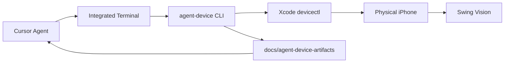

# agent-device setup (Cursor + physical iPhone)

Stack: **Cursor** → integrated terminal → **agent-device** CLI → **Xcode** (`devicectl` / XCTest) → **physical iPhone** → **Swing Vision** (reference app for competitive-analysis QA).

## Prerequisites checklist

| Requirement | Status on this machine | How to verify |
|-------------|------------------------|---------------|
| macOS | Required | — |
| Node.js 22+ | OK (`node --version`) | `node --version` |
| Xcode.app | Installed at `/Applications/Xcode.app` | `ls /Applications/Xcode.app` |
| Active developer dir | **Action needed** — CLI tools were selected instead of Xcode | `xcode-select -p` → should end with `Xcode.app/Contents/Developer` |
| Xcode license | **Action needed** — not yet accepted | `export DEVELOPER_DIR=/Applications/Xcode.app/Contents/Developer && xcodebuild -version` |
| agent-device CLI | Installed globally | `agent-device --version` |
| iPhone paired | Run after Xcode fix | `xcrun devicectl list devices` |
| iPhone Developer Mode | On device: Settings → Privacy & Security → Developer Mode | — |
| Device trusts Mac | Unlock phone, accept “Trust This Computer” | — |

## One-time human steps (required before device commands work)

Run these in **Terminal.app** (they need your password):

```bash
# 1. Point developer tools at full Xcode (not Command Line Tools only)
sudo xcode-select -s /Applications/Xcode.app/Contents/Developer

# 2. Accept Xcode / Apple SDK license
sudo xcodebuild -license accept

# 3. Optional: open Xcode once to finish component install
open -a Xcode
```

Verify:

```bash
export DEVELOPER_DIR=/Applications/Xcode.app/Contents/Developer
xcodebuild -version
xcrun devicectl list devices
agent-device devices --platform ios
```

Add to your shell profile if you prefer not to export each session:

```bash
export DEVELOPER_DIR=/Applications/Xcode.app/Contents/Developer
```

## Install agent-device

```bash
npm install -g agent-device@latest
agent-device --version
agent-device help workflow
```

Optional skill for skill-aware agents:

```bash
npx skills add callstackincubator/agent-device
```

## iOS signing (physical device runner)

If the XCTest runner fails to install:

- Enable **Automatic Signing** in Xcode for your team, or set:

```bash
export AGENT_DEVICE_IOS_TEAM_ID="YOUR_TEAM_ID"
export AGENT_DEVICE_IOS_SIGNING_IDENTITY="Apple Development"
# Optional:
# export AGENT_DEVICE_IOS_PROVISIONING_PROFILE="..."
# export AGENT_DEVICE_IOS_BUNDLE_ID="com.yourname.agentdevice.runner"
```

Free Apple Developer accounts may need a unique `AGENT_DEVICE_IOS_BUNDLE_ID`.

## Cursor integration

| Piece | Location |
|-------|----------|
| Project rule | [.cursor/rules/agent-device.mdc](../.cursor/rules/agent-device.mdc) |
| MCP (discovery only) | [.cursor/mcp.json](../.cursor/mcp.json) |
| Smoke workflow | [AGENT_DEVICE_SMOKE.md](./AGENT_DEVICE_SMOKE.md) |
| Smoke script | [../scripts/agent-device-swing-vision-smoke.sh](../scripts/agent-device-swing-vision-smoke.sh) |
| Stop QA | [../scripts/stop-agent-device-qa.sh](../scripts/stop-agent-device-qa.sh) |

**MCP** exposes only a `status` tool (install/version/handoff). All automation stays in the terminal:

```bash
agent-device help workflow
```

Enable the **agent-device** MCP server in Cursor Settings → MCP if it does not auto-load from `.cursor/mcp.json`.

## Architecture



## Troubleshooting

| Symptom | Fix |
|---------|-----|
| `xcodebuild` requires Xcode | `sudo xcode-select -s /Applications/Xcode.app/Contents/Developer` |
| License not agreed | `sudo xcodebuild -license accept` |
| `devicectl` not found | Same as above; use full Xcode, not CLT-only |
| No devices listed | USB cable, unlock phone, trust Mac, Developer Mode on |
| `agent-device` not in agent terminal | Use absolute path from `which agent-device` in your login shell |
| Stale daemon / agent won’t stop | `./scripts/stop-agent-device-qa.sh` (closes sessions, kills runners + daemon) |
| Stale daemon (manual) | Remove `~/.agent-device/daemon.json` and `daemon.lock`, retry |

Diagnostics: `agent-device … --debug` and logs under `~/.agent-device/logs/`.
