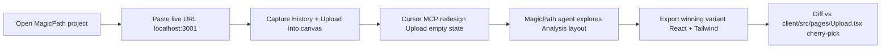

# MagicPath + Cursor — Padel Analyzer

**Status:** Planned — not yet set up. Use this doc when you're ready to connect [MagicPath](https://magicpath.ai) to Cursor for UI exploration and design-to-code.

**Quick start when ready:** Open this file → follow [Setup](#setup) → run the [First exploration session](#first-exploration-session-30-min) checklist.

---

## What MagicPath is (and isn't)

MagicPath 2.0 is an AI design tool with an infinite canvas. Its differentiator vs Figma/v0/Magic Patterns: it exposes the canvas through an **MCP server** so external coding agents (Cursor, Claude Code, Codex) can create and edit screens directly inside the same MagicPath project — alongside MagicPath's own internal agents. Outputs are React + TypeScript + Tailwind, which matches our `client/` stack (`react@19`, `tailwindcss@4`, `framer-motion`, `@radix-ui/*`).

**Not the same product:** **MagicPath** (`magicpath.ai`) ≠ **Magic UI** (`magicui.design`). Different product, different MCP.

---

## Why it fits this repo

| Fit | Detail |
|-----|--------|
| Stack | MagicPath emits React + Tailwind; our `client/src/**/*.tsx` is the same |
| Design system | `.cursorrules` mandates "Tennis Neon"; import Figma tokens or CSS theme into MagicPath |
| Workstream | UI work stays in **Workstream A** — `client/src/pages/**`, `client/src/components/**` ([AGENTS.md](../AGENTS.md)) |
| Multi-agent | MagicPath canvas + Cursor MCP composes with pstack — one canvas, multiple Cursor chats per screen |

---

## Use cases (Padel Analyzer)

Mapped to [client/src/App.tsx](../client/src/App.tsx):

| Screen | Route | Good for |
|--------|-------|----------|
| History | `/` | Landing polish, recent-sessions teaser, empty state |
| Upload | `/upload` | Drop zone + progress states (known feedback pain point) |
| Analysis | `/analysis/:id` | Layout exploration — video + skeleton + metrics + coaching (don't touch MediaPipe loop) |
| ProCompare / Compare | `/pro-compare`, `/compare` | Side-by-side layout iteration |
| Weekly goal dashboard | (net-new page) | Component exists: [WeeklyGoal.tsx](../client/src/components/WeeklyGoal.tsx) |

**Out of scope (intentionally):**

- `client/src/lib/` — analysis pipeline, TrackNet, court calibration
- `shared/types.ts`, `server/`, `drizzle/`
- `mobile/` — MagicPath outputs web React, not React Native

---

## Setup

### Checklist

- [ ] Sign in at [magicpath.ai](https://magicpath.ai) and create a project
- [ ] Open project **Settings → External Agents** and copy the setup command
- [ ] Run the command in Cursor's terminal at repo root (writes MCP config)
- [ ] **Token safety:** put MagicPath MCP in `~/.cursor/mcp.json` (global), not committed `.cursor/mcp.json` — see [Token handling](#token-handling)
- [ ] Restart Cursor → **Settings → Tools & MCP** → confirm `magicpath` is green
- [ ] Sanity check: ask Cursor *"list my MagicPath projects"*
- [ ] Import Tennis Neon tokens (Figma variables or Tailwind theme) into the MagicPath project

### Expected MCP config shape

The official installer from MagicPath UI writes something like:

```json
{
  "mcpServers": {
    "magicpath": {
      "command": "npx",
      "args": ["-y", "@magicpath/mcp@latest"],
      "env": { "MAGICPATH_TOKEN": "<token-from-magicpath-ui>" }
    }
  }
}
```

Preserve existing project MCP servers in [.cursor/mcp.json](../.cursor/mcp.json) (`agent-device`, `XcodeBuildMCP`) when merging.

### Token handling

`.cursor/mcp.json` is tracked in git. **Do not commit the MagicPath token.**

Recommended: add the MagicPath block only to `~/.cursor/mcp.json` (user-global). Project-level `.cursor/mcp.json` stays clean for shared servers.

Alternative: env var reference + local `.env.local` (never commit the token).

---

## First exploration session (~30 min)



1. `npm run dev` → open http://localhost:3001
2. In MagicPath: paste live URL → capture **History** and **Upload** screens
3. In Cursor (with MCP connected): redesign Upload empty state on the canvas
4. Optionally run a MagicPath internal agent on **Analysis** layout in parallel
5. Export code → diff against [Upload.tsx](../client/src/pages/Upload.tsx) → port to existing UI primitives

**Success criteria:** round-trip works, Tennis Neon survives import, exported code is mergeable without rewriting CV/pipeline code.

---

## Rules when bringing code back

1. **Reference, not dump** — MagicPath output won't match [client/src/components/ui/](../client/src/components/ui/) (Button, Card, Badge, Section, Stepper). Port layouts to existing primitives.
2. **Workstream A only** — no drive-by edits to `shared/`, `server/`, or `client/src/lib/`.
3. **Expect minor fixes** — React 19 + Tailwind v4 may need small adjustments vs generic MagicPath exports.
4. **Cost** — external agents (Cursor) use your Cursor subscription, not MagicPath credits (per MagicPath docs).

---

## Risks

| Risk | Mitigation |
|------|------------|
| Token committed to git | Use `~/.cursor/mcp.json` for MagicPath only |
| Off-brand UI | Seed MagicPath with Tennis Neon tokens before generating |
| Duplicate component libraries | Cherry-pick layout/styling; reuse `components/ui/*` |
| Scope creep into CV code | Keep MagicPath work in pages/components only |

---

## When you're ready to implement

Suggested branch: `chore/tooling-magicpath-mcp` (tooling) or `feat/client-<screen>-magicpath` (per-screen redesign).

Suggested agent brief:

```
Workstream: A
Branch: feat/client-upload-magicpath
Goal: Port MagicPath Upload redesign into client/src/pages/Upload.tsx using existing UI primitives
Out of scope: client/src/lib/, server/, shared/
Depends on: MagicPath MCP connected (see docs/MAGICPATH.md)
```

---

## Related docs

- [AGENTS.md](../AGENTS.md) — workstream ownership and merge order
- [PSTACK_USAGE.md](./PSTACK_USAGE.md) — agent workflow for implementation after design
- [MagicPath external agents docs](https://www.magicpath.ai/documentation/features/external-agents)
