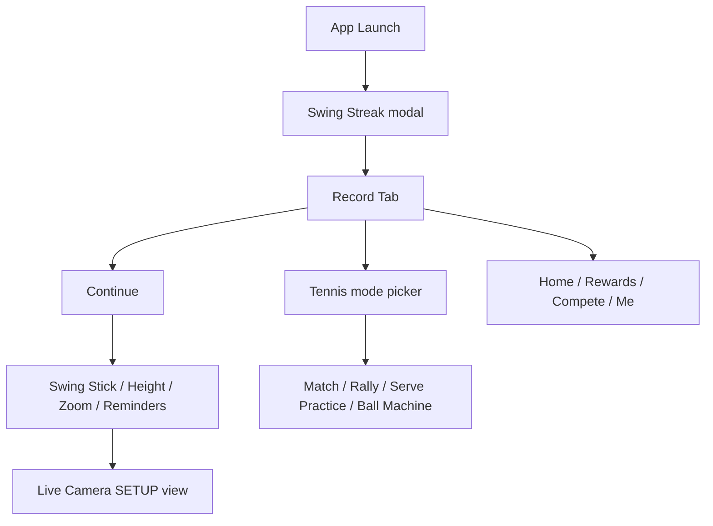

# Swing Vision — agent-device exploration summary

**Date:** 2026-05-27  
**Device:** Praditya's iPhone (00008150-000262891A28401C), iOS 26.5  
**App:** `com.Mangolytics.Swing` (SwingVision v11.9.57)  
**Account:** Praditya Wirjawan (`pradityawirjawan49074`), Plus tier, 0 sessions recorded

## Artifacts

- **42+ screenshots** + matching accessibility snapshots in `docs/agent-device-artifacts/flow/`
- Step log: `FLOW_LOG.md`
- Earlier smoke: `../01-launch.png`, `../02-after-continue.png`, etc.

## Flow map

## Screens captured

### Onboarding & recording prep

| Step | Screen | Key UI |
|------|--------|--------|
| 01–02 | Swing Streak → Record | Dismiss streak, mode picker, Continue |
| 03–04 | Swing Stick + Height Guidelines | Court placement, GOOD/BETTER/OPTIMAL framing |
| 12–13 | Zoom Guidelines + Reminders | Zoom tips, shade/focus/low-power reminders |
| 18–23 | **Live camera SETUP** | Pink court alignment box, Audio-Guided/Manual, START, HD, 1.0x zoom, FLIP |

### Main tabs

| Tab | Content |
|-----|---------|
| **Home** | v11.9.57 release notes, setup how-to video, Swing Stick $50 discount, How-To Guides, Find Players |
| **Rewards** | Referral ladder: T-shirt & Cap (1), Jacket (3), Apple Watch SE (5) — all LOCKED |
| **Compete** | Leaderboard metrics: Shots Hit/In, Deep Shots, Distance Run, Serves In — all 0 |
| **Me** | Profile (PW, Plus), verify email CTA, 0 week streak, empty sessions, RECORD A SESSION |
| **Record** | Tennis/Rally/Singles modes, Players (PW vs Op), Live Line Calls, Target Practice, Remote Control, Swing Stick |

### Record mode picker (Tennis icon)

Sport selector: **Tennis** | **Pickleball**

Tennis sub-modes:

- **Match** — adds Final Score config (Ad Scoring, 3 Sets 6 Games, Full Final Set)
- **Rally**
- **Serve Practice**
- **Ball Machine**

## Competitive-analysis notes (vs Padel Analyzer goals)

| Swing Vision feature | Relevance |
|---------------------|-----------|
| Court alignment overlay (pink rectangle) | Homography / court calibration UX |
| Audio-Guided vs Manual setup | Guided vs expert recording flow |
| HD + zoom + flip controls | Camera pipeline settings |
| Live Line Calls toggle | Automated line-call feature |
| Target Practice mode | Drill / practice session type |
| Remote Control (second phone) | Multi-device recording |
| Swing Stick hardware upsell | Fixed-camera mount for accuracy |
| Streak + Rewards + Compete | Retention / gamification layer |
| Session list on Me tab | Post-analysis library |
| 0-session empty state | Onboarding before first analysis |

## Manual blockers observed

- **Camera permission** — system alert (Allow required once)
- **Developer cert trust** — one-time for agent-device runner
- **Swing Stick tutorial** — skippable via Close on overlay
- **Email verification** — shown on Me tab, non-blocking

## Agent-device learnings

- Always pass `--udid 00008150-000262891A28401C` for physical device
- Set `AGENT_DEVICE_IOS_TEAM_ID` + `AGENT_DEVICE_IOS_BUNDLE_ID` for Personal Team signing
- Re-snapshot after every `press` — refs change across modals
- Tab bar refs only visible when not inside full-screen camera/setup overlay
- First runner build on device can exceed 90s; retry after trust

## Suggested next captures (optional)

- Tap **START** on live camera (requires real court or dummy setup)
- **RECORD A SESSION** from Me tab empty state
- **How-To Guides** and setup video on Home
- **Compete** metric drill-downs after a recorded session exists
