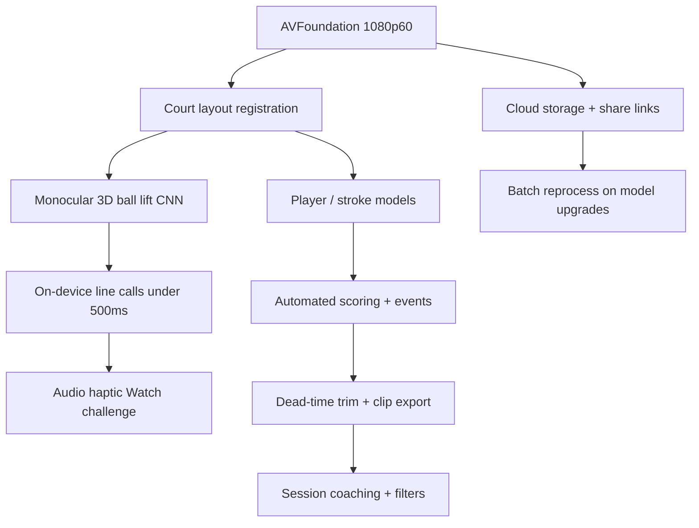

# Competitor AI Video Technology Analysis — SwingVision

**Orchestrator report** · 2026-06-08  
**Target:** SwingVision (`com.Mangolytics.Swing`) on Praditya's iPhone  
**Subagent artifacts:** [PUBLIC_RESEARCH](agent-device-artifacts/competitor-tech-analysis/PUBLIC_RESEARCH.md) · [REPO_SYNTHESIS](agent-device-artifacts/competitor-tech-analysis/REPO_SYNTHESIS.md) · [Jun 2026 device capture](agent-device-artifacts/competitor-tech-analysis/swingvision/RUN_NOTES.md) · [May 2026 flow](agent-device-artifacts/flow/FLOW_SUMMARY.md) · [Orchestrator playbook](COMPETITOR_ANALYSIS_ORCHESTRATOR.md)

## Run status

| Workstream | Agent | Status |
|------------|-------|--------|
| Device readiness | Orchestrator | **Pass** — Developer Mode on, phone paired |
| App discovery | Orchestrator | **Pass** — SwingVision visible on physical UDID |
| App launch | Resume session 2026-06-08 | **Pass** — `agent-device open SwingVision` on physical UDID |
| UI snapshot / exploration | [SwingVision device resume](3c64de89-f098-4d20-9a21-d0ebe689d174) | **Complete** — Home / Record / Me; 5 PNGs + snapshots (`swingvision/`) |
| Prior UI flow (May 2026) | [flow/FLOW_SUMMARY.md](agent-device-artifacts/flow/FLOW_SUMMARY.md) | **Complete** — 42+ screenshots, v11.9.57 (deeper setup wizard) |
| Public tech research | [Public tech research](5d29e5a7-79b9-41fa-9e7d-73981d9f3039) | **Complete** — see PUBLIC_RESEARCH.md |
| Repo synthesis | [Repo synthesis](97cff1e3-802b-4a4b-aaa5-567a26121fff) | **Complete** — see REPO_SYNTHESIS.md |

**Jun 2026 device capture:** Logged-in Home feed; Record tab shows Tennis/Match/Singles, Live Line Calls, Continue (camera not started); Me shows profile + verify-email CTA. See [swingvision/RUN_NOTES.md](agent-device-artifacts/competitor-tech-analysis/swingvision/RUN_NOTES.md). Early attempts failed on phone lock; final run passed after cert trust + session cleanup.

## Target app

| Field | Value |
|-------|-------|
| Display name | SwingVision |
| Bundle ID | `com.Mangolytics.Swing` |
| Physical UDID | `00008150-000262891A28401C` |
| Observed version | **v11.9.58** (2026-06-08 capture) · prior v11.9.57 (2026-05-27 flow) |
| Sport picker (Observed 2026-06-08) | **Tennis + Pickleball only — no Padel** in production v11.9.58 |

## Inferred architecture (confidence: medium-high)

SwingVision’s public story + patent **US11893808B2** describe a **hybrid edge-first** system:



**Public:** Real-time inference on iPhone Neural Engine + Core ML; cloud for storage/sharing/reprocess, not sub-second line calls.  
**Inferred:** Multi-model orchestration (court → ball → events → highlights), Tesla-style monocular 3D tracking lineage.  
**Observed (prior session, May 2026 — v11.9.57):** Pink court alignment overlay, mode picker, live camera SETUP, tab bar (Home / Rewards / Record / Compete / Me). Full flow map in [FLOW_SUMMARY.md](agent-device-artifacts/flow/FLOW_SUMMARY.md).

## Observed UI evidence (May 2026 device capture)

Labels: **Observed** = agent-device screenshots/snapshots on physical iPhone. **Jun 2026** refresh in `swingvision/`; **May 2026** deep flow in `flow/`.

### Jun 2026 refresh — sport picker + setup wizard (v11.9.58, Observed 2026-06-08)

Captured on physical iPhone (`swingvision/07-` … `13-`). Confirms the May v11.9.57 setup flow is unchanged in v11.9.58.

| Step | Observed detail | Screenshot |
|------|-----------------|------------|
| Sport picker | Bottom sheet with **Tennis** + **Pickleball** only — **no Padel option** (Mar 2026 padel beta is not in this production build; likely separate TestFlight) | `08-sport-picker.png` |
| Setup 1 — Swing Stick | "Attach your Swing Stick in the green area" (Close / Forward) | `09-setup-swingstick.png` |
| Setup 2 — Height Guidelines | GOOD / BETTER / OPTIMAL / **SUBOPTIMAL** court diagrams; "a few feet behind each baseline visible, net top must not overlap far service/base line" | `10-setup-height.png` |
| Setup 3 — Zoom Guidelines | GOOD / BETTER / OPTIMAL / SUBOPTIMAL; "zoom in as close to the court as you can while keeping all corners of the singles court visible" | `11-setup-zoom.png` |
| Setup 4 — Reminders | Device in shade (sun behind) · turn on **Fitness Focus** (block call interruptions) · **Low Power Mode**; "show tutorial again next time" toggle | `12-setup-reminders.png` |
| Live camera SETUP | Landscape; **pink court-alignment rectangle** ("Align the near service line inside the pink rectangle"); **Audio-Guided / Manual** toggle; **START**; **TUTORIAL**; **ZOOM 1.0x**; **QUALITY HD**; **FLIP** | `13-live-setup.png` |
| Home (v11.9.58) | "You're On The Latest Version v11.9.58"; a real recorded session now present (8 Jun 2026, 0:53, Point by Point, 303 shots, 0.64 mi) | `06-resume-state.png` |

**Note (tooling):** SwingVision's **Home** tab repeatedly wedged the XCUITest runner ("main thread execution timed out") — its media-rich feed never reports idle, so `snapshot`/`press` time out there. **Record** and the setup wizard snapshot fine. Navigate via Record (last-used tab) and avoid acting on Home. Screenshots succeed even when the tree times out.

### Record tab & capture pipeline

| Element | Detail | Confidence |
|---------|--------|------------|
| Mode picker | Sport: **Tennis** \| **Pickleball**; tennis sub-modes: Match, Rally, Serve Practice, Ball Machine | Observed |
| Match mode | Final Score config: Ad Scoring, 3 Sets 6 Games, Full Final Set | Observed |
| Live Line Calls | Toggle on Record tab — automated line-call feature surfaced pre-record | Observed |
| Target Practice | Separate drill mode on Record tab | Observed |
| Remote Control | Second-phone recording option | Observed |
| Setup wizard | Swing Stick placement → Height Guidelines (GOOD/BETTER/OPTIMAL) → Zoom Guidelines → Reminders (shade/focus/low-power) | Observed |
| Live camera SETUP | Pink court alignment rectangle; **Audio-Guided** vs **Manual**; START; **HD**; **1.0x zoom**; **FLIP** | Observed |
| Swing Stick upsell | Hardware mount tutorial overlay (skippable via Close) | Observed |

### Main tabs

| Tab | Observed content |
|-----|------------------|
| **Home** | v11.9.57 release notes, setup how-to video, Swing Stick $50 discount, How-To Guides, Find Players |
| **Rewards** | Referral ladder: T-shirt & Cap (1), Jacket (3), Apple Watch SE (5) — all LOCKED |
| **Compete** | Leaderboard metrics: Shots Hit/In, Deep Shots, Distance Run, Serves In — all 0 (empty account) |
| **Me** | Profile (Plus tier), verify-email CTA, 0-week streak, empty sessions list, **RECORD A SESSION** CTA |
| **Record** | Players (PW vs Opponent), mode picker, Live Line Calls, Continue → setup wizard |

### Onboarding & blockers (Observed)

- **Swing Streak** modal on launch (dismissible)
- **Camera permission** — system alert; requires user Allow (not bypassed)
- **Email verification** — shown on Me tab; non-blocking
- **Developer cert trust** — required for agent-device runner (still blocking as of 2026-06-08)

### Tech implications from Observed UI

1. **Court homography is user-facing** — pink alignment overlay + height/zoom guidelines imply calibrated reference frame before inference starts (**Inferred** from overlay UX).
2. **Audio-guided setup** — distinct from manual; suggests on-device feedback loop during calibration (**Observed** toggle exists; audio pipeline **Inferred**).
3. **Mode-specific capture** — Match vs Rally vs Serve vs Ball Machine likely feed different event/scoring models (**Inferred** from mode picker granularity).
4. **Live Line Calls is a first-class toggle** — edge inference path is productized, not hidden post-processing (**Observed**).
5. **HD + zoom + flip** — explicit camera pipeline controls at record time; 60fps requirement aligns with **Public** CEO statements (**Observed** controls + **Public** 60fps claim).

## Key technical findings

1. **On-device realtime is the product moat** — CEO explicitly rejects cloud for live inference; targets ~0.5s line-call latency at 1080p60.
2. **Court homography is foundational** — patent uses regulation court visual features as reference frame for 3D property extraction.
3. **60fps is a hard requirement** — ball bounce visibility; iPhone 11+ / A13 floor.
4. **Training stack (public jobs):** PyTorch/TF research → Core ML mobile deploy; AVFoundation capture.
5. **Padel beta (Mar 2026)** — direct encroachment on our sport; monitor accuracy claims.
6. **Data moat:** marketing cites 500M+ labeled shots — we need padel-specific calibration + rally segmentation.
7. **Our parity wins:** court overlay wizard, record modes, history — see REPO_SYNTHESIS.md.
8. **Our gaps:** live ELC, 60fps ball track, audio-guided setup, cloud reprocess UX.

## Device UI automation — status

**Resolved (2026-06-08):** Cert trusted, runner builds, phone unlocked — full `snapshot`/`press`/`screenshot` loop works on the physical device.

**Operational caveats observed this run:**
1. **Home tab wedges the runner** — its media-rich feed never reports idle, so `snapshot`/`press` time out with "main thread execution timed out". Work from the **Record** tab (last-used tab on relaunch) and avoid acting on Home; screenshots still succeed there.
2. **Sport-picker / bottom-sheet animations** can transiently time out the daemon and foreground the runner app; on timeout the daemon may default to a **booted simulator** — re-`open` on the physical device with explicit `--udid` + `--session-lock strip`, or run `./scripts/stop-agent-device-qa.sh` and relaunch.

**Resume steps:**

1. Unlock iPhone; keep screen on (disable Auto-Lock if needed)
2. `source ./scripts/agent-device-signing-env.sh`
3. `TARGET_APP=SwingVision ./scripts/agent-device-competitor-tech-smoke.sh`
4. Explore from **Record** (`snapshot -i`, `press @eN`, `screenshot`); avoid Home for tree ops

**Exploration checklist:**

- [x] Record tab — mode picker, Live Line Calls toggle, Continue (Observed 2026-06-08)
- [x] Setup wizard — Swing Stick, height/zoom guidelines, reminders (Observed 2026-06-08, `09`–`12`)
- [x] Live camera SETUP — Audio-Guided/Manual, HD, 1.0x zoom, FLIP, pink alignment (Observed 2026-06-08, `13-live-setup.png`)
- [ ] Post-record analysis progress / latency (a recorded session exists — `06-resume-state.png` — but opening results not yet captured)
- [ ] Results — metrics, coaching, ball trace
- [ ] Me tab — session history (now non-empty)
- [ ] Settings / subscription gating
- [x] Check for **Padel** in sport picker → **Not present** in production v11.9.58 (Tennis + Pickleball only, Observed 2026-06-08, `08-sport-picker.png`). Mar 2026 padel beta is a separate/beta channel.

## Padel Analyzer implications (prioritized)

| P | Recommendation | Evidence | Confidence |
|---|----------------|----------|------------|
| 1 | Glass-aware ball + court calibration for padel | Patent court-reference + our sport | High |
| 2 | Edge vs batch pipeline split with latency budgets | Public CEO interviews | High |
| 3 | Rally dead-time trimming in orchestrator | Both products; our .cursorrules | High |
| 4 | Mode-specific analysis thresholds | Observed UI + our RecordMode | Medium |
| 5 | Defer gamification; ship analysis quality first | competitor_qa.md | Medium |

## Next orchestrator run

After cert trust on device:

```bash
source ./scripts/agent-device-signing-env.sh
TARGET_APP=SwingVision ./scripts/agent-device-competitor-tech-smoke.sh
# then per-screen:
agent-device snapshot -i --udid 00008150-000262891A28401C --session competitor-tech-analysis
agent-device press @eN --udid 00008150-000262891A28401C --session competitor-tech-analysis
agent-device screenshot docs/agent-device-artifacts/competitor-tech-analysis/NN-name.png --udid 00008150-000262891A28401C --session competitor-tech-analysis
```

Stop and ask user before: login, paywall, camera permission. Merge new **Observed** evidence into this doc; do not overwrite **Public** research without new sources.
