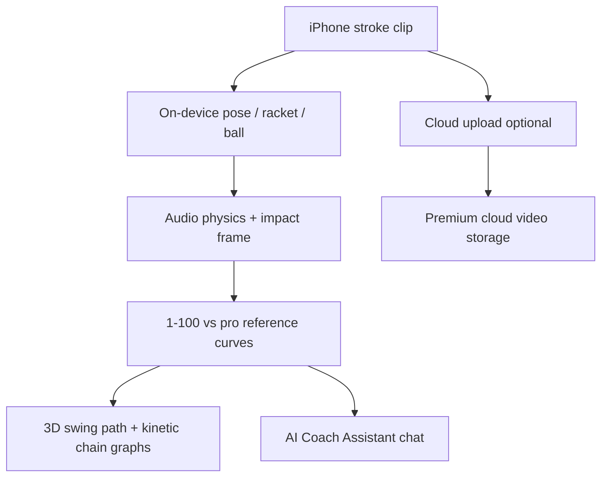

# Competitor AI Video Technology Analysis — SevenSix (sevensix)

**Orchestrator report** · 2026-06-08  
**Target:** sevensix – Tennis AI Coach (`com.sevensix.app`, App Store `id1505604446`)  
**Artifacts:** [PUBLIC_RESEARCH](agent-device-artifacts/competitor-tech-analysis/sevensix/PUBLIC_RESEARCH.md) · [REPO_SYNTHESIS](agent-device-artifacts/competitor-tech-analysis/sevensix/REPO_SYNTHESIS.md) · [FLOW_SUMMARY](agent-device-artifacts/competitor-tech-analysis/sevensix/FLOW_SUMMARY.md) · [RUN_NOTES](agent-device-artifacts/competitor-tech-analysis/sevensix/RUN_NOTES.md)

## Run status

| Workstream | Status |
|------------|--------|
| Public tech research | **Complete** |
| Repo synthesis | **Complete** |
| App launch (`open sevensix`) | **Pass** |
| UI snapshot / exploration | **Complete** — all 4 tabs (TRAINING, VIDEOS, AI COACH, PROFILE); 6 screenshots + snapshots |
| Observed device UI | **Complete** (2026-06-08) — TRAINING, VIDEOS, record setup, AI COACH (`05-ai-coach.png`), PROFILE (`06-profile.png`); see [FLOW_SUMMARY.md](agent-device-artifacts/competitor-tech-analysis/sevensix/FLOW_SUMMARY.md). Remaining: post-analysis results (needs a recorded swing). |

## Target app

| Field | Value |
|-------|-------|
| Display name | sevensix – Tennis AI Coach |
| Bundle ID | `com.sevensix.app` |
| Developer | SevenSix AS (Norway) |
| Sport (public) | **Tennis only** — no padel mode in App Store |
| Padel angle | Sister B2B entity **SportAI** cited in press for multi-sport expansion |

## Inferred architecture (confidence: medium)

**Public:** Hybrid cloud + on-device — CEO claims ~70% latency reduction for racket/ball detection via Apple collaboration; cloud for upload, storage, global scale.



**Not evidenced:** Ball trajectory, court homography, live line calls, padel stroke taxonomy.

## Key technical findings

1. **Biomechanics-first, not match analytics** — stroke-level coaching (swing curve, timing, impact) vs rally/ball tracking.
2. **Audio fusion for contact** — public CEO claims use audio physics for ball hit detection; Padel Analyzer uses wrist-velocity peak only.
3. **Pro-reference scoring** — three 1–100 dimensions; we collapse to single `overallScore` in main analysis UX.
4. **AI Coach Assistant (v4)** — conversational coaching; we have static phase tips only.
5. **Tennis-only consumer app** — padel competition is indirect (SportAI B2B); less direct threat than SwingVision padel beta.
6. **iOS-only, subscription** — $14.99/mo; we are web PWA + Expo mobile, no paywall yet.

## Observed device UI (2026-06-08)

Label: **Observed** = captured on physical iPhone via `agent-device`. Full map in [FLOW_SUMMARY.md](agent-device-artifacts/competitor-tech-analysis/sevensix/FLOW_SUMMARY.md).

- **Four tabs:** TRAINING, VIDEOS, AI COACH, PROFILE.
- **AI COACH (`05-ai-coach.png`):** scoped capabilities — Technique (biomechanics, swing curve, contact point), Strategy (match tactics, shot selection), Drills (at-the-wall / on-court / partner), Mental game (focus, pressure points), Equipment (strings, tension, racket fit). Coach is **gated on a recorded swing** ("Once you record a swing in the Training tab, I'll be able to pull in your scores") and **multilingual**. Quick-Question chips: *Am I improving my technique? · What should I focus on next? · Give me drills to improve · Suggest practice drills · Translate feedback*.
- **PROFILE (`06-profile.png`):** avatar + name, a **skill-progression line chart** with tiered y-axis (32–76) in an empty state ("Analyse a few swings to see your progression"), plus **Settings** and **About** entries.
- **Inferred (medium):** the 32–76 progression tiers imply a normalized per-swing skill score persisted over time — analogous to a padel session-score trend we could surface on a profile/history screen.

## Padel Analyzer implications (prioritized)

| P | Recommendation | Evidence |
|---|----------------|----------|
| 1 | Add **audio onset** fusion at contact frame | **Public** sevensix; **Repo** `swingAnalyzer.ts` |
| 2 | Expose **subscores** (timing, path, contact) in analysis dashboard | **Public** App Store; **Repo** phase scores exist but not surfaced |
| 3 | 3D swing-curve / pro overlay in main results (not only `/pro-compare`) | **Public** sevensix UX |
| 4 | Defer LLM coach until core CV quality ships | **Public** sevensix v4 chat |
| 5 | Keep padel-native moat: ball track, homography, rally trim, shot taxonomy | **Repo** ahead of sevensix **Public** scope |

## Device capture — resume

Core tab capture is **complete** (2026-06-08). Only remaining gap: **post-record analysis results / swing scores**, which require recording and analysing a swing (camera permission + capture — out of scope without user).

```bash
source ./scripts/agent-device-signing-env.sh
# Unlock iPhone, keep screen on
ARTIFACTS=docs/agent-device-artifacts/competitor-tech-analysis/sevensix \
AGENT_DEVICE_SESSION=competitor-sevensix \
TARGET_APP=sevensix ./scripts/agent-device-competitor-tech-smoke.sh
```

Remaining if revisited: Settings / About sub-screens; post-analysis swing-score views (needs a recorded swing). Do not bypass login/paywall/camera.
