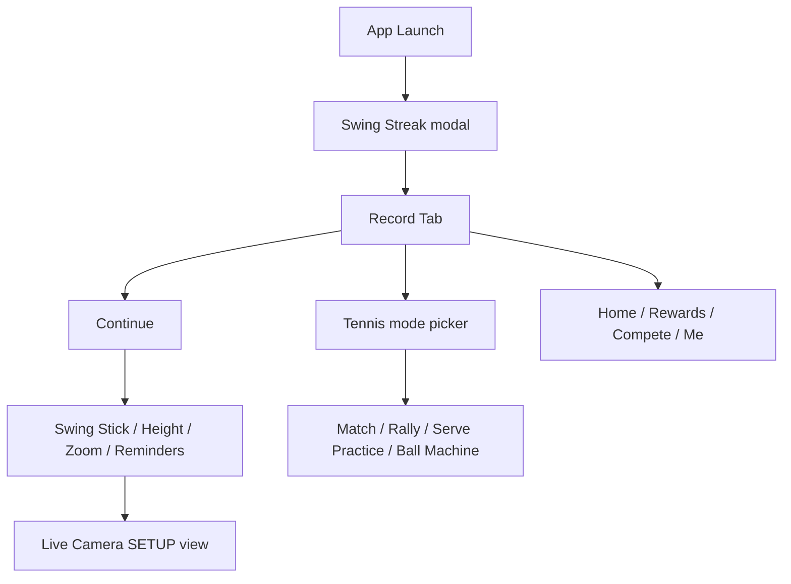

# Competitor QA — SwingVision (agent-device)

**Source:** [agent-device flow summary](./agent-device-artifacts/flow/FLOW_SUMMARY.md) · [step log](./agent-device-artifacts/flow/FLOW_LOG.md)  
**Date:** 2026-05-27 · **App:** SwingVision v11.9.57 (`com.Mangolytics.Swing`)

This document is the **indexed, curated** competitor QA used for Padel Analyzer product decisions. Raw screenshots and accessibility dumps remain under `docs/agent-device-artifacts/flow/` (gitignored except summary/log files).

---

## Pain Points

Friction observed during agent-device exploration that our app should avoid or preempt:

| Pain point | SwingVision behavior | Padel Analyzer implication |
|------------|---------------------|----------------------------|
| **Camera permission** | System alert blocks until Allow | Pre-request with clear copy before record (mobile: `RecordScreen` permissions) |
| **Developer cert trust** | One-time trust for sideloaded builds | Document in agent-device setup only |
| **Skippable tutorial overlay** | Swing Stick tutorial; Close to dismiss | Any setup wizard must be skippable for returning users |
| **Email verification** | Shown on Me tab; non-blocking | Defer blocking auth; optional banner when account ships |

---

## Feature Successes

Capabilities that work well in SwingVision and map to Padel Analyzer goals:

| Feature | Why it works | Padel Analyzer status (mobile) |
|---------|--------------|-------------------------------|
| **Court alignment overlay** (pink rectangle) | Ground-truth homography before record | **Target:** capture-time 4-corner overlay on `Record` |
| **Audio-Guided vs Manual setup** | Reduces bad framing for novices | Missing |
| **HD + zoom + flip** | User control over capture quality | Missing (fixed 1080p back camera) |
| **Pre-record setup wizard** | Swing Stick → Height → Zoom → Reminders | **Target:** `SetupWizard` before `Record` |
| **Mode picker** (Match / Rally / Serve / Ball machine) | Tunes downstream analysis | **Target:** `RecordMode` on job + orchestrator |
| **Live line calls** | Real-time in/out feedback | Missing (defer) |
| **Target Practice / drills** | Practice session type | Partial via `drill` mode |
| **Remote Control (2nd phone)** | Multi-device record | Missing (defer) |
| **Streak + Rewards + Compete** | Retention / gamification | Missing (intentionally deferred) |
| **Session list on Me tab** | Post-session library | **Exists:** `HistoryScreen` + Home recent list |
| **0-session empty state** | Onboarding before first analysis | **Exists:** History + Home empty states |
| **How-To Guides** | In-app education | Partial (static “How it works” on Home) |

---

## Flow map (competitor)

---

## Implementation backlog (from this QA)

Priority order for Padel Analyzer **mobile** (see repo plan):

1. Capture-time **court alignment overlay** + server homography override  
2. **Setup wizard** (mode → framing → align → reminders)  
3. **Record mode** persisted on `analysis_jobs` / `analyses`  
4. Audio-guided setup, HD/zoom/flip, line calls, remote control — deferred  

---

## Agent-device learnings (ops)

- Pass physical device `--udid` for agent-device runs  
- Set `AGENT_DEVICE_IOS_TEAM_ID` + `AGENT_DEVICE_IOS_BUNDLE_ID` for Personal Team signing  
- Re-snapshot after every `press` — refs change across modals  
- Tab bar refs hidden inside full-screen camera/setup overlay  
