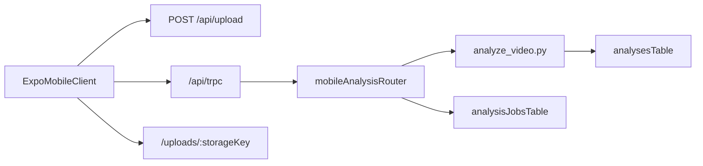

# Mobile Architecture

## Chosen path

The mobile v1 path is:

- true native client with Expo / React Native
- server-side swing analysis
- existing Node/tRPC backend retained as the system of record

This deliberately avoids trying to run the browser ML stack inside a mobile WebView or React Native runtime for v1.

## Why this path

- Mobile UX is better served by native file picking, navigation, and app lifecycle handling.
- The current browser pipeline depends on `HTMLVideoElement`, browser MediaPipe Tasks, and `onnxruntime-web`, which are not drop-in for native mobile.
- Server-side analysis gives one consistent runtime for results across web and mobile.

## System shape

## Implemented v1 mobile flow

1. User picks a local video in the native app.
2. The app uploads the file to the backend.
3. The app creates a mobile analysis job.
4. The backend runs Python/MediaPipe analysis and stores the final `analyses` row.
5. The mobile app polls job status and navigates to the saved analysis.

## Intentional non-goals for v1

- native pose inference on-device
- native overlay replay renderer
- native annotation and pro-comparison tooling
- auth/account system

## Key files

- `mobile/App.tsx`
- `mobile/src/screens/HomeScreen.tsx`
- `mobile/src/screens/JobStatusScreen.tsx`
- `mobile/src/screens/AnalysisScreen.tsx`
- `server/routers/mobileAnalysis.ts`
- `server/_core/mobileAnalysisRunner.ts`
- `scripts/analyze_video.py`
